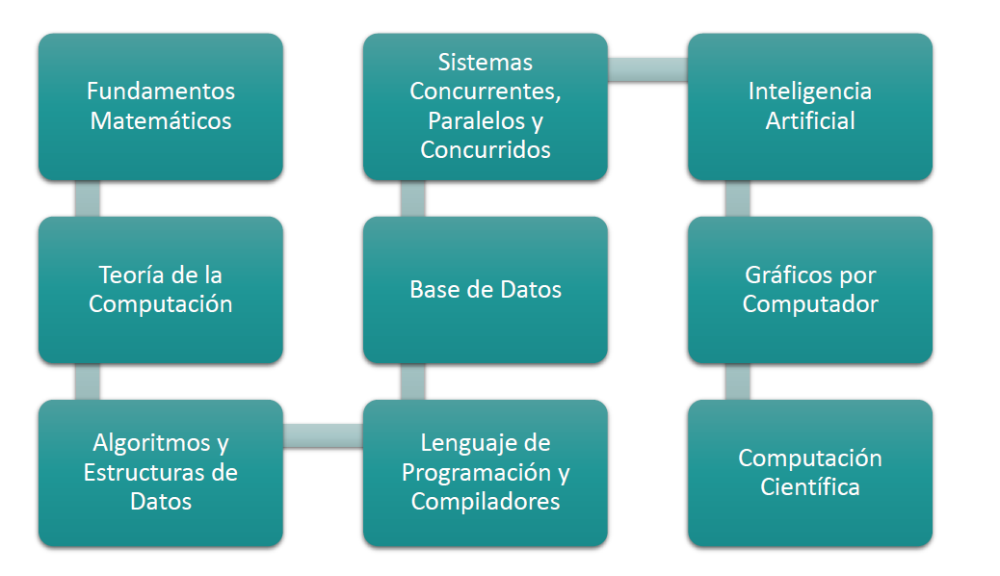
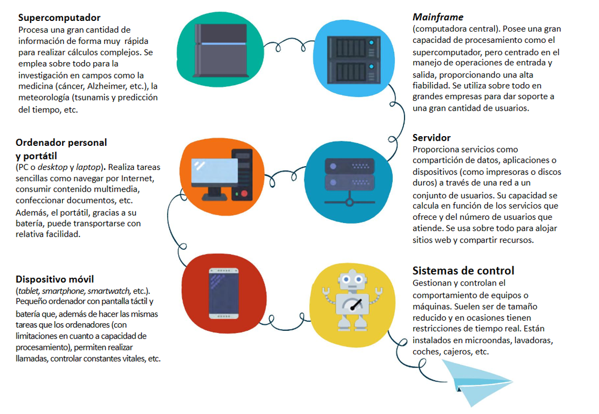
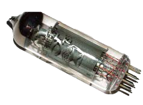
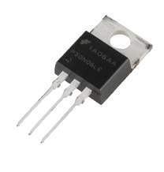
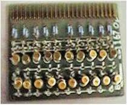
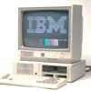
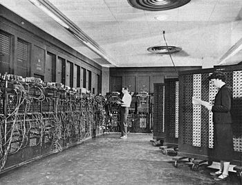
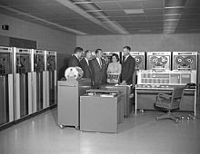

# UT1.1 Introducción a los sistemas informáticos: hardware


## Informática

Según el Diccionario de la Real Academia Española se define a la **informática** como:

```note
💡 Conjunto de conocimientos científicos y técnicas que hacen posible el tratamiento automático de la información por medio de dispositivos digitales, denominados ordenadores o computadoras.
```

Su aparición como ciencia se debe a la presentación del primer ordenador en el año 1936 denominado **Z1** y usado como arma de cálculo durante la 2ª Guerra Mundial.

El objeto de estudio de la Informática es muy amplio:

-   **Aspecto Físico** (Diseño, Arquitectura, Fabricación, Componentes)

-   **Aspecto Lógico** (Almacenamiento, Organización de datos, Programas,
    Información y Comunicación entre dispositivos).


Actualmente es difícil concebir un área que no use el apoyo de la informática. Existen ramas de la informática dedicada a nuevos campos como la Inteligencia Artificial, Ingeniería, Cine, Música, Videojuegos, Realidad Virtual y Robótica, en desarrollo gracias al apoyo de varias ciencias.



Campos fundamentales de las **ciencias de la computación**:

- **Fundamentos matemáticos:**
   - **Criptografía**. Consta de algoritmos para proteger datos privados, incluyendo el cifrado.

   - **Teoría de grafos** Recursos elementales para almacenamiento de datos y algoritmos de búsqueda.

 


- **Bases de datos:**

    - **Minería de datos y big data**.

      

   - Estudio de algoritmos para buscar y procesar información en documentos y
      bases de datos; adquisición de información.

      

- **Algoritmos y estructuras de datos:**
  
    - Análisis de algoritmos. Procesos formales usados para los cómputos,  y eficiencia de estos procesos.
      
    - Estructuras de datos. Organización y manipulación de los datos.

    
- **Inteligencia Artificial (IA):**

    - La implementación y estudio de sistemas que exhiben (ya sea por una inteligencia autónoma o comportamiento propio, a veces inspirado por las características de los seres vivos.
    - Inteligencia artificial conversacional y generativa.
    - Robótica: algoritmos para el control de robots autónomos

    

    

- **Gráficos por ordenador:**

    - Algoritmos para generar sintéticamente imágenes fotorrealistas.
    - Reconocimiento y procesamiento de imágenes.


- **Computación científica:**

   - Bioinformática
   - Computación cuántica
   
   

## El ordenador

```note
💡 Un **ordenador** o computadora es una máquina electrónica que sirve para procesar información digital.
```

El ordenador es una máquina compuesta de elementos físicos (**hardware**), en su mayoría circuitos electrónicos, capaces de realizar una gran variedad de trabajos de **procesamiento digital** a gran velocidad.


Estos componentes electrónicos necesitan de otros componentes no físicos que los pongan en funcionamiento; los **programas, apps o software**.


```note
💡 Un ordenador se distingue de otros dispositivos similares, como una calculadora no programable, es que es una máquina de propósito general, es decir, puede realizar tareas muy diversas, de acuerdo a las posibilidades de sus programas y el hardware.
```

Para que los componentes electrónicos de un ordenador sean capaces de funcionar y realizar un proceso determinado, es necesario ejecutar un conjunto de órdenes o instrucciones.

```tip
Se denomina **programa** al conjunto de **instrucciones** ordenadas y adecuadas para llevar a cabo un determinado proceso.
```

Cuando un programa está compuesto por varios, forma lo que se denomina como **aplicación informática**.

El **software básico** para hacer funcionar cualquier ordenador se denomina **sistema operativo (SO)**

```note
💡 El **sistema operativo (SO)** es el componente software de un sistema informático capaz de hacer que los **programas** (**software**) procesen información (**datos**) sobre los componentes electrónicos de un ordenador o sistema informático (**hardware**).
```

El **firmware** es otro elemento importante entre software y hardware dentro de un sistema informático. Consta de instrucciones (software) que fijan la lógica primaria sobre los circuitos (hardware) funcionando como el nexo entre las instrucciones que llegan al dispositivo desde el exterior y sus diversas partes electrónicas.


La conexión entre los diferentes subsistemas o componentes de un SI se realiza utilizando una **interfaz.**


## El Sistema Informático

```note
💡 Un sistema informático está formado a su vez por el hardware del equipo, el software que lo ejecuta y el personal humano que lo controla y programa.
```


### Hardware 



### Software


### Personal

- Usuario básico: Es aquel que utiliza el ordenador para desarrollar tareas en su puesto de trabajo.
- Programador: También conocido como el desarrollador es un ingeniero que crea o mejora sistemas con ayuda de un lenguaje de programación.
- Analista: Son personas que se ocupan del análisis de los sistemas informáticos, son los que guían a los programadores, puesto que están encargados de determinar las tareas que debe realizar un sistema informático
- Técnico: Es una persona que se encarga de solucionar problemas de software y de hardware.
- Jefe proyecto: El jefe de proyecto se destaca como la figura clave en la planificación, ejecución y control del proyecto y es el motor que ha de impulsar el avance del mismo mediante la toma de decisiones tendentes a la consecución de los objetivos.


## El Hardware de un sistema informático

```note
💡 Se denomina **hardware** a todas las partes tangibles de un ordenador o computadora: sus componentes eléctricos, electrónicos, electromecánicos, así como sus periféricos asociados, cables, baterías o carcasas y cajas.
```


### Evolución histórica del hardware

La evolución histórica de la informática va pareja con la evolución de la mecánica y de la electrónica.

Como antecedentes al inicio de la informática, podemos encontrar a lo largo de la historia de la humanidad distintos instrumentos y máquinas que el hombre ha ido utilizando para facilitar el cálculo.

>   📌 La primera muestra de ello la podemos encontrar en el **ábaco**, que se utilizo en varias culturas de la antigüedad y en la Edad Media y que permitía realizar operaciones de suma y resta con facilidad.

>   En el S XVII podemos encontrar la calculadora que diseñó **Blaise Pascal**, que estaba basada en dispositivos mecánicos y que solo realizaba operaciones limitadas como las sumas y las restas, pero que sentó las bases para que, más adelante, **Leibnitz** desarrollara otra calculadora más potente y con más funciones, como el producto y la división.

>   A principios del siglo XIX **J.M. Jacquard ** desarrolló un telar programable mediante tarjetas perforadas, que fue el antecesor de los primeros dispositivos de cálculo y cuyo diseño fue utilizado posteriormente para la introducción de datos.

La **evolución** del hardware desde el SXX a la actualidad ha sido tecnológicamente vertiginosa y se clasifica en <u>cinco</u> generaciones:

- **1ª Generación** (*1945-1956*): electrónica implementada con válvulas de vacío.




- **2ª Generación** (*1957-1963*): electrónica desarrollada con **transistores**. La lógica discreta era muy parecida a la anterior reduciéndose entre otros factores, el tamaño de un computador en una notable escala.



- **3ª Generación** (*1964-1975*): electrónica basada en **circuitos integrados**. Esta tecnología permitió integrar cientos de transistores y otros componentes electrónicos en un único circuito integrado impreso en una pastilla de silicio. Las computadoras redujeron así considerablemente su costo, y tamaño e incrementado su velocidad y fiabilidad.




- **4ª Generación** *(1971-1981)* Con la aparición del primer **microprocesador** por parte de Intel (el 4004), junto con mejoras en la miniaturización y la implantación de nuevos lenguajes de alto nivel.	


-  **5ª Generación** (*1981-hoy*) Aparece el primer **ordenador personal**, las supercomputadoras actuales y los smartphones. Aparecen los SO en red, móviles y distribuidos.



### Primera generación (1945-1956)

- Conmutadores: **válvulas de vacío**
- Poco fiables
- ENIAC. Primer ordenador digital fabricado en 1945.
- Un barracón, 30 toneladas
- Potencia de cálculo: menos que una calculadora de bolsillo



>   ENIAC, construido para la II Guerra Mundial


### Segunda generación (1957-1963)

- Conmutadores: aparecen los **transistores**
- Ejemplo: IBM 7090, 2.900.000\$ en el mercado
- Reducción de tamaño, coste y fiabilidad
- Primeros lenguajes de programación (Algol y Cobol)



>   Consola de manejo del IBM 7090 en la NASA


### Tercera generación (1965-1975)

- Circuitos integrados, con decenas de transistores.

-   Ejemplo: IBM 360, 2.000.000 \$ en el mercado.
-   Aparecen lenguajes como BASIC, C o Pascal.


> IBM 360

### Cuarta generación (1971-1981)

-  Aparece el primer microprocesador en 1971: el 4004de Intel
-  Se caracteriza por la alta integración de componentes electrónicos y sigue disminuyendo su coste y tamaño.
-  Aparecen las primeras microcomputadoras (Apple II, Spectrumy Commodore)
-  Surgen los primeros sistemas operativos mordernos como Unix


> Intel 4004

### Quinta generación (1981-hoy)

-  Se considera a partir de la aparición del primer ordenador personal PC de IBM
-  El **IBM PC**, 1.500.000$
-  Apple Macintosh, iphone, Android..
-  Nuevos lenguajes de programación (orientada a objetos) y SO modernos.
-  Electrónica de consumo moderna y tecnología móvil.


> Ordenador personal IBM PC

 

> Primer Apple Macintosh y primer móvil Android


## La Ley de Moore

```note
💡 La **ley de Moore** dice que aproximadamente cada dos años se duplica el número de **transistores** en un procesador.
```

Se trata de una predicción formulada por el cofundador de Intel, Gordon E. Moore, el 19 de abril de 1965, cuyo cumplimiento se ha podido constatar hasta el día de hoy.

