# UT2.3 Gestión de los recursos de un SO: La memoria

## La memoria

### Memoria principal interna

La **memoria interna principal** son chips conectados a la placa base principal de cualquier ordenador o computadora. Son dispositivos caros y rápidos que almacenan información para la operaciones y el procesamiento de los datos de la CPU, gráfica y el sistema operativo.

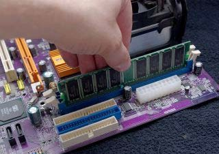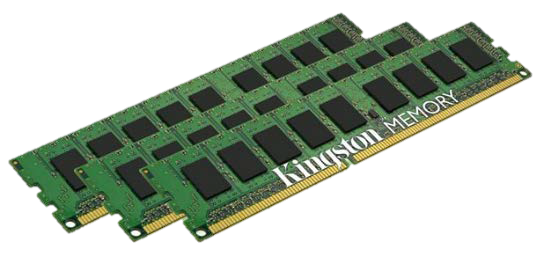

La memoria **RAM** se utiliza para el almacenamiento y la recuperación inmediata de datos. Su memoria RAM puede procesar la información significativamente más rápido que los datos de un disco duro: de veinte a cien veces más rápido, dependiendo del hardware y la tarea específicos.

La memoria **ROM** hace referencia a un pequeño espacio de memoria para almacenar el firmware de un ordenador o dispositivo.

¿Cuánta **memoria RAM** requieren las siguientes aplicaciones?


### Esquema de memorias


## Gestión de la memoria RAM

Algunos **conceptos** importantes que veremos relativos a la memoria:

-   Cada **celda** de una memoria puede almacenar un bit.
-   **Palabra**: número de bits que suele contener cada posición de memoria (6, 8, 16, 32 o 64 bits).
-   El conjunto de celdas en las que se almacena una palabra se llama **posición de memoria**.
-   **Dirección**: posición de memoria en la que se almacena una información (conjunto de bits que identifican a cada palabra de la memoria).
-   Hay que distinguir entre dirección de una posición de memoria y el dato que puede ser almacenado en esa dirección.
-   Si tenemos un sistema con una palabra de 4 bits y una dirección de 10 bits, tendremos una capacidad de: 210 (palabras) \* 4 (bits por palabra) = 4 Kbits

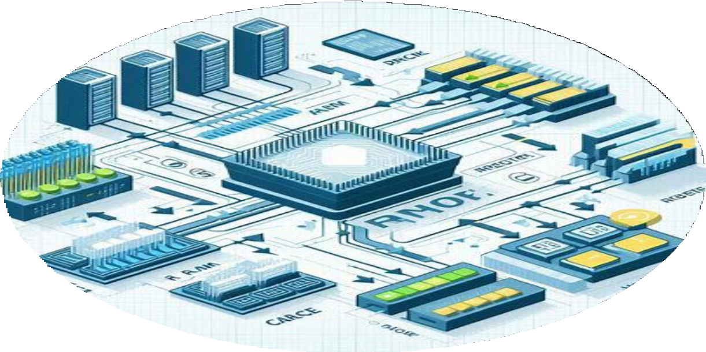

```note
La **gestión de memoria** de los sistemas operativos (a través del administrador de memoria) es el proceso de administrar el uso de la memoria principal por parte de los distintos procesos que se ejecutan en un sistema informático.
```

La gestión de memoria tiene como objetivos principales:

-   Asignar espacio en memoria a los procesos cuando lo necesiten y liberarlo cuando terminen.
-   Proteger los espacios de memoria de los procesos para evitar interferencias o accesos no autorizados.
-   Compartir la memoria entre los procesos que lo requieran, por ejemplo, para comunicarse o acceder a datos comunes.
-   Optimizar el rendimiento del sistema, aprovechando al máximo la capacidad de la memoria y reduciendo el tiempo de acceso.

Existen dos formas principalmente para gestionar la memoria, dependiendo del tipo de sistema operativo, el hardware disponible y las necesidades de los usuarios.

Las técnicas que veremos son:

-   **Particionado:** se divide la memoria en particiones fijas o variables. A cada partición se asigna a un proceso, y se utiliza una tabla para llevar el control de las particiones libres y ocupadas.Provoca fragmentación en la memoria, que veremos a posteriori.

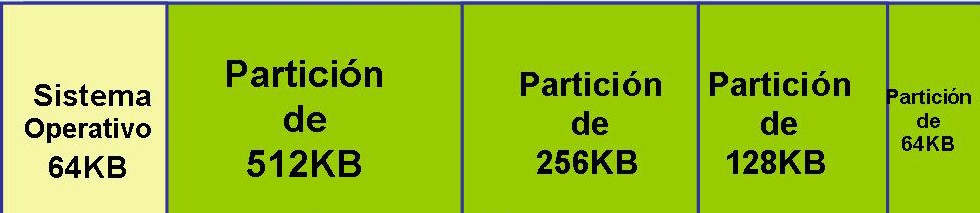

-   **Paginación**: se divide la memoria en unidades pequeñas y fijas llamadas **páginas**, y se divide cada proceso en unidades del mismo tamaño llamadas **marcos**. Se usa también una tabla para asignar los marcos a las páginas. La paginación permite que los procesos se ejecuten de manera eficiente sin preocuparse por la ubicación física de los datos en memoria.
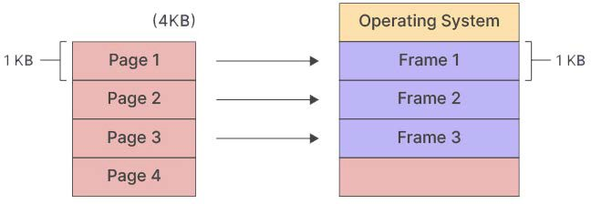

El administrador de memoria carga procesos continuamente y los que han finalizado son eliminados de la memoria.

Cuando se utilizan particiones variables, especialmente, se da un proceso conocido como **fragmentación de la memoria**. La fragmentación es generada cuando durante el reemplazo de procesos quedan huecos entre dos o más procesos de manera no contigua y cada hueco no es capaz de soportar ningún proceso de la lista de espera.

> La **fragmentación** es el proceso por el cual en la memoria principal (o disco) quedan espacios o huecos sin utilizar para algún proceso o dato a lo largo del tiempo, degradando el rendimiento en dichos dispositivos.


**Memoria interna en estado de fragmentación**

En la memoria producen dos tipos de fragmentación:

-   La **fragmentación interna** hace referencia al espacio de memoria desperdiciado dentro de las propias particiones.

    Por ejemplo, si el sistema carga un programa que requiere de 50 MB y 19 bytes de memoria podría utilizar un bloque de 51 MB desperdiciando casi 1 MB.


-   La **fragmentación externa** ocurre cuando el primer bloque libre de memoria no es suficiente para que el siguiente programa lo use.

    Por ejemplo, digamos que un sistema carga tres programas en la memoria, cada uno ocupando 50 megabytes o MB. El segundo programa termina, dejando ese bloque de 50 MB libres. Si el siguiente programa a iniciar requiere de 100 MB, no sería capaz de utilizar ese bloque de 50 MB de espacio libre, y el sistema le asigna el siguiente intervalo de 100 MB libres.


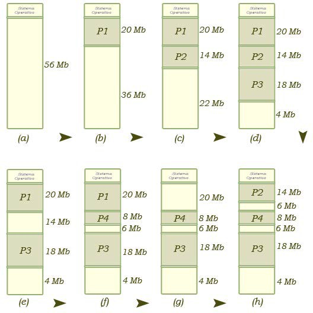


### Particiones 

El administrador divide la memoria en particiones de varios tamaños antes del inicio de la ejecución de los programas. 

Cuando llega un nuevo proceso, el planificador lo ubica en la partición con el tamaño más adecuado y, cuando un proceso acaba, su partición queda libre para un nuevo uso.

Este método genera **fragmentación interna** y **fragmentación externa** ya que no siempre se aprovecha todo el espacio de memoria.

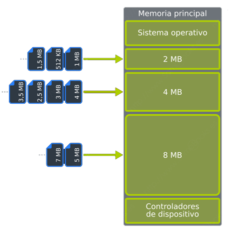 


### Paginación

Se divide la memoria en unidades pequeñas y fijas llamadas **páginas**, y se divide cada proceso en unidades del mismo tamaño llamadas **marcos**. 

Cada marco se asigna a una página libre en memoria (que no tiene por qué ser contigua), y se utiliza una tabla para llevar el control de las páginas y los marcos. 

Esta técnica evita la *fragmentación externa*, pero puede generar sobrecarga por el manejo de las tablas y los cambios de página. El último marco genera **fragmentación interna**.


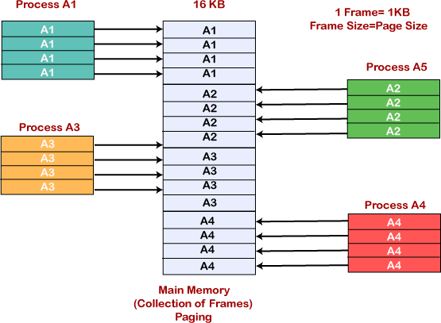


- A modo de ejemplo, imagina que el proceso que queremos cargar en memoria lo representáramos con el zumo contenido en la botella de la siguiente imagen. Por su parte, la memoria donde pretendemos almacenarlo estaría representada por los vasos. Cada vaso, sería el equivalente a un marco de página de la memoria.


- Así, cuando carguemos el proceso en memoria, cada página (cantidad de zumo del tamaño de un vaso) se ubicará en un marco de página diferente. Gracias a este planteamiento, se acaba con la fragmentación externa, y la fragmentación interna quedará reducida al último marco de página asignado a cada proceso.


## Gestión de la memoria virtual

Todos los ordenadores cuentan con una determinada cantidad de memoria RAM, pero esta es limitada y generalmente resulta insuficiente para los requerimientos del usuario. Fotheringam diseñó en 1961 un método de gestión de memoria conocido como **memoria virtual.**

```note
💡 La **memoria virtual** es una técnica de gestión de la memoria que permite que un sistema operativo disponga, tanto para el software de usuario como para sí mismo, de mayor cantidad de memoria que la que está disponible físicamente.
```

Fotheringam pensó en la posibilidad de que al cargar un programa en memoria, este fuera muy grande y así que creó una técnica de forma que solo una parte del proceso que se estaba ejecutando estaría en memoria, y el resto quedaría en los discos de almacenamiento secundario, en un sitio llamado **espacio de intercambio** como veremos más adelante.

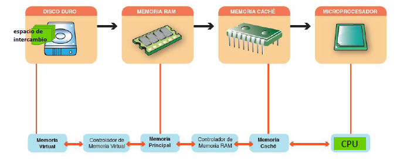

> Cuando se cargan muchos procesos a la vez el equipo se ralentiza puesto que tiene que pasar mucha información del disco a memoria RAM y los sistemas de almacenamiento secundario son mucho más lentos que la memoria.


```note
💡 Se denomina **espacio de intercambio** a la zona de un disco de almacenamiento secundario utilizada para almacenar procesos que actualmente no están en ejecución y así dejar memoria RAM para los procesos que sí lo están.
```

Tal y como hemos visto en la anterior unidad, la parte que administra la memoria de un SO es el **administrador de memoria.**

El administrador de memoria lleva un registro de las partes de la memoria que se están utilizando (en particiones) y guarda espacios para los nuevos procesos, liberando los que han finalizado. Es también el encargado de gestionar el uso de **memoria virtual** o intercambio al disco duro en caso de necesidad.

```note
💡 Las **técnicas de gestión de memoria virtual** , permiten ejecutar procesos de programas de mayor tamaño que la memoria RAM disponible, usando para eso el disco de almacenamiento como ampliación de la memoria.
```

El inconveniente de esta técnica es la importante bajada de rendimiento que supone el uso de discos, mucho más lentos que la memoria y el uso de **direcciones virtuales** y **direcciones físicas** reales que necesitarán el uso de una tabla de conversión intermedia que veremos más adelante.

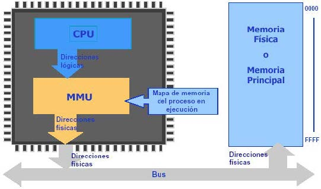


## Técnicas de gestión de la memoria virtual 

### Paginación con memoria virtual

Recordemos que la paginación es una técnica que consiste en dividir la memoria interna o RAM en particiones iguales llamadas frames o marcos, y los procesos en partes del mismo tamaño denominadas páginas. 

-   Es un esquema de gestión de memoria en el que la asignación de memoria no es contigua.
-   El espacio de direcciones virtuales de un proceso está dividido en bloques de tamaño fijo llamados **páginas**.
-   Se produce algo de fragmentación interna.
-   La memoria física se divide en **marcos de página**.

Se utiliza habitualmente para la gestión de la memoria virtual gracias a su facilidad para llevar páginas no usadas al disco.

- El espacio de direcciones virtuales divididas en bloques de tamaño fijo llamados páginas.
- La memoria física dividida en bloques fijos llamados **marcos de página** o frames.
- Mediante una **tabla de paginas,** la CPU asigna las direcciones físicas de
  los **frames** a las **paginas** en las que se ha dividido el programa.
- De la traducción y asignación de direcciones en la paginación se encarga el **MMU** (*Unidad de administración de memoria*)

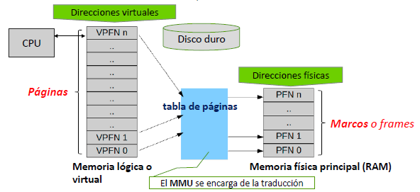


Los procesos de los distintos programas se van cargando en la memoria RAM en sus respectivos **marcos** hasta que la memoria física se llene. En ese momento los procesos que no quepan en la memoria física y no estén en ejecución en ese momento **se moverán al disco** y se borrará su entrada de la tabla de páginas. 

Si al buscar una página en la tabla de páginas no se encuentra, se producirá un **fallo de página**. Ello significa que no estaba cargada en la RAM y se solicitará recuperar dicho dato del disco añadiéndose por tanto a la tabla una nueva entrada y borrando una anterior.

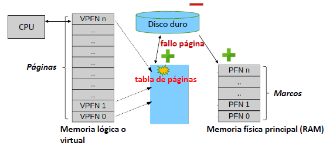

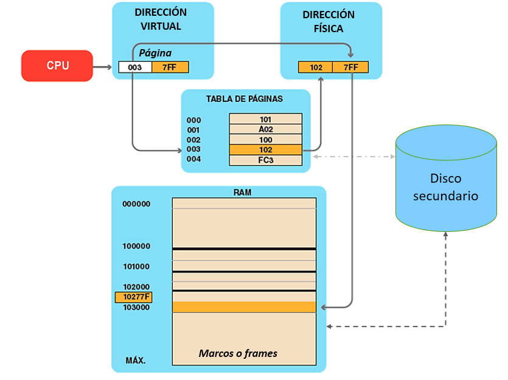

Cuando la memoria RAM se llena se llevan los marcos de los procesos inactivos al disco duro y se eliminan de la tabla de páginas.

Si el dato de la dirección virtual no estuviera en la tabla de páginas se produce un **fallo de página** y se recuperará del espacio de intercambio del disco duro.

#### Rendimiento paginación (hiperpaginación)

```note
💡  Si el sistema no está correctamente ajustado se puede producir un fenómeno llamado **hiperpaginación o trashing**. Dicho proceso sucede cuando un proceso o programa genera fallos de página frecuentemente y el sistema pasa la mayor parte del tiempo paginando degradando el rendimiento del sistema.
```

Se puede evitar reduciendo el grado de multiprogramación, es decir reduciendo el nº de procesos ejecutados a la vez en una máquina con recursos limitados.

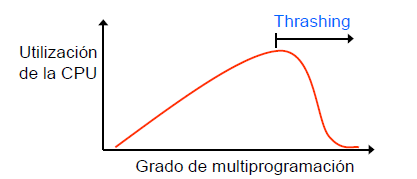

El **tamaño** de las páginas es otra consideración importante de cara al **rendimiento** de la técnica de paginación:

- Página pequeña > se requieren más páginas por proceso > tablas más grandes > menor fragmentación interna.
- Páginas grandes > se requieren menos páginas por proceso > tablas pequeñas > mayor fragmentación interna.

La memoria secundaria está diseñada para transferir eficientemente grandes bloques de datos, luego por todo lo anterior podríamos concluir que es mejor tener páginas más grandes.


### Técnica de swapping

```note
💡 El **swapping** es un caso concreto del uso de técnicas de memoria virtual utilizado en sistemas operativos basados en **Linux,** relativa al espacio que se le da a la memoria virtual en el disco duro.
```

Se siguen usando páginas  y tablas de paginación en la memoria virtual y consiste en la existencia de una **partición especial** , (un espacio delimitado en el disco) denominada partición swap y con un tamaño generalmente que se corresponde con la mitad de la memoria RAM física total.

Se asegura de esta forma que siempre haya espacio disponible en el disco duro y se evita su fragmentación. Además esta partición se puede situar en un sitio del disco de más rápido acceso (al principio de éste) o incluso en una unidad dedicada tipo flash.

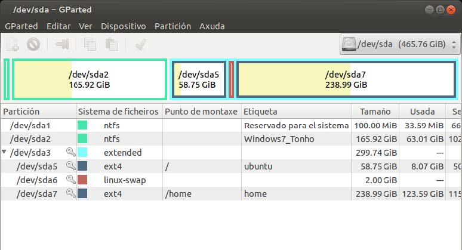

   Partición de espacio swap dedicado en un SO Linux.


