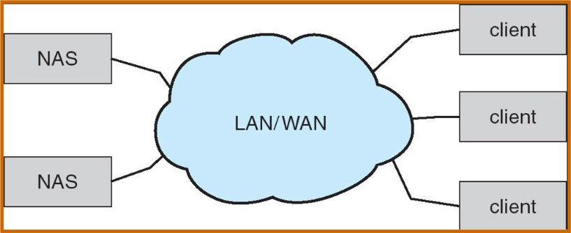
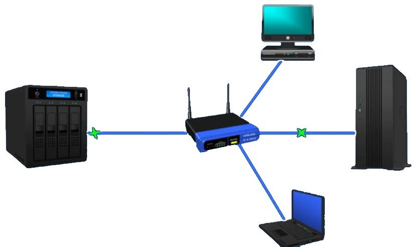
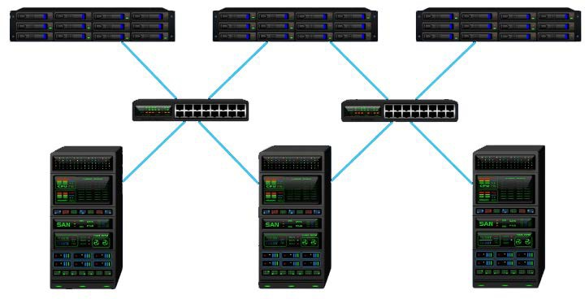
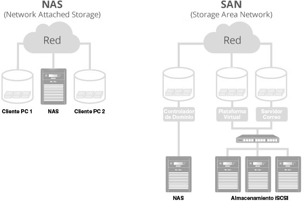
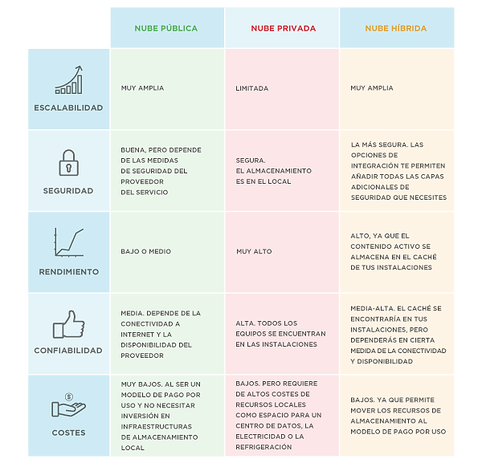
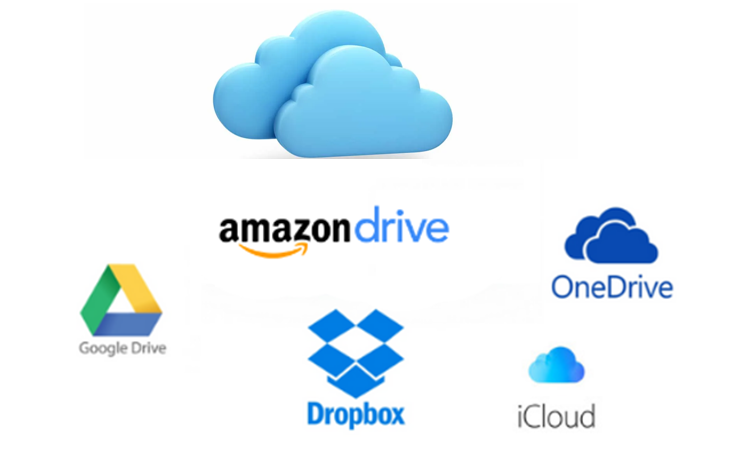
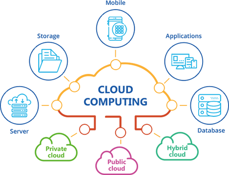
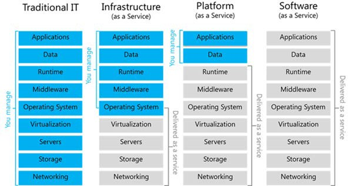
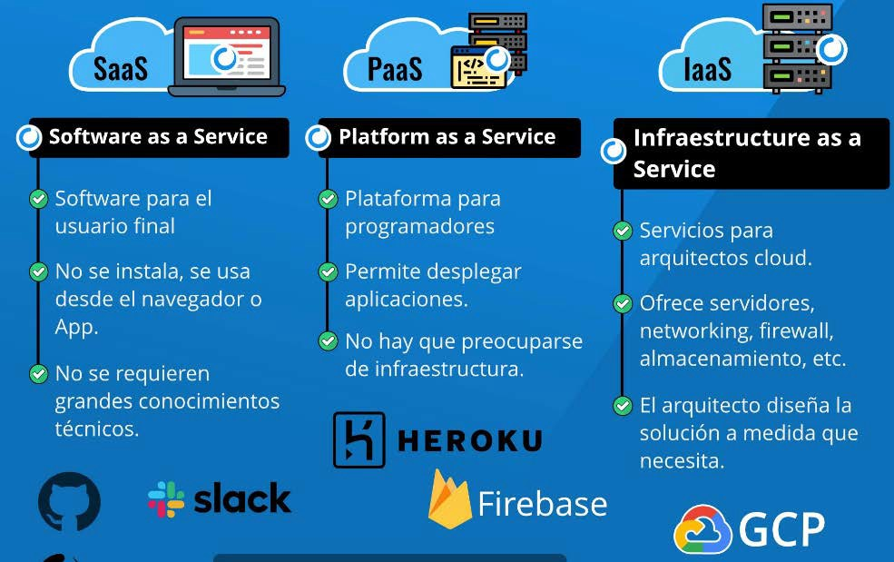
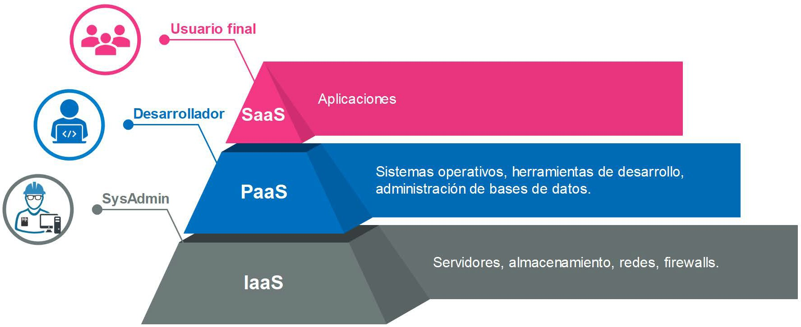

# UT3.2 Almacenamiento en red y en la nube

## Contenido y debate introductorio

<iframe width="560" height="315" src="https://www.youtube.com/embed/7tNKXY5lfFI" title="YouTube video player" frameborder="0" allow="accelerometer; autoplay; clipboard-write; encrypted-media; gyroscope; picture-in-picture; web-share" allowfullscreen></iframe>


## Almacenamiento en red local

```note
💡 El **almacenamiento en red local** busca habilitar uno o múltiples discos duros en una red de forma que los datos que allí se almacenen permanezcan accesibles a todos los dispositivos autorizados que quieran utilizarlos.
```

Veremos los siguientes tipos de almacenamiento en red local:

-  **NAS** (Network Attached Storage)
-  **SAN** (Storage Area Network)

### NAS

En redes locales se suele utilizar como un tipo de almacenamiento el sistema **NAS**, de las siglas en inglés de *Network Attached Storage* o almacenamiento conectado en red, suele ser el elegido por las pequeñas empresas y por los usuarios para centralizar sus archivos y copias de seguridad.

Los sistemas de almacenamiento NAS se conectan directamente al router o punto de acceso de la red y cuentan con entidad propia dentro de ella.

Su configuración y gestión se realiza a través del protocolo TCP/IP por lo que es posible acceder a los datos que contiene desde cualquier lugar y desde cualquier navegador de internet.

Usado sobre todo para hogares y pequeñas y medianas empresas.





### SAN

El sistema de almacenamiento en red tipo **SAN** o *Storage Area Network*, es el sistema de almacenamiento en red más complejo. Es el más utilizado entre las grandes empresas y menos entre particulares.

Este tipo de almacenamiento consiste en conectar una serie de **discos duros** a una controladora que suma sus capacidades formando un espacio de almacenamiento global. Después, este sistema se conecta a uno o varios **servidores** que se encarga de gestionar los datos que se almacenan en el espacio común a través de **switches**.

Se pueden configurar centros de datos que virtualmente forman una sola unidad, en distintas localizaciones geográficas, por lo que se reduce el riesgo de pérdida de datos por incendios o desastres naturales. Esto lo convierte en el sistema de almacenamiento ideal para los servicios que ofrecen **almacenamiento en la nube** que estudiaremos más adelante.



### Comparativa entre NAS y SAN

|                      | **NAS**                      | **SAN**                    |
|----------------------|------------------------------|----------------------------|
| Tipo de datos        | Archivos compartidos         | Datos a nivel de bloque    |
| Cableado utilizado   | LAN                          | Fibra                      |
| Clientes principales | Usuarios finales             | Servidores de aplicaciones |
| Acceso a disco       | A través del dispositivo NAS | Acceso directo             |
| Uso                  | Hogares y pymes              | Grandes empresas           |



## Almacenamiento en la nube

```note
💡 El **almacenamiento en la nube** (o cloud storage) es un modelo de servicio en el cual los datos de un sistema se almacenan, se administran, y se respaldan de forma remota, típicamente en servidores que están en la nube y que son administrados por un proveedor del servicio.
```

Estos datos se ponen a disposición de los usuarios o administradores a través de una red, como lo es Internet aprovechándose de las configuraciones **NAS** vistas.

Al hablar de almacenamiento en la nube, se busca mantener las ventajas principales de un sistema en la nube, como son: elasticidad en el espacio que se puede utilizar, y que sea un servicio por demanda, que en este caso se maneja por bloques de información, por ejemplo se pueden contratar 5GB, 20GB, 100GB o 2TB, pero no valores intermedios, aunque dependerá del proveedor.

💡 Excepcionalmente el correo electrónico con acceso por webmail podía servir como un almacén de reserva donde guardar algunos archivos que necesitasen ser usados desde ordenadores distintos al habitual, pero no era un sistema excesivamente práctico, dadas las limitaciones de espacio existentes en la mayoría de los servicios de correo electrónico.

Existen básicamente tres tipos de servicios de almacenamiento en la nube:

- **Público**: Se trata de un servicio en la nube al que puede acceder en línea cualquier persona que esté autorizada. Utiliza un mismo conjunto de hardware para el almacenamiento de información de varias personas, con medidas de seguridad y espacios virtuales para que cada usuario puede ver únicamente la información que le corresponde. Entre los servicios que puedes encontrar de este tipo están: *Dropbox, Google Drive, MediaFire, Box..*
- **Privado**: Un sistema de este tipo está diseñado específicamente para cubrir las necesidades de una persona o **empresa**. Este tipo de almacenamiento en la nube puede ser presentado en dos formatos: *on-premise* (en la misma oficina o casa) y alojado externamente. Este modelo es más usado por empresas y menos conocidos por el público general. Por ejemplo la *Oracle Cloud Platform, Amazon Cloud Drive, OwnCloud*..
- **Híbrido:** Combinación de almacenamiento en nubes públicas y privadas, de tal forma que a los usuarios les es posible personalizar las funciones y las aplicaciones que se mejor adapten a sus necesidades.

Comparativa entre los tres tipos de servicios de nubes de almacenamiento:



### Nube pública

Proveedores de **almacenamiento** en la nube **pública**:



## Cloud Computing

```note
💡 El **cloud computing** es la utilización de recursos (servidores, aplicaciones, …) que se encuentran en Internet, con lo que la gestión de la infraestructura (servidores, almacenamiento, red) se encarga un tercero.
```

Es un paso más allá del simple almacenamiento que trata de obtener una optimización total de la infraestructura mediante la automatización para conseguir una flexibilidad y adaptabilidad de los recursos informáticos.

¿Que se quiere resolver con la utilización de Cloud Computing?

-  Coste de la infraestructura
-  Escalabilidad
-  Flexibilidad
-  Disponibilidad



**Ventajas:**

-   La **disponibilidad** se refiere a que la infraestructura estará siempre disponible, desde cualquier lugar. Lo único que necesitamos es conexión para poder acceder a nuestros recursos.
-   Su flexibilidad, ya que un aumento de demanda se puede ‘escalar’ la capacidad de una infraestructura, volviendo luego a un estado de baja demanda.

**Desventajas:**

-   Absoluta dependencia de las comunicaciones, si no hay conexión no habrá acceso a la nube y sus servicios.
-   Problemas de seguridad.
-   Dependencia total del proveedor.
-   Problemas legales (**LOPD**). Desconocimiento de donde esta nuestra información y su gestión.

Tipos de **Cloud Computing**:

-   **IaaS** (**Infraestructure** as a Service): Proporciona la infraestructura de un servidor sin SO ni aplicaciones para configurarla a posteriori. AWS, Azure, GCP, Openstack
-   **PaaS** (**Platform** as a Service): Proporciona una plataforma que incluye la infraestructura y el SO instalado. Por ejemplo Windows Azure, Heroku, Firebase.
-   **SaaS** (**Software** as a Service): Proporciona aplicaciones finales ya listas al usuario a través de un navegador web. Por ejemplo Office365, Google services, Teams.







Principales proveedores de **cloud computing**:


