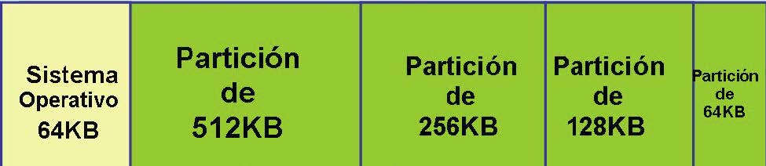
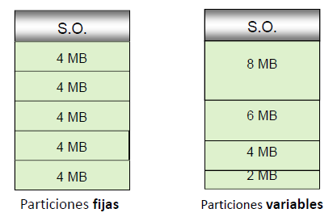
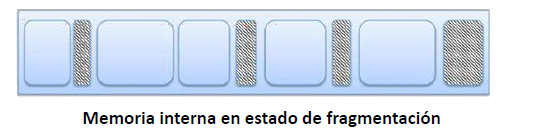
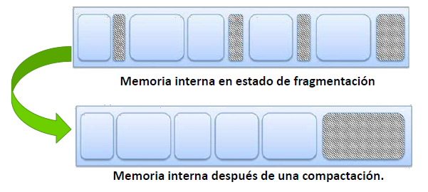
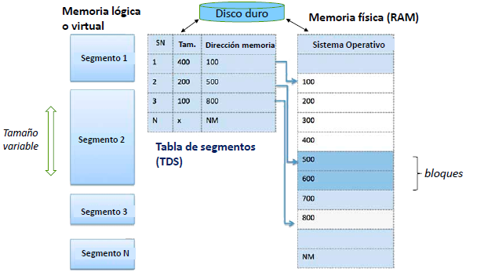
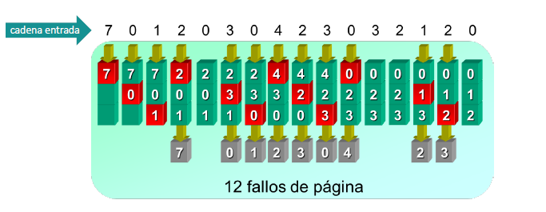
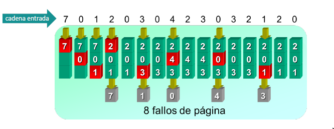
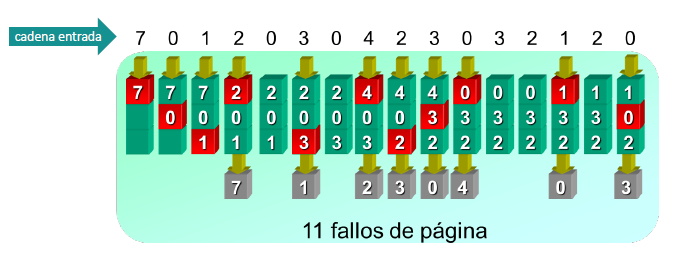
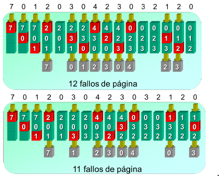

# UT3.3 Gestión de los recursos de un SO: La memoria

📕 [Contenido en presentación PDF](/pdf/UT3.3 - Gestión de recursos - Memoria.pdf)

## Contenido y debate introductorio

<iframe width="560" height="315" src="https://www.youtube.com/embed/jc_8k2qkSLI" title="YouTube video player" frameborder="0" allow="accelerometer; autoplay; clipboard-write; encrypted-media; gyroscope; picture-in-picture; web-share" allowfullscreen></iframe>

## Gestión de la memoria RAM

Algunos <u>conceptos</u> importantes que veremos relativos a la memoria:

-   Cada **celda** de una memoria puede almacenar un bit.
-   **Palabra**: número de bits que suele contener cada posición de memoria (*6, 8,16, 32 o 64 bits*).
-   El conjunto de celdas en las que se almacena una palabra se llama **posición de memoria**.
-   **Dirección**: posición de memoria en la que se almacena una información (conjunto de bits que identifican a cada palabra de la memoria).
-   Hay que distinguir entre dirección de una posición de memoria y el dato que puede ser almacenado en esa dirección.
-   Si tenemos un sistema con una palabra de 4 bits y una dirección de 10 bits, tendremos una capacidad de: 2^10 (palabras)\* 4 (bits por palabra) = *4 Kbits*

En la anterior unidad vimos que el **administrador de memoria del SO** era el encargado de la gestión de esta parte de un ordenador.

>   📌 La memoria tiene que ser gestionada y controlada por el SO de tal manera que cada proceso utilice su espacio en memoria sin afectar a otros donde pudiera haber instrucciones o datos.

Generalmente la memoria se divide en:

-   **Particiones fijas:** el administrador de memoria asignará los procesos a las particiones de un tamaño fijo que considere. Se usará en la **paginación** como veremos más adelante.
    
-   **Particiones variables**: hará falta una planificación más compleja por parte del SO para asignar los procesos de forma dinámica. Se usará para la **segmentación**.
    
    



Al **Sistema Operativo** se le suele reservar una dirección baja de memoria y a continuación el espacio de usuario con los programas divididos en particiones de tamaño predefinido o variables.




La **reubicación** hace referencia al hecho de ubicar los programas en memoria para su ejecución.

El **administrador de memoria** carga procesos continuamente y los que han finalizado son eliminados de la memoria.

Cuando se utilizan particiones variables, especialmente, se da un proceso conocido como **fragmentación de la memoria**. La fragmentación es generada cuando durante el reemplazo de procesos quedan huecos entre dos o más procesos de manera no contigua y cada hueco no es capaz de soportar ningún proceso de la lista de espera.

```note
💡 La **fragmentación** es el proceso por el cual en la memoria principal (o disco) quedan espacios o huecos sin utilizar para algún proceso o dato a lo largo del tiempo, degradando el rendimiento en dichos dispositivos.
```



Se producen dos tipos de fragmentación: **interna** y **externa**, que veremos a continuación:

-   La **fragmentación externa** ocurre cuando el primer bloque libre de memoria no es suficiente para que el siguiente programa lo use. Por ejemplo, digamos que un sistema carga tres programas en la memoria, cada uno ocupando 50 megabytes o MB. El segundo programa termina, dejando ese bloque de 50 MB libres. Si el siguiente programa a iniciar requiere de 100 MB, no sería capaz de utilizar ese bloque de 50 MB de espacio libre, y el sistema le asigna el siguiente intervalo de 100 MB libres.
    
-   La **fragmentación interna** hace referencia al espacio de memoria desperdiciado dentro de las propias particiones. Por ejemplo, si el sistema carga un programa que requiere de 50 MB y 19 bytes de memoria podría utilizar un bloque de 51 MB desperdiciando casi 1 MB.

> 📌 Al proceso para revertir el estado de fragmentación en memoria o discos se le denomina **compactación**.




## Gestión de la memoria virtual

Todos los ordenadores cuentan con una determinada cantidad de memoria RAM, pero esta es limitada y generalmente resulta insuficiente para los requerimientos del usuario. Fotheringam diseñó en 1961 un método de gestión de memoria conocido como **memoria virtual.**

```note
💡 La **memoria virtual** es una técnica de gestión de la memoria que permite que un sistema operativo disponga, tanto para el software de usuario como para sí mismo, de mayor cantidad de memoria que la que está disponible físicamente.
```

Fotheringam pensó en la posibilidad de que al cargar un programa en memoria, este fuera muy grande y así que creó una técnica de forma que solo una parte del proceso que se estaba ejecutando estaría en memoria, y el resto quedaría en los discos de almacenamiento secundario, en un sitio llamado **espacio de intercambio** como veremos más adelante.


Cuando se cargan muchos procesos a la vez el ordenador se ralentiza puesto que tiene que pasar mucha información del disco a memoria RAM y los discos de almacenamiento secundario son mucho más lentos que la memoria.

```note
La **MMU** (*Memory Management Unit*) es un elemento de hardware, responsable del manejo de los accesos a la memoria por parte de la CPU.
```

El papel de la **MMU** generalmente lo desempeñará el chipset de la placa, siendo sus funciones:

-   Traducción de direcciones lógicas (virtuales) a direcciones físicas (reales)
-   La protección de la memoria
-   El control de la caché

```note
💡 Se denomina **espacio de intercambio** a la zona de un disco de almacenamiento secundario utilizada para almacenar procesos que actualmente no están en ejecución y así dejar memoria RAM para los procesos que sí lo están.
```

Tal y como hemos visto en la anterior unidad, la parte que administra la memoria de un SO es el **administrador de memoria.**

El administrador de memoria lleva un registro de las partes de la memoria que se están utilizando (en particiones) y guarda espacios para los nuevos procesos, liberando los que han finalizado. Es también el encargado de gestionar el uso de **memoria virtual** o intercambio al disco duro en caso de necesidad.

## Técnicas de gestión de memoria virtual

```note
💡 Las **técnicas de gestión de memoria virtual** , permiten ejecutar procesos de programas de mayor tamaño que la memoria RAM disponible, usando para eso el disco de almacenamiento como ampliación de la memoria.
```

El inconveniente de esta técnica es la importante bajada de rendimiento que supone el uso de discos, mucho más lentos que la memoria y el uso de **direcciones virtuales** y **direcciones físicas** reales que necesitarán el uso de una tabla de conversión intermedia y la ayuda de la MMU.


La gestión de la **memoria virtual** se lleva a cabo mediante las cuatro técnicas de gestión que veremos a continuación:

1.  Técnica de paginación
2.  Técnica de segmentación
3.  Técnica de swapping
4.  Técnica de paginación segmentada


### Técnica de paginación

```note
💡 La **paginación** es una técnica que consiste en dividir la memoria interna o RAM en particiones iguales llamadas frames o **marcos**, y los procesos en partes del mismo tamaño denominadas **páginas**.
```

-   Es un esquema de gestión de memoria en el que la asignación de memoria no es contigua.
-   El espacio de direcciones virtuales de un proceso está dividido en bloques de tamaño fijo llamados **páginas**.
-   Se produce fragmentación interna.
-   La memoria física se divide en **marcos de página**.
-   La dirección virtual consta de un número de página virtual y un desplazamiento.

#### Proceso de paginación

- El espacio de direcciones virtuales divididas en bloques de tamaño fijo llamados páginas.
- La memoria física dividida en bloques fijos llamados **marcos de página** o frames.
- Mediante una **tabla de paginas,** la CPU asigna las direcciones físicas de
  los **frames** a las **paginas** en las que se ha dividido el programa.
- De la traducción y asignación de direcciones en la paginación se encarga el **MMU** (*Unidad de administración de memoria*)


Los procesos de los distintos programas se van cargando en la memoria RAM en sus respectivos **marcos** hasta que la memoria física se llene. En ese momento los procesos que no quepan en la memoria física y no estén en ejecución en ese momento **se moverán al disco** y se borrará su entrada de la tabla de páginas. 

Si al buscar una página en la tabla de páginas no se encuentra, se producirá un **fallo de página**. Ello significa que no estaba cargada en la RAM y se solicitará recuperar dicho dato del disco añadiéndose por tanto a la tabla una nueva entrada y borrando una anterior.


#### Esquema de paginación


Cuando la memoria RAM se llena se llevan los marcos de los procesos inactivos al disco duro y se eliminan de la tabla de páginas.

Si el dato de la dirección virtual no estuviera en la tabla de páginas se produce un **fallo de página** y se recuperará del espacio de intercambio del disco duro.

#### Rendimiento e hiperpaginación

```note
💡  Si el sistema no está correctamente ajustado se puede producir un fenómeno llamado **hiperpaginación o trashing**. Dicho proceso sucede cuando un proceso o programa genera fallos de página frecuentemente y el sistema pasa la mayor parte del tiempo paginando degradando el rendimiento del sistema.
```

Se puede evitar reduciendo el grado de multiprogramación, es decir reduciendo el nº de procesos ejecutados a la vez en una máquina con recursos limitados.


El **tamaño** de las páginas es otra consideración importante de cara al **rendimiento** de la técnica de paginación:

- Página pequeña > se requieren más páginas por proceso > tablas más grandes > menor fragmentación interna.
- Páginas grandes > se requieren menos páginas por proceso > tablas pequeñas > mayor fragmentación interna.

La memoria secundaria está diseñada para transferir eficientemente grandes bloques de datos, luego por todo lo anterior podríamos concluir que es mejor tener páginas más grandes.


### Técnica de segmentación

```note
💡  La **segmentación** es una evolución del sistema anterior que se basa en el uso de particiones variables llamadas segmentos y una tabla de segmentos.
```

Si se produce un fallo de segmento se recupera del disco duro actualizándose la tabla de segmentos.

Puede organizarse la memoria en **bloques** concretos y tener partes de ella
destinadas a almacenar las estructuras de datos, que pueden crecer o menguar según las necesidades del usuario o del programa.

Para ello se utilizaran las **pilas de memoria** o *stacks*, en las que gestionan las estructuras de datos necesarias.

La paginación difiere por tanto de la segmentación en que las <u>páginas son de tamaño fijo</u> y <u>los segmentos no</u>.

#### Esquema de segmentación




### Técnica de swapping

```note
💡 El **swapping** es un caso concreto del uso de técnicas de memoria virtual utilizado en sistemas operativos basados en **Linux,** relativa al espacio que se le da a la memoria virtual en el disco duro.
```

Se siguen usando páginas  y tablas de paginación en la memoria virtual y consiste en la existencia de una **partición especial** , (un espacio delimitado en el disco) denominada partición swap y con un tamaño generalmente que se corresponde con la mitad de la memoria RAM física total.

Se asegura de esta forma que siempre haya espacio disponible en el disco duro y se evita su fragmentación. Además esta partición se puede situar en un sitio del disco de más rápido acceso (al principio de éste) o incluso en una unidad dedicada tipo flash.


   Partición de espacio swap dedicado en un SO Linux.


##   Algoritmos de sustitución de páginas	

-  Cuando se produce un fallo de página: el SO debe decidir qué página que está en memoria debe pasar a disco para traer a memoria la página requerida.
-  Si la página que sale ha sido modificada: se reescribe en disco.
-  Se puede elegir aleatoriamente, pero es más eficiente sacar una que no se vaya a utilizar pronto.
-  Algoritmos de sustitución que veremos:
    -   FIFO
    -   Optimo (OPT)
    -   LRU

### Algoritmo FIFO (First Input First Output)

Es el más sencillo y consiste en elegir como víctima la página que más tiempo lleva en memoria. Para ello es necesario que cada página posea un contador del tiempo que lleva en memoria o bien que exista una cola por orden de entrada.



>   Partiendo de un estado inicial en que nuestras tres páginas están vacías, las tres primeras referencias a distintas páginas de memoria (7, 0, 1) causarán fallos de página. La siguiente (2) causará uno, pero la quinta referencia (0) puede ser satisfecha sin requerir una nueva transferencia.


### Algoritmo OPTIMO (OPT)

Consiste en reemplazar la página que tardará más tiempo en utilizarse. Este algoritmo garantiza la tasa menor de fallos de página, pero no es fácilmente implementable.



> Este algoritmo, es de interés casi puramente teórico, y también conocido como OPT. Bajo este algoritmo, el enunciado será elegir como página a eliminar aquella página que no vaya a ser utilizada por un tiempo máximo.

### Algoritmo LRU (Last Recent Used)

Consiste en reemplazar aquella página que no haya sido utilizada desde hace más tiempo. La idea es suponer que si una página lleva mucho tiempo sin utilizarse tardará en volver a ser utilizada. Para implementar este algoritmo, a cada página se le asocia un contados que indica cuando se utilizó por última vez. Es el algoritmo más utilizado.



>   Cuando necesita elegir una página a eliminar, LRU elige la página que no ha sido empleada durante más tiempo. 

### Comparación FIFO vs LRU




