# UT4.2 Unidades de almacenamiento redundante y en red

📕 [Contenido en presentación PDF](/pdf/UT4.2 - Unidades de almacenamiento redundante y en red.pdf)

## Contenido y debate introductorio

<iframe width="560" height="315" src="https://www.youtube.com/embed/7tNKXY5lfFI" title="YouTube video player" frameborder="0" allow="accelerometer; autoplay; clipboard-write; encrypted-media; gyroscope; picture-in-picture; web-share" allowfullscreen></iframe>

## Sistemas RAID

```note
💡 Un **RAID** (*Redundant Array of Independent Disk*) es un grupo de discos que actúan colectivamente como un único sistema de almacenamiento, que, en la mayoría de los casos, soporta el fallo de uno de los discos sin perder información de modo que puedan operar con independencia.
```

Se trata de una tecnología que combina varios discos para formar una única unidad lógica, donde los mismos datos son almacenados en todos los discos (**redundancia**).

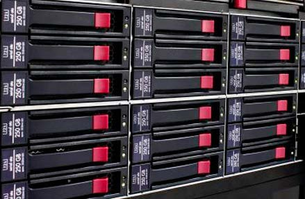

El grupo de investigación de *Berkely* acuñó en los años 80 el término RAID, y se definieron 6 niveles básicos (del 0 al 5) sin contar los anidados. Cada nivel proporciona una forma diferente de expandir datos en múltiples unidades que estudiaremos ahora.

A nivel empresarial RAID es muy utilizado a la hora de configurar el almacenamiento de servidores NAS y aplicaciones.

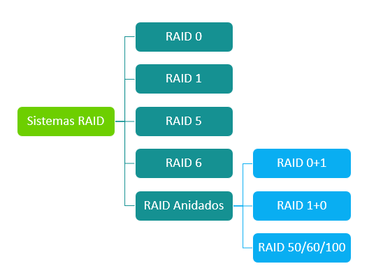

### RAID 0 (stripping)

Usa un <u>mínimo de 2 discos</u> y cuenta la suma de tamaños de todos los HDD.

Un **RAID 0**, conocido como **striping***,* utiliza como mínimo 2 discos y reparte los datos entre ambos*.* Ofrece un **mayor rendimiento**.

```warning
El RAID 0 no debe utilizarse con datos críticos ya que no se considera un sistema RAID real.
```

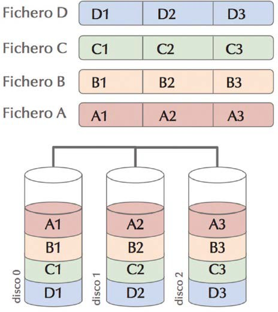

**Desventajas:**

Sin redundancia ni tolerancia a fallos. Cualquier fallo conlleva una pérdida total de los datos.

**Recomendado:**

Si priorizamos el rendimiento del sistema y el acceso a la información (diseño gráfico, en 3D y edición de video), con un presupuesto ajustado. Ofrece **alto rendimiento**, especialmente para archivos grandes.

### RAID 1 (espejo/mirroring)

Utiliza como mínimo 2 discos. En el caso de más unidades, solo contará el disco de menor tamaño. Es conocido como *espejo* o **mirroring**.

El RAID 1 usa 2 discos y duplica todos los datos de la primera unidad de forma sincronizada a la segunda unidad de almacenamiento.

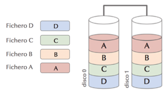

**Ventajas:**

Mayor rendimiento en las lecturas de datos. Podemos recuperar los datos si se rompe un disco.

**Desventajas:**

Es caro ya que necesitamos el doble de espacio y tiene moderada lentitud en escritura ya que tendremos que escribir constantemente en su segundo disco.

### RAID 0+1 (reflejo de discos con bandas)

El nivel RAID 0+1 es un tipo de **RAID** anidado que proporciona redundancia y rendimiento al replicar dos conjuntos de bandas de RAID 0 sobre un RAID 1.

El **espacio disponible** en el RAID 0+1 será **n/2** siendo *n* el nº de discos del RAID.

Los controladores actuales de RAID proporcionan automáticamente rendimiento y redundancia mediante el duplicado de bandas de discos; para ello, debe utilizar un número par de cuatro o más discos.

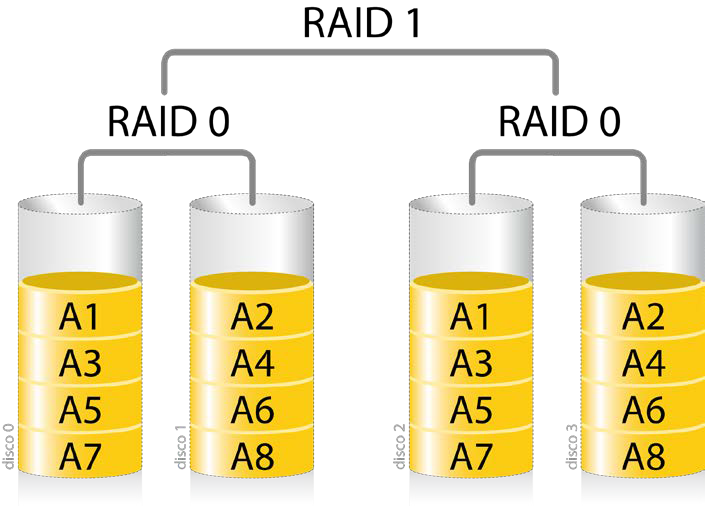

### RAID 5

Se necesitan como <u>mínimo 3 discos</u> (se podría romper un disco sin perder los datos). El **espacio disponible** en el RAID 5 será de **n-1**, siendo *n* el nº de discos del RAID. En el nivel 5 en vez de duplicar completamente los datos del disco duro se utilizan **bits de paridad distribuida** para que en caso de que se rompa un disco duro poder reconstruir la información del mismo. En este caso, los bits de paridad ocupan mucho menos espacio que duplicar un disco duro entero.

💡 Es el RAID más utilizado en servidores.

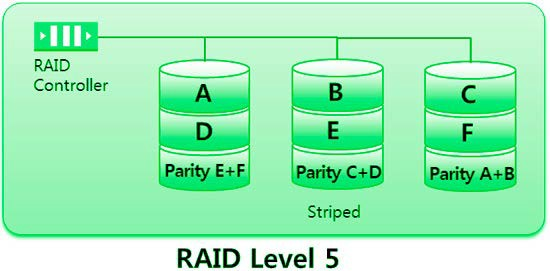

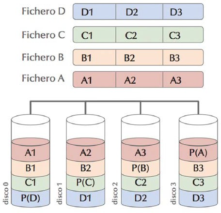

### RAID 6

Se necesitan como <u>mínimo 4 discos</u>. Puede tolerar **dos fallos** de discos duros (n-2)

El RAID 6 es prácticamente igual que el RAID 5, pero añade un **segundo nivel de paridad distribuida**, lo que nos permite que fallen hasta dos discos duros del RAID y poder sustituirlos. Si fallan 3, entonces toda la información del RAID se pierde.

Proporciona por tanto una elevada redundancia de datos y rendimiento de lectura.

El rendimiento en tareas de escritura es menor que el de RAID 5 debido a los dos cálculos de paridad. Requiere hacer un gasto adicional ya que dedicamos dos discos a la paridad, (si tenemos 4 discos de 1TB disponemos sólo de 2TB de espacio ya que los otros 2 TB se dedican a paridad).

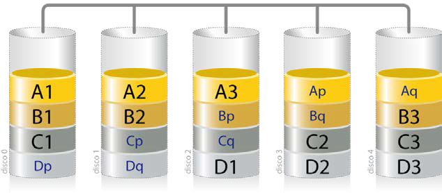

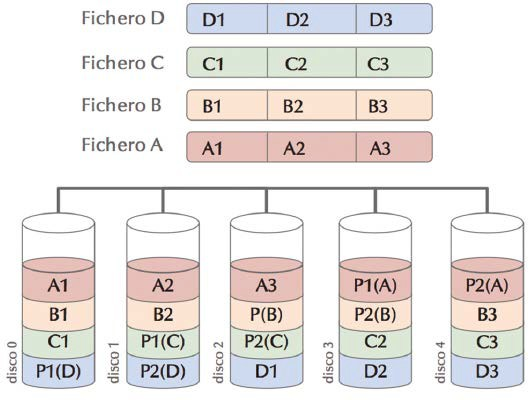

### RAID 10 (1+0)

El RAID 10 es otro tipo de RAID <u>anidado</u>, que combina una RAID 0 (*striping*) y un RAID 1. Si algo sale mal con uno de los discos en una configuración RAID 10, el tiempo de reconstrucción es muy rápido, ya que todo lo que se necesita es copiar todos los datos del espejo sobreviviente a una nueva unidad. Necesitaría un número mínimo de 4 discos. Como inconveniente tiene precios elevados.

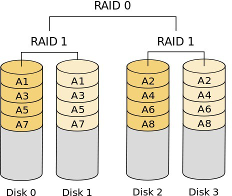

### RAID 50/60/100

Muchas empresas suelen optar por otras configuraciones anidadas, como RAID 50 (5+0), Raid 60 (6+0) o RAID 100 (10+0).

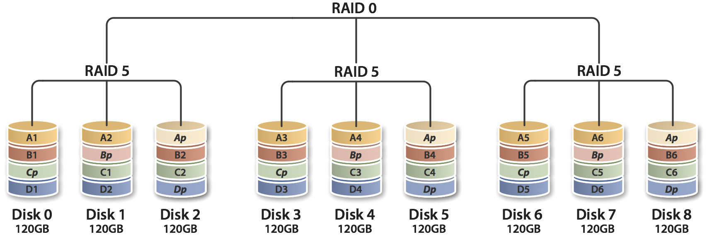

### Resumen y calculadora RAID

- Video explicación RAID Youtube:

<iframe width="560" height="315" src="https://www.youtube.com/embed/x8MXkvgeD0w" title="YouTube video player" frameborder="0" allow="accelerometer; autoplay; clipboard-write; encrypted-media; gyroscope; picture-in-picture; web-share" allowfullscreen></iframe>

- Calculadora online RAID:

🧮 [Calculadora RAID](https://www.synology.com/es-es/support/RAID_calculator)

### Otros términos RAID

Los tipos de RAID más utilizados en servidores son RAID1, RAID5, RAID6 y RAID10. Algunos términos importantes que conviene conocer son éstos:

-   **Datos de paridad**: éstos se distribuyen entre todos los discos físicos en el sistema. Si un disco físico falla, es posible reconstruirlo desde la paridad y los datos de los discos físicos restantes. Los datos de paridad están presentes en RAID5, 6,50 y 60

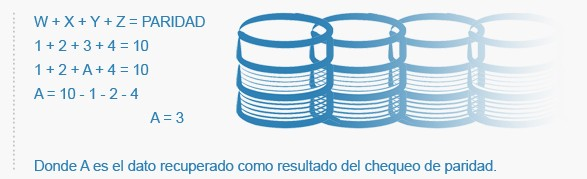

-   **Modo Degradado**: Ocurre cuando uno de los discos del RAID se vuelve ilegible, el disco entonces es considerado corrupto y se extrae del RAID. Los datos y la paridad del disco son almacenados en los discos restantes. Este proceso degrada en gran medida el rendimiento del RAID, y es lo que se llama Modo degradado.

Un concepto utilizado en sistemas RAID es el **disco de reserva** o spare.

```note
Un **disco de reserva** es un dispositivo físico instalado en un sistema RAID que se mantiene inactivo hasta que uno de los discos activos falla.
```

Un disco de reserva no es realmente parte del conjunto hasta que un disco falla y el conjunto se reconstruye sobre el de reserva. No suponen mejora alguna del rendimiento y no se usan en absoluto mientras no existan fallos de disco, pero minimizan el tiempo de reconstrucción (en el caso de los discos hot spare) y las labores de administración cuando se producen fallos.

Se suele llamar **RAID 5E** y **RAID 6E** a las variantes de RAID 5 y RAID 6 que incluyen discos de reserva disponibles para cualquiera de las unidades miembro. Estos discos pueden estar conectados y preparados (**hot spare**) o en espera (**standby spare**).

Cuando un disco del RAID se avería y es necesario cambiarlo, entra en juego otro concepto interesante denominado **hot swap**.

```note
**Hot swap** es la habilidad de sustituir un dispositivo o componente defectuoso de un sistema y reemplazarlo por otro sin apagar el sistema y sin interferir en las funciones de otros dispositivos. Se denomina también "cambio en caliente".
```

Los componentes con capacidad **hot swap** más comunes son los discos duros, aunque también las fuentes de alimentación. Ciertos modelos de servidores ofrecen también ofrecen la posibilidad de cambiar los módulos de ventilación en caliente.


Existen dos posibilidades de usar RAID; por software o por hardware.

-   **RAID por software**: Es el propio sistema operativo quien monta crea, monta y gestiona todo el RAID sobre una serie de discos físicos. El SO marca las particiones a usar del RAID para luego crear el dispositivo virtual y permitir el trabajar con éste espacio. El inconveniente de este sistema es la dedicación de recursos del servidor para toda tarea relacionada con el RAID, pero en cambio goza de la ventaja de ser y un sistema casi tan fiable como un RAID por hardware.

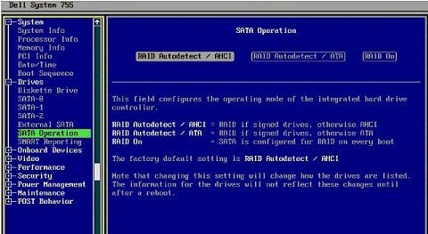

-   **RAID por hardware**: Los discos se conectan a una controladora RAID que es la encargada de realizar todas las operaciones de control del RAID y los discos.
 El RAID por hardware es más fiable que el RAID por software ya que es más independiente del resto de componentes.
  Ofrece un mayor rendimiento, que sobre todo se notará en RAID 5 y RAID 6 donde se realizan operaciones de paridad y se consumen más recursos.

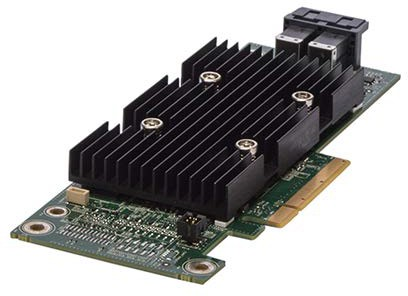

### Resumen RAID

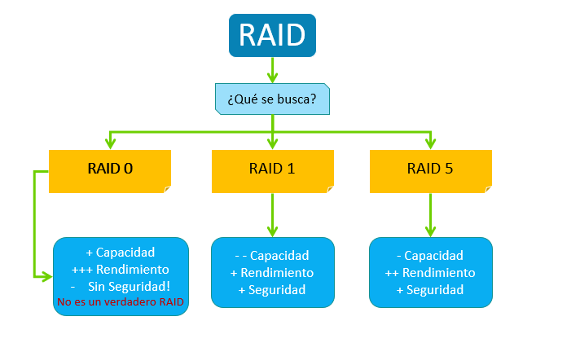

Configuraciones **RAID** recomendadas:

|                                         | **Servidor de gama** |              |
|-----------------------------------------|----------------------|--------------|
| Sistema de ficheros                     | Baja-media           | alta         |
| Para el Sistema Operativo               | 1 HDD o SDD          | RAID 1 o 0+1 |
| Para datos                              | 1 HDD, Raid 1 o 0+1  | RAID 5       |
| Registro y ficheros de actividad (logs) | 1 HDD                | RAID 1 o 0+1 |

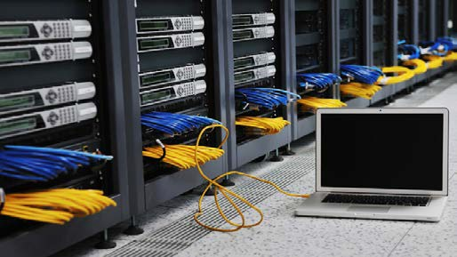

## Almancenamineto en red local

```note
💡 El **almacenamiento en red local** busca habilitar uno o múltiples discos duros en una red de forma que los datos que allí se almacenen permanezcan accesibles a todos los dispositivos autorizados que quieran utilizarlos.
```

Veremos los siguientes tipos de almacenamiento en red local:

-  **NAS** (Network Attached Storage)
-  **SAN** (Storage Area Network)

### NAS

En redes locales se suele utilizar como un tipo de almacenamiento el sistema **NAS**, de las siglas en inglés de *Network Attached Storage* o almacenamiento conectado en red, suele ser el elegido por las pequeñas empresas y por los usuarios para centralizar sus archivos y copias de seguridad.

Los sistemas de almacenamiento NAS se conectan directamente al router o punto de acceso de la red y cuentan con entidad propia dentro de ella.

Su configuración y gestión se realiza a través del protocolo TCP/IP por lo que es posible acceder a los datos que contiene desde cualquier lugar y desde cualquier navegador de internet.

Usado sobre todo para hogares y pequeñas y medianas empresas.


### SAN

El sistema de almacenamiento en red tipo **SAN** o *Storage Area Network*, es el sistema de almacenamiento en red más complejo. Es el más utilizado entre las grandes empresas y menos entre particulares.

Este tipo de almacenamiento consiste en conectar una serie de **discos duros** a una controladora que suma sus capacidades formando un espacio de almacenamiento global. Después, este sistema se conecta a uno o varios **servidores** que se encarga de gestionar los datos que se almacenan en el espacio común a través de **switches**.

Se pueden configurar centros de datos que virtualmente forman una sola unidad, en distintas localizaciones geográficas, por lo que se reduce el riesgo de pérdida de datos por incendios o desastres naturales. Esto lo convierte en el sistema de almacenamiento ideal para los servicios que ofrecen **almacenamiento en la nube** que estudiaremos más adelante.


### Comparativa entre NAS y SAN

|                      | **NAS**                      | **SAN**                    |
|----------------------|------------------------------|----------------------------|
| Tipo de datos        | Archivos compartidos         | Datos a nivel de bloque    |
| Cableado utilizado   | LAN                          | Fibra                      |
| Clientes principales | Usuarios finales             | Servidores de aplicaciones |
| Acceso a disco       | A través del dispositivo NAS | Acceso directo             |
| Uso                  | Hogares y pymes              | Grandes empresas           |


## Almacenamiento en la nube

```note
💡 El **almacenamiento en la nube** (o cloud storage) es un modelo de servicio en el cual los datos de un sistema se almacenan, se administran, y se respaldan de forma remota, típicamente en servidores que están en la nube y que son administrados por un proveedor del servicio.
```

Estos datos se ponen a disposición de los usuarios o administradores a través de una red, como lo es Internet aprovechándose de las configuraciones **NAS** vistas.

Al hablar de almacenamiento en la nube, se busca mantener las ventajas principales de un sistema en la nube, como son: elasticidad en el espacio que se puede utilizar, y que sea un servicio por demanda, que en este caso se maneja por bloques de información, por ejemplo se pueden contratar 5GB, 20GB, 100GB o 2TB, pero no valores intermedios, aunque dependerá del proveedor.

Excepcionalmente el correo electrónico con acceso por webmail podía servir como un almacén de reserva donde guardar algunos archivos que necesitasen ser usados desde ordenadores distintos al habitual, pero no era un sistema excesivamente práctico, dadas las limitaciones de espacio existentes en la mayoría de los servicios de correo electrónico.

Existen básicamente tres tipos de servicios de almacenamiento en la nube:

- **Público**: Se trata de un servicio en la nube al que puede acceder en línea cualquier persona que esté autorizada. Utiliza un mismo conjunto de hardware para el almacenamiento de información de varias personas, con medidas de seguridad y espacios virtuales para que cada usuario puede ver únicamente la información que le corresponde. Entre los servicios que puedes encontrar de este tipo están: *Dropbox, Google Drive, MediaFire, Box..*
- **Privado**: Un sistema de este tipo está diseñado específicamente para cubrir las necesidades de una persona o **empresa**. Este tipo de almacenamiento en la nube puede ser presentado en dos formatos: *on-premise* (en la misma oficina o casa) y alojado externamente. Este modelo es más usado por empresas y menos conocidos por el público general. Por ejemplo la *Oracle Cloud Platform, Amazon Cloud Drive, OwnCloud*..
- **Híbrido:** Combinación de almacenamiento en nubes públicas y privadas, de tal forma que a los usuarios les es posible personalizar las funciones y las aplicaciones que se mejor adapten a sus necesidades.

Comparativa entre los tres tipos de servicios de nubes de almacenamiento:


### Nube pública

Proveedores de **almacenamiento** en la nube **pública**:


## Cloud Computing

```note
💡 El **cloud computing** es la utilización de recursos (servidores, aplicaciones, …) que se encuentran en Internet, con lo que la gestión de la infraestructura (servidores, almacenamiento, red) se encarga un tercero.
```


Es un paso más allá del simple almacenamiento que trata de obtener una optimización total de la infraestructura mediante la automatización para conseguir una flexibilidad y adaptabilidad de los recursos informáticos.

¿Que se quiere resolver con la utilización de Cloud Computing?

-  Coste de la infraestructura
-   Escalabilidad
-   Flexibilidad
-   Disponibilidad


**Ventajas:**

-   La **disponibilidad** se refiere a que la infraestructura estará siempre disponible, desde cualquier lugar. Lo único que necesitamos es conexión para poder acceder a nuestros recursos.
-   Su flexibilidad, ya que un aumento de demanda se puede ‘escalar’ la capacidad de una infraestructura, volviendo luego a un estado de baja demanda.

**Desventajas:**

-   Absoluta dependencia de las comunicaciones, si no hay conexión no habrá acceso a la nube y sus servicios.
-   Problemas de seguridad.
-   Dependencia total del proveedor.
-   Problemas legales (**LOPD**). Desconocimiento de donde esta nuestra información y su gestión.

Tipos de **Cloud Computing**:

-   **IaaS** (**Infraestructure** as a Service): Proporciona la infraestructura de un servidor sin SO ni aplicaciones para configurarla a posteriori. AWS, Azure, GCP, Openstack
-   **PaaS** (**Platform** as a Service): Proporciona una plataforma que incluye la infraestructura y el SO instalado. Por ejemplo Windows Azure, Heroku, Firebase.
-   **SaaS** (**Software** as a Service): Proporciona aplicaciones finales ya listas al usuario a través de un navegador web. Por ejemplo Office365, Google services, Teams.


Principales proveedores de **cloud computing**:


