# UT4.3 Proceso de arranque

## Introducción

```note
El **proceso de arranque** o booting de un ordenador es un momento crítico en la inicialización previa del hardware y que lleva finalmente a la carga del sistema operativo.
```

Independientemente del sistema operativo utilizado, todos los ordenadores utilizan para su arranque uno de estos dos mecanismos firmware almacenados en la ROM:
-   El arranque tradicional basado en **BIOS** (*Basic Input Output*) \*en desuso
-   El actual basado en **UEFI** (*Interfaz unificado extensible del hardware*).

El arranque de un ordenador, conocido como *bootstrapping,* consta de dos fases:

1.  Arranque del hardware
2.  Arranque del SO

💡 Los dispositivos móviles (basados en procesadores *ARM*) utilizan otros sistemas como **BootROM** en Android o **SecureROM** en el iPhone.

## Firmware de arranque

### BIOS (Basic Input Output System)

BIOS es un estándar de firmware para la verificación e inicialización del hardware y la gestión del arranque del sistema operativo de un ordenador tipo PC que aparece en 1975 por primera vez en dispositivos con sistema operativo CP/M.

El BIOS residía en memorias ROM o EPROM pero desde mediados de los 90 comenzó a usarse en memorias flash que podían ser actualizadas por el usuario.

BIOS es un sistema de **16 bits** con bastantes limitaciones en cuanto a seguridad (código no firmado digitalmente y arranque en modo real de la CPU) así como diversas restricciones de tamaño para manejar discos/particiones (un máximo 4 particiones primarias con 2TB)

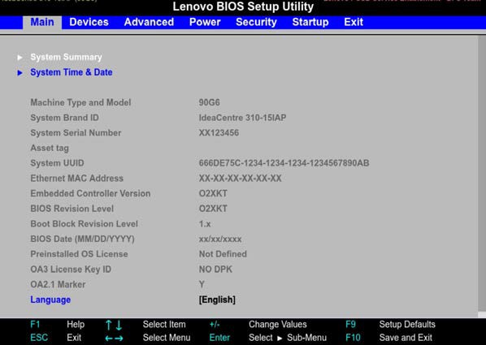

###  UEFI (Unified Extensible Firmware Interface)

Se trata de un nuevo firmware que nació con el objetivo de relevar a BIOS, superando a este último en asuntos como la limitación del tamaño de particiones de disco, la interfaz del programa de configuración o la seguridad intrínseca del proceso de arranque.

En 1998 nace EFI, a propuesta de fabricantes como Intel, AMD, Microsoft y fabricantes de PC, hasta llegar a la especificación UEFI en 2005. En 2006 es adoptada como mecanismo de arranque en dispositivos Apple basados en Intel.

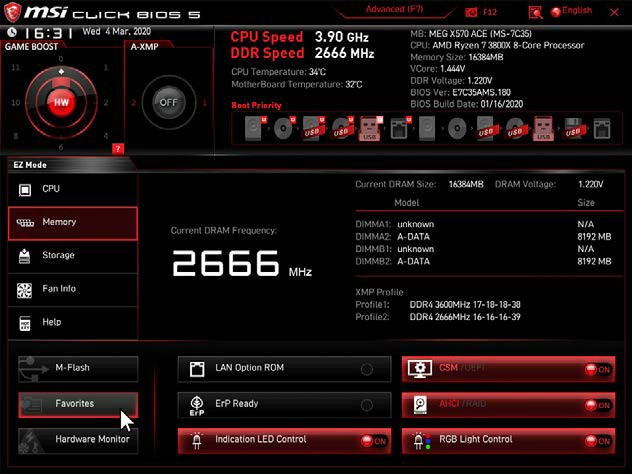

Desde 2011 los equipos ya incorporan firmware UEFI, aunque es muy habitual el uso del módulo de compatibilidad CSM (*Compatibility Support Module*) o heredado para arrancar el sistema al viejo estilo BIOS. Desde 2012 todos los ordenadores con Windows preinstalado incorporan UEFI.


El proceso de arranque UEFI es similar al de BIOS, con diferencias como veremos más adelante, pero especialmente que su código se ejecuta en **32 o 64-bit** en modo **protegido** de la CPU, mientras que en el caso de la BIOS se ejecuta en 16 bits.

UEFI reduce el tiempo de inicio y reanudación, y cuenta con un proceso que ayuda a prevenir de ataques del tipo **bootkit** y es compatible con el arranque **Secure Boot** utilizado en sistemas Windows (a partir de Windows 8), Mac y actualmente compatible con cualquier distribución Linux.

En la actualidad, todos estos equipos donde se dispone de UEFI es posible configurar el arranque del SO en dos modos:
-   Modo **UEFI puro**.
-   Modo heredado o **legacy** (BIOS): permite la compatibilidad con el viejo sistema BIOS deshabilitando algunas de las mejoras que UEFI tiene.

## Proceso de araranque

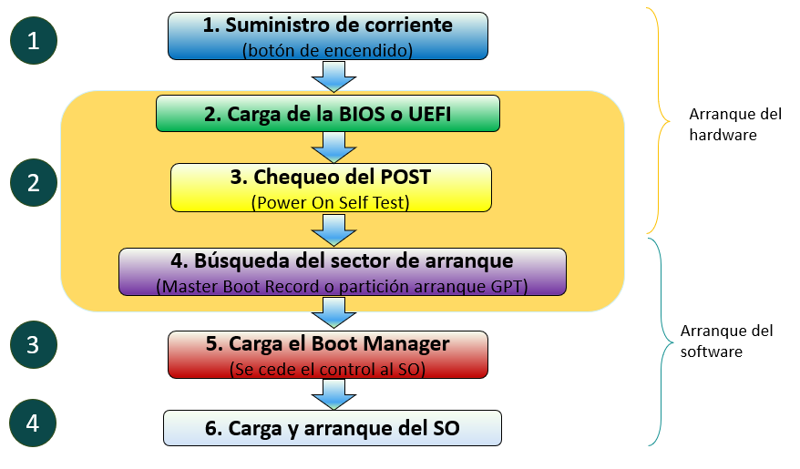

### Suministro de corriente

Cuando pulsamos el **botón de encendido** lo que hacemos es permitir conectar la **fuente de alimentación** del dispositivo y que la corriente llegue a la placa base y también al microprocesador, ventiladores, discos duros, lectores ópticos, pantallas, sensores y demás dispositivos conectados.

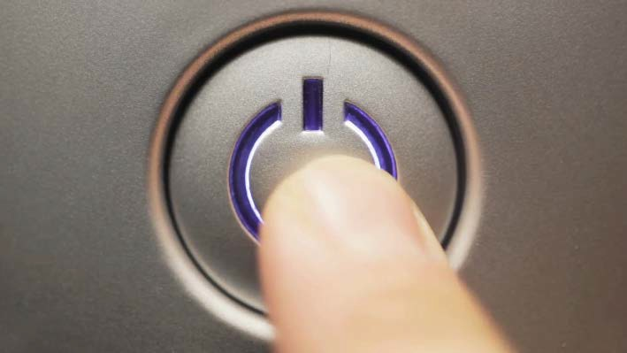
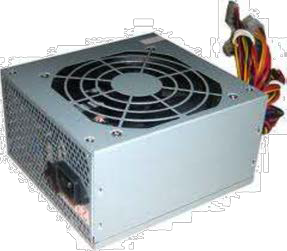
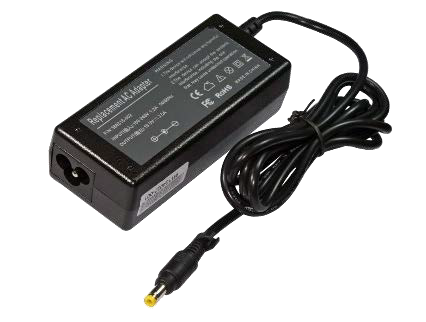

### Carga BIOS/UEFI

Una vez que le llega la corriente a la placa base, el microprocesador se inicializa y se **carga la BIOS o UEFI** desde la ROM ejecutándose desde ahí. La BIOS/UEFI contiene los programas y configuración que controla la secuencia inicial de arranque. Cada vez que se enciende un ordenador se realizan esta serie de operaciones:

1.  Test de chequeo del sistema **POST** (*Power On Self Test*)
2.  Se busca el primer dispositivo de arranque disponible (*HDD, USB..)*
( \*según orden, en la configuración o en un menú de arranque seleccionable)
3.  Una vez encontrado, se arranca dicho dispositivo desde el **MBR o partición de arranque,** que es donde se encuentra y carga el **Boot Manager**.
4.  El **Boot Manager** pasará el control al sistema operativo y va a la pantalla de carga inicial de dicho SO.

💡 El proceso completo de arranque es lo que comúnmente se conoce como arranque en frio. 
💡 Si se lleva a cabo obviando pasos (como al reiniciar mediante Ctrl+Alt+Supr en ciertos SO) se realiza un arranque en caliente, que partirá desde el punto 3 anterior.

### Chequeo POST

Durante el paso del **POST** (*Power On Self Test*) se realizan la siguientes comprobaciones básicas:

-   Verificación general de tarjeta gráfica.
-   Verificar RAM y recuento de memoria.
-   Verificar la propia BIOS.
-   Verificar placa, dispositivos y buses de sistema.
-   Mostrar y seleccionar el dispositivo desde el cual se va a tratar de arrancar a continuación el SO.

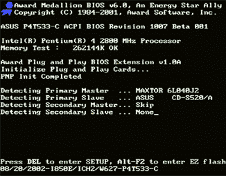

Pasadas estas comprobaciones y chequeos se puede habilitar un monitor, mostrando el conteo de memoria del sistema, información e **inventario** de los componentes del PC (dependiendo la placa).

En la mayoría de ordenadores, portátiles y placas, el POST es un proceso oculto que ya no se muestra de cara al usuario.

El conocimiento de los códigos sonoros del POST durante el arranque puede ser necesario para los técnicos en hardware, aunque dependen del modelo del fabricante:

| **Código o cantidad de pitidos** | **Significado**                                                          |
|----------------------------------|--------------------------------------------------------------------------|
| 1 tono corto                     | El POST no ha terminado satisfactoriamente.                              |
| Tono ininterrumpido              | Fallo en el suministro eléctrico de corriente.                           |
| Tonos cortos y seguidos          | Placa base estropeada.                                                   |
| 1 tono largo                     | La RAM no funciona o se detectan módulos instalados.                     |
| 1 tono largo y 1 corto           | Fallo en la placa base o en la ROM.                                      |
| 1 tono largo y 2 cortos          | Fallo en la tarjeta de vídeo o no hay instalada.                         |
| 2 tonos largos y 1 corto         | Fallo en la sincronización de imagen.                                    |
| 2 tonos cortos                   | Error en la paridad de la memoria.                                       |
| 3 tonos cortos                   | Fallo en los primeros 64 Kb de la RAM.                                   |
| 4 tonos cortos                   | Temporizador o contador defectuoso.                                      |
| 5 tonos cortos                   | El procesador o la tarjeta de vídeo no pasan el test.                    |
| 6 tonos cortos                   | Fallo en el controlador del teclado.                                     |
| 7 tonos cortos                   | Modo virtual de procesador AT activo, Error de excepción del procesador. |
| 8 tonos cortos                   | Fallo en la escritura de la RAM de video.                                |
| 9 tonos cortos                   | Error de checksum de la ROM en el BIOS.                                  |

### Búsqueda del sector de arranque

Pasado el POST se buscará en una unidad por defecto el **sector de arranque** del sistema operativo (que puede ser un disco duro, un DVD, un USB, una unidad de red..), según una secuencia ya definida y cuyo orden puede ser configurado para cargar el BootManager.

Además de en la pantalla de configuración de la UEFI/BIOS, a dicho menú de arranque se puede acceder después del POST pulsando las teclas **F8 o F12.**

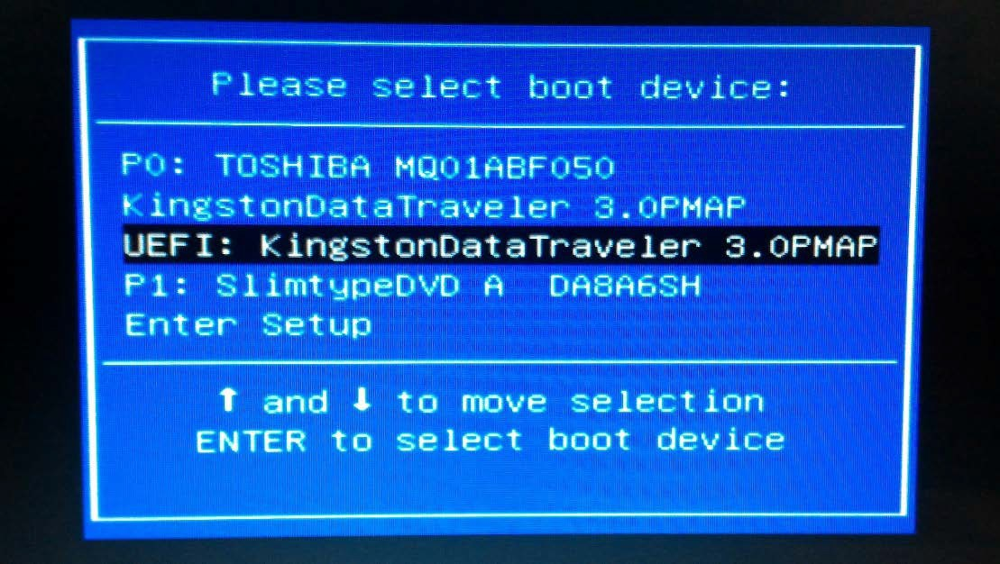

### Carga del Boot Manager

El **Boot Manager** es un pequeño programa **gestor de arranque** que permite arrancar el sistema operativo instalado (normalmente F5 o ESC). Su función entre otras es cargar el sistema operativo elegido por el usuario en el caso de que haya varios sistemas operativos instalados en dicha máquina.

Gracias a este programa se permite tener varios sistemas operativos que sean compatibles con dicho Boot Manager dentro de un mismo ordenador o iniciar un menú de recuperación en caso de fallo.

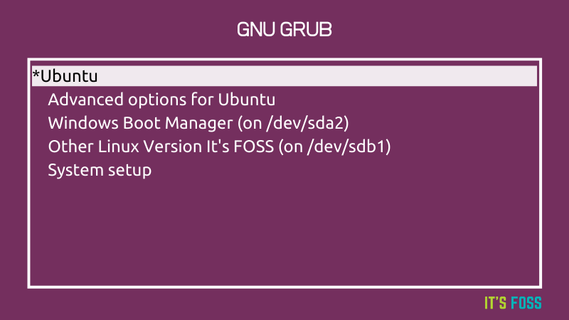
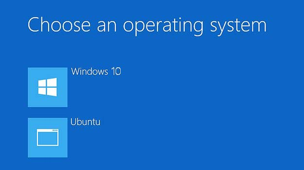
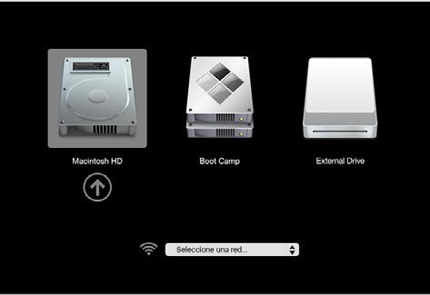

Existen múltiples programas Boot Manager dependiendo del SO que hayamos instalado en la unidad, los más destacados son:

-   Sistemas operativos **Linux**: GRUB
-   Sistemas operativos **Windows**: BOOTMGR
-   Sistemas operativos **Mac**: boot.efi

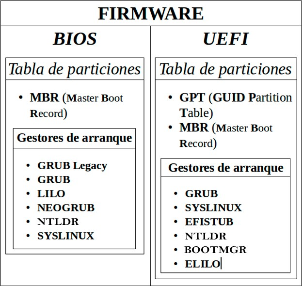

El formato de la <u>tabla de particiones</u> es fundamental en un sistema. Las tablas MBR limitan el tamaño máximo de cada unidad a 2TB y a 4 particiones primarias.

En los ordenadores que utilizan UEFI (actualmente todos) aparte del **MBR** también se puede cargar el nuevo sistema de tablas de partición llamado **GPT** *(Guid Partition Table).*

💡 En la actualidad las tablas **MBR** han sido sustituidas por el nuevo sistema **GPT**.

La fiabilidad de los discos con tablas **GPT** es mucho mayor que la de **MBR**. En MBR la tabla de particiones se almacena solo en los primeros sectores del disco, pudiendo tener problemas en caso de que se borre, corrompa o sobrescriba.

En cambio, GPT crea varias copias redundantes a lo largo del disco de manera que, en caso de fallo, problema o error, la tabla de particiones se recupera automáticamente desde cualquiera de dichas copias.

-   Si se utiliza un sistema **BIOS** y una unidad con tablas **MBR** se intentará cargar el **Boot Manager** desde ahí:

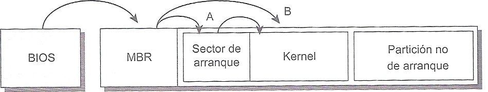

-   Si se utiliza un sistema **UEFI** se leerá un archivo de cargador de arranque que se encuentra en una partición especial llamada **ESP.** Este sistema es compatible con el sustituto de MBR, las tablas **GPT**

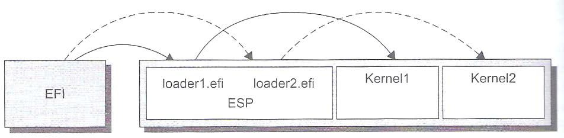

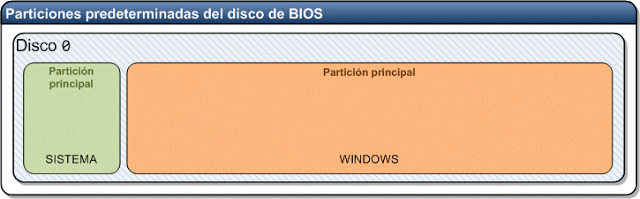

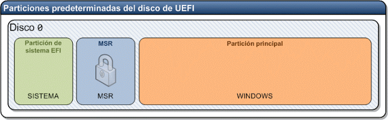

Desde el administrador de particiones del SO se verá asi:

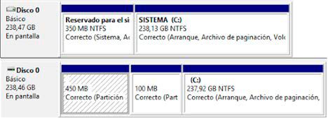

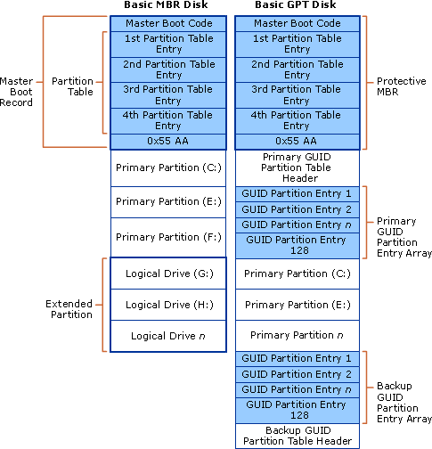

Pantallas de arranque de distintos SO:

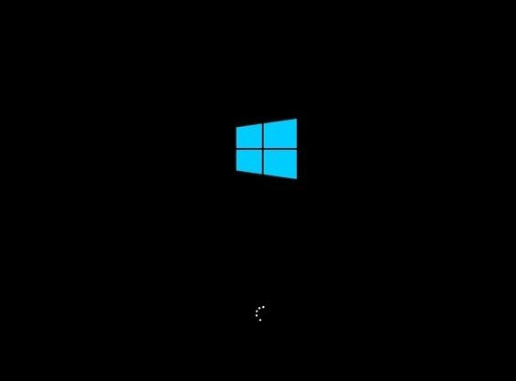


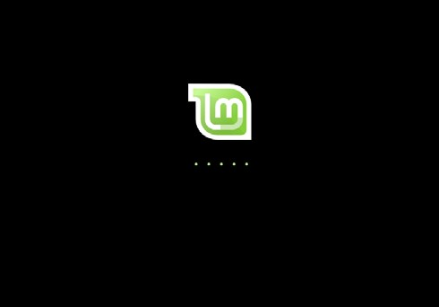


## Pantallas de configuración

### Pantalla BIOS

Podemos acceder a la **pantalla de configuración** de una **BIOS** (ya en desuso) presionando la tecla **supr** durante el arranque lo cual abrirá un menú en modo texto/ratón en el cual las distintas opciones se encuentran clasificadas por categorías (configuración básica, avanzada…). Existieron varios tipos de marcas BIOS, siendo las más conocidas Award, Phoenix y WinBIOS.

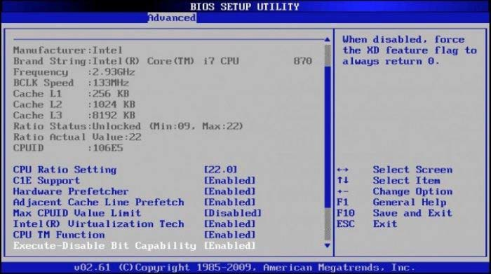

### Pantalla UEFI

En la actualidad las **pantalla de configuración** de UEFI (*Unified Extensible Firmware Interface)* suele contar con soporte gráfico para ratón y soporte de red, dependiendo el fabricante. Se suele acceder presionando **Esc**, **supr**, **F1** o **F2**.

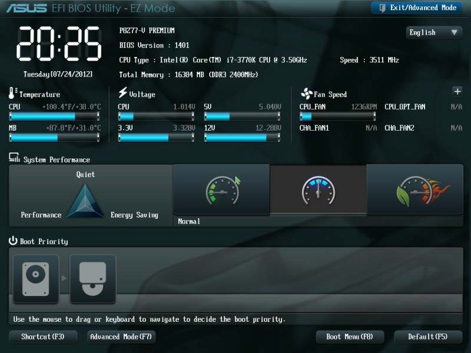

Acceso a pantallas de configuración UEFI/BIOS según fabricante:

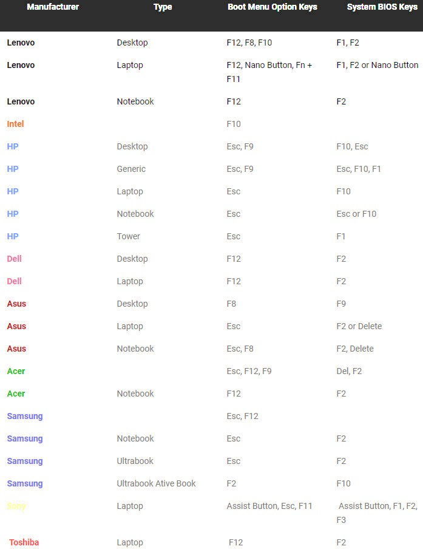

## BIOS vs UEFI

El proceso de arranque en un sistema basado en UEFI tal y como hemos visto es distinto a BIOS e incorpora mejoras respecto a la limitación de número y tamaño de particiones, el no arranque desde el MBR, así como medidas de seguridad.

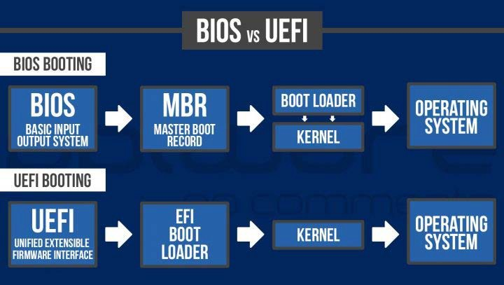UEFI permite usar **Secure Boot** (*arranque seguro*). Solo se iniciará el Boot Manager si se ha firmado criptográficamente con una clave cuyo duplicado se almacena en el firmware del equipo, evitando que programas malintencionados accedan al inicio del arranque.

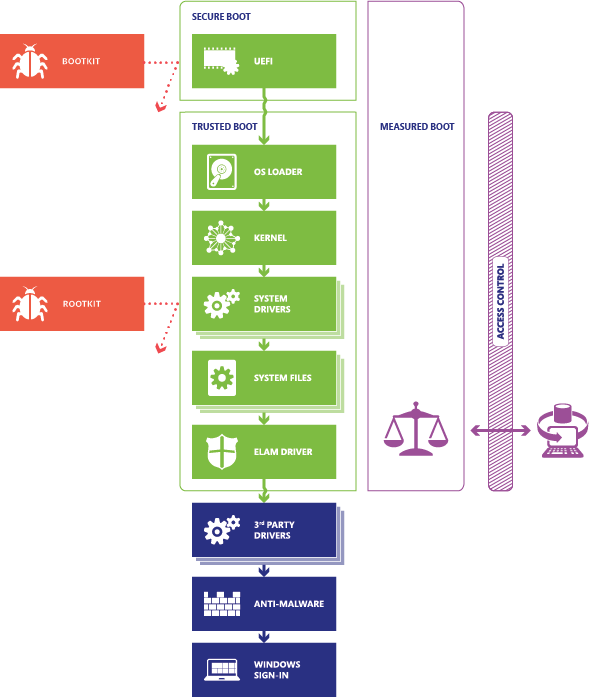
