# UT5.1 SO propietarios Windows

## Contenido y debate introductorio

<iframe width="560" height="315" src="https://www.youtube.com/embed/dDJ5bdNM10o" title="YouTube video player" frameborder="0" allow="accelerometer; autoplay; clipboard-write; encrypted-media; gyroscope; picture-in-picture; web-share" allowfullscreen></iframe>

## Historia de Windows

 **Windows** es el sistema operativo desarrollado por *Microsoft Corporation*, para el uso en computadoras personales (PC) y servidores, acompañado de un conjunto de programas y un sistema de organización de archivos propio.

Windows se caracterizó principalmente por contar con una interfaz de ventanas (Windows) que se superponen para mostrar distinta información y aplicaciones.

Microsoft domina el mercado de los **SO de escritorio** con comodidad, ya que Windows está instalado en más del 80% de este tipo de dispositivos de este tipo. Durante años ha sido el SO más utilizado del mundo, excepto en el mundo de los SO de servidor donde domina **Linux** y en el mercado móvil donde con la llegada de los Smartphones ha sido desplazado por **Android** (de Google)

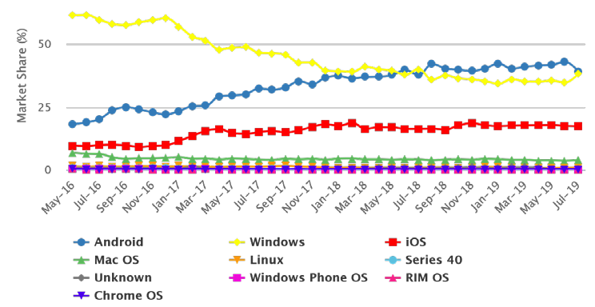

**Microsoft**, la compañía desarrolladora de Windows, fue fundada en 1975 por William Henry Gates y Paul Allen. Ambos se habían conocido como estudiantes por su afición común a programar con el ordenador PDP-10.

Su objetivo inicial fue desarrollar las versiones de un nuevo lenguaje de programación denominado BASIC. Mientras en 1980 **IBM** estaba trabajando en el que sería su gran éxito, el ordenador personal IBM PC. Necesitaba de un SO para su proyecto y se lo encargó a Microsoft. Presionada por el poco tiempo disponible, Microsoft compró QDOS a Tim Paterson por 50.000 dólares y le cambió el nombre a **MS-DOS**. No obstante y de forma astuta el contrato firmado con IBM permitía a Microsoft vender este SO a otras compañías de ordenadores personales recién nacidas, lo que lo acabó convirtiéndolo en un estándar.

La primera versión de **Windows** fue lanzada el 20 de noviembre de 1985 nunca fue del todo potente, ni tampoco se hizo popular. Estuvo severamente limitada a causa de los recursos legales de Apple, que no permitió imitaciones de sus interfaces de usuario.
Windows 1 trajo incluido un administrador de archivos, calculadora, calendario, tarjetero, reloj, libreta de apuntes y emulador de terminal.

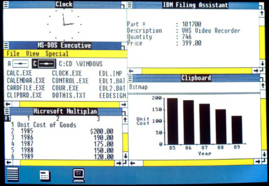

El 9 de diciembre de 1987 Microsoft lanzó Microsoft **Windows 2.0**, la primera versión de Windows que incluiría el panel de control y se hizo más popular. En Windows 2.0 aparecen los iconos en el escritorio, atajos de teclado, ofreciendo la posibilidad de superponer ventanas y el uso de la memoria extendida. Lanza también su paquete Office.

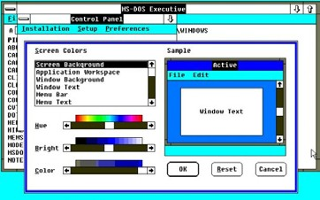

**Windows 3.0** llegó al mercado en mayo de 1990 y dos años después fue lanzado Windows 3.1. Entre las dos versiones vendieron más de 10 millones de copias, convirtiendo de esta manera al sistema operativo de Microsoft en el más usado del mundo. Aparecieron el Administrador de programas, el Administrador de archivos. Son SO que siguieron funcionando sobre MS-DOS, sin multitarea real.

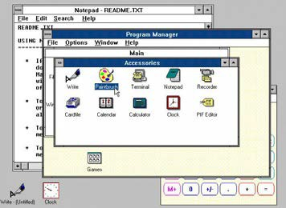

En 1993 se publica **Windows NT** (Windows New Technology) paralelamente al desarrollo de los SO Windows comerciales de escritorio, que es una familia de SO producidos por Microsoft orientada a las estaciones de trabajo, servidor de red y de la cual derivaría el kernel de los futuros Windows 2000 y XP. Windows NT usa 32 bits, multitarea preferente y dejaba de lado MS-DOS.

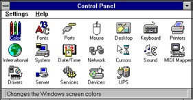

**Windows 95** fue lanzado el 24 de agosto de 1995 con récord de ventas convirtiéndose en un hito en la historia informática como producto de consumo de masas. Aparece por primera vez el menú inicio. Tenía compatibilidad con 16/32 bits, acceso a Internet, sistema de archivos FAT32, Plug&Play, USB 1.0. Windows **98** y **Me** son mejoras del 95 pero usando su mismo kernel basado en MS-DOS.

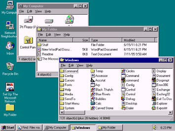

**Windows 2000**, nace como sustituto de Windows NT 5.0 para administradores de sistemas y con una gran cantidad de servicios de red. Admite dispositivos Plug&Play que eran aun un problema con Windows NT y la aparición del Active Directory, balanceo de carga, cifrado y nueva versión de IIS.

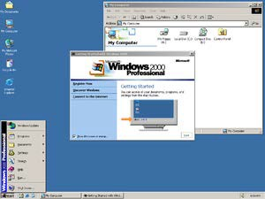

**Windows XP** es lanzado en octubre de 2001 y supone un punto de inflexión con la fusión de ambas líneas en un SO único basado en la arquitectura NT y con la funcionalidad y compatibilidad de la línea doméstica. Fue un rotundo éxito, llegando alcanzar cuotas de un 80%. Cuenta con el nuevo sistema de archivos NTFS, escritorio remoto, cuentas y perfiles de usuario, etc.

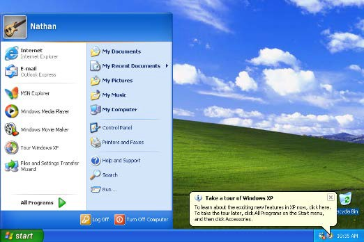

**Windows Vista** aparece como sustituto de XP en enero de 2007 con nuevo núcleo Windows NT 6.0. Fue un SO que llegó entre continuos retrasos. Traía nuevas características como interfaz Aero, así como mejoras de seguridad pero su falta de optimización y altos requerimientos de hardware lo abocaron a su fracaso comercial.

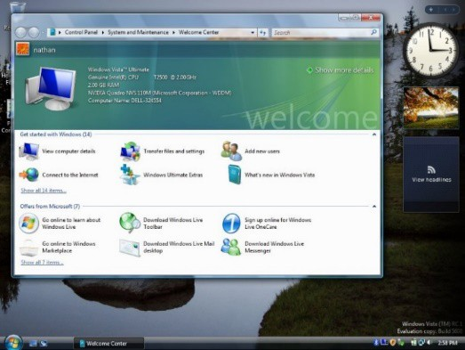

En paralelo a Vista se lanza el sustituto de Server 2003, llamado **Windows Server 2008** basado también en el núcleo de Windows NT 6.0 y orientado al mercado de servidores con mejoras en Active Directory, virtualización así como la inclusión de IIS 7.5. Surge la nueva consola de administración *Powershell.*
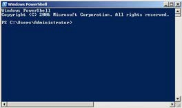

**Windows 7** se puso a la venta en julio del 2009 buscando corregir los errores que lastraron Vista usando su mismo núcleo NT. Considerado por muchos la mejor versión del SO, Windows 7 solucionó los problemas de rendimiento y compatibilidad de su predecesor con novedades que mejoraban su interfaz y utilización.

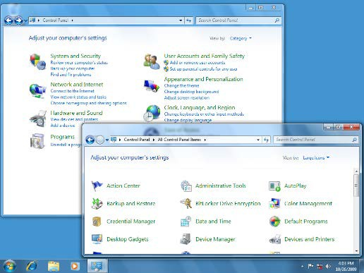
Después de Windows 7 Microsoft tuvo un importante fracaso con Windows 8, un sistema con una interfaz confusa orientado a tablets.

**Windows 10** supone otro cambio de paradigma de SO como producto a SO como servicio (imitando el éxito de Android o IOS), con actualizaciones y mejoras continuas. Su nueva interfaz Fluent Design busca coherencia con otros productos de Microsoft y su incursión en el mercado móvil que terminó en fracaso.

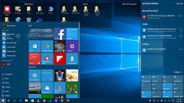

Con **Windows server 2016** Microsoft busca acercarse a su exitosa plataforma en la nube llamada Azure, con mejoras en virtualización, buscando convertirse en una plataforma híbrida para aplicaciones.

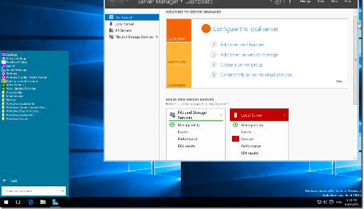

**Windows server 2019** ofrece las mejoras del WSL y un enfoque híbrido para la nube así como nuevas herramientas de seguridad.

**Windows 11** se lanzó en octubre de 2021 mejorando su interfaz fluent design y rediseñando una parte importante de la interfaz del sistema. Se sustituye el menú inicio, la barra de tareas y el menú de configuración. Así mismo se agregan pestañas a ciertos componentes como el explorador y se llevan a cabo mejoras en el sistema de actualización. El sistema Operativo sigue siendo controvertido por sus necesidades de hardware (módulo *TPM*) y dificultades para llegar a todos los equipos.

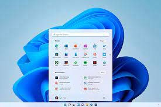

**Cuadro resumen** 

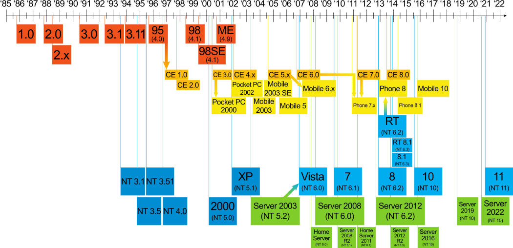

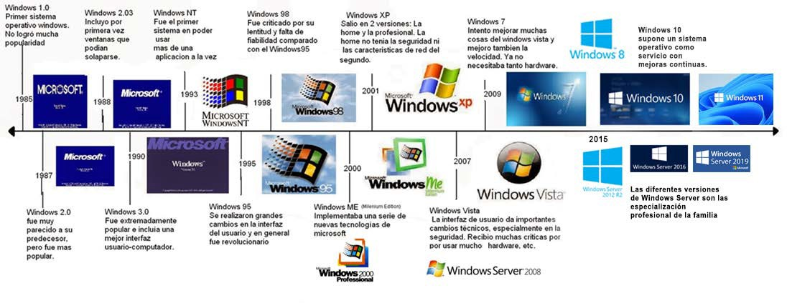

Las versiones anteriores a Windows XP, funcionaban para programas y procesadores de 16 y 32 bits así como procesadores **Intel** y **AMD**.

Se denominó en jerga informática común **Wintel**, como la unión hasta prácticamente la actualidad de procesadores Intel (x86) y SO Windows.

A partir de Windows NT y su exponente en Windows XP (NT 5.0) únicamente aparecerían versiones para procesadores de 32 bits y 64 bits. Aparece así mismo compatibilidad con nuevas plataformas de procesadores distintas a Intel o AMD tales como PowerPc, y desde Windows 8 soporte a procesadores **ARM**, especialmente en el reciente Windows11. 

En Windows Server se da soporte a la arquitecturas específicas para servidores de gran potencia, los AMD-EPYC e Intel Xeon. Se caracterizan por tener gran cantidad de núcleos y otra arquitectura.

## Características

### Windows 10 Cliente (desktop)

 Algunas de las características y tecnologías reseñables de **Windows 10**:

-   Centro de notificaciones y menú inicio.
-   Centro de seguridad y UAC.
-   Arranque rápido, ahorro y gestión de energía.
-   Windows Defender y Firewall.
-   Escritorio remoto y escritorios virtuales.
-   Administración de directivas de grupo y usuarios.
-   Buscador integrado y asistente Cortana.
-   Sistema de archivos NTFS.
-   Cifrado de dispositivos (BitLocker) y compatibilidad biométrica.
-   Cliente Hyper-V.
-   Compatibilidad con aplicaciones universales.
-   Tienda Windows Store.
-   Administración de dispositivos móviles.
-   DirectX 12, openGL 3 y WDDM2 2.0.

Aunque Microsoft lleva literalmente años hablando del enfoque *One Windows*, los responsables de la firma han ido lanzando distintas **ediciones** para ir adaptándolas a escenarios específicos:

-   Windows 10 Home
-   Windows 10 Professional
-   Windows 10 Enterprise
-   Windows 10 Education
-   Windows 10 S
-   Windows 10 IoT
-   Windows 10 Mobile (\*descontinuado)

En clase trabajaremos con la versión de **Windows 10 Pro** (Professional). Dicha versión se recomienda para empresas y trabajadores profesionales.

Posee funciones concretas respecto a Home como:

-   Más herramientas de gestión de usuarios y políticas de grupo
-   Permite unirse a Dominios (Servidores con Windows Server)
-   Accceso remoto
-   Cifrado Bitlocker
-   Cliente Hyper-V (Para máquinas Virtuales)

Tal y como se prometió en su concepción Windows 10 funciona como un SO como servicio con actualizaciones continuas y mejoras de por vida. Ello ha dado con las siguientes **actualizaciones** de Windows 10, que suele tener dos grandas actualizaciones al año, y que indican en su número de versión, su fecha de salida y mes:

| Actualización/versión Windows 10 | Nombre clave            |
|----------------------------------|-------------------------|
| Versión 1507                     | Inicial                |
| Versión 1511                     | November Update        |
| Versión 1607                     | Anniversary Update     |
| Versión 1703                     | Creators Update        |
| Versión 1709                     | Fall Creators Update   |
| Versión 1803                     | April 2018 Update      |
| Versión 1809                     | October 2018 Update    |
| Versión 1903                     | May 2019 Update        |
| Versión 1909                     | November 2019 Update   |
| Versión 2004                     | May 2020 Update        |
| Versión 20H2                     | October 2020 Update    |
| Versión 21H1                     | H1 update              |
| Versión 21H2                     | H2 update              |
| Versión 22H1                     | H1 update              |
| Versión 22H2                     | H2 update              |

### Windows 11 Cliente (desktop)

Algunas de las características y tecnologías reseñables de **Windows 11**:

-   Nueva interfaz y personalización del espacio de trabajo
-   Desbloqueo al acercarse/alejarse
-   Narrador natural y subtítulos en directo
-   Compatibilidad con aplicaciones Android
-   Widgets de escritorio
-   Integración del módulo TPM 2.0
-   Integración de Teams
-   Mejora en la experiencia de juego
-   Directx 12 Ultimate.
-   Nueva Microsoft Store.

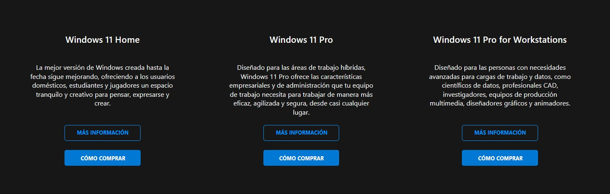

Desde su lanzamiento se ha dado con las siguientes actualizaciones de Windows 11, que suele tener dos grandas actualizaciones al año, y que indican en su número de versión, fecha y mes, parecido a como ha sucedido con Windows 10, pero con tendencia a ser anuales:

| Actualización/versión Windows 11 | Nombre clave            |
|----------------------------------|-------------------------|
| Versión 21H1                     | Sun Valley              |
| Versión 22H2                     | Sun Valley 2            |
| Versión 23H2                     | Sun Valley 3            |
| Versión 24H2                     | Hudson Valley           |

### Windows Server 

**Windows server** es similar al sistema operativo Microsoft Windows que conocemos, solo que está enfocado al de área de servidores y profesional.

Es parecido y a la vez diferente respecto a la versión de escritorio ya que en realidad las herramientas y los servicios que incorpora son especiales para su rol.

Mientas que un Windows de escritorio viene preparado para una amplia gama de tareas de oficina, educativa, multimedia y juegos, en un Windows Server nada de esto importa y viene preparado para brindar servicios de red a otros equipos, está preparado para ser rápido, eficiente y seguro.

Las distintas **ediciones** de Server 2016-19-22 van enfocadas a herramientas/mercados específicos, aunque básicamente se dividen en tres ediciones bastante diferentes:

-   Windows Server 2016 **Standard Edition**. Para entornos físicos poco virtualizados. Soporta hasta 64 sockets y hasta 4 TB de RAM, con licencias para 2 máquinas virtuales.
-   Windows Server 2016 **Essentials Edition**. Para pequeñas empresas. Permite hasta 25 usuarios y 50 equipos, 2 cores y hasta 64 GB de RAM.
-   Windows Server 2016 **Datacenter Edition**. Idóneo para entornos de nube privada e híbrida muy virtualizados. Soporta hasta 64 sockets, 640 cores y 4 TB de RAM, incluyendo licencias ilimitadas para máquinas virtuales.

### Versiones especiales

**Windows 11/10 IoT (Internet of Things)**

Orientada a dispositivos inteligentes y sistemas embebidos, como terminales de punto de venta, sistemas médicos y dispositivos industriales.

**Windows Embedded**

Similar a Windows IoT, pero para sistemas embebidos más antiguos.

**Windows LTSC (Long Term Servicing Channel)**

Para organizaciones que necesitan estabilidad a largo plazo y menor frecuencia de actualizaciones.

**Windows China Government Edition**

Por otro lado, una de las versiones más raras de Windows 10 que nunca usaremos nadie es la China Government Edition. Una edición creada por Microsoft para el gobierno chino. Es una versión realmente ligera y útil que cumple con las directrices de seguridad establecidas por el gobierno en este país.
