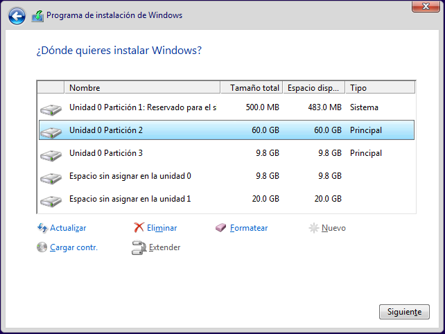
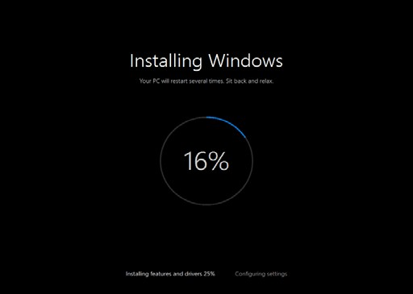
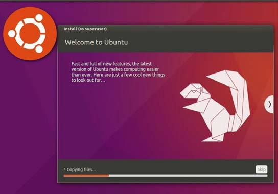

# UT5.2 Proceso de instalación de SO

## Procedimientos de instalación

Antes de realizar una instalación de cualquier SO hay que tener en cuenta y analizar los siguientes parámetros o procedimientos de instalación que veremos a continuación

### Según el lugar

-  **Local**. La instalación se realiza en el mismo ordenador.
-  **Red**. La instalación se realiza desde otro ordenador o servidor a través de la red.

### Según el tipo

-  **Instalación normal**. Durante el proceso de instalación se responde a una serie de preguntas relacionadas con la configuración del ordenador y los usuarios. Una instalación normal se realiza cuando:
    -   No había ningún SO previo en el ordenador, dispositivo o máquina virtual.
    -   Se instala un SO y se borra todo el anterior.
    -   Se instala un SO junto con otro que ya está instalado previamente en el ordenador y se escoge el SO para arrancar; esto se conoce como sistema de **arranque dual**.
-   **Actualización.** Proceso mediante el cual pasamos de una versión de un SO a otra más actual, añadiendo características, manteniendo los datos y los programas que estaban instalados en el ordenador, aunque eso no siempre será posible.
-   **Downgrade**. Consiste en instalar o volver a una versión anterior de un SO. Esta operación se hace, por ejemplo, para que se puedan ejecutar determinadas aplicaciones que en versiones más actuales de un SO no funcionan correctamente.
-   **Migración**. Proceso mediante el cual pasamos de un SO a otro tratando de conservar datos existentes (pueden ser sistemas operativos de la misma familia o no). La única forma de conservar los datos es hacer una copia de seguridad de estos en un dispositivo de almacenaje como una partición aislada, un disco, una memoria USB, etc.

### Según el entorno

-   **Virtual**. El SO se instala en un entorno virtual o en contenedor. La ventaja de virtualizar es que se pueden utilizar dos o más SO de forma simultánea sin necesidad de reiniciar el equipo.
Conlleva muchas ventajas de mantenimiento, almacenamiento y portabilidad, pero un rendimiento inferior como sabemos.

-   **Real (no virtual)**. El sistema operativo se instala en una máquina real propia, con todos los recursos a su disposición.

### Según la atención

-   **Atendida**. Es necesario estar frente al equipo respondiendo preguntas para configurar la instalación.
-   **Desatendida**. No es necesario estar delante del ordenar respondiendo a preguntas, se utiliza un archivo de respuesta que contiene la información que necesita el SO para instalarse correctamente de forma **automatizada**.

### Según el modo

-   **Mediante ficheros**. El sistema operativo usa ficheros para funcionar, al instalarlo lo que hacemos es copiar esos ficheros en el disco duro del ordenador en una carpeta del árbol de directorios dedicada a ello.

-   **Mediante un fichero de imagen**. Una imagen es un fichero o dispositivo de almacenamiento que contiene la estructura y toda la información de un disco duro, partición, o CD/DVD, etc. Las imágenes se utilizan para crear copias exactas de discos o particiones, lo que se denomina **clonación**.

### Según la forma

-   **Mediante dispositivos físicos**. Tales como USB, DVD, Discos duros..
-   **Mediante carpetas compartidas**. Este forma de instalación es típica de una red, un ordenador que ya tiene un SO previamente cargado y que comparte un recurso en red.
-   **Mediante PXE** (*Prebot eXecution Enviroment*). Este entorno se basa en la comunicación cliente-servidor a través también de una red. El cliente se descarga el programa de instalación del servidor que a su vez proporciona los ficheros necesarios para proceder usando el protocolo de transferencia *TFTP*.

## Pasos de la instalación

Antes de llevar a cabo la instalación de cualquier SO es necesario seguir los siguientes **pasos**:

1. Plantificación de la instalación

2. Preparar la instalación

3. Ejecutar la instalación

4. Configuración posterior de la instalación

5. Documentación durante la instalación

### Planificación de la instalación

**Planificar** la instalación de cualquier SO es algo fundamental y necesario para que esta sea exitosa. Los pasos necesario para planificar una instalación son:

-   **Analizar los requisitos de hardware necesarios** y el entorno donde se instalará (real o virtual)
    -   Definir el **modo** y **forma** de instalación: en caso de hacerse directamente sobre una unidad de disco, partición donde se va a instalar el SO.
    -   **Compatibilidad** de las aplicaciones que se instalarán o necesarias en un futuro.
    -   **Número de ordenadores** a instalar y **licencias** disponibles (si fueran necesarias)
    -   Existencia de un SO previo: **tipo** de instalación: normal, actualización.

Los **requisitos de hardware** del sistema para poder soportar el SO a veces necesitan un estudio más detenido:

### Preparar la instalación

Durante este apartado se **prepara** el ordenador para iniciar la instalación, desde el arranque, dónde se carga el sistema, cuáles son los parámetros para realizar la instalación, y en qué disco y partición se va a instalar el sistema.

**Arranque:** Cuando un ordenador se enciende el procesador busca la BIOS y la ejecuta tal y como ya hemos visto. Una vez que se han comprobado los dispositivos hardware, intenta localizar un dispositivo con el que arrancar (desde **MBR** o **GPT**) y cargar el Boot Manager del sistema operativo.

Por defecto los ordenadores suelen arrancar desde el disco duro. Cuando vamos a instalar un sistema operativo a veces es necesario arrancar desde la unidad de DVD, USB, PXE, etc. Para arrancar desde un dispositivo concreto es necesario configurarlo desde el *BIOS SETUP UTILITY* o presionando una tecla predefinida en el equipo para cargar el **menú de arranque**.

**GParted** es un editor para entorno gráfico de **particionamiento** Open Source (software libre) presente en múltiples distribuciones de Linux y utilizado durante su proceso de instalación que sirve para para crear, reorganizar y eliminar particiones de un disco para diversos sistemas de archivos (*FAT32, NTFS, ext3, ext4, extFAT..)*

Para descargar una versión Live CD de dicho software será necesario entrar en la página <http://gparted.sourceforge.net/download.php>

La versión Live de Gparted se carga previamente antes del arranque del SO presente en el PC y provee de un pequeño escritorio Linux además del programa de particionamiento presente para dichas distribuciones Linux.

Durante la instalación de distribuciones Linux también se carga dicha herramienta. Windows tiene también su propio particionador durante su proceso de instalación.

**Parámetros de instalación**: Recoger y anotar los siguientes parámetros de instalación para tenerlos a mano cuando se requieran durante cualquier proceso de instalación:

-   Zona horaria y hora (generalmente automáticos)
    -   Idioma de la instalación y distribución de teclado (generalmente automáticos)
        -   **Nombre del equipo:**

            Generalmente de longitud máxima de *15 caracteres.*

            El nombre debería incluir año de instalación y/o la ubicación física donde se va a situar.

        -   **Nombre del administrador y su contraseña.**
        -   Los parámetros de red:
            -   Dirección IP, máscara y puerta de enlace
            -   DNS o dirección WINS

### Ejecución de la instalación

Una vez elegido el dispositivo, tipo, entorno, atención, forma y modo de instalación podremos comenzar con la **ejecución de la instalación** en si misma. Si la instalación es desatendida el proceso será totalmente automático.

### Configuración posterior

Una vez finalizada la ejecución de la instalación normal se hace necesario una **configuración posterior** de diversos parámetros como el gestor de arranque, drivers, paquetería, elementos de virtualización, red y actualizaciones de seguridad.

**Configurar el gestor de arranque**: En sistemas **Windows**:

-   Archivo NTLDR (*NT Loader, para sistemas anteriores a Vista o Server 2008*). Fichero *boot.ini*, que contiene distintas opciones de arranque. En desuso.
-   **BOOTMGR** (BCD: *Boot Configuration Data*, datos de configuración de arranque). Desde la versión Windows Vista y Server 2008.

    En sistemas **Linux**:

-   LILO (Llnux LOader, cargador de Linux). Sistema en desuso.
-   **GRUB** (GRand Unified Bootloader, Gran gestor de arranque unificado). Es el gestor que actualmente viene por defecto en la mayoría de distribuciones Linux.

### Documentación

Durante el proceso de instalación hay que **documentar** los pasos que se van realizando y señalar incidencias que surjan. Documentar es una buena práctica, y ayuda a otras personas y a nosotros a saber los pasos y configuración utilizada.

-   Fecha de la instalación
-   Nombre o id de la persona que ha realizado la instalación.
-   Identificación del equipo (nombre, emplazamiento físico, etc.).
-   Tipo de instalación (normal, actualización, migración) y entorno (virtual, no virtual).
-   Forma de la instalación (mediante dispositivos, carpetas compartidas, PXE, etc.).
-   Hardware del equipo (procesador, disco duro, RAM, etc.) e impresoras.
-   Discos o particiones de las que consta la unidad de disco usada.
-   Identificador de red y configuración (dominio, etc.)
-   Usuarios del equipo a configurar.
-   Software adicional
-   **Incidencias** que surjan durante la instalación.

Durante el proceso de instalación de los SO indicados por el profesor haremos uso de una **ficha modelo de datos de instalación** que rellenaremos adecuadamente:
