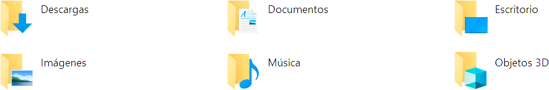
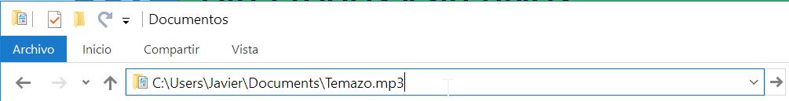
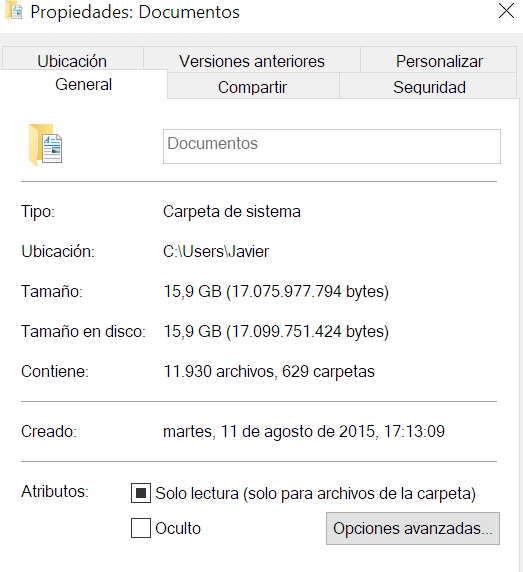
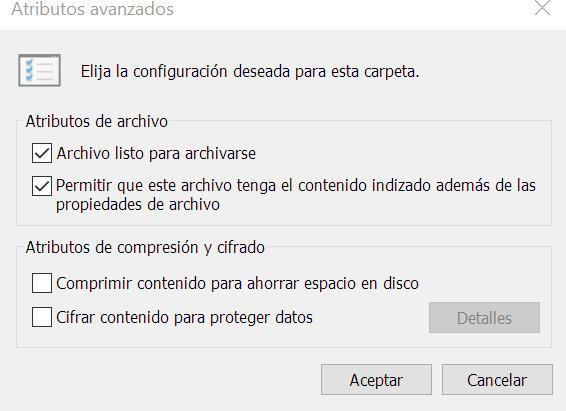
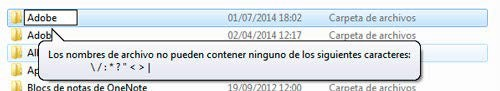
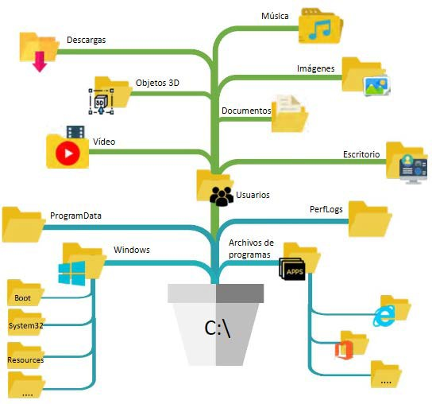

# UT7.2 Operaciones generales en Windows: Directorios y archivos

## Directorios y archivos

```note
Un **directorio o carpeta** es un conjunto de archivos y/o subdirectorios que se agrupan según su contenido, un propósito o cualquier otro criterio de agrupación.
```

Un directorio no es ni más ni menos que un tipo de archivo, que almacena información acerca de los archivos y directorios que contiene. En todos los sistemas de archivos existe un directorio especial, denominado el **directorio raíz**.




```note
Un archivo o fichero se define como un conjunto de datos que tienen unas propiedades y unos atributos en común.
```

En general, los SO Windows distinguen entre estos tipos de archivos básicos:

-   **Normales**: los archivos pueden contener cualquier tipo de información, en algunos casos pueden ser programas que una vez ejecutados pasan a ser procesos. Dentro de los archivos normales podemos encontrar archivos ejecutables, de audio, de imágenes, de video, comprimidos, etc.
-   **Directorios**: los directorios no dejan de ser archivos especiales que contienen información sobre la organización y estructura de otros archivos.
-   **Especiales**: estos archivos permiten comunicarse con dispositivos de E/S (archivos especiales de caracteres) o con discos (archivos especiales de bloques) o son reservados por el propio SO.

```note
Una ruta indica la localización exacta de un archivo dentro del sistema de archivos
```

El símbolo **\\** es el utilizado en sistemas **Windows** para separar los nombres de directorios y subdirectorios en una ruta concreta.

Partamos de la siguiente **ruta** de ejemplo para un SO Windows:



-   **C:** indica la unidad lógica de almacenamiento en la que se encuentra el archivo.
-   **\\Users\\Javier\\Documents\\** es la ruta del archivo.
-   **fichero** es el nombre del archivo.
-   **.mp3** será la extensión del archivo.

Existen además dos **caracteres comodín** que usaremos al trabajar con rutas:
-   El punto **.** se referirá al directorio activo sobre el que estemos situados
-   El doble punto **..** se referirá al directorio anterior al activo en el árbol de directorios de la unidad activa actual.

### Rutas en sistemas Windows

Una **ruta** en sistemas Windows es una lista de nombres de directorio separados por el símbolo **\\**, seguida por un nombre de directorio o por el nombre de un archivo.

-   Una **ruta absoluta** o completa comenzará siempre con la letra de unidad seguida de dos puntos y desde ahí su ruta pasando por todos los directorios.

        C:\Users\Javier\Desktop

-   Una **ruta relativa** hará referencia a una ubicación que es relativa al directorio activo actual, haciendo uso del carácter comodín **..** para indicar el directorio anterior al que nos encontremos.

        ..\Documentos\archive.html

### Propiedades carpetas

El nombre de un directorio o carpeta debe ser único dentro de una misma ruta. En los nombres de directorios hay caracteres que no se pueden utilizar.

**Propiedades** de cada carpeta o directorio:

-   **Nombre**: sirve para identificar una carpeta o directorio (otros SO hacen distinción entre minúsculas y mayúsculas). Hay caracteres especiales que no se pueden utilizar como parte del nombre como veremos más adelante.
-   **Ubicación**: lugar donde se encuentra dentro del sistema de archivos.
-   **Tamaño**: cantidad de bytes que ocupa un directorio.
-   **Fecha de creación, modificación y último acceso.**
-   **Atributos**: propiedades que permiten asignar características especiales como **sólo lectura**, **oculto** o **directorio del sistema**.
-   **Permisos**: se utilizan para permitir o restringir el acceso a los directorios determinados usuarios o grupos.

### Propiedades archivos

-   **Nombre:** sirve para identificar un archivo permitiendo utilizar nombres de hasta 255 caracteres. Windows no hace distinciones entre minúsculas y mayúsculas.
-   **Extensión**: la extensión suelen es un conjunto de letras después de un punto que sirven para saber el tipo de programa que lo ejecuta o interpreta
-   **Tipo de archivo**: pueden ser **normales**, **directorios** o **especiales**.
-   **Ubicación**: lugar del sistema de archivos donde se encuentra.
-   **Tamaño**: cantidad de bytes que ocupa un fichero.
-   **Fecha de creación, modificación y último acceso**: para cada archivo indica la fecha en que ha sido creado, modificado y la última vez que se accedió a él.
-   **Atributos**: son propiedades que permiten asignar características especiales a los archivos. Por ejemplo, **sólo lectura, oculto, archivo, del sistema**, cifrado, etc.
-   **Permisos**: se utilizan para permitir o restringir el acceso a los archivos a usuarios o grupos. Los permisos suelen ser: **lectura, modificación y ejecución.**

### Extensión

💡 La **extensión** de los archivos es un grupo de letras o caracteres que acompañan al nombre del archivo (generalmente tres caracteres) y que en el caso de Windows podrá servir para indicar su formato o qué tipo de archivo es.

Existen muchas extensiones, específicas para determinados programas:

| **Archivos**           | **Extensiones**          |
|------------------------|--------------------------|
| Documentos             | DOC, DOCX, TXT, RTF      |
| Imágenes               | JPG, BMP, HEIF, GIF, PNG |
| Sonido                 | WAV, MP3, WMA            |
| Vídeo                  | AVI, MPEG, FLV, MOV      |
| Ejecutables            | EXE                      |
| Máquinas virtuales     | OVA                      |
| Discos duros virtuales | VDI, VDMK                |
| Imágenes de SO         | ISO                      |


### Atributos

💡 Los **atributos** de los archivos y carpetas son los mismos para todos los usuarios o grupos. Cuando se establece un determinado atributo a un archivo, como por ejemplo sólo lectura afectará a cualquier usuarios que intente modificar dicho fichero.

Para visualizar o modificar los **atributos** deberemos seleccionar cualquier carpeta o archivo en Windows y abrir *Propiedades*. Los principales atributos son:

-   **Solo lectura.** Indica que, en principio, solo podremos leer los contenidos que haya en dicho fichero o carpeta, aunque en realidad este atributo permite crear archivos y carpetas dentro de la carpeta principal.
-   **Oculto.** Si lo activamos, la carpeta deja de verse en la estructura de directorios, a menos que en las opciones de vista de carpetas tengamos seleccionado que se muestren también las carpetas ocultas.



### Atributos avanzados

Existen más atributos avanzados como:

-   **Archivo listo para archivar históricamente**: indica si el archivo o carpeta se debe guardar cuando se realice una copia de seguridad.
-   **Permitir al servicio de Index Server** indizar este archivo para acelerar la búsqueda.

-   **Comprimir contenido para ahorrar espacio en disco**.

-   **Cifrar contenido para proteger datos:** indica que el archivo o carpeta se cifrará para evitar que su contenido pueda ser visto por otro usuario. Los archivos y carpetas cifrados no se pueden comprimir.

-   **Sistema**: indica que el archivo es para uso del sistema operativo, uso interno.



### Propiedades

Los archivos o carpetas tienen restricciones a la hora de crearlos en SO Windows:

-   Windows no diferencia entre mayúsculas y minúsculas (solo al visualizar).
-   Las carpetas o archivos no pueden tener nombres repetidos, es decir no puede existir más de una carpeta o archivo con un mismo nombre y en la misma ruta.
-   La longitud de una ruta no debe exceder de **255 caracteres**, entre los que se incluye el nombre de la unidad de disco.
-   **No** se pueden utilizar los siguientes **caracteres** a la hora de crear carpetas o archivos: **\> \< / \\ \* ? : “ \|**



### Operaciones generales

Con los archivos y carpetas o directorios podemos realizar las siguientes operaciones:

-   **Creación (create)**

    Hacer que el directorio exista. Ya veremos en cada sistema operativo, tanto en entorno texto como gráfico, cómo se crean directorios y carpetas.

-   **Consulta (opendir)**

    Ver los archivos o directorios que contiene.

-   **Actualización (updatedir)**

    Añadir o borrar elementos del directorio o carpeta.

-   **Borrado (delete)**

    Eliminar totalmente el directorio, incluido su contenido.

-   **Renombrado (rename)**

    Cambiar el nombre al directorio.

### Carpetas del sistema

Existen **carpetas especiales** en todos los SO Windows:

| **Descripción**                                 | **Ruta**                                                                            |
|-------------------------------------------------|-------------------------------------------------------------------------------------|
| Carpeta principal del SO Windows                | **C:\\Windows**                                                                     |
| Carpeta de **archivos principales** del sistema | **C:\\Windows\\System**                                                             |
|                                                 | **C:\\Windows\\System32** (versiones de 32 bits)                                    |
| Archivos de **programas** instalados            | **C:\\Program Files** (en SO de 64bits, los programas de 64 bits)                   |
|                                                 | **C:\\Program Files (x86)** (en SO de 64bits, los programas de 32 bits)             |
| Archivos de programa, datos comunes             | **C:\\Program Files\\Common Files**                                                 |
| Datos de programas compartidos                  | **C:\\ProgramData**                                                                 |
| Fuentes del sistema                             | **C:\\Windows\\Fonts**                                                              |
| Herramientas administrativas compartidas        | **C:\\ProgramData\\Microsoft\\Windows\\Start Menu\\Programs\\Administrative Tools** |
| Programas en el menú de Inicio                  | **C:\\ProgramData\\Microsoft\\Windows\\Start Menu**                                 |
| Programas que inician con Windows (antiguo)     | **C:\\ProgramData\\Microsoft\\Windows\\Start Menu\\Programs\\Startup**              |
| Carpetas personales de los **usuarios**         | **C:\\Users**                                                                       |
| Datos de restauración del sistema               | **C:\\System Volume Information**                                                   |



### Carpetas del usuario local

Las carpetas de **usuario locales** se encuentran en el interior del directorio con el nombre del usuario local del equipo, en la ruta C:\\Users\\NombreUsuario.

| **Descripción**                   | **Ruta**                                                                                    |
|-----------------------------------|---------------------------------------------------------------------------------------------|
| Carpeta de perfil usuario         | **C:\\users\\usuario**                                                                      |
| Escritorio                        | **C:\\users\\usuario\\desktop**                                                             |
| Mi música                         | **C:\\users\\usuario\\music**                                                               |
| Mis documentos                    | **C:\\users\\usuario\\documents**                                                           |
| Mis imágenes                      | **C:\\users\\usuario\\images**                                                              |
| Descargas                         | **C:\\users\\usuario\\downloads**                                                           |
| Archivos temporales               | **C:\\Users\\usuario\\AppData\\Local\\Temp**                                                |
| Datos de programa                 | **C:\\Users\\usuario\\AppData**                                                             |
| Programas que inician con Windows | **C:\\Users\\usuario\\AppData\\Roaming\\Microsoft\\Windows\\Start Menu\\Programs\\Startup** |


