# UT7.1 Operaciones generales interfaz en SO Windows

## Interfaz de Windows

```note
La **interfaz gráfica** de Windows se conoce como el **Shell**. El shell es la interfaz gráfica de usuario principal y de Windows. 
```

Es el contenedor dentro del cual toda la interfaz de usuario se presenta, incluyendo la barra de tareas, el escritorio, el explorador de Windows, así como muchos de los cuadros de diálogo y controles de interfaz.

Representa la capa de interacción con el usuario y generalmente presenta una mayor unificación pero menor personalización/variedad que en Linux.

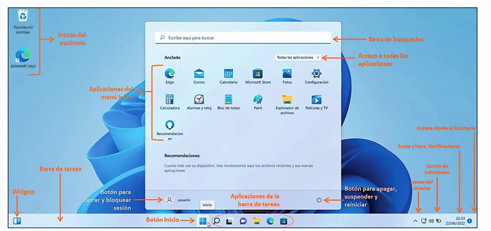

Otra forma de interactuar con el sistema operativo es a través de lo que se denomina el **intérprete de línea de comandos** o **CMD**. Este elemento se heredó de versiones anteriores de Windows y servía para realizar muchas de las operaciones que hoy se efectúan en entorno gráfico. La rapidez en el uso de muchos comandos supera muchas veces al entorno gráfico.

Con el tiempo el intérprete de comandos también se ha modernizado y en la actualidad los profesionales utilizan la nueva consola **Powershell**.


## Administración y configuración

Elementos generales para la administración y configuración de SO Windows cliente:

1. Herramientas administrativas y administración de equipos

 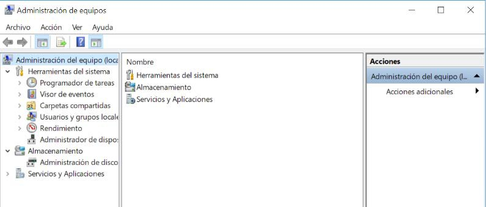


2. El menú de configuración de Windows

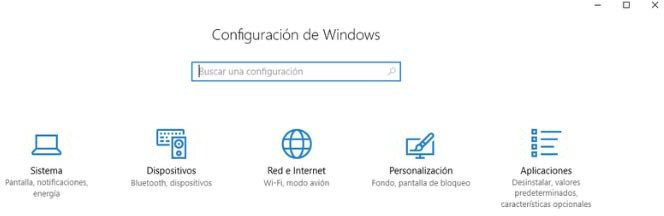

3.  El panel de control:

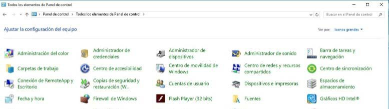

### Herramientas administrativas

El menú de **herramientas administrativas** puede variar según la versión de Windows que se utilice (presente solo en la versión Pro)

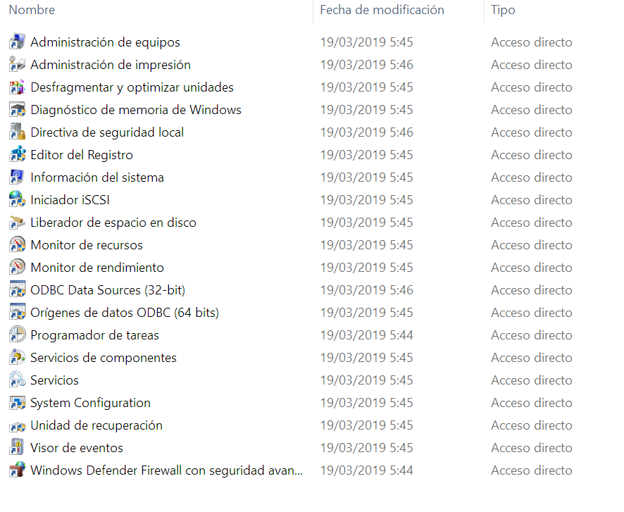

### Microsoft Management Console

La **Microsoft Management Console** nos permite crear **colecciones** personalizadas de herramientas administrativas o consolas. Estas últimas pueden contener elementos como extensiones, complementos, controles, documentación y tareas entre otros.

Para abrir dicha utilidad deberemos ejecutar el comando **mmc**.

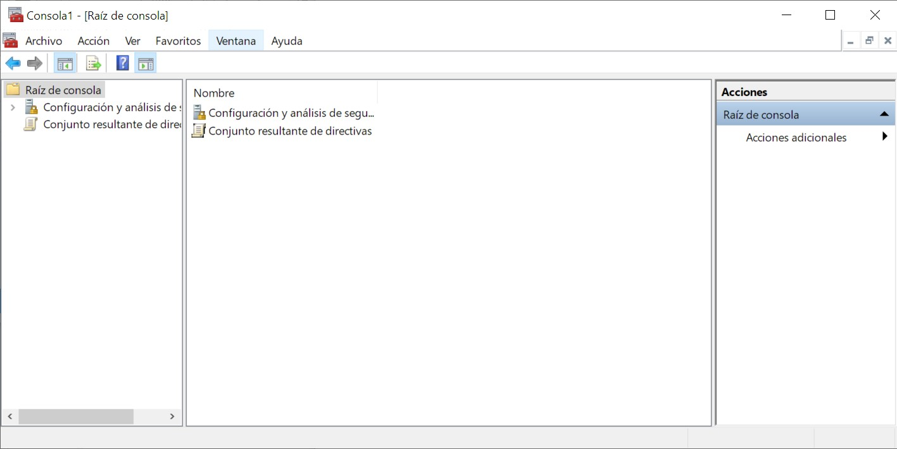

### Administrador de equipos

El **administrador de equipos** incluye información del sistema físico y lógico de la Administración del equipo local agrupado en *Herramientas del sistema , Almacenamiento* y *servicios y Aplicaciones.*

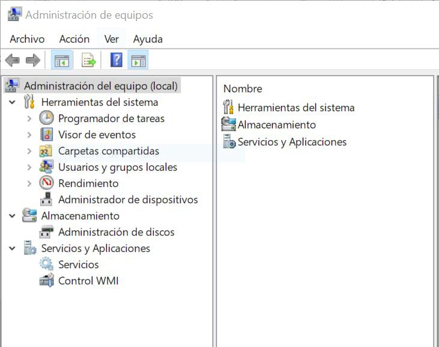

## Gestión de discos

A continuación veremos las siguientes herramientas de **gestión de discos** en Windows:

1.  Administrador de discos
2.  Formateo de discos
3.  Liberación de espacio en disco
4.  Chequear y reparar discos
5.  Desfragmentación de discos HDD
6.  Comprobación integridad archivos del sistema

### Administrador de discos

El **administrador de discos** de Windows se usa para la administración de particiones en unidades de almacenamiento locales.

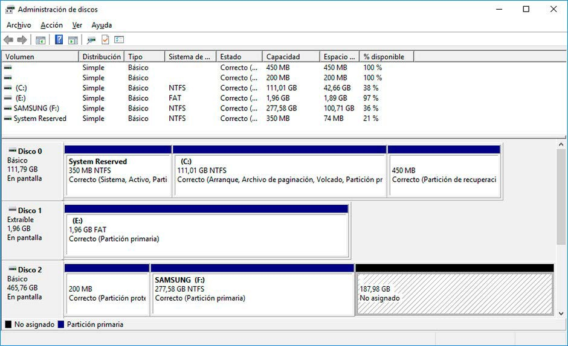

Otra forma para acceder al **administrador de discos** es desde el menú ejecutar escribiendo el comando **diskmgmt.msc**

Esta herramienta del sistema permite entre otras cosas:

-   Formatear particiones.
    -   Crear nuevas particiones.
    -   Redimensionar particiones.
    -   Cambiar el nombre de la letra de la unidad o etiqueta.

### Formateo de discos

El proceso de **formateo** de unidades en Windows es bastante sencillo, aunque no se permite llevar a cabo sobre la unidad de Windows activa en este momento. Aparte del administrador de discos se puede llevar a cabo desde el explorador de Windows.

Aparecerá la siguiente ventana de diálogo:

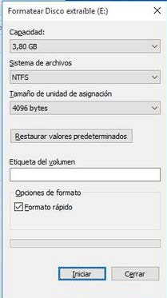

**Sistema de archivos**: Permite elegir el sistema de archivos con el que formatear la unidad seleccionada.

**Tamaño de unidad de asignación**: Lo habitual es mantener el tamaño que te indique por defecto la ventana de formateo.

**Etiqueta del volumen:** Escribir un nombre que describa lo que hay o habrá en ese disco o USB. No es una opción obligatoria pero sí recomendable.

**Opciones de formato**: Si se desactiva la casilla de formato rápido se obliga a que Windows chequee el disco o USB e intente reparar de forma automática posibles errores que tenga. Puede ahorrar problemas futuros y de pérdidas de datos.

### Liberación de espacio en disco

El disco duro se va llenando de información y archivos no esenciales que pueden afectar al rendimiento del sistema, ocupar el disco completamente y afectar el óptimo funcionamiento del sistema con:

-   Descargas de Internet.
    -   Archivos temporales.
    -   Archivos generados por las diversas aplicaciones.
    -   Programas o aplicaciones instaladas.
    -   Actualizaciones de Windows.

Windows posee dos herramientas denominadas **liberador de espacio en disco** y otra de **gestión automatizada del espacio** para llevar a cabo una limpieza de dichos archivos innecesarios sin necesidad de terceros programas.

Se puede abrir buscando **Liberador de espacio en disco** desde el menú Inicio, en propiedades de la unidad desde el explorador o ejecutando el comando **cleanmgr**

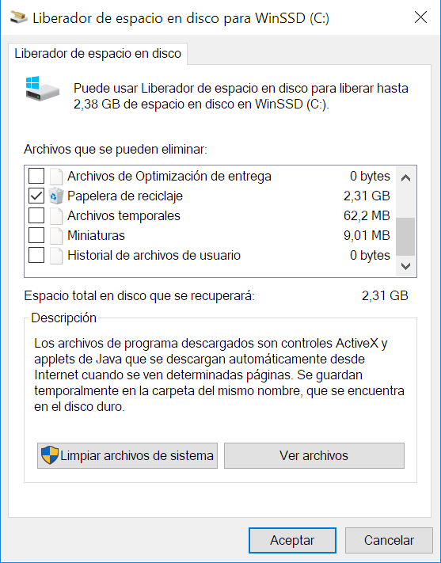

Se puede visualizar cómo qué se gasta el espacio en un disco concreto desde *sistema\> almacenamiento*

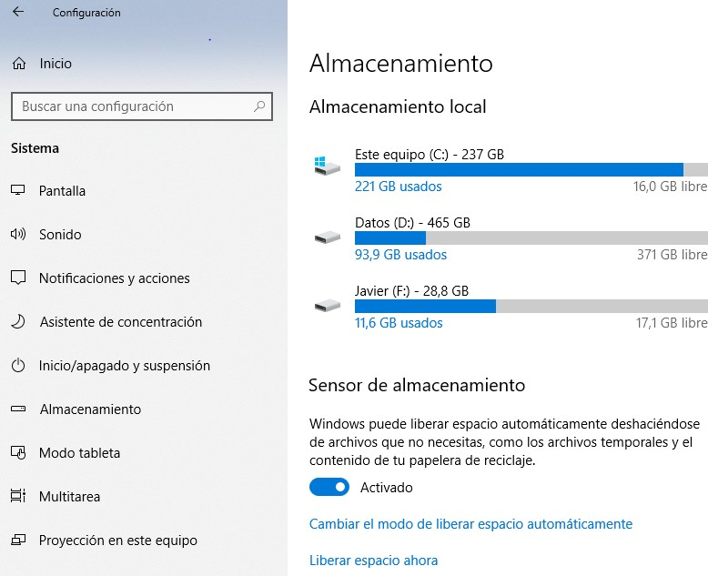

El **sensor de almacenamiento** sirve para liberar espacio, borrando ficheros temporales y vaciando elementos de la papelera que lleven más de 30 días.

### Chequeo y reparación de discos

Windows posee una serie de herramientas para **chequeo** y **reparación** de errores en las unidades seleccionadas. Desde el explorador de archivos, si hacemos clic con el botón derecho en *propiedades* del disco que queramos analizar y luego en la pestaña *herramientas,* nos dará la opción comprobar.

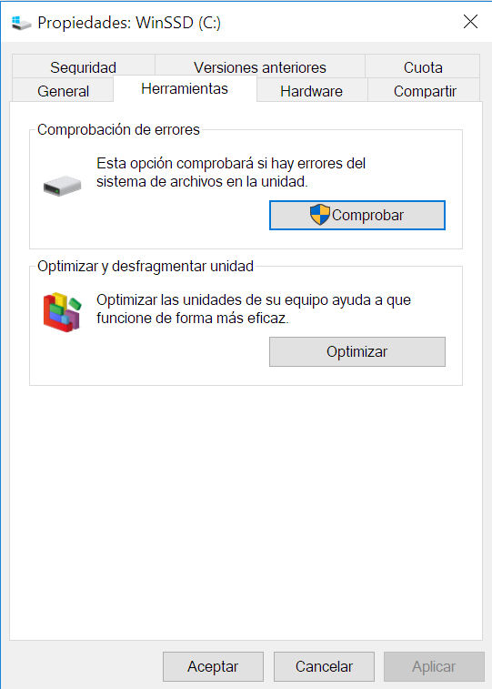

Otra opción para el chequeo de unidades avanzada desde la consola del sistema o CMD es usando el comando **CHKDSK**.

Si se ejecuta sin parámetros solo revisa la unidad, sin repararla.

La sintaxis de dicho comando es la siguiente: CHKDSK Unidad: [parámetros]

Donde [Parámetros] puede ser:

    /F – Además de chequear corrige errores en el disco. 

    /R – Encuentra sectores dañados y recupera la información que sea legible.

    /X – Fuerza al volumen a desmontarse si fuese necesario.

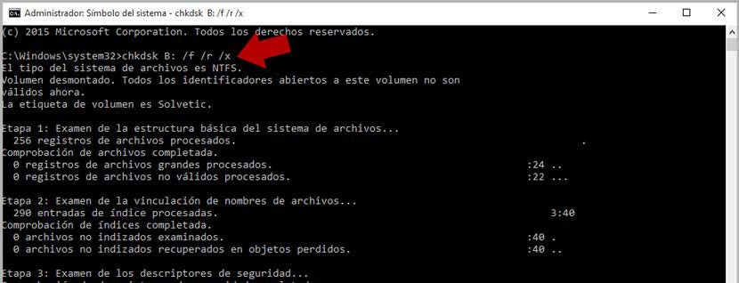

### Chequeo integridad archivos Windows

El comando **SFC** se utiliza para comprobar la integridad de los archivos de Windows y del sistema que necesita para funcionar correctamente.

La sintaxis de dicho comando es la siguiente: SFC [parámetros]

Donde [Parámetros] puede ser:

    /SCANNOW – comprueba la integridad de todos los archivos del sistema y repara los archivos dañados.

    /VERIFYONLY – Comprueba la integridad de los archivos del sistema

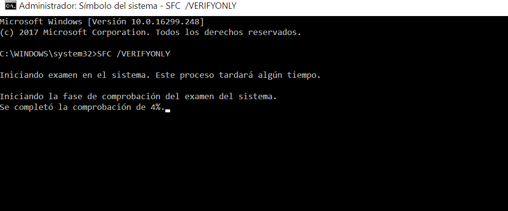

### Defragmentación

En discos duros clásicos (HDD) la **fragmentación** del contenido de los ficheros y directorios degrada con el tiempo el rendimiento del sistema. Para evitarlo Windows posee una herramienta de defragmentación de discos. Es un proceso lento, pero conviene llevarla a cabo de forma habitual para mejorar el rendimiento del sistema. 
La defragmentación no es posible en discos de estado sólido o memorias USB.

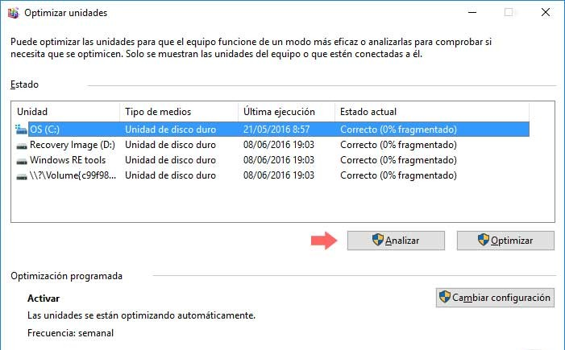

## Gestión del hardware

En la mayoría de las versiones de Windows, el procedimiento para agregar o eliminar hardware es similar y ha ido mejorado entre versiones. Hoy por hoy, casi todas las versiones de sistemas operativos son sistemas **Plug and Play,** es decir, sistemas en los que el hardware, se inserte en frío o en caliente, queda reconocido por el sistema operativo en la mayoría de los casos de forma automática (el SO posee ya drivers o los baja de Internet)

Al hardware, debemos tener en cuenta algunas consideraciones:

-   *Que se pueda añadir en caliente*. Este hardware suele ser del tipo **USB** o **Firewire.** Añadirlo en caliente indica que podemos insertar el nuevo dispositivo hardware sin tener que apagar el ordenador.
-   *Que se pueda añadir en frío*. Este tipo de hardware suelen ser discos duros internos, memoria, tarjetas gráficas, etc., para los que es necesario apagar el equipo, insertar el hardware y luego volver a encender el equipo.

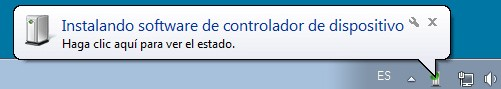

### Agregar una impresora local

Desde el menú de **configuración** de Windows se puede agregar una impresora local de forma sencilla, desde **dispositivos** y agregar una impresora o escáner.

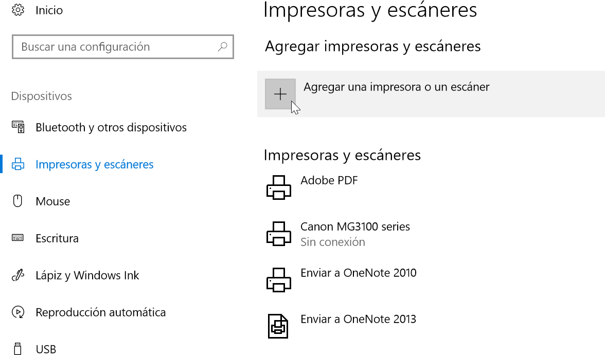

### Administrador de dispositivos

El **Administrador de dispositivos** es una interfaz de dispositivos gráfica que se puede abrir buscando desde el menú inicio, propiedades del sistema o el comando **devmgmt.msc**

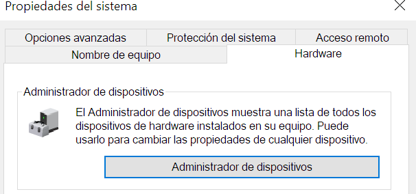

El Administrador de dispositivos es una potente herramienta que se usa para:

-   Ver el hardware del equipo organizado por categorías.
    -   Ver o actualizar los controladores del equipo.
    -   Comprobar si el hardware está funcionando correctamente.
    -   Modificar la configuración del hardware o deshabilitarlo.

El administrador de dispositivos con el listado completo de hardware del equipo:

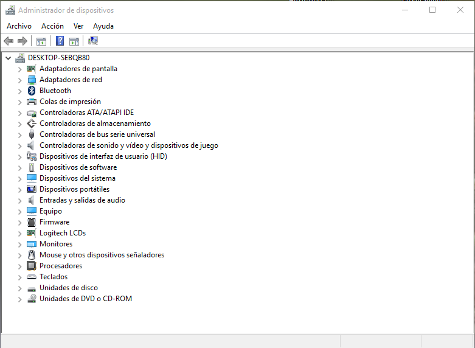

Si hubiese algún problema de hardware, como que no se encuentran los drivers adecuados y por tanto el dispositivo no funciona correctamente, aparecerá un icono de aviso al lado del dispositivo.

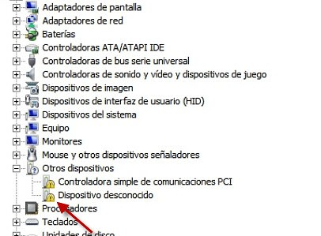

Si desplegamos uno de los dispositivos, como el adaptador de pantalla, podremos entrar desde *propiedades* en **la información de controlador actual**, permitiendo así mismo actualizar con una versión más reciente, desinstalarla o deshabilitarlo.

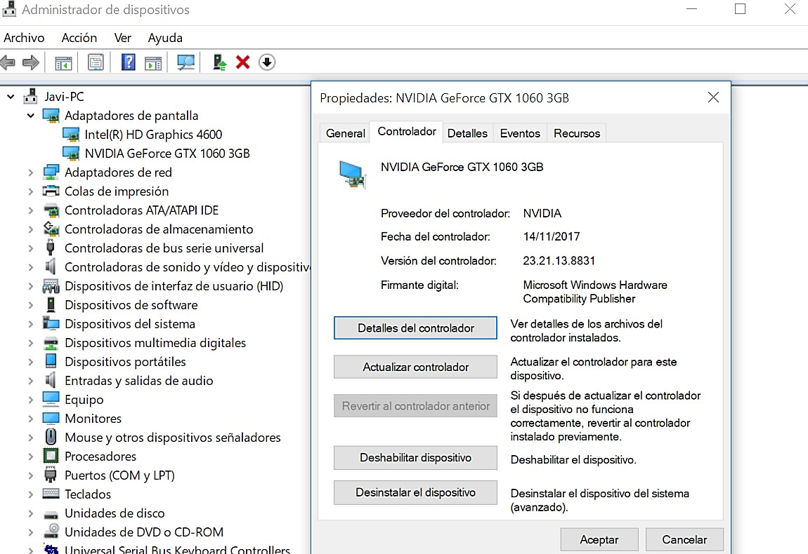

## Gestión del software

Para agregar o quitar **software** del sistema existen varias formas:

1.  A través del de Aplicaciones y características
2.  A través del panel de control
3.  A través de la Microsoft Store
4.  Ejecutando el instalador de un programa

### Aplicaciones y características

En el menú Inicio selecciona **Configuración** y seleccionar 
**Aplicaciones** de la configuración de Windows.

Selecciona el programa o aplicación de la lista o búscalo en la lista para obtener información de la instalación, modificarlo o para **desinstalarlo**.

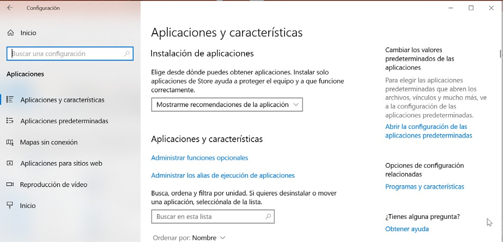

Desde Aplicaciones y características también se pueden administrar ciertas **funciones opcionales** instaladas del sistema operativo.

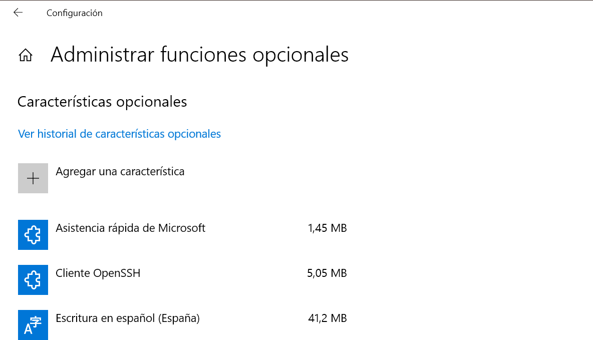

Otra función importante es poder controlar los programas o aplicaciones en segundo plano que se cargan siempre al inicio de Windows y poder desactivarlos para mejorar tiempos de carga.

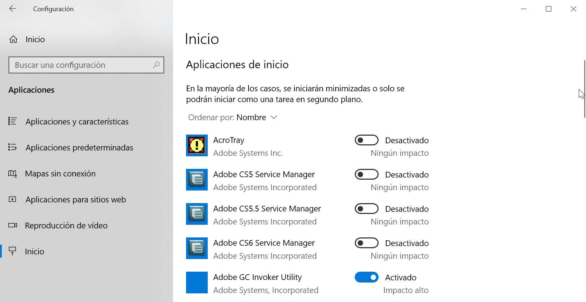

### Panel de control

A través del **Panel de control (cada vez más obsoleto)** se puede agregar o quitar software y elementos de Windows.

El **Panel de Control** era una parte fundamental de Windows desde sus primeras versiones y desde la cual se permite a los usuarios ver y manipular ajustes, agregar hardware, desinstalar programas, gestionar las cuentas de usuario, accesibilidad, entre otras opciones de sonido y pantalla.

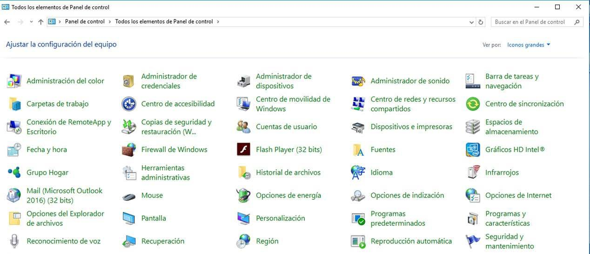

En las diferentes actualizaciones de Windows 10 y 11 se han ido trasladando de forma paulatina sus funciones al menú de configuración general.

Selecciona el programa o aplicación de la lista o búscalo en la lista para obtener información de la instalación, modificarlo o para **desinstalarlo**.

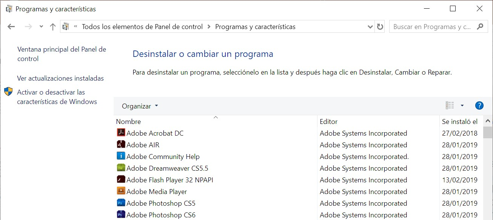

El panel de control también permite **activar o desactivar ciertos programas o características de Windows** (\*dependiendo la edición de Windows que tengamos)

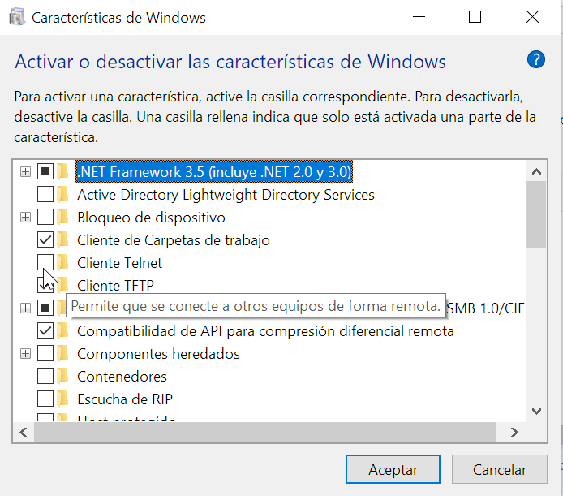

### Microsoft Store

La tienda de Windows, denominada Microsoft Store contiene un listado software (denominadas **aplicaciones universales**) preparado específicamente para la plataforma Windows 10 y 11, de forma parecida a las tiendas de dispositivos móviles.


Desde ajustes, se permite las opciones de actualizaciones y desinstalación de los elementos individualmente.

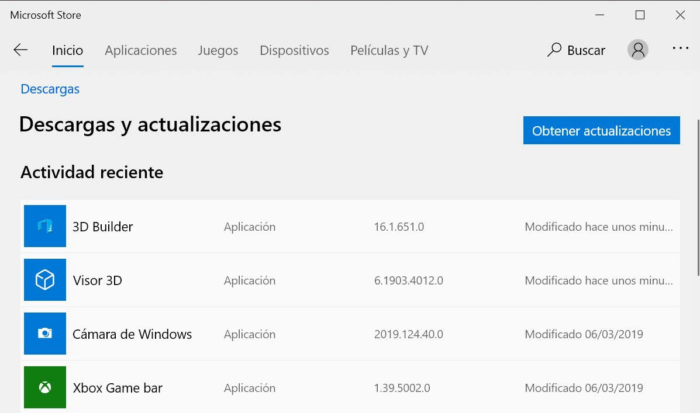

### Instaladores

La clásica instalación de programas descargados en Windows (para la arquitectura apropiada ya que conviven programas de 32 bits llamados *x86* o de 64 *x64*) se realiza ejecutando el programa instalador, que suele denominarse **setup.exe**

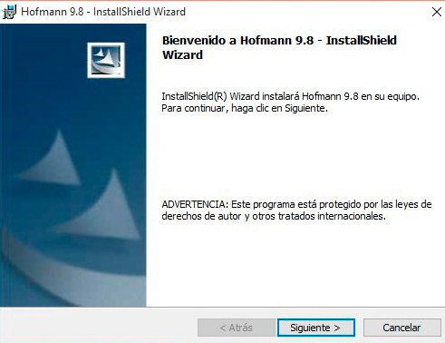

Otro tipo de instaladores son los archivos **msi**. Un archivo *msi* es un archivo instalador de Windows, usado para instalar aplicaciones. El nombre de la extensión *msi* proviene de *Microsoft Installer*. Al hacer doble clic sobre un archivo *msi* éste se abre con el Windows Installer y no tiene un editor asociado.

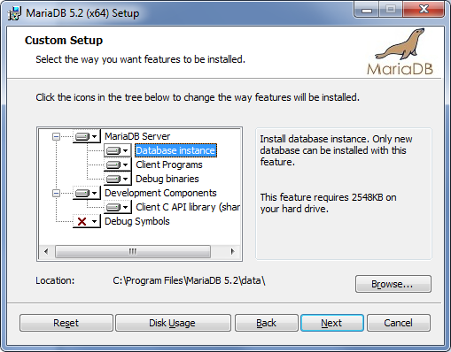

### Ejecución de aplicaciones

Existen diversas formas triviales para **ejecutar** aplicaciones desde Windows. La más habitual será a través del menú inicio, o el de búsqueda de la barra de tareas, aunque también se podría hacer desde el cuadro ejecutar (*Win+R*)

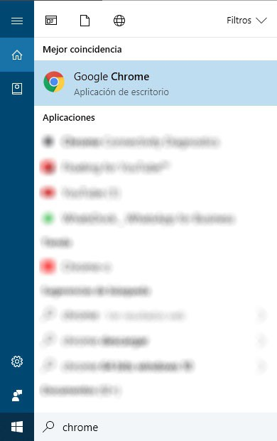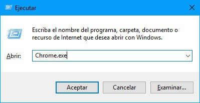

Ciertas aplicaciones no funcionarán en Windows 10 hasta no concederles permisos de administrador, los cuales veremos en qué consisten más adelante.

Si una aplicación antigua no funciona en Windows 10 conviene primero probar usando este método. Para ello hacer clic derecho en el icono del programa o el archivo *.exe* y en **ejecutar como administrador**.

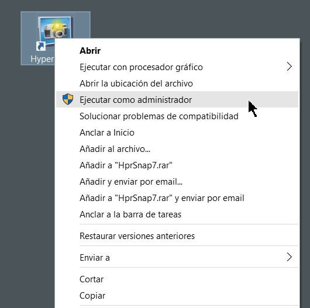

Las versiones de Windows 10 cliente incluyen un **modo de compatibilidad** para ejecutar aplicaciones antiguas. Para acceder al mismo hacer clic derecho en el icono del programa o en el archivo .exe e ir a *Propiedades\>pestaña Compatibilidad*

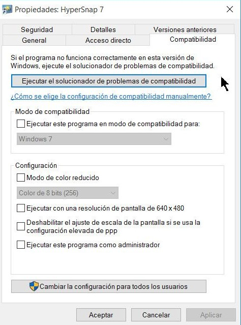

Si un programa funcionaba en 7 marca “Ejecutar este programa en modo de compatibilidad” Elegir *Windows 7.*  Se pueden probar otras opciones. Hay juegos antiguos que necesitan el “modo de color reducido” La herramienta también incorpora un asistente automático que comprueba los mejores valores de compatibilidad para cada aplicación.

Para ejecutar aplicaciones o programas desde la consola CMD es necesario escribir el nombre de su ejecutable para lanzarlos.

Aquellos que no sean programas del sistema, o cuya ruta no esté en la variable *PATH* no se reconocerán a no ser que se ejecuten desde la ruta desde la que están instalados.

Otra forma de lanzar cualquier programa es mediante el comando START START [programa]

### Información del sistema

Windows posee una herramienta llamada **Información del sistema** que proporciona un perfil general y completo del equipo. Esta información incluye entre otros:

-   La versión de Windows y compilación actual.
-   El tipo de unidad central de proceso (CPU) y cantidad de memoria.
-   Una recopilación completa de los recursos **hardware** y software del sistema.
-   Versión, fecha y modo de la BIOS.

Se puede abrir desde el programa **msinfo32.exe**

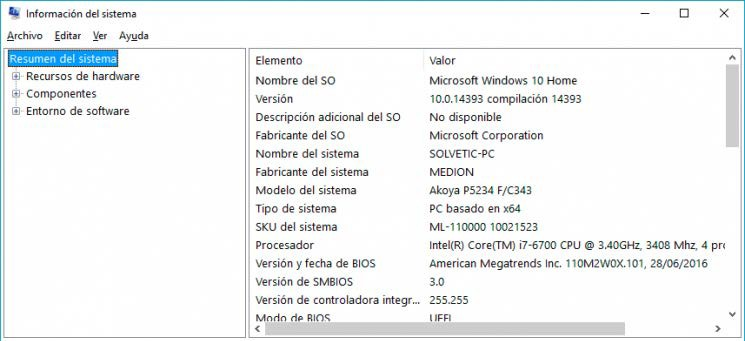

Desde la consola CMD también se puede lanzar el comando **SYSTEMINFO** para extraer información del sistema como la versión del SO actual, el fabricante de la placa base, procesador y tarjeta de red.

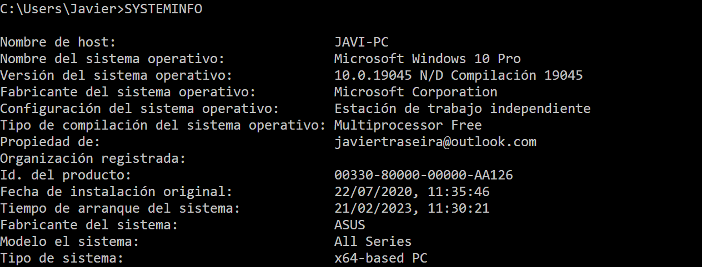

### Configuración del sistema

Configuración del sistema, conocido como **msconfig,** es otra sencilla herramienta que permitirte arreglar problemas relacionados con el inicio y arranque de Windows, y que también permite deshabilitar programas al inicio de Windows, sin necesidad de editar el Registro de Windows.

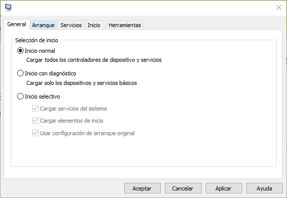

El cuadro **Opciones de arranque** permite elegir distintos tipos de modo a prueba de errores (o modo seguro) a elegir entre Mínimo, Shell alterno, Reparar Active Directory o de Red. Otras opciones te permiten elegir que Windows arranque sin interfaz (Sin arranque de GUI), si quieres guardar un registro del arranque (Registro de arranque), si quieres cargar un controlador estándar de vídeo (Vídeo base) o si deseas ver información de arranque del sistema operativo.

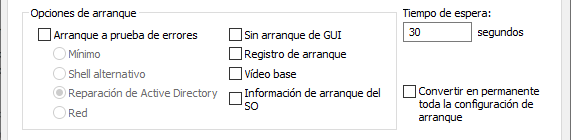

La última pestaña de **msconfig** recopila acceso directos a muchas miniherramientas de Windows que te pueden ser útiles para resolver problemas relacionados con Windows. La gran mayoría de ellas son accesibles desde el menú de inicio

### Actualizaciones de Windows

El menú principal de configuración de Windows posee un importante apartado relativo a la **actualización** y seguridad de Windows.

‘Forzar’ la comprobación de búsqueda de actualizaciones en el momento es relativamente sencillo, haciendo clic en buscar actualizaciones. El sistema se conecta a los servidores de Microsoft y comprueba respecto la versión instalada si existen actualizaciones.

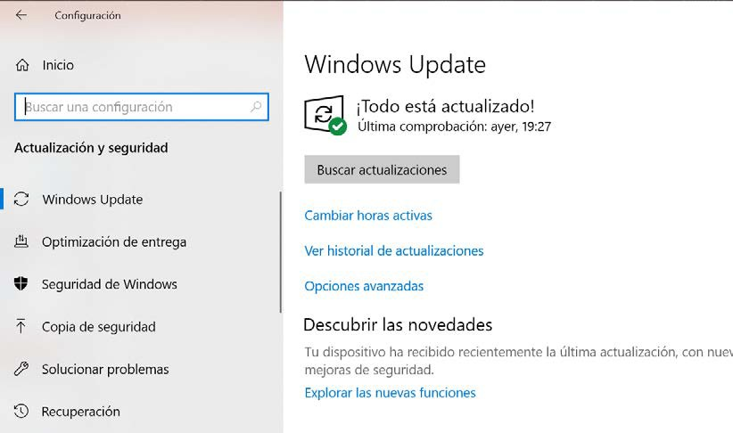

Microsoft las clasifica en función de lo esenciales que sean para Windows o tu PC las actualizaciones en tres niveles básicos:

-   **Críticas e importantes:** Son actualizaciones que se deben instalar de forma obligatoria. Son críticas afectando a la seguridad y privacidad del equipo o a lo fiable y estable que sea Windows. Suelen afectar al kernel o elementos críticos.
-   **Recomendadas:** Son actualizaciones que hacen que el ordenador mejore el rendimiento o añaden nuevas funcionalidades al sistema operativo. Conviene instalarlas pero no se consideran fundamentales. Se puede configurar *Windows Update* para que les dé la misma rango que a las actualizaciones importantes. En caso contrario se tratarán como actualizaciones opcionales.
-   **Opcionales:** Las principales actualizaciones de este grupo son relativas a drivers o controladores de dispositivos y componentes del ordenador. También afectan a programas de Microsoft, como el paquete ofimático de Office o el navegador Edge.

Cada mes, Microsoft publica una actualización de su herramienta de eliminación de software malicioso que se puede utilizar para eliminar infecciones conocidas de una computadora.

En el apartado de **opciones avanzadas** podemos configurar parámetros de las actualizaciones como notificaciones, reinicios o pausar durante una semana dichas actualizaciones

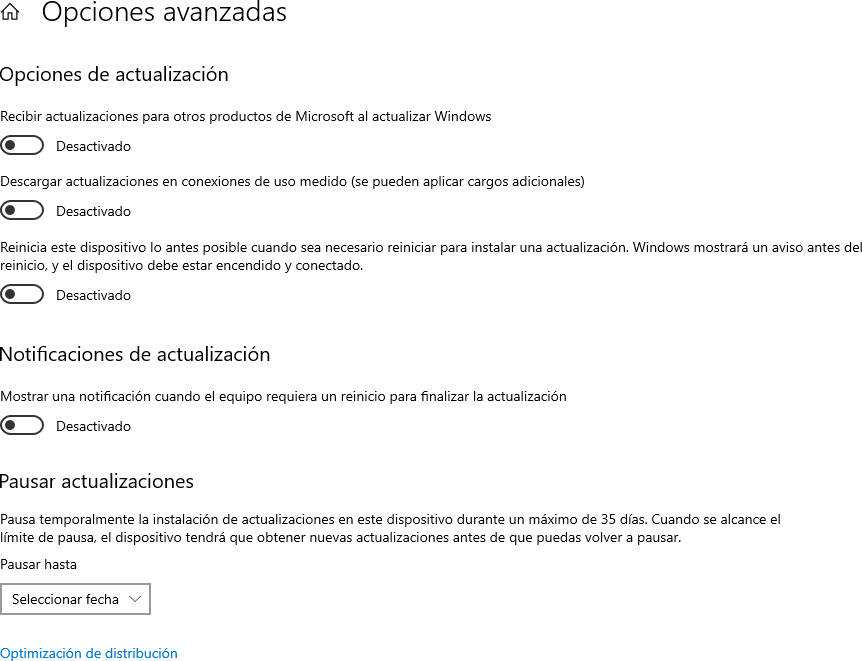

Todos los productos de Microsoft y sus diferentes versiones tienen un **soporte de vida** determinado por su directiva de ciclo de vida que puede consultarse en la web: <https://support.microsoft.com/es-es/hub/4095338/microsoft-lifecycle-policy>


### Parada del sistema

A la hora de **parar del sistema** debemos distinguir entre: apagar, reiniciar, hibernar, inicio rápido, suspender o la suspensión híbrida.

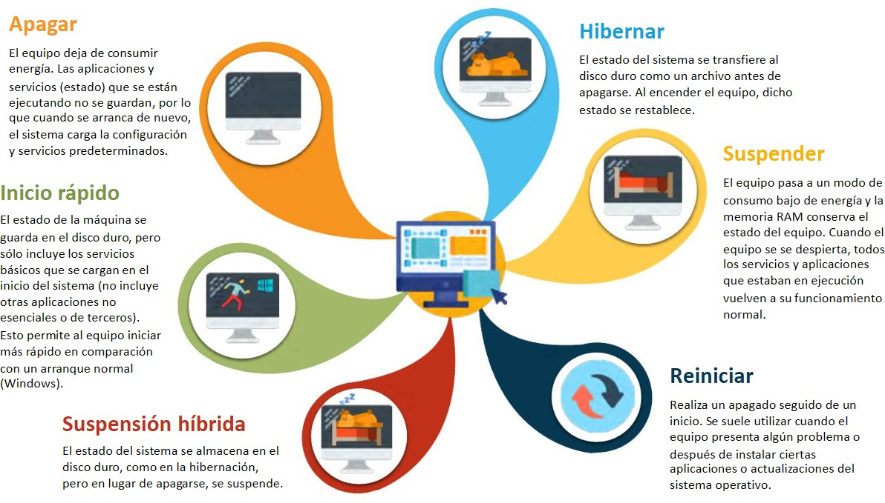

### Atajos generales Windows


|  Windows      |                                                                          |
|-----------------------------------|--------------------------------------------------------------------------|
| **Tecla**                         | **Acción**                                                               |
| Ctrl + X                          | Cortar el elemento seleccionado                                          |
| Ctrl + C (o Ctrl + Insertar)      | Copiar el elemento seleccionado                                          |
| Ctrl + V (o Mayús + Insertar)     | Pegar el elemento seleccionado                                           |
| Ctrl + Z                          | Deshacer una acción                                                      |
| Alt + Tabulador                   | Cambiar entre aplicaciones abiertas                                      |
| Alt+F4                            | Cerrar el elemento activo o salir de la aplicación activa                |
| Tecla del logotipo de Windows + L | Bloquear el equipo                                                       |
| Tecla del logotipo de Windows + D | Mostrar y ocultar el escritorio                                          |
| F2                                | Cambiar el nombre del elemento seleccionado                              |
| F3                                | Buscar un archivo o carpeta en el Explorador de archivos                 |
| F4                                | Mostrar la lista de la barra de direcciones en el Explorador de archivos |
| F5                                | Actualizar la ventana activa                                             |
| F6                                | Desplazarte por los elementos de la pantalla                             |
| F10                               | Activar la barra de menús en la aplicación activa                        |
| Alt + Esc                         | Desplazarte por los elementos en el orden en que se abrieron             |
| Alt + Intro                       | Ver las propiedades del elemento seleccionado                            |
| Alt + Barra espaciadora           | Abrir el menú contextual de la ventana activa                            |
| Alt + Flecha izquierda            | Volver                                                                   |
| Alt + Flecha derecha              | Ir hacia delante                                                         |
| Alt + Re Pág                      | Subir una pantalla                                                       |
| Alt + Av Pág                      | Bajar una pantalla                                                       |
| Ctrl + R (o F5)                   | Actualizar la ventana activa                                             |
| Ctrl + Y                          | Rehacer una acción                                                       |

| **Atajos usando la tecla de Windows 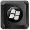** |                                                                                                                                              |
|---------------------------------------------------------------------------------------|----------------------------------------------------------------------------------------------------------------------------------------------|
| **Tecla**                                                                             | **Acción**                                                                                                                                   |
| Tecla del logotipo de Windows          | Abrir o cerrar Inicio                                                                                                                        |
| Tecla del logotipo de Windows + A                                                     | Abrir el Centro de actividades                                                                                                               |
| Tecla del logotipo de Windows + B                                                     | Llevar el foco al área de notificación                                                                                                       |
| Tecla del logotipo de Windows + K                                                     | Abrir la acción rápida Conectar                                                                                                              |
| Tecla del logotipo de Windows + L                                                     | Bloquear el equipo o cambiar de cuenta                                                                                                       |
| Tecla del logotipo de Windows + M                                                     | Minimizar todas las ventanas                                                                                                                 |
| Tecla del logotipo de Windows + O                                                     | Bloquear la orientación del dispositivo                                                                                                      |
| Tecla del logotipo de Windows + Mayús + número                                        | Abrir el escritorio e iniciar una nueva instancia de la aplicación anclada a la barra de tareas en la posición indicada por el número        |
| Tecla del logotipo de Windows + Ctrl + número                                         | Abrir el escritorio y cambiar a la última ventana activa de la aplicación anclada a la barra de tareas en la posición indicada por el número |
| Tecla del logotipo de Windows + Alt + número                                          | Abrir el escritorio y abrir la lista de accesos directos de la aplicación anclada a la barra de tareas en la posición indicada por el número |
| Tecla del logotipo de Windows + Ctrl + Mayús + número                                 | Abrir el escritorio y abrir una nueva instancia de la aplicación ubicada en la posición determinada en la barra de tareas como administrador |
| Tecla del logotipo de Windows + Tabulador                                             | Abrir la Vista de tareas                                                                                                                     |
| Tecla del logotipo de Windows + Flecha arriba                                         | Maximizar la ventana                                                                                                                         |
