# UT7.2 Administración de Windows: usuarios, grupos y permisos

## Usuarios y grupos locales

```note
💡 Un **usuario** es una persona identificable que puede usar un SO.
```

```note
💡 Un **grupo** es un conjunto de usuarios a los que se les asocian las mismas reglas.
```

Las versiones de Windows permiten la gestión de **usuarios** y **grupos locales**, mientras que las versiones Windows Server además, las de **usuarios** y **grupos de Dominio** (en red) que veremos más adelante.

Windows necesita que un usuario se valide ante el sistema para poder usarlo. Este tiene que haber sido, además, dado de alta previamente por el único usuario que, en principio, tiene privilegios sobre el equipo: **el Administrador***.*

Una vez creado el usuario, este podrá iniciar sesión en el equipo de forma local, y, si es el caso, también de forma remota (desde un **Dominio**).

Se entiende por tanto como **usuario o grupo local** la configuración personalizada que permite iniciar sesión de trabajo en un equipo local.

```note
💡 Una **cuenta de usuario** es una colección de información que indica al SO los archivos y carpetas a los que puede tener acceso un determinado usuario del equipo, los cambios que puede realizar en él así como sus preferencias personales.
```

En Windows existen dos tipos de **cuentas de usuario local**:

-   **Cuenta de usuario local estándar**: Tiene privilegios limitados, se puede usar la mayoría de los programas instalados en el equipo, pero no se puede instalar o desinstalar software ni hardware, eliminar archivos que son necesarios para que el equipo funcione, o cambiar opciones de configuración que afecten a otros usuarios.
-   **Cuenta de administrador**: Tiene el máximo control sobre el equipo local y sólo se debe usar cuando se lleven a cabo tareas de administración que requieran los privilegios del administrador. Este tipo de cuenta permite realizar cambios que afectan a otros usuarios. Son tareas fundamentales de los administradores las relativas a configuración de seguridad, instalación de software, hardware, etc.

La cuenta de **Invitado** era un tipo de cuenta con derechos muy limitados que en Windows 10 se ha terminado por eliminar por motivos de seguridad.

```note
Cada cuenta de usuario se identifican con un **SID** (Security Identifier) o Identificador de Seguridad. Se trata de un número de identificación único para cada usuario. 
```

Es como el DNI de cada usuario, Windows identifica internamente los usuarios a través de su SID y no por su nombre.

Para ver todos los **SID** del sistema se utiliza de nuevo el comando **WMIC**:

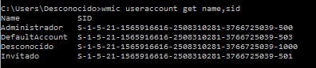

```note
💡 Un **grupo de usuarios** es un conjunto de cuentas de usuario que tienen en común las mismas reglas y derechos de seguridad.
``` 

Los **grupos** en Windows proporcionan la posibilidad de otorgar permisos a tipos de usuarios con características similares. Si un usuario es miembro de un grupo con acceso a un recurso, ese usuario en particular puede acceder al mismo recurso que estos. Los grupos de usuarios locales se nombran como *Equipo\\Nombre_grupo.*

Windows emplea los siguientes tipos de grupos:

-   **Grupos locales:** Definidos en un equipo local y usados solo en dicho equipo local.
-   **Grupos de seguridad:** Pueden tener descriptores de seguridad asociados. Se utiliza un servidor Windows para definir grupos de seguridad en dominios.
-   **Grupos de distribución:** Se utilizan como lista de distribución de correo electrónico. No pueden usar descriptores de seguridad.
-   **Grupos creados por nosotros**: Según nuestras necesidades podremos crear grupos con un nombre y función u otro.

Al instalar Windows se crean por defecto varios **grupos de usuarios** predefinidos en el sistema:

-   Administradores.
-   Operadores de copia de seguridad.
-   Operadores criptográficos.
-   Lectores del registro de eventos.
-   Invitados.
-   Operadores de configuración de red.
-   Usuarios del registro de rendimiento.
-   Usuarios del monitor del sistema.
-   Usuarios avanzados\*.
-   Usuarios autenticados.
-   Usuarios de escritorio remoto.
-   Duplicadores.
-   Usuarios\*.

Podemos crear, borrar y modificar cuentas de usuario y grupos locales en Windows desde varios sitios distintos del SO, con distintas opciones:

1.  **Cuentas** desde la configuración de Windows (poco útil)
2.  **Cuentas de usuario** desde Panel de Control.
3.  **Gestión de cuentas de usuario** desde *Herramientas Administrativas \> Administración de equipos.*
4.  Ventana del **gestor de usuarios.**
5.  Desde la **consola de comandos** (CMD)

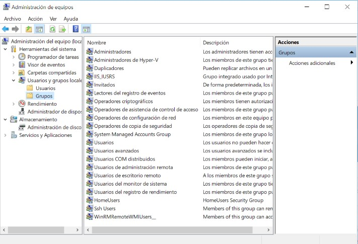
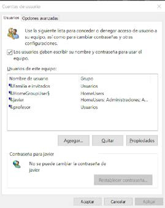

Desde **administración de equipos** en cambio, se pueden gestionar además de usuarios, grupos, perfiles y propiedades de forma detallada:

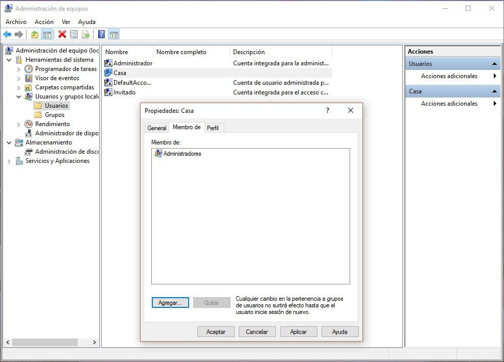

Al usuario **Administrador** no hay que darlo de alta, ya que se crea automáticamente. Tampoco se puede borrar, aunque sí personalizar. Es el que suele dar de alta a los demás usuarios o grupos, el que los borra y el que los modifica.

Para dar de alta un nuevo usuario local en el equipo que tenemos, tendremos que ir al *Administrador de equipos*. Desde allí, y seleccionando la opción *Usuarios,* podremos ver que en la ventana de la derecha se despliega la lista de usuarios que tiene creado el sistema nada más instalarlo.

Para **dar de alta o añadir** a un nuevo usuario local desde el administrador de equipos el único que podrá hacerlo será el Administrador del equipo o un usuario con privilegios suficientes para realizar este tipo de operaciones.

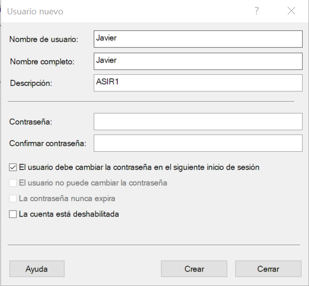

Para que un sistema sea seguro y no pueda acceder ningún usuario no autorizado, es prácticamente obligatorio, que todos los usuarios del sistema introduzcan una **contraseña** para loguearse. Las contraseñas se gestionan en la misma pantalla en la que se da de alta el usuario. Las opciones son las siguientes:

-   **El usuario debe cambiar la contraseña en el siguiente inicio de sesión**. Si activamos esta casilla, hayamos introducido o no contraseña, la primera vez que el usuario se conecte, el sistema le pedirá obligatoriamente que cambie la contraseña.
-   **El usuario no puede cambiar la contraseña**. El usuario podrá iniciar sesión con una contraseña en blanco o no, pero no podrá cambiarla en ningún momento.
-   **La contraseña nunca expira**. Si no marcamos esta casilla, la contraseña caducará, es decir, expirará a los 42 días por defecto.
-   **Cuenta deshabilitada**. Esta opción se utiliza para no eliminar las credenciales del ordenador de un usuario que no queremos que se conecte.

Otra forma de gestionar usuarios más simplificada si cabe, es abriendo la ventana del **gestor de usuarios** o ejecutando el comando **NETPLWIZ**

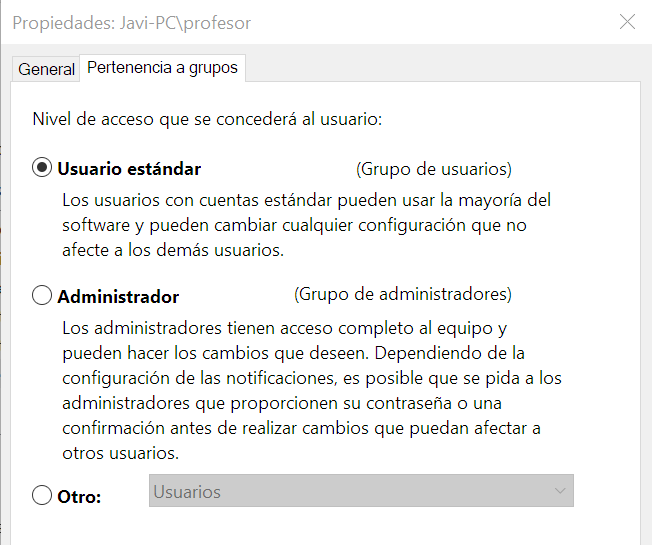

### Control de cuentas de usuario (UAC)

El **UAC** (*User Account Control*) o **control de cuentas de usuario** es una característica de seguridad que se encarga de notificar alertas de seguridad del sistema al usuario. Lanza mensajes de alerta cuando se quiere realizar alguna acción que influya en el sistema, tal como la instalación de determinados programas, la modificación del registro de Windows, la creación de servicios, etc y que requieren privilegios de usuarios con permiso de administrador.

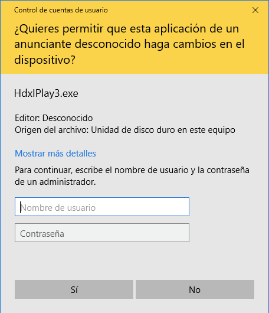

El nivel de alertas del **UAC** se puede ajustar para que sea más o menos agresivo o incluso desactivarlo (lo cual no es nunca recomendable).

### Gestión de usuarios desde la consola

```tip
A la hora de gestionar **usuarios** desde consola existe un comando específico para ello: **NET USER**
```

La sintaxis del comando: 

        NET USER usuario [contraseña] [parámetros]

NET USER nombreusuario: Devuelve toda la información asociada a la cuenta del usuario proporcionado.

NET USER nombreusuario contraseña: Asociar una contraseña al usuario indicado.

NET USER nombreusuario /ACTIVE:YES\|NO: activar o desactivar la cuenta del usuario especificado.

NET USER nombreusuario contraseña /ADD: Añade el usuario indicado con la contraseña facilitada. Parecida a la anterior, pero esta solo sirve para asociar una contraseña a un usuario ya existente en Windows.

NET USER nombreusuario /DELETE: Elimina el usuario y todo lo relacionado con él en lo que se refiere a configuración. Los cambios no son reversibles.

-   Para ver los usuarios en el sistema actualmente:

        NET USER

-   Para agregar un usuario:

        NET USER nombreusuario /ADD

-   Para agregar un usuario con contraseña:

        NET USER nombreusuario contraseña /ADD

-   Para eliminar un usuario:

        NET USER nombreusuario * /DELETE

-   Para activar o desactivar una cuenta de usuario:

        NET USER nombreusuario active:yes|no

### Gestión de grupos desde la consola

A la hora de gestionar **grupos** se utiliza una variante del anterior comando denominada: **NET LOCALGROUP**

La sintaxis del comando: 

        NET LOCALGROUP usuario [parámetros]

-  Para ver los grupos locales registrados del sistema:

        NET LOCALGROUP

-   Para agregar un nuevo grupo:

        NET LOCALGROUP nombregrupo /ADD

-   Para eliminar un grupo existente:

        NET LOCALGROUP nombregrupo /DELETE

-   Para agregar un usuario a un grupo:

        NET LOCALGROUP nombregrupo nombreusuario /ADD

## Permisos NTFS

El sistema de **permisos** de carpetas y usuarios en Windows es relativamente complejo y es una característica de su sistema de archivos **NTFS**.

Cada carpeta en Windows tiene un **propietario**, que es su creador, ya sea el propio SO (*SYSTEM*), un instalador (*TrustedInstaller*) o un usuario concreto (*javier*).

Cada carpeta o archivo puede tener a su vez varios usuarios o grupos de usuarios a los cuales se les puede asignar determinados permisos.

Dichos **permisos básicos** en Windows son:

- Control total
- Modificar
- Lectura y ejecución
- Mostrar el contenido de la carpeta
- Ejecutar

Usamos los permisos **NTFS** para especificar:

-   Usuarios y grupos que acceden a archivos y carpetas
-   Acciones que puedan realizar sobre ellos
-   Cada permiso tendrá 3 posibles estados:

    - Conceder ✅
    - Denegar ❌
    - Dejar en blanco, con lo que decidirá otra regla


-   Los permisos se aplicarán a dos niveles:
    -   A nivel de carpeta
    -   A nivel de archivos.


    

### Listas ACL

Para asignar permisos en Windows, se utilizan Listas de control de acceso o **ACLs.**

Todos los objetos de tipo fichero o carpeta se encuentran protegidos por un **SD** (Security Descriptor). 

```note
💡 Las **ACL** (*Access Control Lists*), son listas de condiciones que poseen los descriptores de seguridad (SD) y que permiten designar permisos de acceso a cualquier elemento del sistema o directorio en general.
```

La **lista ACL** contiene un listado de todas las cuentas de usuario, grupos y equipos a los que se ha concedido acceso al archivo o carpeta, y el tipo de acceso concedido.

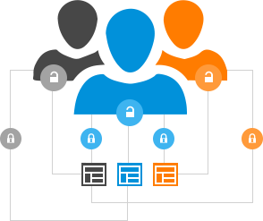

Para que un usuario pueda acceder a un archivo o carpeta:

-   La lista ACL debe contener una entrada, denominada entrada de control de acceso (Access Control Entry, **ACE**), para la cuenta de usuario, grupo o equipo al que pertenece el usuario.
-   La entrada debe permitir específicamente el tipo de acceso solicitado por el usuario para que éste pueda tener acceso al archivo o carpeta.
-   Si no existe ninguna entrada ACE en la lista ACL, Windows denegará al usuario el acceso al recurso.

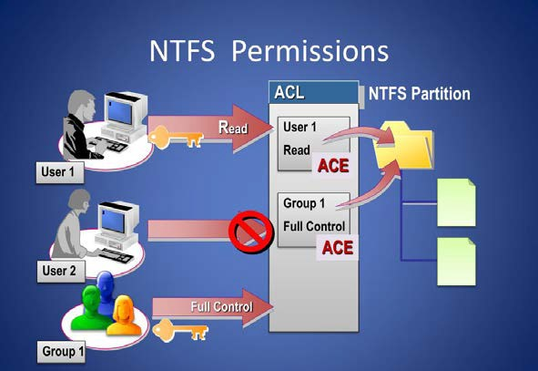

### Propietario carpeta o archivo


Para cambiar el **propietario** de una carpeta o archivo haremos clic en Cambiar siendo usuario administrador. Desde la ventana que se abrirá escribiremos el nombre o grupo de usuarios a los que asignar la propiedad:

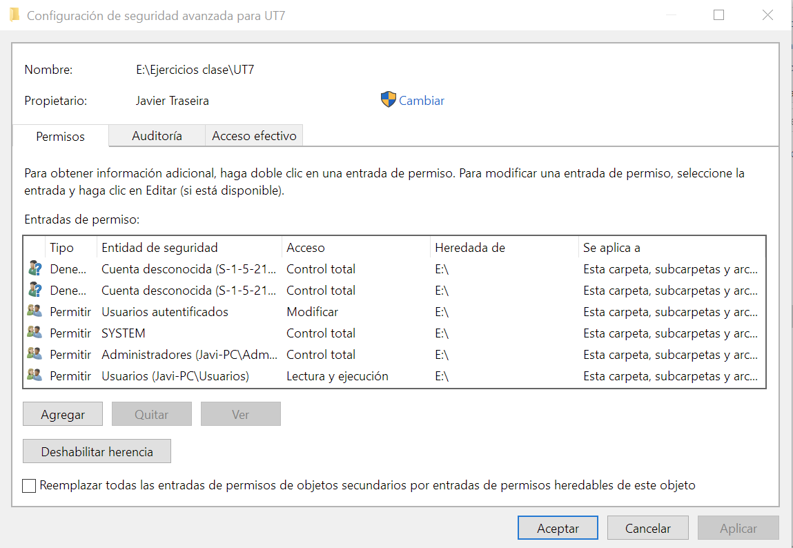
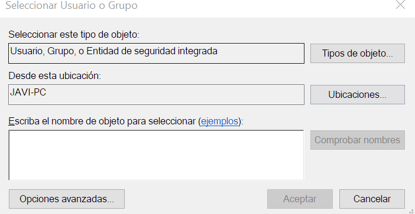

El orden de interpretación de los permisos, en caso de conflicto, es el siguiente:

-   Accesos denegados explícitos (*DENY ONLY*).
-   Accesos autorizados explícitos (*ALLOW ONLY*).
-   Accesos denegados heredados.
-   Accesos autorizados heredados.

```warning
Si hay por tanto permisos denegados explícitos y a su vez autorizados, la anulación siempre tendrá preferencia sobre las demás.
```

En caso de querer acceder a una carpeta en la cual no tenemos permisos o no somos administradores aparecerá el siguiente mensaje.

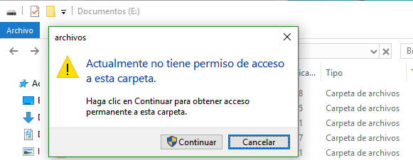

Para modificar los permisos de una carpeta se debe entrar en sus propiedades dentro de la pestaña **seguridad** y a continuación en **Editar** para el usuario buscado.

En caso de no tener permisos en la carpeta y querer cambiar su **propietario** o editar permisos especiales desde un menú mucho más complejo, seleccionaremos **opciones avanzadas**:


Existen otra serie de permisos para usos específicos, son los llamados permisos especiales:

-   Atravesar carpeta/Ejecutar archivo
-   Mostrar carpeta/Leer datos
-   Leer atributos
-   Leer atributos extendidos
-   Crear archivos/Escribir datos
-   Crear carpetas/Anexar datos
-   Escribir atributos
-   Escribir atributos extendidos
-   Eliminar subcarpetas y archivos
-   Eliminar
-   Permisos de lectura
-   Cambiar permisos
-   Tomar posesión

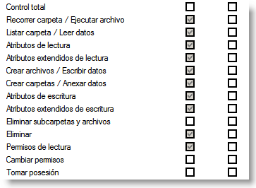

## Herencia de permisos

La **herencia de permisos** puede resultar confusa o compleja en Windows. 

💡 Al crear un archivo o carpeta en un volumen NTFS ese objeto **hereda automáticamente los permisos de su carpeta contenedora.**

De la misma forma cuando asignamos permisos a una carpeta contenedora, los permisos se propagan automáticamente hacia los archivos y subcarpetas contenidas en el recurso.

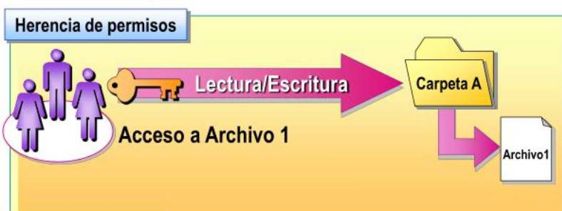

-   Los permisos de NTFS son acumulativos.
-   Los permisos de archivo son independientes de los permisos de carpeta.
-   El permiso denegar invalida otros permisos lo cual a veces es confuso.

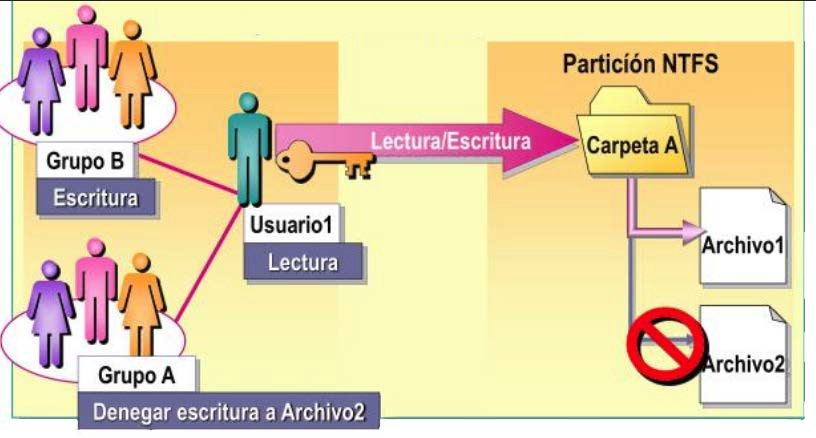

### Deshabilitar herencia

Se puede comprobar de forma sencilla la herencia de una carpeta o archivo en la columna “*Heredada de”* de opciones avanzadas en las propiedades de la carpeta:

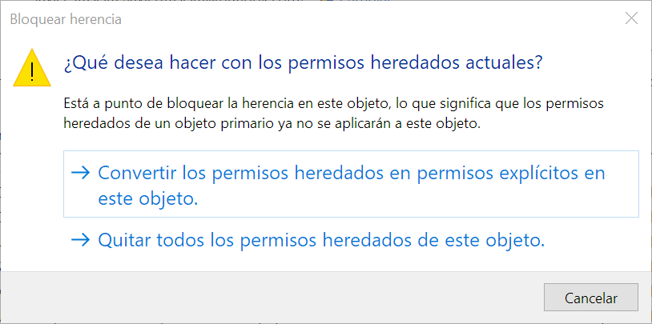

💡 Si queremos anular dicho comportamiento por defecto haremos clic en el botón Deshabilitar herencia y convertiremos los permisos heredados en permisos explícitos.

## Comandos de permisos

### Comandos gestión de permisos

```tip
Podemos usar el comando ICACLS para modificar permisos de sistema de archivos **NTFS** en un equipo que está ejecutando un SO Windows.
```

        ICACLS nombre_objeto [modificadores] [opciones]

Donde modificadores puede ser:

    /GRANT: Conceder permisos
    /DENY: Denegar permisos
    /SAVE: Guarda las ACLS de los objetos en el fichero que se le indique.
    /RESTORE: Recupera las ACLS almacenadas en el archivo especificado.
    /SETOWNER: Cambiar el propietario de los objetos que se le especifiquen.
    /INHERITANCE: Habiltar/deshabilitar herencia 
    
Y opciones puede ser:

    /T Indicar que las operaciones se realicen recursivamente
    /C Continuar las operaciones aunque encuentre errores

Significado de las **letras** de los permisos sobre ficheros:

- N sin acceso
- F acceso completo (total)
- M modificar acceso
- RX acceso de lectura y ejecución
- R acceso de solo lectura
- W acceso de solo escritura
- D acceso de eliminación

Significado de la máscara de **derechos de herencia** que aplican solo a directorios: 

- O herencia de objeto 
- NP no propagar herencia 
- CI herencia de contenedor 
- I permiso heredado del contenedor principal 

```warning
En caso de conflicto entre usuario, grupos y sus reglas, **las reglas de prohibición tienen mayor prioridad** que las que permitan el acceso.
```

Así para el siguiente caso de ejemplo:

```
BUILTIN\Administradores:(F)           
NT AUTHORITY\SYSTEM:(F)            
BUILTIN\Usuarios:(RX)            
NT AUTHORITY\Authenticated Users:(M)
```

Significado de los permisos mostrados:
- Los administradores (BUILTIN\Administradores) y el sistema (NT AUTHORITY\SYSTEM) tendrán control total (F).
- Los usuarios estándar (BUILTIN\Usuarios) solo pueden leer y ejecutar (RX).
- Los usuarios autenticados (NT AUTHORITY\Authenticated Users) pueden modificar (M).


Veremos a continuación, algunos ejemplos prácticos:

-  Para permitir al usuario Victor permitir modificar (**M**) el contenido de la carpeta C:\\USERS\\JAVIER\\DIRECTORIO

        ICACLS C:\Users\Javier\Proyecto /GRANT VICTOR:M

-  Para otorgar al grupo PROFESORES permiso de Control total (**F**) y aplicar toda la configuración a las subcarpetas:

        ICACLS C:\ejercicios /GRANT PROFESORES:F /C /T

-  Para guardar el estado de todos los permisos de la carpeta y subcarpetas del propio Windows:

        ICACLS C:\Windows\* /SAVE Copia_acls /T
        

-  Eliminar el control total del usuario Ana del contenido de una carpeta indicado y subcarpetas:

        ICACLS D:\Documentos /REMOVE ANA:F /C /T


```tip
El comando **TAKEOWN** se utiliza para cambiar el dueño de un fichero o directorio. 
```

Para poder hacerlo deberemos ser usuarios administradores y estar usando una unidad con sistema de archivos **NTFS**

        TAKEOWN /F "D:\System Volume Information" 

## Resumen comandos

| **Operaciones (Acciones)**                | **Comando**                                |
|-------------------------------------------|--------------------------------------------|
| Gestor de usuarios                        | NETPLWIZ                                   |
| Visualizar usuarios del sistema           | NET USER                                   |
| Visualizar grupos del sistema             | NET LOCALGROUP                             |
| Añadir/borrar usuario                     | NET USER nombre /ADD \| /DELETE            |
| Añadir/borrar grupo                       | NET LOCALGROUP nombre /ADD \| /DELETE      |
| Gestión de permisos                       | ICACLS [carpeta o fichero] /GRANT \| /DENY |
| Cambiar dueño carpeta/archivo             | TAKEOWN                                    |
