# UT7.3 Operaciones generales en consola CMD

## La consola CMD

La consola de comandos, **CMD**, símbolo del sistema o también conocido como **Command prompt** es un intérprete de línea de comandos que lleva acompañando al sistema operativo de Microsoft durante décadas. Tanto es así que es el Shell original para el sistema operativo Microsoft DOS y el Shell predeterminado en Windows hasta la compilación *14791* de Windows 10, momento en el que **Windows Powershell** pasó a ser la opción predeterminada del sistema.

Con el símbolo del sistema podemos lanzar o ejecutar comandos básicos, preparar scripts relativamente sencillos y realizar muchas de las tareas que podemos hacer desde la interfaz gráfica del sistema operativo de Microsoft. Ahora bien, cuando necesitamos realizar desarrollos más avanzados, acceder a ciertas áreas del sistema o automatizar tareas es donde deberíamos usar Windows PowerShell.

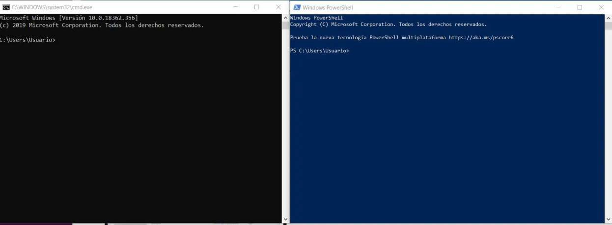

La **consola de comandos** (CMD) permite realizar tareas repetitivas de forma rápida. Escribimos el comando (y sus modificadores en su caso), presionamos **ENTER** y la aplicación CMD hará de intérprete para su ejecución.

Algunas **características** de la consola de Windows:

-   No diferencia entre mayúsculas y minúsculas.
-   Al escribir un nombre de archivo o carpeta con espacios conviene escribirlo siempre “*entrecomillado*”.
-   Los nombres pueden ser de hasta 255 caracteres.
-   Al eliminar un archivo este no va a la Papelera y se elimina.
-   Algunas operaciones requieren iniciar la consola como administradores (botón derecho\>**Ejecutar como administrador**)

Se puede configurar el **aspecto** así como ciertas propiedades de la consola de comandos haciendo clic en **propiedades.**


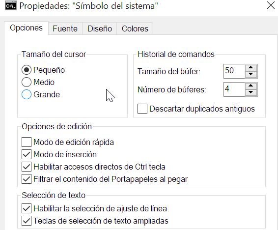

> 💡 La ruta en el disco actual indicada en la consola, y que indica estar a la espera de órdenes después del >, se denomina **PROMPT**.


## Navegación por directorios

```tip
Para navegar o moverse de directorio en la consola de comandos se utiliza el comando **CD** (CHDIR) y el comando **CD..**
```

Navegar usando el Explorador de archivos como hemos visto es intuitivo y natural.

Generalmente cuando el usuario abre la consola, el directorio donde comienza es su <u>directorio personal</u>. Desde ahí uno puede moverse a los diferentes directorios donde se tenga acceso usando el comando.

El comando **CD..** navega al directorio padre (el anterior).

El comando **CD\\** navega al directorio raíz.  

## Creación de directorios

```tip
En el entorno de consola de comandos de Windows (CMD), para la creación de directorios se utiliza el comando **MD** (MKDIR). 
```

En el entorno gráfico, para crear una carpeta dentro de otra, tendremos que tener abierta aquella dentro de la cual queremos crear otra u otras carpetas. Esta carpeta principal, llamada carpeta padre, será de la que «cuelgue» la estructura de carpetas.

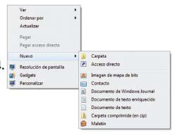


La sintaxis del comando **MD** es la siguiente: 

        MD nombre_directorio

## Consulta de directorios

```tip
En el entorno de consola de comandos de Windows, para la consulta del contenido de un directorio se utiliza el comando **DIR**. 
```

El **Explorador de Windows** a su vez permite mostrar la información de archivos y carpetas en iconos/listas personalizables.

Su sintaxis: 

        DIR [parámetros]

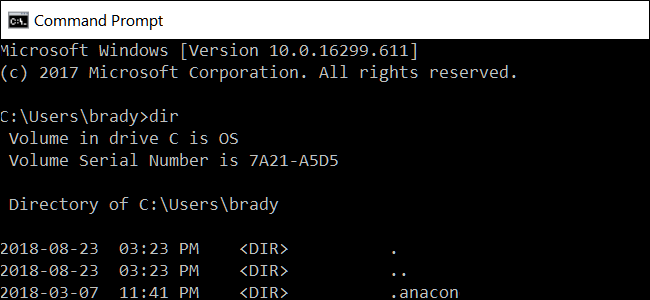

## Estructura de directorios

```tip
En el entorno de consola de comandos de Windows (CMD), utilizaremos el comando **TREE** para visualizar el árbol de directorios completo.
```


En la parte izquierda de la ventana del Explorador, se visualiza la estructura de directorios, unidades, así como accesos rápidos o bibliotecas.

Su sintaxis: 

        TREE [parámetros]

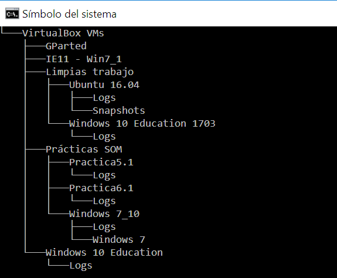

## Borrado archivos/directorios

```tip
El comando **RD** (RMDIR) se utiliza para borrar directorios ya vacíos.
```

```tip
El comando **DEL** (DELETE) se utiliza para borrar ficheros individualmente, o el contenido desde cierto directorio.
```

Al eliminar una carpeta o fichero desde la interfaz gráfica se mandará por defecto a la **papelera de reciclaje**. Si pulsamos a la vez la tecla *Mayús+Supr* se borrará el contenido seleccionado sin pasar por la papelera.

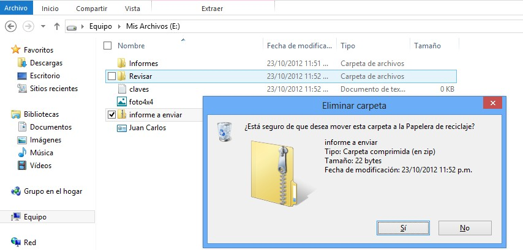

## Mover/copiar archivos/directorios

```tip
Para mover ficheros en la consola se utiliza el comando **MOVE**.
```

```tip
Para copiar ficheros en la consola se utilizan los comandos **COPY** y **XCOPY**.
```

La diferencia entre el comando **COPY** y el comando **XCOPY** radica en que uno, en el caso del comando COPY, no puede copiar subdirectorios y el **XCOPY** sí permite realizar **copia de archivos y subdirectorios** existente así como de **archivos ocultos** usando los parámetros apropiados. XCOPY además es más rápido.

La sintaxis de dichos comandos es la siguiente:

        COPY archivo_origen destino [parámetros] 
        XCOPY archivo_origen destino [parámetros]

**ROBOCOPY** es uno de los comandos disponibles más poderosos, útiles y empleados en la línea de comandos de Windows.

La aplicación Robocopy.exe, incluida en todas las versiones de Windows, permite copiar carpetas y directorios ya sea en un ordenador local o en la red. No copia archivos aislados. 


Ventajas de dicho comando:

-   Tolera las interrupciones en la copia de archivos, como por cortes de energía o red.
-   Realiza reintentos automáticos si no se puede acceder a un archivo.
-   Permite copiar grandes cantidades de archivos, imposible con XCOPY.
-   Muestra indicador de progreso.
-   Permite copiado multihilo.
-   Copia correctamente toda la información como propiedades, atributos, datos del propietario, fechas, etc además mantiene inalterables los permisos del archivo.

La sintaxis de dicho comando es la siguiente:

        ROBOCOPY origen destino [parámetros]

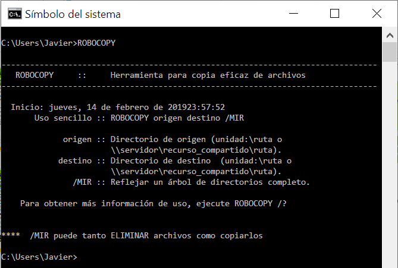

        C:> ROBOCOPY D:\PRUEBAHOY "\\sflimfs0\datalima\Sistemas y Tecnologia\PRUEBAHOY" /MIR /SEC /SECFIX


## Renombrar archivos/directorios

```tip
Para renombrar ficheros en la consola se utiliza el comando **REN**.
```

        C:> REN fichero.txt nuevonombre.doc

Para realizar esta operación en entorno gráfico, simplemente seleccionaremos la carpeta con el botón izquierdo del ratón y pulsaremos la tecla **F2**. De esta forma editamos el nombre de la carpeta para poder cambiarlo. Otra forma de hacerlo es haciendo un doble clic lento sobre el nombre de la carpeta/archivo o eligiendo la opción *Cambiar nombre* en el menú contextual de dicho elemento.

A la hora de renombrar archivos hay que tener presente que si tenemos **accesos directos** que apuntan a un archivo y lo renombramos o movemos, el sistema realizará un cambio de ruta de forma automática, incluso si lo cambiamos de unidad.

## Comandos útiles consola CMD

```tip
Para mostrar un texto en consola se usa el comando **ECHO**
```

        C:> ECHO HOLA

💡 Si escribimos **ECHO.** simplemente aparecerá una línea en blanco de separación, muy útil para separar contenido.

```tip
Para visualizar el contenido de un fichero de texto se utiliza el comando **TYPE**
```

        C:> TYPE fichero_texto.txt


Para crear un **fichero de texto vacío**, se puede hacer de varias formas:

        C:> COPY CON fichero.txt

        C:> ECHO. > fichero.txt


Otra forma sería abriendo el *bloc de notas* de Windows con un fichero como parámetro y a continuación guardarlo desde la interfaz.

        C:> notepad fichero.txt

```tip
Para mostrar o cambiar la hora se utiliza **TIME** y para la fecha **DATE**.
```

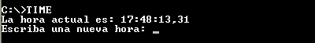

```tip
Para comparar el contenido de dos ficheros de texto y mostrar las diferencias entre ellos se utiliza el comando **FC**
```

        C:> FC fichero1.txt fichero2.txt

```tip
Para mostrar la versión del Sistema Operativo en la consola se utiliza VER.
```

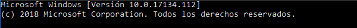

```
Para reiniciar o apagar nuestro equipo se usa el comando **SHUTDOWN**
```

El comando SHUTDOWN utiliza la siguiente sintaxis:

    SHUTDOWN [-s\|-r] -t Tiempo -c "Comentario"

    \-s indica que apagaremos el equipo
    \-r indica que queremos reiniciarlo
    \-t debe ir seguido de los segundos que demore en apagar.

```tip
Para borrar el contenido de la pantalla de la consola se usa el comando **CLS**
```

```tip
Para mostrar una ventana de la interfaz de Windows con un mensaje utilizaremos el comando **MSG**.
```

Se deberá especificar destinario del mensaje y texto del mensaje:

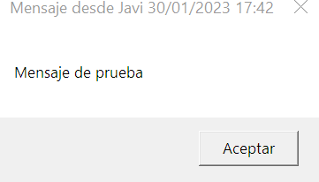

```tip
Para programar acciones básicas desde la consola se puede llevar a cabo utilizando el comando **AT**.
```

Junto con el parámetro */interactive* a las 20:00 nos aparecerá un mensaje que nos dirá que son las 8 de la Noche.

        AT 20:00 /interactive MSG * Son Las 8 de la noche


💡 El comando AT está en desuso, pero nos puede seguir siendo útil para cosas sencillas.

## Comodines consola CMD

En la consola existen **comodines** universales que permiten especificar grupos de:

-   archivos.
-   directorios (carpetas)
-   archivos y directorios.

cuyos nombres tengan uno o más caracteres en común.

| **Comodín** | **Descripción uso**                                 |
|-------------|-----------------------------------------------------|
| **\***      | Representa a cero, uno o más caracteres cualquiera. |
| **?**       | Representa a un sólo carácter cualquiera.           |

Sintaxis de ejemplo:

        DIR a\*
        MOVE progr?m?.exe programas 
        DIR archivo?.txt

-   Mostrar todos los archivos y cuyos nombres comienzan por **a**:

        C:> DIR a*

-   **Mover** todos los archivos que tengan extensión **.exe** al directorio PROGRAMAS:

        C:> MOVE *.exe PROGRAMAS 

-   **Mostrar** todos los archivos que comienzan por **a** y terminan por **a** con la extensión **.txt**:

        C:> DIR a*a.txt 


-   **Copiar** las imágenes **jpg** a un directorio BACKUP en la **unidad D**:

        C:> COPY *.jpg D:\BACKUP

-   **Copiar** todos los archivos y subdirectorios al directorio BACKUP:

        C:> XCOPY *.* D:\BACKUP /S

## Atributos del sistema

```tip
En el entorno de consola de comandos de Windows (CMD), para visualizar los atributos de archivos se utiliza el comando **ATTRIB**. 
```


| **Letra** | **Atributo** | **Traducción** | **Descripción**                                                                        |
|-----------|--------------|----------------|----------------------------------------------------------------------------------------|
| A         | De archivo   | *Archive*      | Se asigna por defecto, tipo de archivo común.                                          |
| R         | Sólo lectura | *Read Only*    | Un directorio o archivo con este atributo sólo se podrá leer, ni modificar, ni borrar. |
| H         | Oculto       | *Hidden*       | Archivo o directorio oculto.                                                           |
| S         | De sistema   | *System*       | Archivo especial del sistema operativo; oculto y de sólo lectura.                      |
| I         | Indexado     | *Index*        | Archivo indexado especial.                                                             |

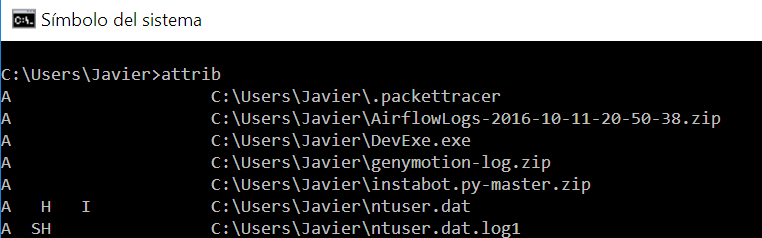 

Los archivos tienen varios **atributos**, usados habitualmente como hemos visto y usan el comando **ATTRIB**.

Sintaxis del comando:

-   Para añadir un atributo se usa **+**
-   Para quitar un atributo se usa **─**

        ATTRIB +- atributo archivo [/S] [/D]
        ATTRIB /S (Procesa archivos que coinciden en la carpeta actual y todas las carpetas)
        ATTRIB /D (Procesa solo carpetas)

Por ejemplo:

        ATTRIB +A fichero.txt
        ATTRIB +H *
        ATTRIB +SH *.jpg


## Redireccionamiento

Antes de continuar con las tareas de **administración** de Windows, vamos a ver herramientas útiles y conceptos de la consola como el **redireccionamiento**.

-   Todos los programas que procesan datos de entrada tienen un dispositivo de **entrada**.

-   Similarmente todos los programas que visualizan datos tienen un dispositivo de **salida**.

Por defecto el dispositivo de entrada es el <u>teclado</u> y el dispositivo de salida el monitor o <u>pantalla</u>.

Para poder redireccionar la entrada y la salida en la consola CMD utilizaremos los siguientes símbolos después del correspondiente comando:

        <  Redirección de la entrada
        >  Redirección de la salida
        >> Redirección de la salida y adición a un fichero.


## Redireccionamiento de salida

Por ejemplo para redirigir la **salida** del comando DATE podríamos crear un fichero de texto que se llamara *FECHA.TXT* y cuyo contenido es una única línea usando **\>**

💡 Si el fichero ya existiera se **sobrescribiría** su contenido.

        C:> DATE > FECHA.TXT


Si quisiéramos **añadir contenido** a ese mismo fichero existente sin sobreescribir nueva información, como por ejemplo con la hora usaríamos **\>\>**

        C:> TIME >> FECHA.TXT

El redireccionamiento es útil para guardar la información devuelta por los comandos que usemos, o en un fichero de procesamiento por lotes y que podría guardarse en un fichero de registro o **log**.

        C:> DIR >> REGISTRO.LOG


## Redireccionamiento de entrada

El otro tipo de direccionamiento es el de **entrada**. Por ejemplo, para redirigir la entrada del comando DATE podríamos crear un fichero de texto que se llamara *FECHA.TXT* y cuyo contenido es una única línea:

        01/02/2022

A continuación ejecutamos el comando DATE redirigiendo su entrada de la siguiente forma usando **\<**

        C:> DATE < FECHA.TXT

El comando leería el contenido del fichero de texto y modificará la hora del sistema sin pedirla por teclado.

## Búsqueda de textos

```tip
Para buscar una cadena de caracteres dentro de un fichero se utiliza el comando **FIND**.
```

Este comando recibe como entrada datos dispuestos en filas y devuelve aquellas filas que contienen la cadena de caracteres que se ha especificado en la orden.

Su sintaxis:

FIND [parámetros] "cadena" fichero

Donde parámetros puede ser:

    /V: Muestra todas las líneas que no contienen la cadena.
    /C: Muestra sólo el número de ocurrencias que contienen la cadena.
    /I: No distingue mayúsculas y minúsculas.
    /N: Muestra las líneas de texto con la cadena y los números de esas líneas

```warning
Cuidado porque este comando es sensible a mayúsculas y minúsculas, con lo que no será lo mismo “*cadena*” que “*CADENA*”.
```

Ejemplos:

    FIND "azul" C:\Users\Javier\colores.txt

    FIND "javier" *.txt

    FIND "a*r" listado.txt

    FIND "javier" fichero.txt /V

💡 Recuerda que para salir de cualquier fichero bat en ejecución debes de presionar *Ctrl+C*

Una mejora de este comando es el comando *FINDSTR*.

----

| **Operaciones (Acciones)**                     | **Comando CMD**  |
|------------------------------------------------|------------------|
| Borrar pantalla consola                        | CLS              |
| Fecha y hora                                   | DATE/TIME        |
| Ayuda comandos                                 | HELP o /?        |
| Salir de la consola                            | EXIT             |
| Ver el contenido de un directorio              | DIR              |
| Crear directorios                              | MD o MKDIR       |
| Cambiar de directorio                          | CD o CHDIR       |
| Ver el árbol de directorios                    | TREE             |
| Copiar archivos                                | COPY             |
| Copiar archivos y subdirectorios               | XCOPY o ROBOCOPY |
| Cambiar el nombre de archivos y directorios    | REN o RENAME     |
| Mover archivos y directorios                   | MOVE             |
| Eliminar archivos                              | DEL o ERASE      |
| Eliminar directorios                           | RD o RMDIR       |
| Visualizar/modificar atributos                 | ATTRIB           |
| Comparar contenido ficheros                    | FC               |
| Visualizar el contenido de un fichero de texto | TYPE             |
| Búsqueda de textos                             | FIND             |
| Apagar o reiniciar el equipo                   | SHUTDOWN         |
| Lanzar una ventana con un mensaje              | MSG              |
| Redireccionamiento                             | \> , \>\>, \<    |


## Filtro MORE

```tip
Los filtros o tuberías son utilizados también a menudo después de un comando usando para ello el símbolo de tubería |
```

El filtro **MORE** recibe como entrada un listado o archivo de texto organizado en filas y devuelve como salida ese mismo texto introduciendo cada 23 filas una línea con los caracteres “-- Más --

Es decir, cuando el dispositivo de salida es el monitor, el filtro MORE pagina un archivo de texto de forma que pueden verse 23 líneas en cada pantalla o el largo de la ventana. Un ejemplo:

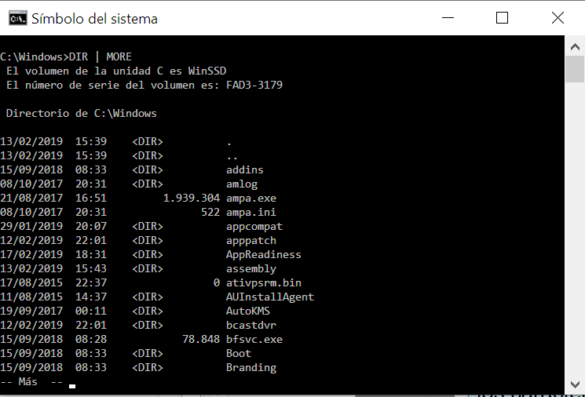

## Filtro SORT

```tip
El filtro **SORT** recibe, igual que MORE, un conjunto de datos organizados en filas y los ordena.
```

**SORT** devuelve los datos ordenados según el primer carácter de cada fila. La ordenación se realiza en base al código ASCII. La ordenación es literal. El espacio en blanco es anterior a los números, y éstos a cualquier letra. 

```warning
SORT no distingue entre mayúsculas y minúsculas ni entre letras acentuadas y letras sin acentuar.
```

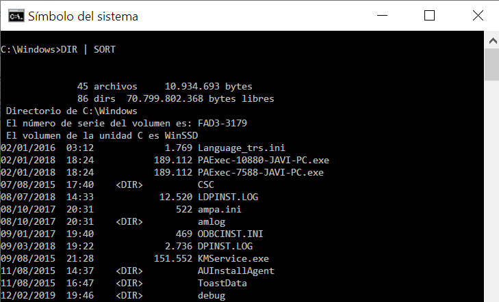Ejemplos:

También se puede utilizar **SORT** como comando independiente.

💡 SORT tiene un parámetro para ordenar columnas respecto a un fichero de texto, indicando en este caso la posición de la columna por la que queramos ordenar usando para ello el parámetro **/+n**

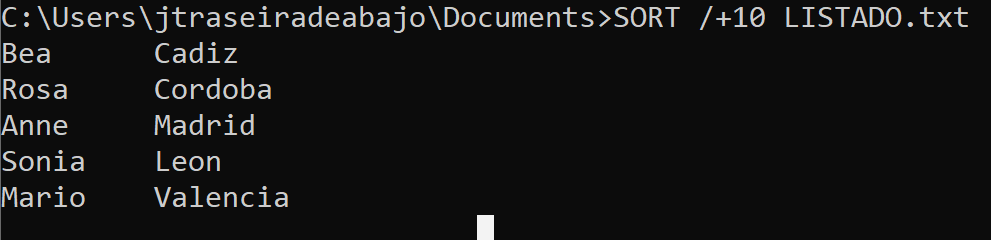

## Ficheros procesamiento por lotes

```tip
> 💡 Un fichero de **procesamiento por lotes** es un archivo de texto plano guardado con la extensión **.bat**, que contienen un conjunto de **comandos** de consola separados en distintas líneas.
```

Cuando se ejecuta este archivo .bat (escribiendo su nombre directamente en el CMD o haciendo doble clic desde el explorador), sus comandos contenidos serán ejecutados uno a uno de forma secuencial, permitiendo automatizar diversas tareas repetitivas, como por ejemplo tareas de mantenimiento del sistema. Los veremos más adelante en profundidad .

        @ECHO OFF
        ECHO Cuando pulses cualquier tecla se borrará el contenido de la consola
        PAUSE
        CLS
        EXIT


Se pueden crear fácilmente ficheros .bat desde un editor como el bloc de notas, guardándolos con extensión *.bat*

**Caso práctico de ejemplo:**

Supongamos que queremos guardar todo el contenido de nuestra carpeta de **Mis Documentos** en una carpeta del **disco duro externo** que nos acabamos de comprar. Repetiremos dicha operación cada cierto tiempo.

Lo primero de todo sería crear un fichero de procesamiento por lotes dentro del directorio o carpeta de usuario de documentos de nuestro usuario (C:\\users\\usuario\\documents). Lo llamaremos por ejemplo copiaseg.bat y desde el bloc de notas introduciremos los comandos:

        @ECHO OFF
        ECHO Presione cualquier tecla para comenzar
        PAUSE
        ECHO Procediendo a la copia de seguridad…
        XCOPY *.* D:\COPIASEGURIDAD\ /Y

A continuación, podríamos crear una tareaen el editor de tareas referido al fichero.
