# UT8.1 Administración de Windows: procesos, servicios y tareas

## Contenido y debate introductorio

<iframe width="560" height="315" src="https://www.youtube.com/embed/FMENyzjejt8" title="YouTube video player" frameborder="0" allow="accelerometer; autoplay; clipboard-write; encrypted-media; gyroscope; picture-in-picture; web-share" allowfullscreen></iframe>

## Administrador de tareas

```note
💡 El **administrador de tareas** es el programa que nos va a permitir gestionar las aplicaciones, procesos, usuarios y servicios que se están ejecutando actualmente en el equipo. Su uso más habitual es para cerrar un programa que no responde y supervisar el **rendimiento** del equipo a través de la memoria, red y otros recursos.
```

Para iniciar el Administrador de tareas:

-   Presionar *Ctrl+Alt+Supr* y luego en Administrador de tareas o *Ctrl+Shif+Esc*
-   Hacer clic con el botón secundario en la barra de tareas y, después en Administrador de tareas.
-   Botón derecho sobre el icono del botón inicio.
-   Comando *taskmgr.exe*

> Expandir la información mostrada haciendo clic en <u>más detalles</u>

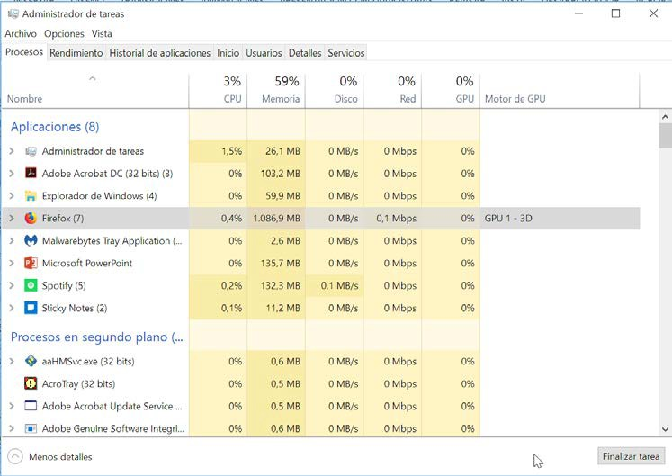

La información mostrada por el administrador de tareas puede ampliarse marcando más columnas de para ver información como el *PID*, Estado... Haciendo clic sobre cada proceso podemos conocer información adicional desde *propiedades.*

A veces algunas partes de Windows no están respondiendo (barra de tareas, explorador..) mientras que otras aplicaciones funcionan bien. El administrador de tareas permite cerrar esos procesos, aunque a veces es suficiente con **reiniciar** la aplicación.

Antes de cerrar o reiniciar una aplicación o programa se puede utilizar desde la pestaña **detalles** la función “**analizar cadena de espera**

### Rendimiento

La pestaña **rendimiento** muestra en tiempo real información sobre el porcentaje de uso a lo largo del tiempo de los componentes internos de hardware clave que utiliza el equipo como la CPU, la memoria, los discos duros, la red o la gráfica (GPU)

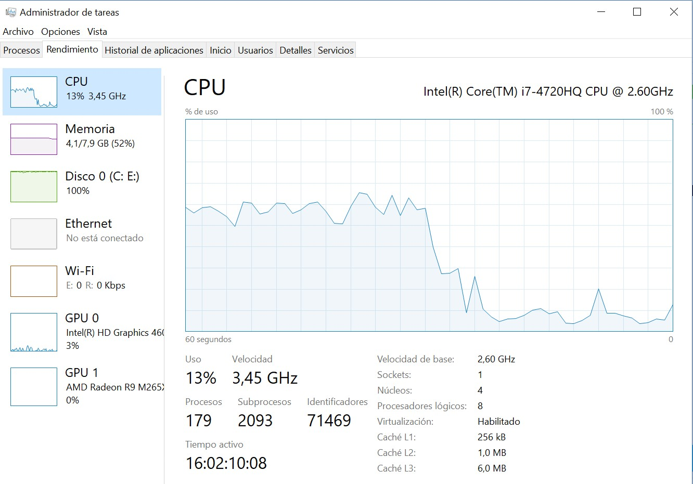

El **monitor de recursos** del administrador de tareas se abre desde la pestaña **rendimiento**. Esta herramienta avanzada de análisis no sólo proporciona una visión general los procesos en sino que tiene varias herramientas para supervisar el rendimiento del sistema y cómo se asignan los recursos (*CPU, Memoria, disco, Red, GPU...*).

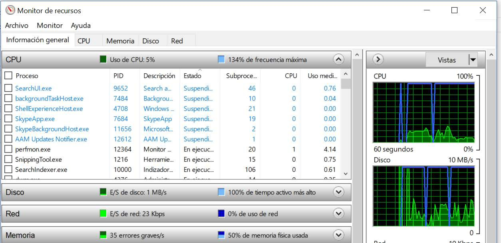

### Procesos de inicio

Desde la pestaña **inicio** del administrador de tareas, al igual que en msconfig, se visualizan la lista de programas que se cargan o inician de forma automática del usuario actual al inicio de Windows. Se pueden deshabilitar y ver su impacto en tiempo de inicio.

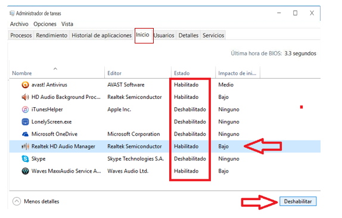

## Servicios

```note
💡 Los servicios son programas que son iniciados por el propio sistema operativo sin que intervenga el usuario y son necesarios para el funcionamiento correcto del SO.
```

Estos programas se inician en cuanto arranca el equipo sin que sea necesario que se valide ningún usuario ejecutándose en segundo plano.

Para acceder a los servicios de Windows se puede hacer desde el *administrador de equipos* en el apartado *Servicios y aplicaciones* o ejecuntado **services.msc**

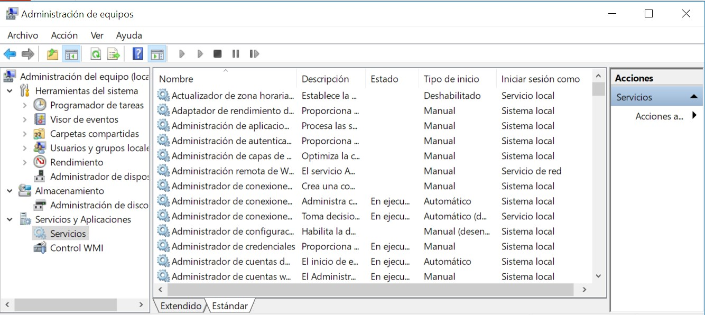

💡 Desde la pestaña **servicios** del administrador de tareas también se puede visualizar el listado completo de servicios así como su estado actual (detenido o en ejecución).

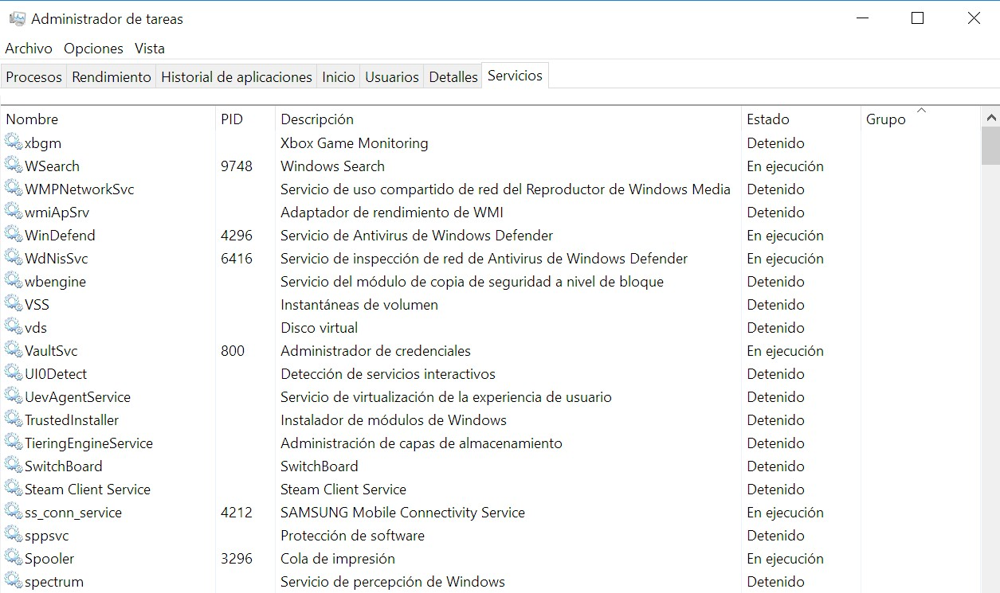

La herramienta de servicios muestra un listado de los procesos junto con su descripción, el tipo de inicio y otras características. Además de permitir la consulta, también se pueden iniciar o desactivar los servicios que se ejecutan en Windows.

Listado de algunos servicios y su función en Windows:

-   Servicios de Escritorio remoto - TermService, - SessionEnv, - UmRdpService
-   Registro remoto - RemoteRegistry: Modificar registro a usuarios remotos.
-   Windows Search - WSearch: Indexa los archivos para hacer búsquedas con rapidez.
-   Servicio del Reproductor de Windows Media - WMPNetworkSvc: Comparte las bibliotecas del Reproductor de Windows Media con otros dispositivos.
-   Parental Controls - WPCSvc: Control parental.
-   Archivos sin conexión - CscService: Realiza actividades de mantenimiento en la caché de archivos sin conexión.
-   Agente de Protección de acceso a redes - napagent: Administra información de los equipos de una red.
-   Net Logon - Netlogon: Autentica usuarios y servicios.
-   Servicio del iniciador iSCSI de Microsoft – MSiSCSI
-   Servicio de compatibilidad con Bluetooth.
-   Servicio de detección automática de proxy web WinHTTP – WinHttpAutoProxySvc.
-   Servicio Informe de errores de Windows.

### Tipos de inicio

Los servicios tienen tres **tipos de inicio** configurables en general:

-   **Automático**: el servicio comienza en el inicio del sistema.
-   **Automático (en diferido**): el servicio se inicia poco después de que el sistema haya terminado de arrancar. Esta opción se introdujo en Windows Vista para reducir el tiempo de arranque del escritorio.
-   **Manual**: el servicio se inicia sólo cuando se le llame explícitamente.
-   **Desactivado**: El servicio está deshabilitado. No va a funcionar.

    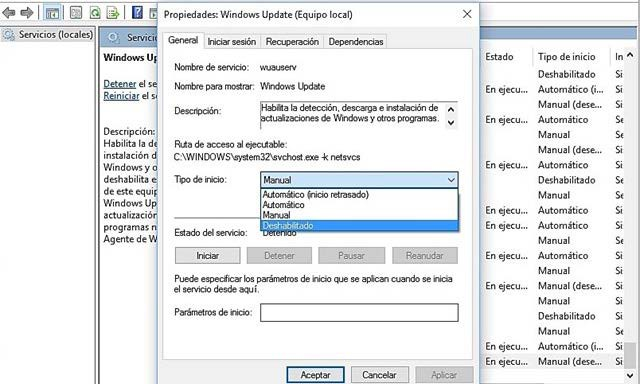


## Variables de entorno

```note
💡 Una variable es una letra o cadena de caracteres que contiene valores, que pueden variar en cualquier su valor y utilizados por el sistema operativo para determinadas tareas.
```

Una **constante** en cambio es una letra o cadena de caracteres que contiene valores que no pueden variar, es decir que su valor será siempre el mismo.

Ejemplos:

    DATOS= 5 
    PI=3.1416 
    E= 3.81
    DATOS=”ENTORNO WINDOWS” 
    USUARIO=”JAVIER”

Los SO Windows definen las variables de entorno siempre en mayúsculas.

```note
💡 Las variables de entorno son cadenas que contienen información acerca del entorno para el sistema y el usuario que haya iniciado sesión en ese momento.
```

Las variables de entorno se crean por la necesidad de acceder al contenido de valores dinámicos, distintos en cada sistema, son parámetros preestablecidos a rutas, valores o aplicaciones que cambian según el entorno, equipo o sistema o el usuario que los utilice.

Existen dos tipos de **variables de entorno**:

-   **Variables del sistema**: variables utilizadas de forma global por el sistema operativo y sus componentes.
-   **Variables de usuario**: Entorno personal del usuario actualmente logueado (scripts, ficheros por lotes).

La ruta local del directorio personal será diferente en cada equipo, porque incluye el nombre del usuario que difiere en cada ocasión.

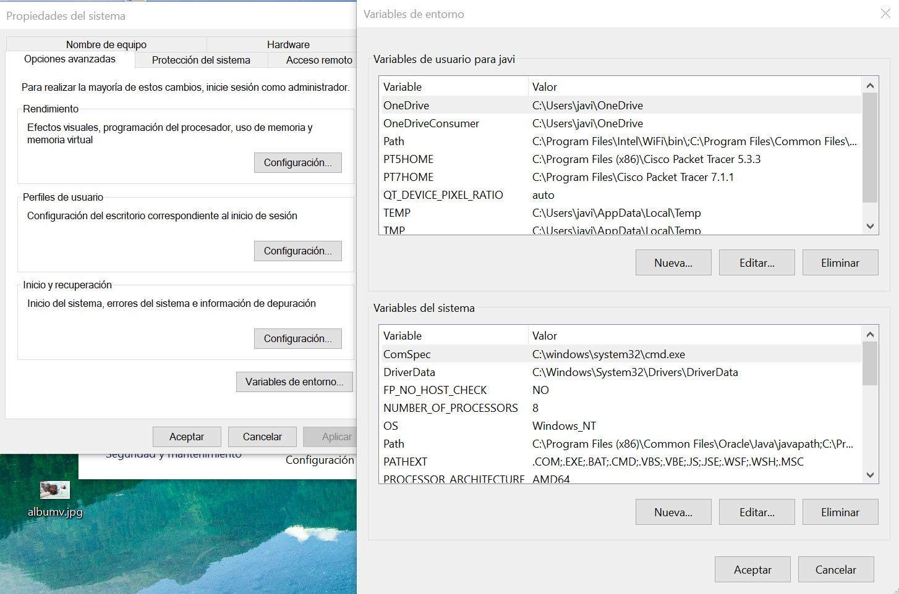En el Shell gráfico de Windows: *Este equipo (botón derecho) \> Propiedades \> Configuración avanzada del sistema \> Variables de entorno*.

Para visualizar dichas variables desde la consola CMD de Windows se utilizará el comando **SET**, el cual también podrá utilizarse para asignar nuevas variables necesarias y que veremos más adelante.

### Variables de entorno en CMD

```tip
Para visualizar las variables de entorno del sistema se utiliza el comando **SET**.
```

Para asignar una nueva variable de entorno se utilizará: SET nombrevariable = “valor”

        C:> SET TIEMPO=60


Para asignar el nombre de una variable mostrando justo antes un mensaje al usuario se utilizará **SET /P** nombrevariable = Introduzca el valor:

        C:> Introduzca el valor: _


Para realizar **operaciones aritméticas** se utilizará **SET /A**

        C:> SET /A resultado=2+3
        C:> 5


## Comandos de procesos

```tip
Los procesos también pueden administrarse también desde la consola de Windows. Para ello se utiliza el comando **TASKLIST**
```

Si se usa sin ningún parámetro muestra una **lista** similar a la que aparece en la pestaña *Procesos* del *Administrador de tareas* con el nombre del proceso, el PID y la memoria usada.

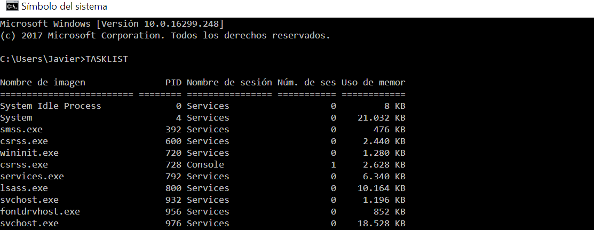

Para **cerrar** un proceso o tarea puede hacerse utilizando el comando **TASKKILL** con la siguiente sintaxis: TASKKILL /PID numeroPID o TASKKILL /IM notepad.exe

        C:> TASKKILL /PID 792 

## Comandos de información

En Windows tenemos disponible un poderoso comando llamado **WMIC** que es otra alternativa para obtener información del equipo y del SO mediante la línea de comandos. Algunos ejemplos de su utilización:

-   Información sobre la CPU:

        C:> WMIC /output:fichero.txt CPU get /all /format:LIST


-   Información sobre sistema:

        C:> WMIC /output:fichero.txt NICCONFIG get /all /format:LIST

-   Información sobre discos:

        C:> WMIC /output:fichero.txt DISKDRIVE get /all /format:LIST

-   Información sobre todos los programas instalados:

        C:> WMIC PRODUCT GET NAME

## Comandos de servicios 

```tip
Para visualizar el listado de servicios activos desde la consola de comandos se utiliza el comando **NET START\|STOP\|PAUSE**
```

-   Para ver los servicios iniciados en el sistema actualmente:

        NET START

-   Para detener un servicio activo:

        NET STOP nombreservicio

-   Para pausar un servicio:

        NET PAUSE nombreservicio

-   Ver estado de un servicio:

        SC INTERROGATE nombreservicio


## Programación de tareas

En todos los sistemas operativos es posible **automatizar** la ejecución de determinadas tareas o procedimientos. Esta automatización responde a la necesidad que pueda tener un usuario de realizar periódicamente alguna acción, como una copia de archivos, una limpieza de disco, una copia de seguridad, etc.

Para abrir el programador de tareas se puede buscar desde el menú inicio como tal o desde el menú de **herramientas administrativas.**

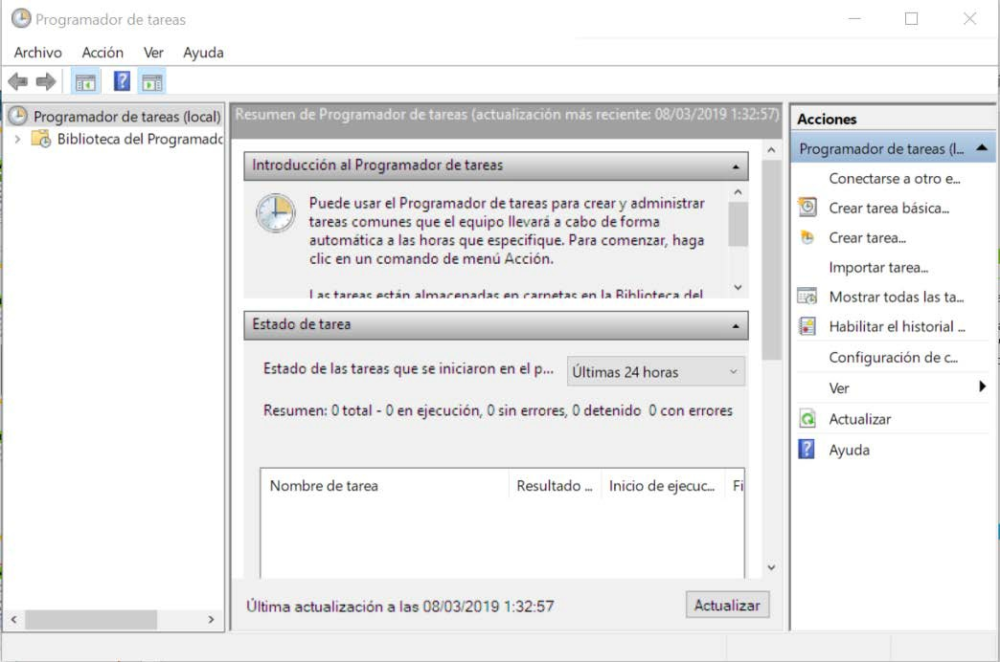 

Ver el listado completos de tareas en tu sistema Windows:

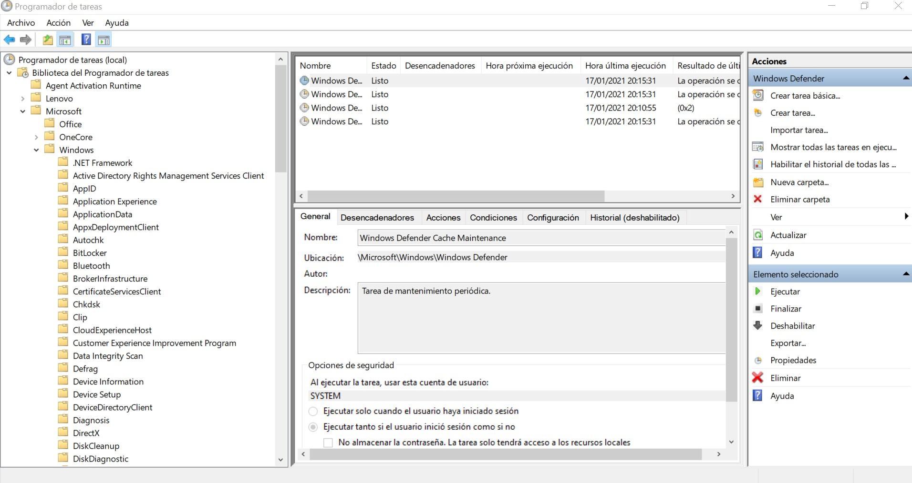

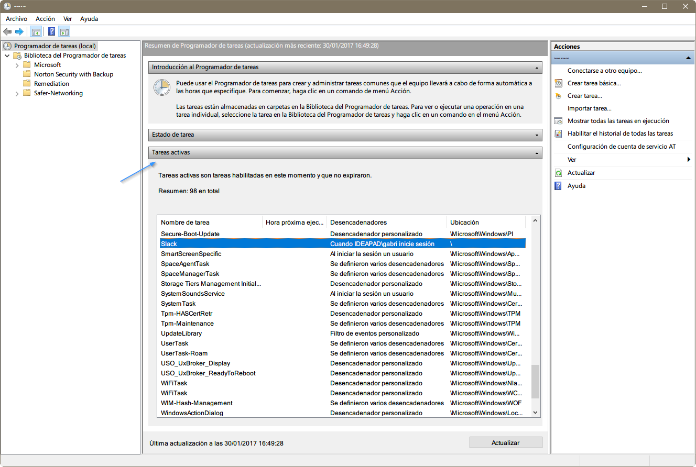

### Tareas básicas

Para crear una tarea sencilla se debe hacer clic en **Acción** y en **Crear tarea básica**.

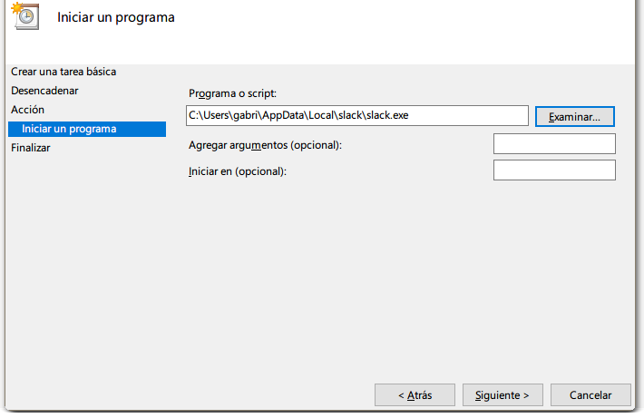

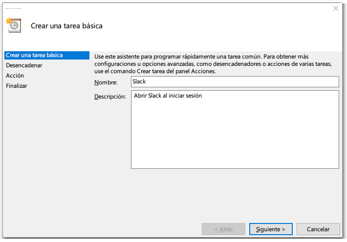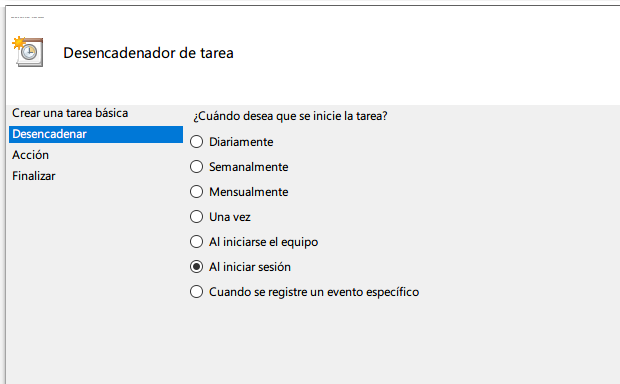

### Tareas avanzadas

La opción **crear tarea** es más avanzada, no tiene asistente y permite crear la tarea desde el panel de propiedades y cinco pestañas para la configuración completa de una tarea:

-   General
-   Desencadenador
-   Acciones
-   Condiciones
-   Configuración

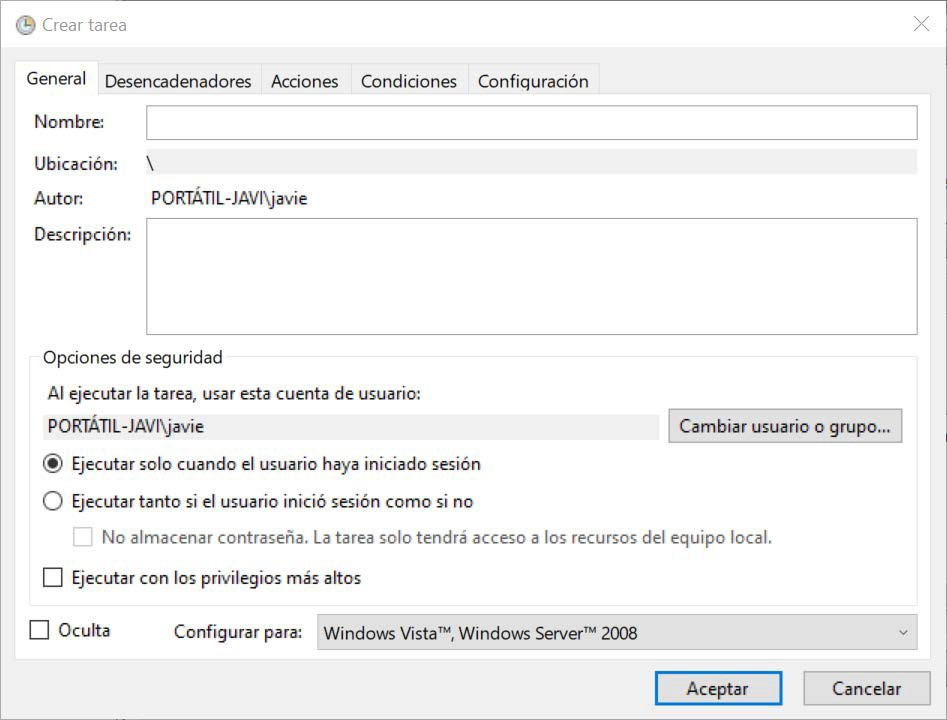

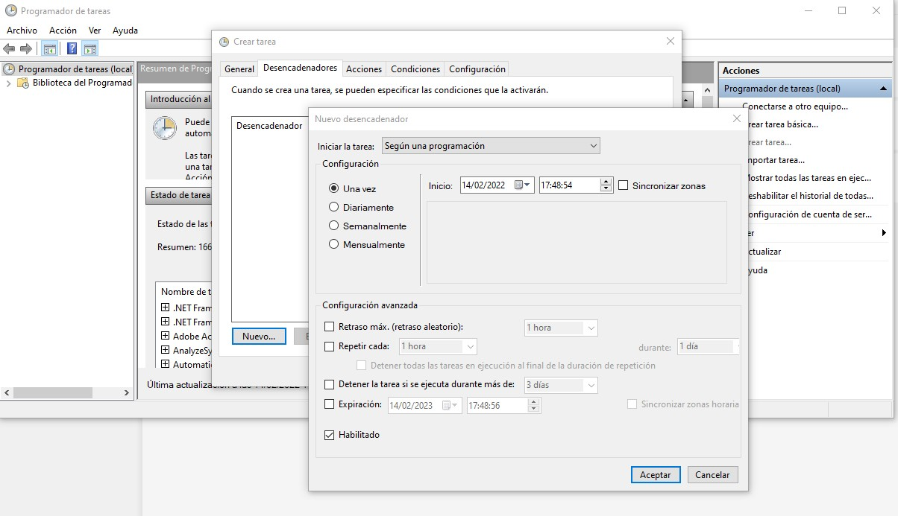

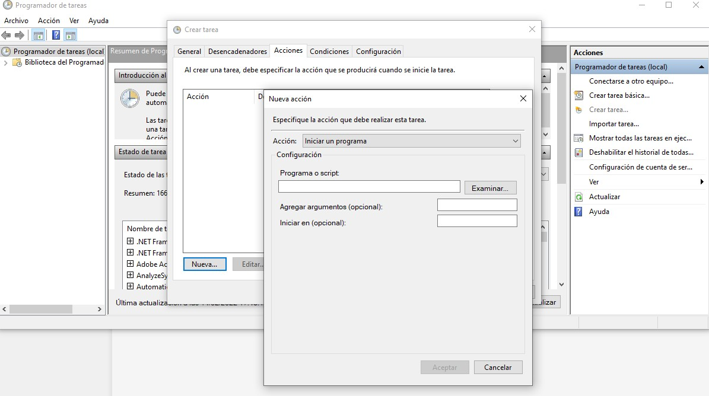


El programador de tareas es más complejo de lo que parece a simple vista ya que hace uso de un concepto denominado **desencadenadores de eventos.**

Un desencadenador es un evento del sistema que al detectarse permite que una tarea sea ejecutada. Algunos de los desencadenadores son:

-   Al iniciar sesión
-   Al producirse un evento
-   Al bloquear el equipo
-   Al crear o editar una tarea
-   Al iniciar el sistema

También se pueden agregar tareas programadas desde la línea de comandos CMD si desea incluirlas en una secuencia de comandos mediante el comando **schtasks** junto con los parámetros para indicar cuándo debe programar la tarea.

Por ejemplo, si quisiera ejecutar "notepad.exe" todos los miércoles a la 1:00 pm, podría usar el siguiente comando:

        SCHTASKS /CREATE /TN OPENNOTEPAD /TR NOTEPAD.EXE /SC WEEKLY /D WED /ST 13:00:00
