# UT9.1 Administración de Windows: Redes

## Redes en Windows

💡 Los **requisitos hardware** necesarios para instalar una red Windows son muy básicos. Cada equipo contará con uno o más adaptadores de red (*máximo 4*), y tendremos que disponer del cableado y los componentes hardware específicos para que los equipos se puedan comunicar entre ellos.

Para poder integrar nuestro equipo en una red, es necesario tener en cuenta algunas consideraciones previas:

-   El **nombre de cada equipo** de la misma red física tiene que ser diferente.
-   La **dirección IP** de cada equipo dentro de una misma red física no puede ser la misma.
-   La **máscara de subred** de los equipos en una misma red física, debe ser, en principio, la misma.
-   Puerta de enlace y un servidor DNS. \*

### Interfaces de red

La configuración global de **redes** para nuestras interfaces de red se centraliza desde el apartado de configuración *Red e Internet*

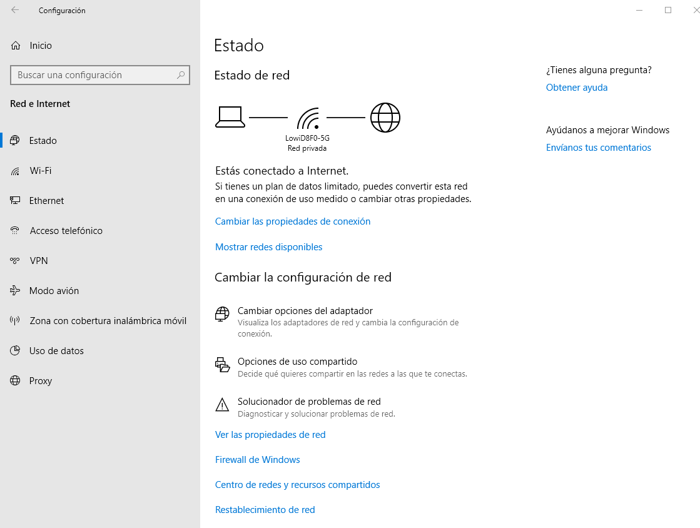

Para acceder directamente a las interfaces de red podremos hacerlo con el comando *ncpa.cpl*

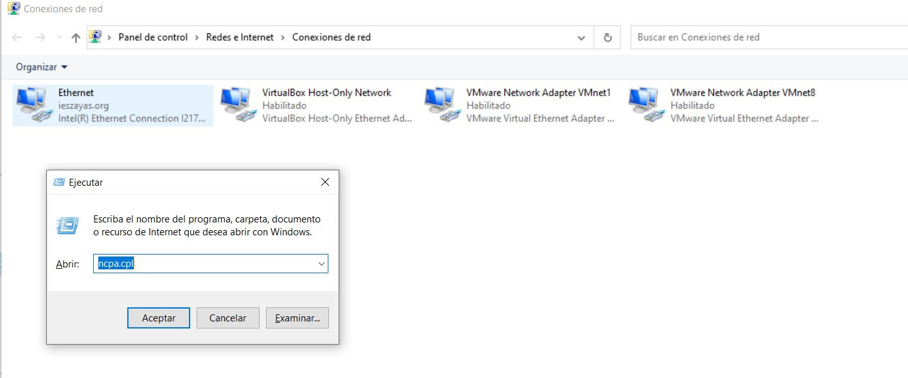

### Centro de redes y recursos compartidos

El **centro de redes y recursos compartidos** es otra interfaz accesible desde el panel de control que agrupa las funciones clave para la administración de la red: su estado, configuración, creación de una nueva conexión y reparación.

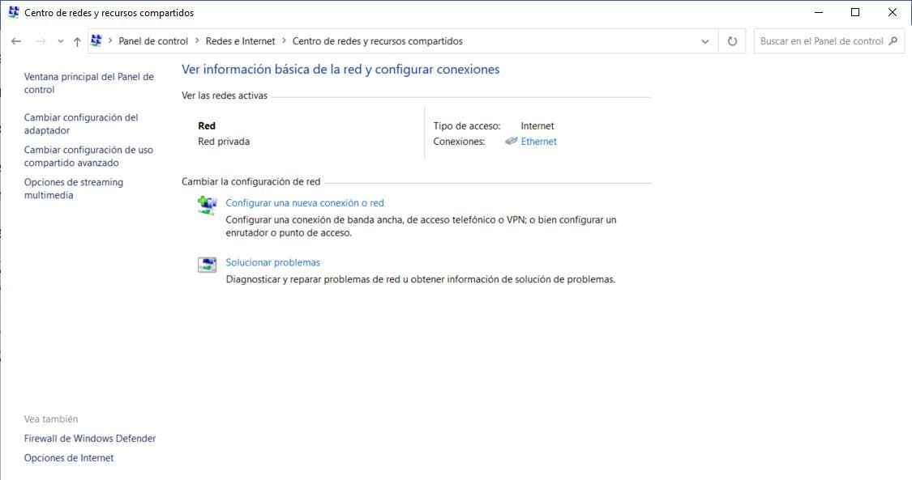

## Configuración de Redes 

### Perfil de red

Windows permite configurar las conexiones de red como **pública** o **privada**. Esta configuración nos permitirá tener una seguridad más o menos elevada.

Si configuramos una red a internet como **pública**, Windows interpretará que dicha conexión no es segura y por lo tanto bloqueará el intercambio de archivos a través de dicha red. Si la configuramos como **privada** se permitirán usar archivos compartidos e impresoras en red.

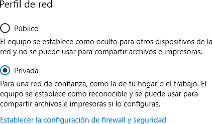

Una red local (*LAN*) como sabemos, se utiliza para conectar diferentes equipos en un área pequeña (como un aula, departamento o habitación) y permitir a sus usuarios compartir recursos así como enviar y recibir archivos.

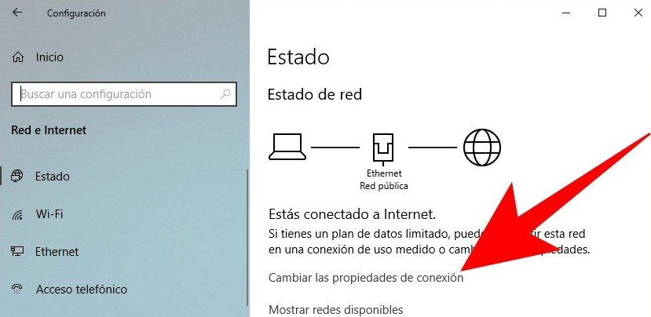

### Creación de una red local 

Para crear una red local seguir los siguientes pasos en cada uno de ellos:

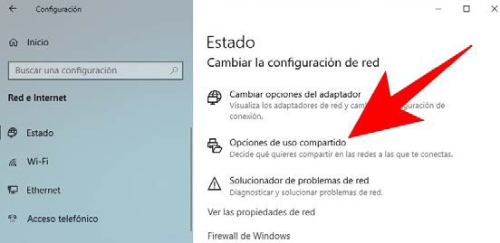

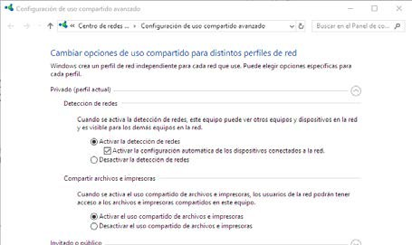

### Nombre del equipo

El **nombre del equipo** se utiliza para identificar un equipo en una red (no confundir con *descripción del equipo*). Se accede desde propiedades del sistema.

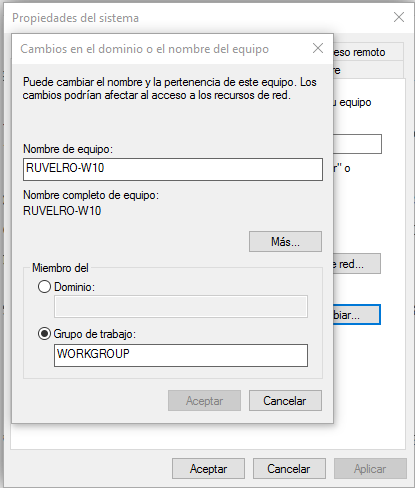

El **nombre del equipo** también se puede cambiar en el apartado *Acerca De* dentro del apartado Sistema en la configuración de Windows.

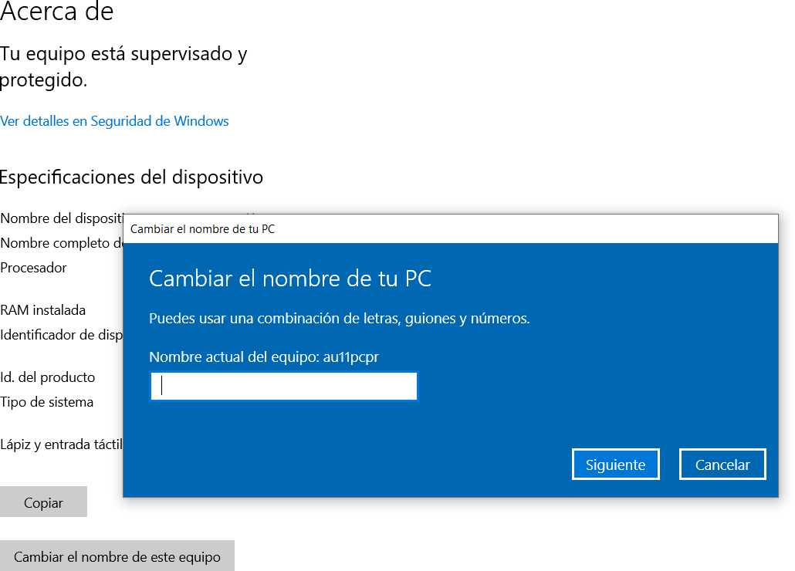

### Grupos de trabajo

```note
💡 Los grupos de trabajo permiten unir diferentes equipos usando grupos lógicos y a partir de allí tener la opción de compartir archivos e impresoras.
```

Las características de un grupo de trabajo son:

-   La relación entre todos los equipos de un grupo de trabajo es de igual a igual, es decir, ningún equipo en el grupo tiene control sobre otro.
-   El número de equipos no debe superar los **20 equipos**, por razones de control y recursos, si pasa de este limite se recomienda un dominio.
-   Con el fin de que los usuarios de un grupo de trabajo estén en la posibilidad de verse entre ellos, todos deben estar en la misma red local.
-   Cada equipo perteneciente al grupo de trabajo debe disponer de su propia cuenta de usuario local.

Para unirnos a un grupo de trabajo basta con **cambiar** el nombre predeterminado de **WORKGROUP** en propiedades del sistema, pero es necesario también que todos los equipos en el grupo de trabajo posean un **nombre de equipo único**.

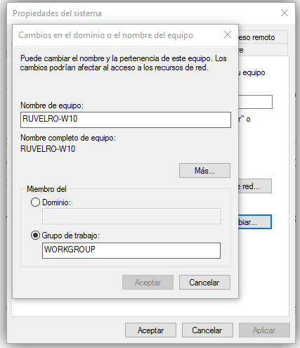

### Dominios

Las redes basadas en **dominios** son comunes en empresas y organizaciones, donde el proceso requiere que varias equipos sean controladas en red a través de un solo nodo llamado servidor de dominio.

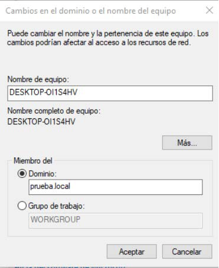

### Dirección IP

Una vez identificados los equipos en la red, tendremos que configurar el protocolo *TCP/ IP* para que los equipos puedan comunicarse entre ellos. Por defecto en Windows siempre que dispongamos de adaptador de red el protocolo TCP/IP, se instalará automáticamente e iniciarán los servicios de red correspondientes.

Es importante antes de nada distinguir entre la IP pública y la IP privada en una red de ordenadores locales:

-   Una **IP privada:** es la que utiliza cada dispositivo dentro de su red local dentro de los siguientes rangos para IPv4:
    -   De 10.0.0.0 a 10.255.255.255 (clase A)
    -   172.16.0.0 a 172.31.255.255 (clase B)
    -   192.168.0.0 a 192.168.255.255 (Clase C)
-   Una **IP pública**: Es la que tendrá asignada cualquier equipo o dispositivo conectado de forma directa a Internet (como nuestro router)

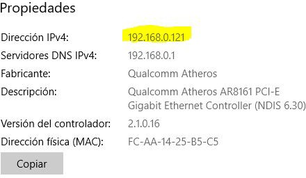

La IP privada de Windows puede verse como sabemos desde el apartado de *Red e internet* en el apartado ver propiedades de red.

La IP privada de las interfaces de red del sistema también puede conocerse a través del comando **ipconfig**:

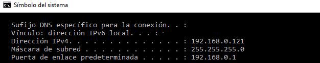

Para conocer más detalles como el nombre del equipo, la dirección MAC, el DNS o el servidor DHCP, se usa el parámetro ipconfig /ALL

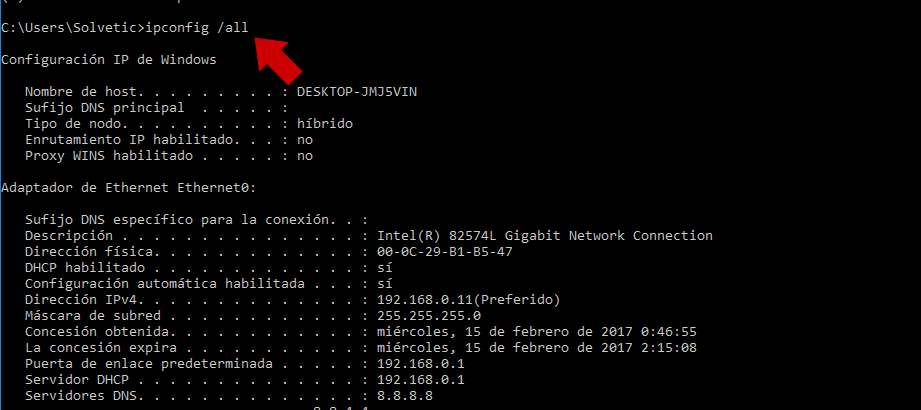

Otro comando para mostrar información de la dirección IP, además de su máscara, puerta de enlace y demás, de una interfaz de red concreta del equipo es **NETSH**

El comando NETSH lo veremos más a fondo a continuación. Una forma de utilizarlo para mostrar la información de la interfaz llamada Ethernet sería la siguiente:

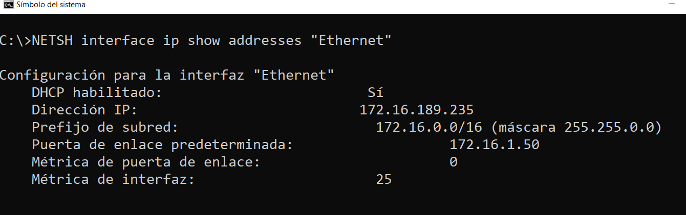

### Configurar IP

Generalmente para la mayoría de configuraciones de red para domésticos se realizan automáticamente, utilizando para ello el protocolo DHCP.

```note
💡 **DHCP** *(Dynamic Host Configuration Protocol)* es un protocolo que permite que un equipo conectado a una red pueda obtener su configuración de red de forma dinámica dentro de una misma red.
```

No obstante, como administradores nos puede interesar más mantener una dirección IP local **estática** para que dichos equipos siempre conserven dicha dirección, por motivos de seguridad, organización y mantenimiento.


La configuración de IP de Windows puede modificarse desde varios sitios como sabemos. Seleccionando la interfaz y luego en cambiar opciones del adaptador haciendo a continuación clic sobre propiedades del protocolo de Internet deseado:

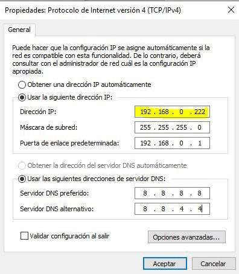

En el apartado Usar la siguiente dirección IP se asignará de forma manual una dirección, siempre dentro del mismo rango de la red y siempre que no esté ya ocupada en dicha red local.

La configuración de máscara de subred, puerta de enlace y dirección de servidor **DNS** pasará en ese momento también a manual.


Se podría empezar, por ejemplo, por la secuencia 192.168.0… *(la 192.168.0.1 suele estar reservada para el router)* seguida de un número entre 2 y 254. Tras guardar los cambios, la IP privada de vuestro PC ya no cambiará aunque reiniciemos el equipo o el router.

## Recursos de una red

El principal motivo por el que crear redes donde hay varios equipos funcionando y utilizar SO en red, es para compartir recursos entre ellos. Las redes dan muchas posibilidades, pero básicamente en un grupo de trabajo lo que se comparten son carpetas y dispositivos tales como impresoras.

Una vez configurada una red podemos utilizarla para trabajar de forma compartida con los **recursos** de los que dispongamos en ella:

-   Archivos
-   Carpetas
-   Impresoras

Para poder **compartir recursos** de un equipo en red y que lo puedan utilizar otros usuarios de dicha red, deberemos comprobar que:

-   Nuestro equipo deberá tener un **nombre diferente** a cualquier otro de la red.
-   Los equipos deberán pertenecer al mismo **grupo de trabajo** o un **Dominio**.
-   La dirección IP de cada equipo de la red local deberá ser distinta y tener todos la misma máscara de subred.
-   El usuario **administrador** de cada equipo deberá contar con contraseña y la cuenta del mismo deberá estar habilitada.

### Compartir carpetas en red

Para poder **compartir recursos** como **carpetas en red** debemos primeramente tener habilitado la **compartición de archivos e impresoras.**

Para ello se deberá acceder desde opciones de uso compartido y habilitar y según el acceso que se le quiera dar a esos recursos:

-   **Privado** (perfil actual): para usuarios identificados dentro de una misma red local.
-   **Invitado o público**: para usuarios dentro de una misma red local no identificados.
-   **Todas las redes**: para usuarios dentro o fuera de una red local.

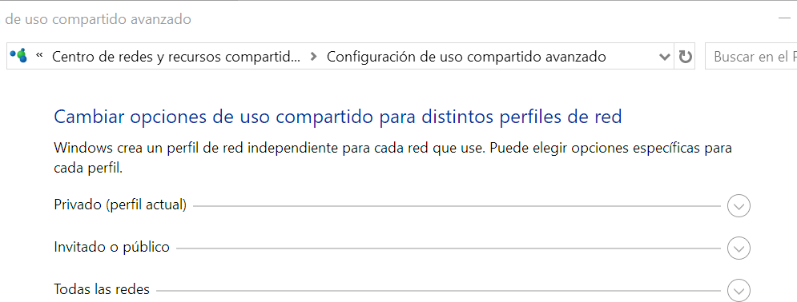

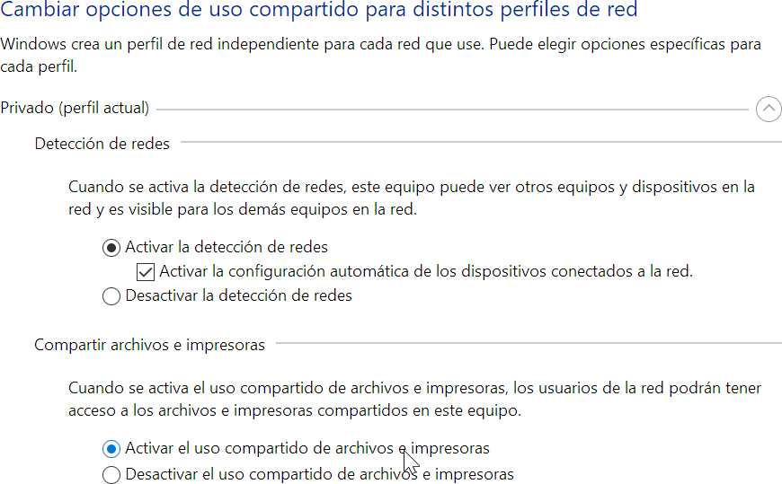

Para **compartir carpetas en red** y los ficheros que contiene, deberemos seleccionamos la carpeta o directorio que deseamos compartir en red y pulsar con el botón derecho del ratón seleccionando la opción de *Conceder acceso \> Usuarios específicos* o dentro de la pestaña *compartir* en *propiedades de la carpeta.*

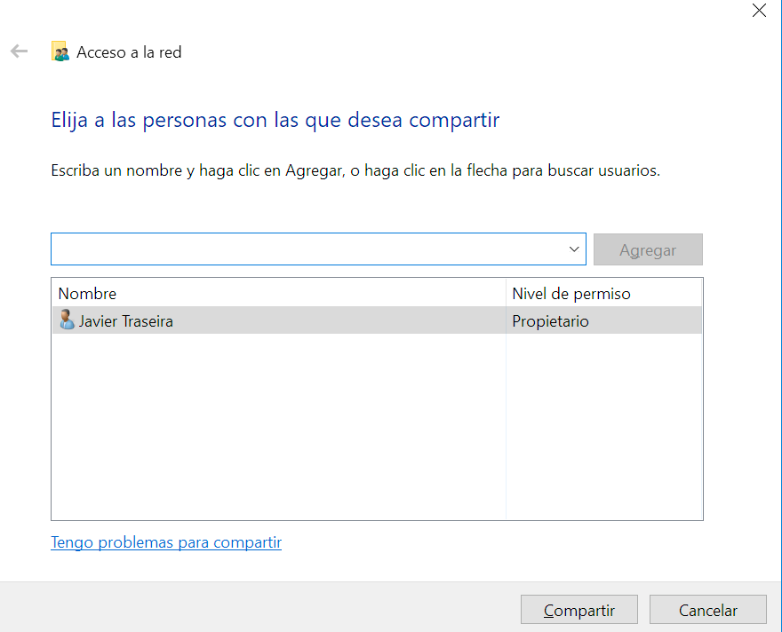

Dentro del cuadro anterior deberemos elegir con que **equipos de nuestra red compartir la carpeta y su contenido**. Se puede compartir el contenido con todos los equipos conectados a nuestra red, seleccionando **Todos y Agregar**. Podemos asignarla dos niveles de permiso: *Lectura o Lectura y escritura.*

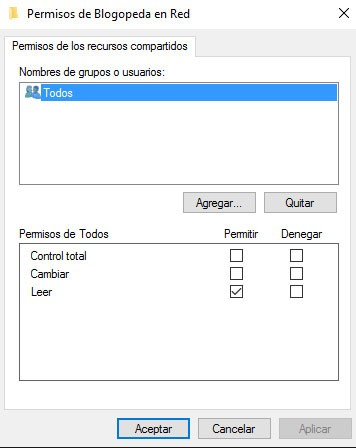

También podemos establecer una serie de permisos a los usuarios que se conecten a la carpeta compartida para según que permiso, tener unas prioridades con los archivos o no.

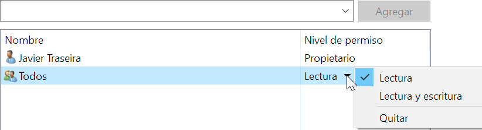

💡 Al acceder a la carpeta compartida Windows pedirá un usuario y contraseña.

Para configurar dicho comportamiento deberemos acceder desde el Panel de Control de nuestro equipo a las opciones del **Centro de redes y recursos compartidos**, y pulsar sobre *Cambiar configuración de uso compartido avanzado.*

Dentro de las opciones que se abren dentro de campo Todas las redes, podemos marcar la opción de **Desactivar el uso compartido con protección por contraseña**. De esta manera evitaremos que Windows solicite un usuario y contraseña cuando intentemos acceder a las carpetas compartidas.

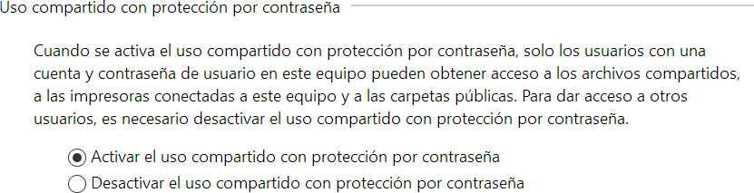

Para compartir carpetas en red desde la línea de comandos utilizaremos el comando **NET SHARE**.

        NET SHARE \<sharename=drive:path\>

Por ejemplo, para compartir una carpeta denominada recurso situada en la unidad C, en la ruta de acceso \\Usuarios\\miNombre, se debe escribir:

        NET SHARE myshare=C:\Users\Myname

Usando el comando sin parámetros nos mostrará los elementos en red compartidos:


### Mapeo elementos de red

Desde el explorador de archivos podemos mapear un recurso compartido desde otro equipo, entrando en *Red\> botón derecho\>Conectar a Unidad de red* e indicando el **UNC** (dirección de recurso de red) al que nos queremos conectar:

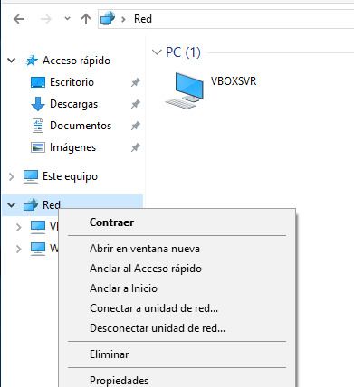
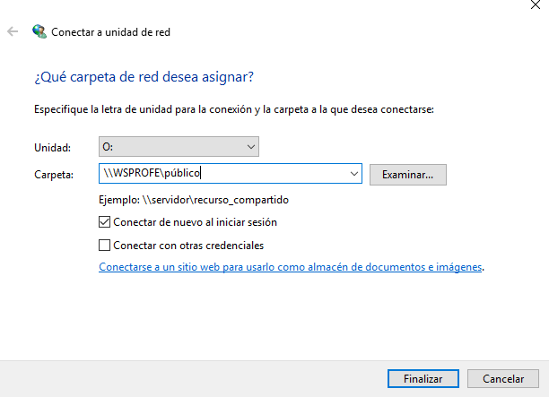

## Comandos de red

### PING

El archiconocido comando sirve para probar el estado de la comunicación del host local con uno o varios equipos remotos accesibles por una dirección IP.

Por medio del envío de paquetes *ICMP*, diagnostica el estado, velocidad y calidad de una red determinada.

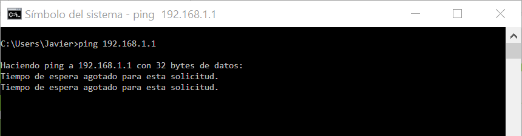

### GETMAC

Obtiene la dirección **MAC** de las interfaces de red del equipo donde se ejecuta. La dirección MAC es un identificador único de 48 bits determinado y configurado por el IEEE y el fabricante (24 bits cada uno).

### IPCONFIG

El completo comando **IPCONFIG** muestra todos los valores de configuración de red *TCP/IP* actuales de las interfaces de red indicadas. También permite reasignar las direcciones dinámicas *DHCP* y del sistema de nombres de dominio o *DNS*. Utilización de sus parámetros:

| **Comando / parámetro**        | **Uso**                                                                          |
|--------------------------------|----------------------------------------------------------------------------------|
| IPCONFIG /all                  | Muestra toda la información disponible en el adaptador o tarjeta de red empleado |
| IPCONFIG /release              | Libera la dirección IP del adaptador especificado                                |
| IPCONFIG /renew                | Renueva la dirección IP del adaptador especificado                               |
| IPCONFIG /displaydns           | Muestra el contenido de la caché de resolución DNS                               |
| IPCONFIG /flushdns             | Vacía la memoria caché de resolución DNS                                         |
| IPCONFIG /registerdns          | Actualiza todas las concesiones DHCP y vuelve a registrar los nombres DNS        |
| IPCONFIG /showclassid          | Muestra todas las identidades (ID) permitidos para este adaptador                |
| IPCONFIG /setclassid           | Modifica el identificador de clase                                               |
| IPCONFIG /allcompartments /all | Muestra información detallada sobre todos los compartimientos                    |

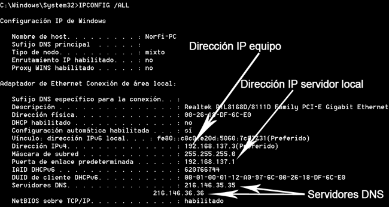

En una red local cuando sea necesario utilizar una dirección IP diferente, utiliza los comandos: *IPCONFIG /RELEASE* y a continuación *IPCONFIG /RENEW*.

Esto solo funciona si se encuentra habilitada la configuración dinámica de host (*DHCP*), es decir que se genera de forma dinámica la dirección IP necesaria.

        IPCONFIG /release *
        IPCONFIG /renew *

Windows almacena la cache de resolución DNS, es decir la relación que existe entre las direcciones IP de sitios visitados y los nombres de dominio, de forma predeterminada 24 minutos. Para mostrarla utiliza:

        IPCONFIG /displaydns

### NSLOOKUP

El comando **NSLOOKUP** se emplea para conocer si el DNS está resolviendo correctamente los nombres y las IPs. También nos permite averiguar la dirección IP detrás de un determinado nombre de Dominio.

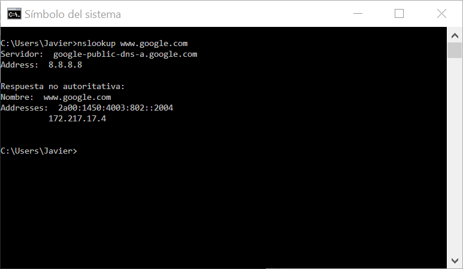

Cuando se hace una consulta mediante NSLOOKUP, aparecen de forma frecuente estos dos términos:

-   **Authoritative Answer:** significa que la respuesta DNS se ha producido desde un servidor DNS que tiene todo el archivo de información disponible para esa zona.
-   **Non Authoritative Answer:** significa que la respuesta DNS se ha producido desde un servidor DNS que tiene en caché una copia de las consultas realizadas para esa zona.

### NETSTAT

Otro potente comando que sirve para mostrar estadísticas de la red y permite diagnósticos y análisis. Por defecto, muestra un listado de las conexiones activas de una computadora, tanto entrantes como salientes. Incluye el protocolo en uso, las tablas de ruteo, las estadísticas de las interfaces y el estado de la conexión.


### TRACERT

Permite conocer los paquetes que vienen desde un host (punto de red). También se obtiene una estadística del RTT o latencia de red de esos paquetes, ofreciendo una estimación de la distancia a la que están los extremos de la comunicación.

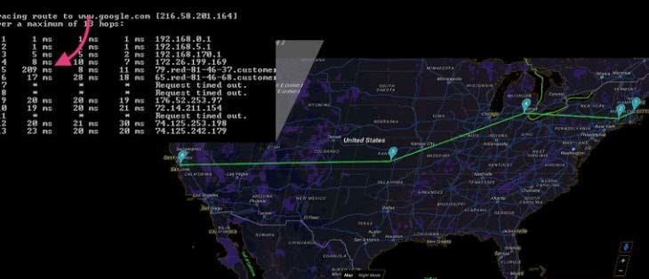

### NETSH

NETSH (*Network Shell*) es una potente herramienta de la línea de comandos de Windows que nos permite consultar, diagnosticar y/o modificar la configuración de la red local o Wifi de nuestro ordenador.

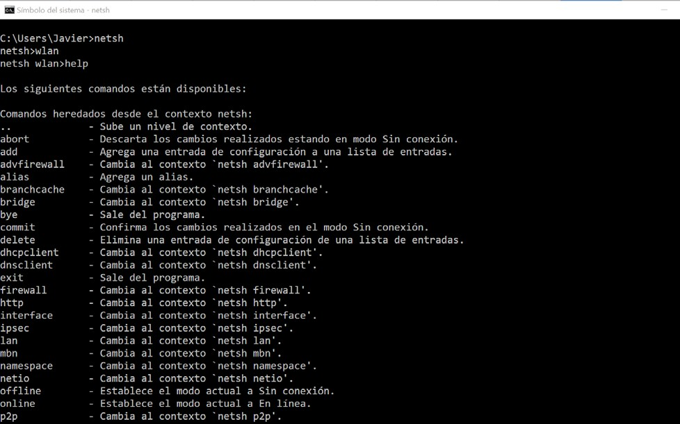

El comando **NETSH** ofrece multitud de opciones a la hora de obtener información sobre la conexión de red, así como configurarla.

-   Para mostrar las estadísticas del protocolo IP:

        NETSH interface ip show ipstats

-   Para ver la relación de direcciones MAC que se corresponden con las direcciones IP de todos los interfaces de red:

        NETSH interface ip show ipnet

-   Para ver los nombres de las interfaces de red de nuestro sistema:

        NETSH interface show interface


---


| **Operaciones (Acciones)**                                                           | **Comando** | **Ejemplo uso**                                                                     |
|--------------------------------------------------------------------------------------|-------------|-------------------------------------------------------------------------------------|
| Nombre del equipo                                                                    | HOSTNAME    | HOSTNAME                                                                            |
| Carpetas compartidas en red                                                          | NET SHARE   | NET SHARE                                                                           |
| Verificar comunicación entre equipos                                                 | PING        | PING 192.168.1.21                                                                   |
| Obtener direcciones MAC                                                              | GETMAC      | GETMAC                                                                              |
| Obtener valores de configuración de interfaces de red y reasignar valores DHCP o DNS | IPCONFIG    | IPCONFIG /RENEW \*                                                                  |
| Conocer si el DNS está resolviendo correctamente los nombres y las IPs               | NSLOOKUP    | NSLOOKUP [www.google.com](http://www.google.com/)                                   |
| Mostrar estadísticas de la red y ver diagnósticos y análisis.                        | NETSTAT     | NETSTAT                                                                             |
| Determina la ruta a un destino especificado                                          | TRACERT     | TRACERT [www.google.com](http://www.google.com/)                                    |
|   Herramienta de **configuración avanzada** de red en línea                          |   NETSH     | NETSH interface ip show  NETSH interface ip set address name="Ethernet" source=dhcp |
