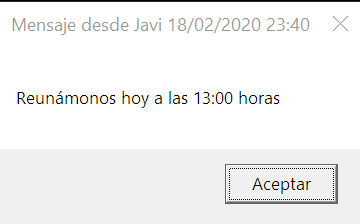

# UT9.2 Ficheros por lotes

## Introducción

```note
Un fichero por lotes es un archivo de texto sin formato que contiene uno o más comandos y tiene una extensión de nombre de archivo .bat.
```

Los *ficheros por lotes*, que también se denominan programas por lotes o scripts, se utilizan para simplificar las tareas rutinarias o repetitivas de Sistemas Operativos Windows. Se pueden crear scripts para otros SO como Linux pero utilizando su propia sintaxis y reglas, que veremos más adelante.

Cualquier editor de texto puede editar archivos por lotes. Se puede usar el bloc de notas predeterminado que se incluye con Windows para editar y ver un archivo por lotes, aunque no ofrece resaltado de sintaxis, para lo cual se recomienda como editor el *Notepad++.*

Cuando se escribe el nombre del fichero en el símbolo del sistema, cmd.exe ejecutará los comandos de forma secuencial a medida que aparecen en el archivo.

Un archivo bat contiene una o varias líneas de comandos en Windows, que se ejecutan secuencialmente (una a una) tal y como ya hemos visto.

-   La primera de ellas suele ser: @ECHO OFF
Es usada para mostrar en la ventana de la consola mientras se ejecuta el fichero batch, solo la información necesaria.

-   A continuación se agregarán los comandos necesarios.
-   Finalmente se puede usar el comando PAUSE, para evitar que se cierre la ventana, de utilidad en muchas situaciones. En ese caso será necesario presionar cualquier tecla para cerrarla.

    Un ejemplo sencillo llamado prueba.bat:

        @ECHO OFF
        ECHO Cuando pulses cualquier tecla se borrará el contenido de la consola
        PAUSE
        CLS
        EXIT


Por ejemplo, supongamos que queremos guardar todo el contenido de nuestra carpeta de **Mis Documentos** en una carpeta del **disco duro externo** que nos acabamos de comprar. Repetiremos dicha operación cada cierto tiempo.

Lo primero de todo sería crear un fichero de procesamiento por lotes dentro del directorio o carpeta de usuario de documentos de nuestro usuario (C:\\users\\usuario\\documents). Lo llamaremos por ejemplo copiaseg.bat y desde el bloc de notas introduciremos los comandos:

        @ECHO OFF
        ECHO Presione cualquier tecla para comenzar
        PAUSE
        ECHO Procediendo a la copia de seguridad…
        XCOPY *.* D:\COPIASEGURIDAD\ /Y


A continuación, podríamos crear una tarea en el editor de tareas referido a dicho fichero.

## Comandos útiles consola CMD

```tip
Para mostrar o cambiar la hora se utiliza **TIME** y para la fecha **DATE**.
```

```tip
Para pausar el contenido hasta presionar una tecla se utiliza **PAUSE**
```

```tip
Si queremos pausar la ejecución durante unos segundos concretos usaremos **TIMEOUT** indicando a continuación los segundos.
```

## Uso de variables con SET

Ya hemos visto en anteriores la existencia de las **variables de entorno del sistema** operativo, pero su utilización en ficheros de procesamiento por lotes puede ser necesaria por diversas razones.

-   Para asignar el valor de una variable utilizaremos **SET variable=valor**
-   Para mostrar el valor de una variables en un fichero .bat se escribirá entre los símbolos % de la siguiente forma: **%variable%**

        @ECHO OFF
        SET NOMBRE=BULBASUR
        SET NIVEL=25
        SET COLORDEPELO=AZUL
        ECHO HOLA ME LLAMO %NOMBRE%
        ECHO SOY DE NIVEL %NIVEL%
        ECHO MI COLOR DE PELO ES %COLORDEPELO%

Mediante archivos bat también podemos realizar operaciones aritméticas como multiplicar, sumar, dividir, etc. usando el modificador **SET /A**, por ejemplo de la siguiente forma hacemos la operación: 2 + 43 = 45.

        @ECHO OFF
        SET numero1=2
        SET numero2=43
        SET /A suma=%numero1% + %numero2%
        ECHO La suma total es %suma%
        PAUSE
        EXIT


Los operadores **aritméticos** matemáticos que podemos utilizar con SET /A son los siguientes:

| **Operador** | **Significado**          |
|--------------|--------------------------|
| **()**       | Agrupación en parántesis |
| **+**        | Suma                     |
| **-**        | Resta                    |
| **\***       | Multiplicación           |
| **/**        | División                 |
| **%%**       | Resto                    |

También podemos requerir al usuario leer una variable por teclado usando el comando **SET** con el parámetro **/P** de la siguiente forma:

        SET /P nombrevariable=[texto_usuario ]

---

        @ECHO OFF
        SET /P nombre=Por favor, introduzca su nombre:
        SET /P apellidos=Introduzca sus apellidos:
        ECHO Buenos dias %nombre% %apellidos%


Podemos usar las variables del sistema que ya conocemos en nuestro ficheros.

| **Variable**   | **Definición**                                                                                                        |
|----------------|-----------------------------------------------------------------------------------------------------------------------|
| %HOMEPATH%     | Directorio por defecto del usuario actualmente logueado.                                                              |
| %APPDATA%      | Directorio oculto donde guardan sus datos las aplicaciones, dentro de la carpeta de usuario.                          |
| %COMPUTERNAME% | Devuelve el nombre del equipo.                                                                                        |
| %ERRORLEVEL%   | Devuelve el código de error del último comando ejecutado.                                                             |
| %HOMEDRIVE%    | Devuelve la unidad en la que está el directorio en el que estás actualmente.                                          |
| %LOCALAPPDATA% | Directorio donde los programas guardan archivos temporales. Generalmente C:\\Users\\NombreDeUsuario\\AppData\\Local.  |
| %PROGRAMDATA%  | Directorio donde los programas almacenan datos, normalmente: C:\\ProgramData.                                         |
| %PROGRAMFILES% | Devuelve la carpeta donde se instalan los programas, normalmente: C:\\Archivos de Programa.                           |
| %RANDOM%       | Devuelve un número al azar entre 0 y 32767.                                                                           |
| %SYSTEMDRIVE%  | Devuelve la unidad que contiene el directorio raíz del sistema, generalmente: C.                                      |
| %SYSTEMROOT%   | Devuelve la carpeta de administración, que suele ser C:\\Windows.                                                     |
| %TEMP% %TMP%   | Estas dos variables contienen la ruta a los directorios donde los programas pueden almacenar sus archivos temporales. |
| %TIME%         | Devuelve la hora actual.                                                                                              |
| %USERNAME%     | Devuelve el nombre del usuario actual.                                                                                |
| %USERPROFILE%  | Devuelve la ruta del directorio donde están los archivos del usuario actual, normalmente: C:\\Users\\NombreDeUsuario. |
| %WINDIR%       | Devuelve la ruta de la carpeta del sistema operativo, normalmente: C:\\Windows.                                       |

## Paso de parámetros

💡 Se puede pasar **parámetros** a los ficheros bat a la hora de llamarlos en la consola. Los valores pasados como parámetros se almacenan en las variables **%1**, para hacer referencia al primer parámetro posicional, **%2** hará referencia al segundo, y así sucesivamente.

        @ECHO OFF
        ECHO Hola
        ECHO El primer parámetro es %1%
        ECHO El primer parámetro es %2%
        ECHO El primer parámetro es %3%

## Etiquetas en ficheros bat
 
La lectura de los ficheros de procesamiento por lotes o Batch es lineal, pero existe una forma para que el Batch se salte líneas, o vuelva a alguna anterior.

Esto se logra con **Etiquetas** y la función **GOTO**.

Las etiquetas también nos sirven para delimitar el código de un fichero. Para crear una etiqueta solo debemos escribir: 

        :NombreEtiqueta

De esta manera el **GOTO** funciona escribiendo GOTO seguido del nombre de la etiqueta, como vemos en el siguiente ejemplo.

        @ECHO OFF
        GOTO :MIETIQUETA
        ECHO ¿Por qué me saltan?
        :MIETIQUETA
        ECHO Hola, esta es la etiqueta y hemos saltado una línea antes
        PAUSE
        EXIT

## Condicional

💡 El **condicional** es un elemento muy útil a la hora de generar archivos de procesamiento por lotes. Se usa **IF** y se puede utilizar para comparar, cadenas, números o para saber si existen archivos.

Ejemplo de sintaxis: 

        IF %cadena1% == %cadena2% OrdenAEjecutar

Que se podría leer de la siguiente manera. Si cadena1 es igual a Cadena2 ejecutaremos la Orden *OrdenAEjecutar*.

También podríamos usar el **IF NOT** para verificar si no son iguales.

        IF NOT %cadena1% == %cadena2% ejecutarAccion

Para saber si un archivo existe, se usa **IF EXIST**:

        IF EXIST "NombreDelArchivo" AccionAEjecutar

O también para ver si NO existe:

        IF NOT EXIST "NombreDelArchivo" AccionAEjecutar

Las **comparaciones** válidas con el comando IF admiten los siguientes operadores:

| **Operador** | **Descripción uso**                                 | **Ejemplos**       |
|--------------|-----------------------------------------------------|--------------------|
| **==**       | Si dos números o variables son iguales              | IF %v1% == %v2%    |
| **GTR**      | Si el primer número es mayor que el segundo         | IF 1 GTR 2         |
| **LSS**      | Si el primer número es menor que el segundo         | IF %opera% LSS 2   |
| **GEQ**      | Si el primer número es mayor o igual que el segundo | IF %op1% GEQ %op2% |
| **LEQ**      | Si el primer número es menor o igual que el segundo | IF 12 LEQ 32       |

Cuando se ejecuta cada una de las sentencias devolverá el valor 0 (correcto) en una variable llamada **ERRORLEVEL**.

Si alguna sentencia tiene algún error o es falsa devolverá un valor distinto de 0.

**ERRORLEVEL** se utiliza también los condicionales:

- IF ERRORLEVEL 0 Si no ha ocurrido ningún error o la sentencia es verdadera.

- IF NOT ERRORLEVEL 0 Si ha ocurrido algún error o la sentencia es falsa.

Ejemplo de un fichero bat que verifica si existen dos **directorios** y si fuera el caso lo borrará con RD. Si algo falla mostrará un error.

        @ECHO OFF
        IF EXIST MODELO73 RD MODELO73 /S /Q
        IF EXIST PRACTICA73 RD PRACTICA73 /S /Q
        MD C:\USERS\LOGON
        IF ERRORLEVEL 1 GOTO ERROR
        ECHO Todo correcto
        GOTO FIN
        :ERROR
        ECHO Se ha producido un error
        :FIN
        ECHO Fin del programa


Ejemplo de un fichero bat que verifica si existe un **fichero** y si no mostrará un mensaje de error y saldrá:

        @ECHO OFF
        IF NOT EXIST %1% (
        ECHO No se encuentra el fichero %1%
        GOTO FIN
        )
        :FIN


Resumen del comando **IF**:

| **Condición** | **Operador**   | **Descripción uso**                                           | **Ejemplos**        |
|---------------|----------------|---------------------------------------------------------------|---------------------|
| **IF**        | **NOT**        | Negación de la condición que venga a continuación             | IF NOT %v1% == %v2% |
| **IF**        | **EXIST**      | Si el primer número es mayor que el segundo                   | IF EXIST fichero    |
| **IF**        | **==**         | Si dos números o variables son iguales                        | IF %v1% == %v2%     |
|               | **GTR**        | Si el primer número es mayor que el segundo                   | IF 1 GTR 2          |
|               | **LSS**        | Si el primer número es menor que el segundo                   | IF %opera% LSS 2    |
| **IF**        | **ERRORLEVEL** | Sirve para verificar si el comando anterior ha dado un error. | IF ERRORLEVEL 0     |

Recordar que se pueden lanzar ventanas de la interfaz de Windows desde ficheros bat con mensajes utilizando el comando **MSG** utilizando la siguiente sintaxis:

    MSG {username } [/TIME:seconds] [/V] [/W] [mensaje]



| **Operaciones (Acciones)**                | **Comando y parámetros**                                                   | **Ejemplo uso**               |
|-------------------------------------------|----------------------------------------------------------------------------|-------------------------------|
| Dar valor directamente a una variable     | SET vble=valor                                                             | SET nombre=javier             |
| Operaciones aritméticas                   | SET /A                                                                     | SET /A suma=%a%+%b%           |
| Pedir al usuario el valor de una variable | SET /P vble=texto                                                          | SET /P dni=Introduzca su DNI: |
| Parámetros pasados al fichero por lotes   | %1, %2, %3                                                                 |                               |
| Saltar en un programa por lotes           | GOTO                                                                       | GOTO Etiqueta                 |
|  Condicionales                            | IF [NOT] vble comparador\* acción \*el comparador puede ser ==, GTR, LSS.. |  IF %valor% == 2 GOTO Fin     |
| Ventana mensaje                           | MSG                                                                        | MSG \* mensaje                |


## Menús sencillos

    @ECHO OFF
    :MENU
    echo.
    echo 1. Opcion1
    echo 2. Opcion2
    echo.
    SET/P opcion= Elija una opcion: 
    IF %opcion%==1 goto ETIQUETA1
    IF %opcion%==2 goto ETIQUETA2
    IF %opcion% GTR 2 echo La opcion no existe
    GOTO MENU
    :ETIQUETA1
    ...
    GOTO MENU
    :ETIQUETA2
    ...
    GOTO MENU
