# UT10.1: Operaciones generales en sistemas Linux

## Operaciones básicas en consola

```note
El intérprete de comandos, **consola** o shell, es la interfaz entre el usuario y el sistema operativo.
```

El **shell**, es tanto un interprete de comandos como un lenguaje de programación interactivo. Cuando un usuario se conecta al sistema, se inicia automáticamente **/etc/passwd.**

Los tipos de shell en SO Linux más comunes son:

- *sh ("Bourne shell")*
- **bash("Bourne again shell")**
- *csh ("C Shell")*
- *tcsh ("Tenex C shell")*
- *ksh ("Korn shell")*
- *zsh ("Zero shell")*

💡 Ubuntu utiliza por **defecto el shell bash**.

Es posible cambiar el shell durante una sesión; bastará con ejecutar el archivo ejecutable correspondiente. Por ejemplo: */bin/bash*


Las principales <u>características</u> del intérprete GNU Bash son:

-   Control del entorno de los procesos.
-   Ejecución síncrona de órdenes (una tras otra) o asíncrona (en paralelo).
-   Distintos tipos de redirecciones de entradas y salidas para el control y filtrado de la información.
-   Ejecución de mandatos interactiva y desatendida, aceptando entradas desde teclado o desde ficheros.
-   Proporciona una serie de órdenes internas para la manipulación directa del intérprete y su entrono de operación.
-   Un lenguaje de programación de alto nivel, que incluye distinto tipos de variables, operadores, matrices, estructuras de control de flujo, entrecomillado, sustitución de valores y funciones.
-   Control de trabajos en primer y segundo plano.
-   Edición del histórico de comandos ejecutados.
-   Posibilidad de usar una "shell" para el uso de un entorno controlado

```note
Se llama **prompt** al carácter o conjunto de caracteres que se muestran en la línea de comandos de la terminal para indicar que está a la espera de órdenes.
```

El *prompt* de la terminal de Ubuntu tiene el siguiente aspecto por defecto:

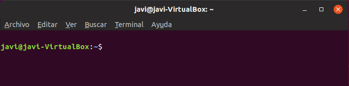

Está compuesto por:

-   El nombre de usuario "javi"
-   El símbolo de "**@**"
-   Nombre del equipo "javi-VirtualBox"
-   Dos puntos "**:**"
-   Directorio donde nos encontramos "\~" *(si lo omite es que es el home por defecto)*
-   Símbolo del dolar "**\$**" (si estamos como **root** cambiará a "\#").

Algunas **combinaciones** de teclado interesantes para usar en la terminal:

| **Comando**           | **Acción**                              |
|-----------------------|-----------------------------------------|
| Ctrl + Alt + Fn (1-6) | Abrir terminales a pantalla completa    |
| **tty**               | Indica el nº de terminal actual abierto |
| Tab (tabulador)       | Autocompletado (función de expansion)   |
| Flecha arriba / abajo | Moverse por el historial de comandos    |
| **clear**             | Limpiar pantalla de la consola          |
| **history**           | Historial de comandos                   |
| Ctrl + r              | Buscar comando en el historial          |
| Ctrl + c              | Interrumpir proceso actual              |
| **!!**                | Repetir último comando utilizado        |
| **exit**              | Cerrar terminal                         |

**Comandos básicos** de utilización en la consola/terminal de Linux:

| **Comando** | **Acción**                                                    | **Ejemplo**             |
|-------------|---------------------------------------------------------------|-------------------------|
| **pwd**     | Muestra el directorio actual                                  | pwd                     |
| **ls**      | Lista ficheros y directorios                                  | ls -l                   |
| **cd**      | Cambia de directorio                                          | cd mp3/wim_mertens      |
| **mkdir**   | Crea uno o varios directorios                                 | mkdir cartas facturas   |
| **cat**     | Visualiza un fichero                                          | cat /var/log/dmesg      |
| **more**    | Visualiza un fichero pantalla a pantalla                      | more /var/log/dmesg     |
| **less**    | Visualiza un fichero pantalla a pantalla y permite retroceder | less /var/log/dmesg     |
| **head**    | Visualiza las primeras filas de un fichero                    | head -n5 /var/log/dmesg |
| **tail**    | Visualiza las últimas filas de un fichero                     | tail /var/log/dmesg     |
| **touch**   | Crea un fichero vacío                                         | touch listado.txt       |
| **nano**    | Editor de textos simple                                       | nano listado.txt        |
| **vi**      | Editor de textos muy potente                                  | vi listado.txt          |
| **apt**     | Instala y desinstala programas y aplicaciones en Ubuntu       | apt-get install mc      |
| **man**     | Muestra ayuda sobre un determinado comando                    | man ls                  |
| **history** | Muestra el historial de comandos utilizados                   | history                 |
| **env**     | Mostrar la lista de variables de entorno                      | env                     |

Significado de los **colores** para el comando **ls** en la terminal bash de Ubuntu:

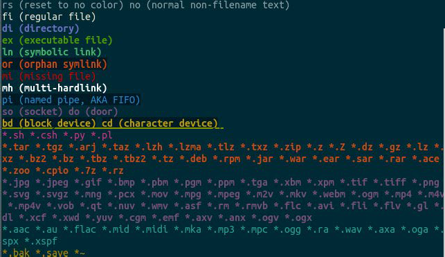

El historial de comandos escritos se visualiza usando el comando **history**.

Este historial se guarda dentro del fichero **.bash_history** dentro de nuestra carpeta personal de usuario.

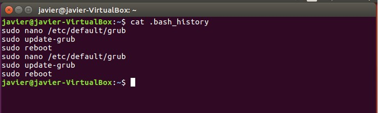

El comando **history**, por defecto, tiene algunas limitaciones; de *500 a 1000* entradas por usuario. Otro problema es que si tenemos múltiples ventanas de consola abiertas sólo guardará información de la primera.

Los parámetros del comando están ubicados en el fichero **.bashrc**, que se pueden modificar de manera fácil, veamos un ejemplo.

## Variables de entorno

```note
Las **variables de entorno** son porciones de memoria que guardan datos.
```

En la terminal Bash las variables de entorno tienen un nombre alfanumérico. 

💡Para referirse al valor de la variable se utiliza el carácter dólar \$ como prefijo del nombre.

Para ver las variables se usa el comando **env**. Algunas de las importantes son:

| **Variable** | **Descripción**                                                               |
|--------------|-------------------------------------------------------------------------------|
| \$HOME       | Directorio personal del usuario actual.                                       |
| \$HOSTNAME   | Nombre de la máquina.                                                         |
| \$PATH       | Lista de directorios donde buscar los programas ejecutables (separados por ;) |
| \$SHELL      | Intérprete de comandos por defecto.                                           |
| \$TERM       | Tipo de terminal.                                                             |
| \$USER       | Nombre del usuario.                                                           |
| \$PWD        | Ruta del usuario actual.                                                      |
| \$PS1        | PROMPT principal                                                              |

Se pueden cambiar el valor de las variables según necesidad o añadir variables propias para que sean utilizadas por otros programas o desde la línea de comando.

Por ejemplo para crear una nueva variable: HOY=viernes

Se podrá ver el valor de esa variable escribiendo: echo \$HOY *(no olvidar el \$ delante)*

Si ahora se empleara el comando **set** la variable aparecerá ahí, sin embargo usando el comando **env** no aparecerá. La variable ha sido creada localmente y solo podrá ser referenciada localmente.

Para que sea accesible por subrutinas o procesos hijos se deberá utilizar el comando

**export** que hará que pase de ser local a ser una variable del entorno: **export** HOY

Para que el valor sea permanente debes añadir la definición a un perfil, por ejemplo puedes cambiar el valor de PATH para todos los usuarios del sistema, conectándote como root y editando el archivo /etc/profile modificando la línea donde se define la variable PATH.

Si fuese necesario eliminar una variable se utilizaría el comando **unset**.

El comando **alias** se utiliza para indicarle a la terminal de Linux que reemplace una cadena por otra al ejecutar comandos.

Es importante mencionar que los alias persisten solo durante la sesión actual. Se pueden cargar no obstante en el momento del inicio de sesión modificando el fichero bash_profile.

Al invocar el comando alias sin argumentos, se mostrarán todos los comandos con alias definidos actualmente.

Para crear un alias se usará de la siguiente forma:

    alias nombre = “lista_comando_parámetros”

## Editores de texto

Existen muchos **editores de texto** en Linux, aunque los más conocidos son básicamente:

- Nano
-   **Vi / Vim**
-   **Emacs**
-   **Gedit**

### nano

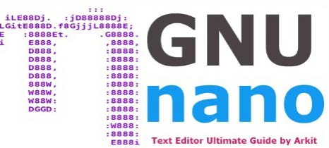

Nano es sin ninguna duda el editor de texto en consola más utilizado. La razón de esto es su simplicidad, facilidad de uso, y el hecho de que está preinstalado por defecto en muchas Linux conocidas.

Los comandos se completan con combinaciones de la tecla *Ctrl* y una letra que se muestra en la parte inferior.

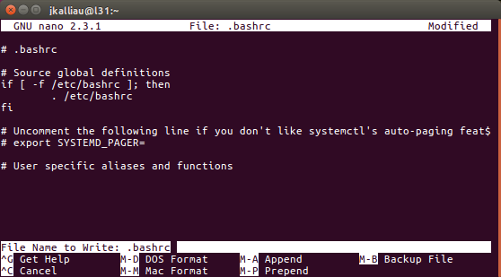

### vi/vim


Vim es un editor mejorado del vetusto Vi. Es un editor de texto muy flexible, con el cual realizar cualquier tipo de operación en los textos, aunque tiene una curva de aprendizaje moderada.

Suele ser la principal opción para desarrolladores y usuarios avanzados en Linux.

Sus propiedades son muchas y variadas. Permite usar expresiones regulares para reemplazar fragmentos de texto en un archivo y ofrece una manera fácil y ágil de navegar entre líneas, párrafos y palabras, además incluye resaltado de texto, etc….

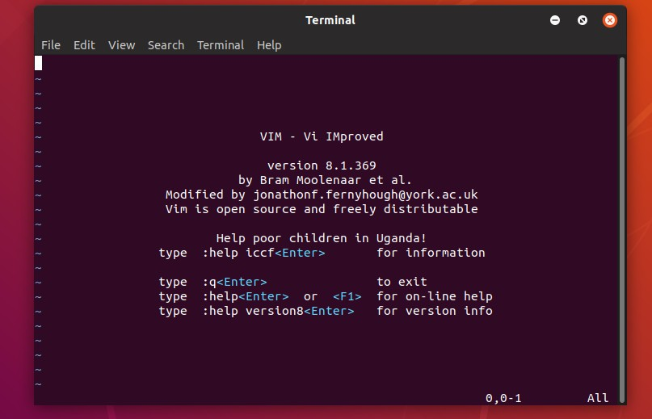

### Emacs


Es otro de los editores en línea de comandos más antiguo y versátil para sistemas

basados en Linux y UNIX, pero también es el más complejo.

Emacs proporciona un entorno integrado para diferentes tipos de tareas. Permite cambiar a modo trabajo similar a Vi / Vim.

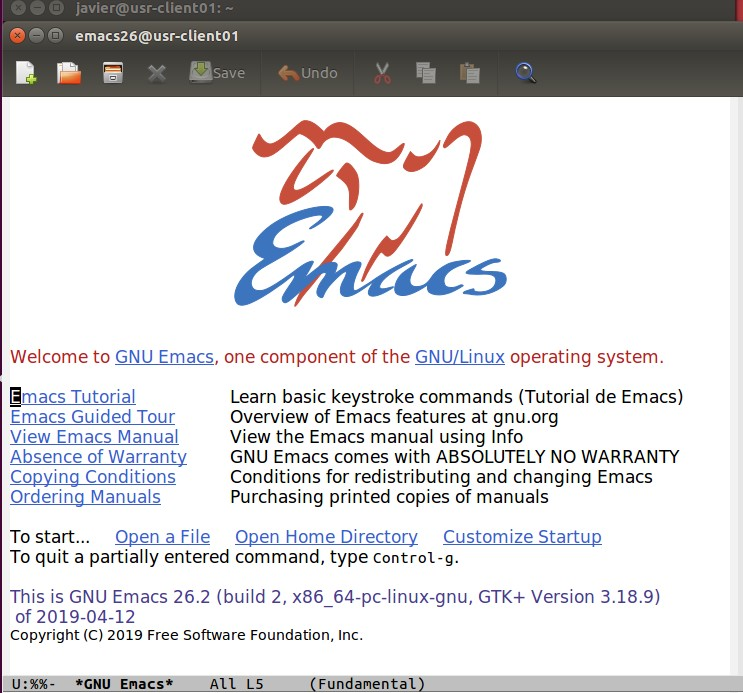

### Gedit


Un clásico y popular editor de textos sencillo pero potente para entornos gráficos basados en Gnome o similares. Existen ports para otros SO como Windows o Mac.

Incluye herramientas para la edición de código fuente y textos estructurados, como lenguajes de marcado.

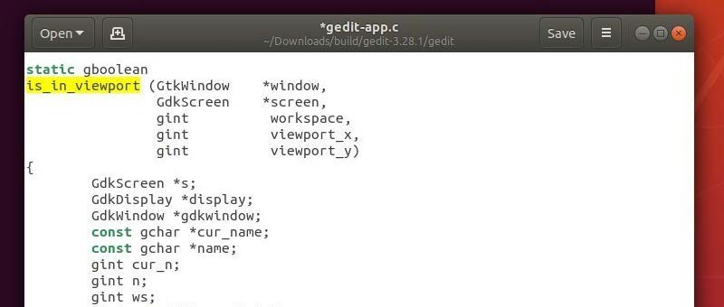

## Metacaracteres

El shell bash proporciona varios caracteres llamados **metacaracteres** (caracteres comodín) que tienen un significado especial al usarlos en cualquier *script*, es decir, son como reservados por el propio sistema para realizar funciones especiales:

| **Metacarácter** | **Significado**                                                     |
|------------------|---------------------------------------------------------------------|
| ?                | Representa un único caracter                                        |
| \*               | Representa ningún o cualquier carácter (incluido vacío)             |
| [abc]            | Conjunto de caracteres individuales; ya sea '*a*'*,* '*b*'*,* '*c*' |
| [a-z]            | Rango de caracteres; de la letra 'a' a la 'z'                       |
| { , }            | Conjunto de patrones de caracteres separados por comas              |
| [! ]             | Negación de un conjunto de caracteres (que no incluya)              |
| \|               | Alternativa entre dos expresiones                                   |
| \\               | Mostrar un metacaracter especial                                    |

A diferencia de los caracteres vistos en la consola CMD, los del terminal de Linux son mucho más variados, complejos y potentes de utilizar.

Además de los metacaracteres, muchos comandos que veremos más adelante permiten el uso de **expresiones regulares**. Las expresiones regulares se utilizan para describir patrones de texto.


## Operaciones generales

### Manejo de directorios/ficheros

Los comandos para **operaciones generales** de manejo de directorios y ficheros en consola son los siguientes:

| **Comando** | **Acción**                              | **Ejemplo**                |
|-------------|-----------------------------------------|----------------------------|
| **cp**      | copia archivos o directorios            | cp \*.txt correspondencia/ |
| **mv**      | mueve o renombra archivos o directorios | mv palabras.txt texto.txt  |
| **rm**      | borra archivos o directorios            | rm -R cosas/basurilla      |

```bash
#Borrar un fichero o directorio:
~$ rm fichero
#Renombrar un fichero:
~$ mv ficheroorig ficherofinal
#Mover de sitio un fichero:
~$ mv ficheroorig path/ficherofinal
#Copiar un fichero/directorio:
~$ cp dirorigen/ficheroorig dirfinal/ficherofinal
```

### Cambio de usuario

Cambiar de usuario en sistemas Linux y utilizar privilegios de administrador, conocido como **root**, es algo muy habitual. Para ello se utilizan los comandos su y sudo.

Para cambiar de usuario activo se utiliza el comando **su** *("***S***witch* **U***ser”)*

    ~$ su nombreusuario

-   **sudo** viene de "**s***witch* **u***ser* **do**" y permite a los usuarios ejecutar comandos que requieren privilegios de seguridad del **root**, de una manera segura.

    Por defecto Ubuntu trae desactivada la cuenta del "root", por seguridad. Para administrar el sistema existe un grupo de usuarios denominado "sudoers users" (administradores o admin), los cuales pueden obtener permisos de root, mediante la utilización de "sudo" lo que veremos en unidades posteriores.

        ~$ sudo comando

    Cuando necesitamos utilizar programas **en modo gráfico** (GUI) que requieran privilegios administrativos, se puede usar el comando **gksudo**


### Listado de directorios/ficheros

Para obtener la lista de los ficheros en el directorio actual se utiliza el comando **ls**:

    ~$ ls [directorio\|fichero]

Parámetros:

    ls -l: Información detallada
    ls -a: Todos (incluidos ocultos)
    ls -t: Ordenar por fecha de modificación
    ls –r: Ordenación inversa

### Mostrar el contenido de ficheros

Para mostrar el contenido de un fichero de texto se usa el comando **cat**.

Si queremos mostrar solamente las primeras líneas de un fichero o las últimas utilizaremos los comandos **head** o **tail**

### Comando date

El comando **date** sirve para mostrar la fecha y la hora actual. Dicha salida puede formatearse con una secuencia de caracteres de control de formato precedidos por el signo + entre "". Los controles de formato comienzan con el % y se sustituyen por los caracteres de control de dicho formato de salida.

Listado de los caracteres de formato más comunes:

- %d Día del mes
- %H Hora (formato 24h)
- %m Mes
- %M Minuto
- %s Segundo
- %Y Año completo
- %u Día de la semana

### Enlaces

Un **enlace** en Linux es un puente a un archivo o directorio perteneciente al sistema. Es una referencia que podemos poner en cualquier sitio que nos interese y que actúa como una especie **acceso directo o puntero** a cualquier otro.

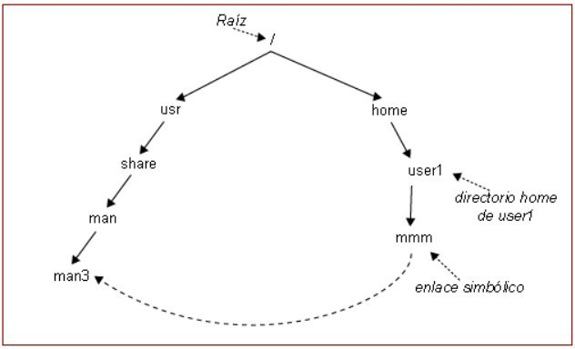

Existen dos tipos de **enlaces** con distinto comportamiento en Linux:

-   Enlaces blandos o simbólicos
-   Enlaces duros o físicos

#### Enlaces blandos o simbólicos

Los enlaces simbólicos permite crear un enlace a otro archivo. Parecido a los accesos directos en Windows. No debe confundirse con un lanzador de aplicaciones. Sirven para colocar en una carpeta el acceso a ficheros que están en otros lugares.

También para directorios. Pueden apuntar a archivos de otra partición. Los enlaces blandos se crean mediante el comando **ln –s**

    ~$ ln -s /usr/share/man/man3 mienlace 

La línea anterior crearía este enlace, que hemos denominado mienlace.

El usuario sólo deberá escribir (desde su directorio home) cd mienlace y el sistema automáticamente lo redirigiría hacia/usr/share/man/man3/

#### Enlaces duros o físicos

Recordar que los sistemas de archivos usados por Linux identifican los archivos en el disco mediante un número llamado *inodo*.

Un **enlace duro** consiste en asignar otro nombre en un directorio que apunta a un fichero o inodo existente. Los enlaces duros, asocian dos o más ficheros compartiendo el mismo *inodo*. Esto hace que cada enlace duro sea una copia exacta del resto de ficheros asociados, tanto de datos como de permisos, propietario:

- Si se cambia el archivo, todos los enlaces duros verán el cambio.
- Si se borra el fichero original la información no se pierde.
- Sólo pueden crearse enlaces duros entre archivos de la misma partición.

 Se crean mediante el comando **ln**:

    ~$ ln ficheroExistente enlace1.txt
    ~$ ln ficheroExistente enlace2.txt

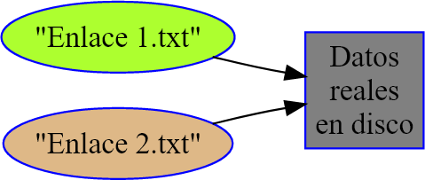

Para conocer el número de *inodo* correspondiente a un archivo usaremos **ls -li**

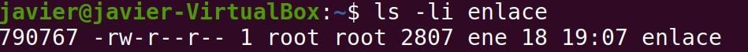

### Ficheros ocultos

**Ocultar** archivos y directorios en Linux es una operación relativamente sencilla.

La forma más habitual de hacerlo consiste en colocar un punto al inicio del nombre del archivo o directorio.

Desde un terminal de consola procederíamos de la siguiente forma:

    mv fichero.txt .fichero.txt

La segunda opción de ocultar archivos sería creando un archivo llamado *.hidden*. En este archivo colocaremos los nombres de todos los archivos y directorios que queramos ocultar.

### Buscar ficheros

El comando find en Linux se usa para buscar archivos y directorios en el sistema de archivos basándose en diferentes criterios, como nombre, fecha de modificación, etc.
Su sintaxis es la siguiente:

    find [ruta] [opciones] [acción]

Parámetros:
- ruta → Directorio donde buscar (. para la actual, / para todo el sistema, etc.).
- opciones → Criterios de búsqueda como nombre, tipo, tamaño, permisos, etc.
- acción → Qué hacer con los archivos encontrados (mostrar, eliminar, mover, etc.).

Buscar archivos por nombre en un directorio específico:

    find /home/user -name "documento.txt"
    
Buscar archivos con extensión .log en cualquier subdirectorio:

    find /var/log -name "*.log"
    

## Gestión de paquetes de software

```note
Un sistema de gestión de paquetes es una colección de herramientas propia de cada distribución Linux que proporciona un método para la
instalación, actualización y eliminación de software para el SO.
```

El software es una de las grandes diferencias en Linux respecto Windows. A diferencia de lo que pasa en Windows u otros SO, en Linux se distribuye a través de un “sistema de paquetes” que es donde se contienen los programas o utilidades. A estos paquetes están vinculados **metadatos** que contienen información como una lista de dependencias necesarias para que el software funcione correctamente en cada distribución en concreto.

Esos paquetes se centralizan en **repositorios**, ya sean locales (USB, DVD o disco duros) aunque generalmente desde **repositorios** en Internet.

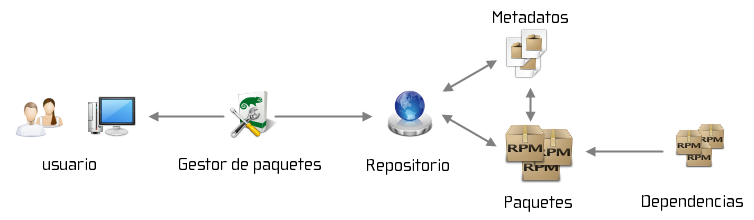

Los paquetes a su vez, tienen un formato concreto manejado por el gestor de paquetes, dependiendo de la familia de distribución que estemos utilizando.

Los formatos de paquetes más conocidos son:

-   **RPM**: paquetes que utiliza la distribución Fedora/Red Hat (y derivadas). Se suelen manejar utilizando el comando *rpm*.
-   **DEB**: paquetes de Debian (los utilizados en Ubuntu), se suelen manejar con un conjunto de herramientas entre las que cabe mencionar *dpkg, apt-get y aptitude.*
-   **SNAP**: Es el nuevo tipo de paquetería autocontenida con todo lo necesario para instalar software. Es lo más parecida a lo que conocemos en Windows, aunque es poco eficiente.
-   **Tar**, o bien los tgz (también *tar.gz*): son puramente paquetes de ficheros unidos y comprimidos mediante *tar* y *gzip* (se usan los mismos para la descompresión). Estos paquetes no contienen dependencias y pueden instalarse en diferentes lugares sin ruta concreta.

### Repositorios

El **repositorio**, en cambio, es un sitio centralizado donde se almacena y mantiene información digital de los paquetes de software que utilice una distribución en concreto. Cada distribución tiene los suyos propios (entre ellos el OFICIAL) en los que están almacenados los programas diseñados para esa distribución.

Ubuntu utiliza paquetes Debian (DEB), dividiendo todo su software en cuatro secciones, llamadas **componentes**, para mostrar diferencias en licencias y la prioridad con la que se atienden los problemas que informen los usuarios:

-   Main
-   Restricted
-   Universe
-   Multiverse
-   Patrocinados\*


- **Repositorio Main**

    -   Contiene solamente los paquetes que cumplen los requisitos de la licencia de Ubuntu.
    -   Hay soporte disponible por parte del equipo.
    -   Están pensados para que incluya todo lo necesario para la mayoría de los sistemas Linux de uso general.
    -   Los paquetes de este componente poseen ayuda técnica garantizada y mejoras de seguridad oportunas.
    -   Algunos paquetes que usan Main serían por ejemplo nano o Firefox.


- **Repositorio Restricted**

    -   Paquetes soportados por los desarrolladores de Ubuntu debido a su importancia pero que no está disponible bajo ningún tipo de licencia libre para incluir en *main*.
    -   En este lugar se incluyen los paquetes como controladores **propietarios** de algunas tarjetas gráficas (*ATI y NVIDIA*) u otro dispositivo hardware.

- **Repositorio Universe**

    -   Todo el software incluido en Universe es libre y de código abierto.
    -   Es un repositorio de software que por motivos diversos no se incluyo en el repositorio ya que su mantenimiento y actualizaciones de seguridad no es tan riguroso como el de main.
    -   No hay garantía de actualizaciones de seguridad por tanto.

- **Repositorio Multiverse**

    -   En el repositorio Multiverse, se puede encontrar generalmente software de código abierto con dudas legales o con licencias dudosas.
    -   También incluye software de código abierto con restricciones legales, por ejemplo, software de reproducción de audio y video que infringe las patentes.

### El gestor de paquetes de Ubuntu

```note
**Advanced Packaging Tool** (Herramienta Avanzada de Empaquetado), abreviado APT, es el sistema de gestión de paquetes creado por el proyecto Debian y usado en Ubuntu. 
```

El gestor **apt** nació en la distribución Linux Debian en el año 1998.

A partir de ese momento se convirtió en parte importante de esta distro y derivadas como Ubuntu manejando sus paquetes con un grupo de programas.

Es bueno aclarar que apt son varios programas, cada uno con diferentes funciones aunque el que mas usaremos será **apt** o **apt-get** en Ubuntu.

También existe un comando *apt-get* muy parecido a *apt*. La diferencia entre ambos es que apt es una versión reducida o más específica de las funciones más utilizadas.

Los principales parámetros de **apt** son los siguientes: sudo apt [parámetro]

| **Parámetro apt** | **Descripcion**                                                                                             |
|-------------------|-------------------------------------------------------------------------------------------------------------|
| apt **list**      | Muestra el listado completo de paquetes, dependiendo de los parámetros que especifiquemos.                  |
| apt **search**    | Para buscar un paquete concreto.                                                                            |
| apt **update**    | Lo primero que hay que hacer es buscar actualizaciones de los paquetes que tenemos respecto al repositorio. |
| apt **upgrade**   | Para aplicar los cambios y actualizaciones del apt update.                                                  |
| apt **install**   | Para instalar cualquier aplicación disponible conocido su nombre.                                           |
| apt **remove**    | desinstalar el programa o aplicación indicado.                                                              |
| apt **remove**    | igual que remove, pero también elimina los ficheros de configuración que haya creado la aplicación.         |

Para **buscar actualizaciones** en los paquetes del sistema usaremos *apt update*:

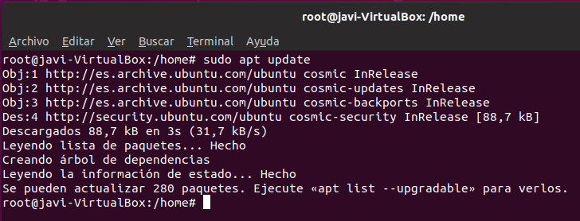

Para aplicar las **Actualizaciones** a dichos paquetes usaremos *apt upgrade*:

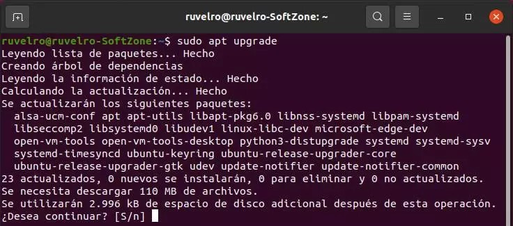

Para **Instalación** de un nuevo componente usaremos apt install:

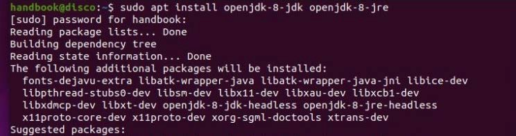

La gestión de repositorios con apt se puede llevar a cabo de la siguiente forma.

-   Añadir repositorios *(/etc/apt/sources.list o /etc/apt/sources.list.d)*

        add-apt-repository ppa:Nombre_Repositorio.

-   Eliminar repositorios:

        add-apt-repository -r ppa:Nombre_Repositorio


Desde la interfaz de Ubuntu, podemos utilizar los orígenes de software para gestionar repositoriosconcretos, en vez de utilizar comandos.

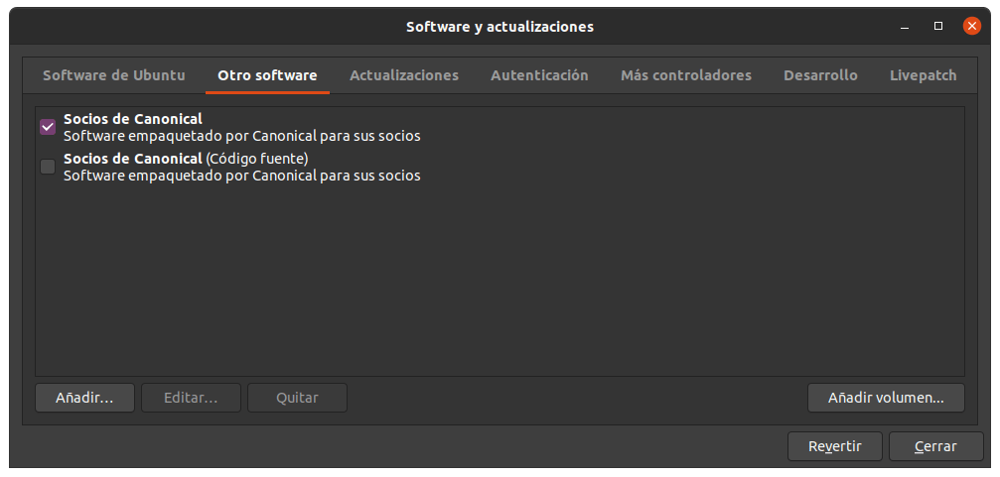

## Empaquetado y compresión de archivos

El comando **tar** permite **empaquetar** varios archivos en uno solo, sin comprimirlos y es utilizado habitualmente en cualquier distribución Linux.

Para **empaquetar** una carpeta (o directorio) con tar: 

    tar **-vcf** nombre_archivo.tar nombre_directorio
    tar –vcf ficherospacked.tar /home/javier/images

Para **desempaquetar** un archivo con tar:

    tar **-vxf** mi_archivo.tar
    tar –vxf ficherospacked.tar

Para ver el contenido de un tar:

    tar –tvf ficherospacked.tar

Se puede utilizar los parámetros *--apend* o *--delete* para agregar o quitar ficheros:

    tar –f ficherospacked.tar --append nuevofichero.d

Si además de empaquetar/desempaquetar queremos **comprimir/descomprimir** y entonces habrá que usar los comandos **tar** y **gzip**.

No confundir **gzip** con **zip**, el cual no es compatible. **gzip** sólo comprime archivos, pero no los archiva. Debido a esto a menudo se usa junto con tar para archivar.

Para comprimir sin más se usa gzip, dando como resultado el fichero llamado test.gz

    gzip test.docx

Para comprimir con tar:

    tar -cvzf empaquetado.tar.gz \*.md

Y para descomprimir:

    tar –xvzf empaquetado.tar.gz \*.md

| **.tar (tar)**                 |                                          |         |             |
|--------------------------------|------------------------------------------|---------|-------------|
| Empaquetar                     | tar **vcf** archivo.tar /archivo/mayo/\* |         |             |
| Desempaquetar                  | tar                                      | **vxf** | archivo.tar |
| Ver el contenido (sin extraer) | tar                                      | vtf     | archivo.tar |

| **.tar.gz - .tar.z - .tgz (tar con gzip)** |                                          |
|--------------------------------------------|------------------------------------------|
| Empaquetar y comprimir                     | tar zvcf archivo.tar.gz /archivo/mayo/\* |
| Desempaquetar y descomprimir               | tar zvxf archivo.tar.gz                  |
| Ver el contenido (sin extraer)             | tar zvtf archivo.tar.gz                  |

| **.gz (gzip)** |                                                                          |
|----------------|--------------------------------------------------------------------------|
| Comprimir      | gzip -q archivo (El archivo lo comprime y lo renombra como "archivo.gz") |
| Descomprimir   | gzip -d archivo.gz (El archivo lo descomprime y lo deja como "archivo"   |
