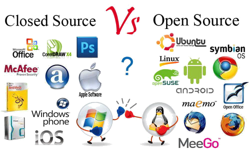
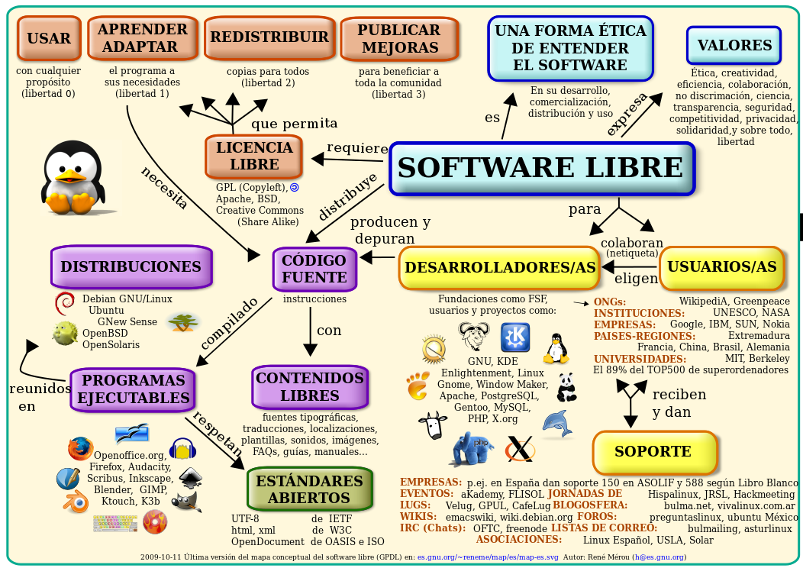
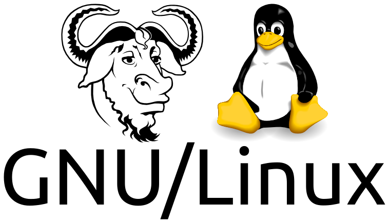
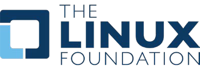
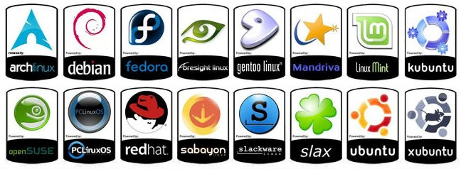
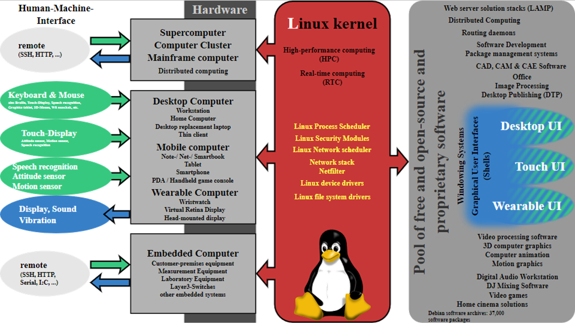

# UT10.1 SO libres GNU Linux

## SO libres y propietarios

En las anteriores unidades hemos trabajado con el mayor representante de **software propietario** actual; Microsoft y su sistema operativo Windows, entre otras tantas múltiples compañías conocidas.

En contraposición a este tipo de desarrollos, en los cuales el código es privado y se basa en licencias de pago, existe el **software de código abierto** *(Open Source)* o el **software libre** (Free Software) como ya sabemos

El software libre defiende la libertad de modificación de los códigos de un programa y su libre distribución bajo otro tipo de licencia.

Recordemos las principales diferencias entre software libre y propietario de la UT1:

-   **Software libre** es el que otorga libertad de uso, copia y distribución a los usuarios. Su código puede ser totalmente abierto o estar sometido a ciertas normas según la licencia concreta de distribución.
-   **Software de propietario** es aquel cuyas condiciones de uso, copia y distribución están sometidas a normas o restricciones. Su código fuente es cerrado, es decir, no está disponible para el usuario (el propietario puede mostrarlo, pero esto no implica que pase a ser software libre en cuanto a su uso).

| **SOFTWARE LIBRE**                                                                                                                                                                                                   | **SOFTWARE PROPIETARIO**                                                                                                                                              |
|----------------------------------------------------------------------------------------------------------------------------------------------------------------------------------------------------------------------|-----------------------------------------------------------------------------------------------------------------------------------------------------------------------|
| No está limitado a los usuarios y garantiza las libertades de usar, modificar, copiar y distribuir software                                                                                                          | Tiene licencias que limitan a los usuarios y que, en algunos casos, son costosas. Estas licencias restringen las libertades de usar, modificar y distribuir software. |
| Puede intervenir en su desarrollo cualquier persona, empresa u organización, por lo que se generan gran cantidad de ideas innovadoras, y permite la adecuación a los avances tecnológicos.                           |  El desarrollo, la actualización y la programación de este software solo lo realiza la empresa que tiene los derechos.                                                |
| Los avances, modificaciones y descubrimientos tecnológicos son constantes y se encuentran en Internet de forma gratuita. “La principal meta del software libre es compartir los avances tecnológicos con los demás.” |  El futuro del software que adquirió el usuario solo depende de una empresa comercial.                                                                                |
| Compatible tanto en software como en hardware, no obliga al usuario a cambiar de sistema operativo o equipo.                                                                                                         | Siendo creado con fines de lucro, las actualizaciones o mejoras al software quedan estipuladas bajo contrato.                                                         |

## Historia de Linux

En la década de los 80, prácticamente todos los programas eran software privativo, lo que llevó a Richard Stallman a crear en 1983 el Proyecto **GNU** (*GNU is Not Unix*), un futuro **sistema operativo de software libre compatible con Unix** en contraposición al Unix de pago de la época y que estuviera conformado por programas de software libre.

Así que GNU fue un proyecto con el propósito de generar un sistema operativo compatible con Unix.

Linus Torvalds, será el que escribía el código fuente de un kernel propio, y el que decide comenzar a usar los programas de *GNU* para hacer su sistema.

**Linux en sí, es tan sólo un kernel.**

El finlandés Linus Torvalds, después de conocer el Proyecto GNU y algunos de sus programas de código abierto, decidió crear su propio sistema operativo *Open Source* en 1991 basado en *Minix*, un SO de aprendizaje universitario inspirado en Unix. Para ello, tuvo la ayuda de voluntarios de **Usenet**, que reunía varios foros en los inicios de Internet. Se trataba del lugar perfecto para el encuentro virtual de programadores, donde buscar opiniones, código y consejos de los que también entendían del tema.

La aparición del nombre **Linux** tiene su origen en la combinación de las palabras **Linus** y **Unix**. Recordemos que Linux es muy similar a Unix, pero no viene del mismo lugar y fue escrito de otra forma.

El proyecto GNU está sumamente relacionado al éxito de Linux, ya que gracias a la mezcla de sus programas con el *kernel* desarrollado por Linus Torvalds, ha acabado por demostrar que es el SO definitivo, adaptable y de características aún no superadas por otro sistema.

La historia de Linux es la de un éxito de utilización en el mundo moderno actual. **Linux Foundation** es un consorcio tecnológico sin ánimo de lucro establecido para adoptar el crecimiento de Linux:

-   Servidores de Internet: Wikipedia, Facebook, Wordpress.. 
-   Supercomputadores: CERN Europeo, NASA…
-   Gestión de tráfico aéreo mundial.
-   Bolsa de Wall Street
-   Dispositivos móviles y tabletas: Android
-   Conducción autónoma: Toyota, Tesla..
-   Dispositivos endebidos: televisores, drones..
-   Cine y animación digital
-   Ordenadores de escritorio, consolas..

<https://www.linuxfoundation.org/membership/members/>

## Distribuciones Linux

Linux, a diferencia de Windows, MacOS, Unix u otros sistemas basados en este, no es un sistema operativo como un todo como ya hemos indicado.

Al tener un núcleo o kernel disponible de forma gratuita y con código abierto, cualquier persona u organización podrá reensamblarlo en un conjunto de programas de software para crear un sistema operativo personalizado, como propuso GNU.

Es de ahí de donde proceden los cientos de **distribuciones** disponibles en la actualidad de Linux, desarrolladas por distintos grupos, empresas y asociaciones:

Una **distribución de Linux** (coloquialmente llamada distro) es una colección de software basada en el núcleo Linux que incluye determinados paquetes de software para satisfacer las necesidades de un grupo específico de usuarios.

Por lo general están compuestas, total o mayoritariamente, de software libre, aunque pueden incorporar aplicaciones o controladores propietarios.

Cada distribución Linux tiene un objetivo, que justifica su existencia. Por ejemplo, distros como **Ubuntu** se centran en ser lo más amigables posible a la hora de instalarse o descargar programas. Linux **Mint** aprovecha el hardware potente para competir con Windows o MacOS. Para equipos antiguos existen distros ligeras como **Puppy Linux**. Para instalar Linux en un servidor se recomienda **Debian,** para diseño gráfico **Deepin** y para videojuegos en Linux SteamOS.

<https://upload.wikimedia.org/wikipedia/commons/1/1b/Linux_Distribution_Timeline.svg>

Uno de los aspectos más interesantes de GNU/Linux para usuarios y organizaciones es el ciclo de lanzamientos y soporte existente. La diversidad de opciones que proporciona el software libre tiene sus inconvenientes, pero también sus ventajas.

A grandes rasgos, estas son las opciones que ofrece GNU/Linux:

-   *Distribuciones de lanzamiento regular y soporte contenido*. Por ejemplo, Fedora o Ubuntu, con un par de lanzamientos anuales con más o menos un año de soporte.
-   *Distribuciones de lanzamiento regular y soporte extendido*. Por ejemplo, Debian, Ubuntu LTS y openSUSE Leap, que con calendarios de lanzamiento distintos suelen ofrecer entre dos y cinco años de soporte.
-   D*istribuciones rolling release, de actualización continua*. Por ejemplo, Arch Linux o openSUSE Tumbleweed, que instalas una vez y lo que duren, siempre recibiendo los últimos paquetes.
-   *Distribuciones half rolling release*, de actualización continua pero manteniendo cierta estabilidad en el software base. Por ejemplo, Manjaro, que instalas una vez y lo que duren, pero con márgenes de prueba antes de liberar actualizaciones.

## Arquitectura Linux

De forma global, la arquitectura de cualquier distribución basada en UNIX/Linux está basada en la siguiente estructura:

- Un **kernel** o núcleo: parte que interacciona con el usuario (*Linux*) así como su sistema de archivos.
-   El **shell**: entorno gráfico o consola.
-   **Aplicaciones** de usuario: en el caso de las distribuciones Linux se trata generalmente de software que se instala gracias a un sistema centralizado de paquetería (modular)

De forma más detallada cualquier distribución escritorio Linux contendrá al menos:

-   Un núcleo o **kernel:** la última versión del kernel es la 6.2 ([www.kernel.org](http://www.kernel.org/))
-   **Un bootloader**: *Grub o Lilo*
-   **Un servidor gráfico**: *X Windows System o Wayland*.
-   **Entorno de escritorio**: Suele ser *GNOME* o *KDE*.
-   **Shell de línea de comandos**: *Bash o sh*
-   Software adicional, herramientas y bibliotecas..
-   Documentación y ayuda.

La **interfaz gráfica** (GUI) de cualquier distribución como vimos es diversa y modular:

-  Servidor gráfico: *X.org o Wayland*
-  Entorno escritorio: *GNOME* o *KDE*
-  Gestor de ventanas: *Compiz, Mutter..*

 

 ## Arquitectura Android

Android es una pila de software de código abierto basada en Linux creada para una variedad amplísima variedad de dispositivos y caracterizada por utilizar los servicios de la empresa Google.

  
