# UT11.3 Administración de Linux. Gestión de procesos y servicios

## Procesos en Linux

```tip
El **PID** (*Process Identificator*) es un número único que se asigna a un proceso cuando se inicia. Son números crecientes y los procesos que se terminan y luego se vuelven a iniciar van a tener un **PID** diferente.
```

💡 El **PID** número 1 se asigna al primer proceso que inicia el sistema operativo al ser arrancado (que suele ser *systemd*).

Todo proceso en Linux tiene un Proceso Padre o *Parent ID* (**PPID**), generando un árbol jerárquico de procesos y estos a su vez siempre tendrán de padre al proceso 1.


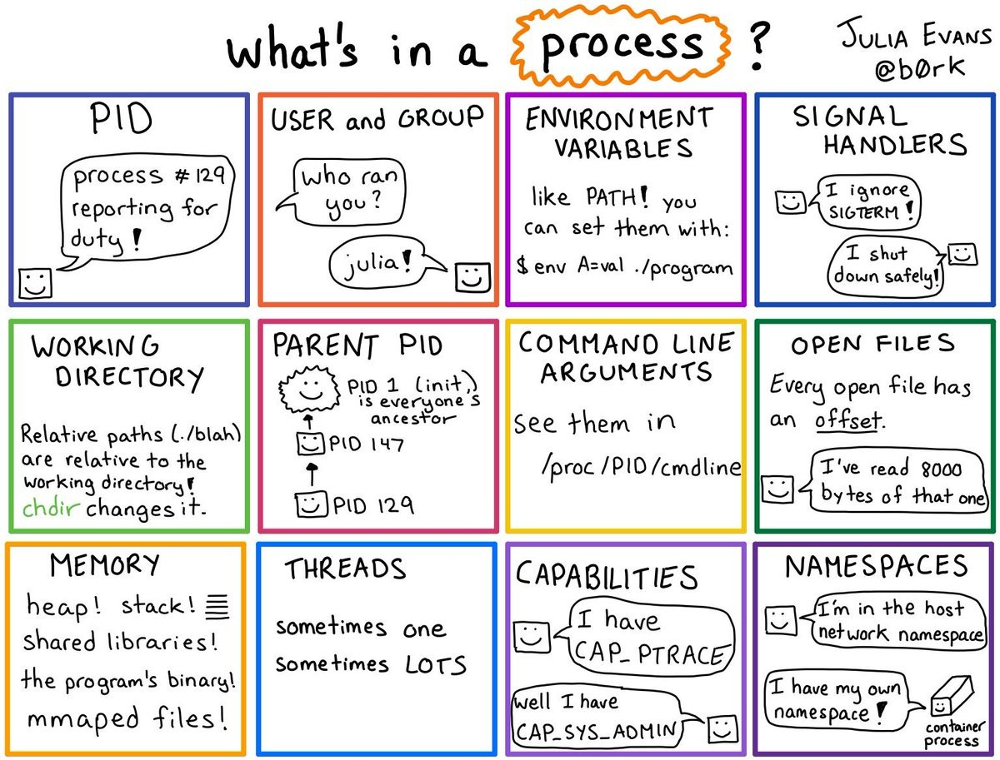

En Linux existen principalmente dos tipos de procesos:

-   **Procesos del sistema**. Son los procesos que actúan sin que el usuario los solicite. También reciben el nombre de demonios (*daemon*). Hay de dos tipos:

    - **Procesos permanentes o de larga duración**. Se crean cuando se arranca el sistema y permanecen activos hasta que se desconecta. Su función es soportar las actividades del sistema.

    - **Procesos transitorios**. Nacen y mueren cuando el sistema efectúa tareas propias, independientes de los usuarios.

-   **Procesos de usuario**. Son los procesos asociados a cada usuario como consecuencia de la interpretación de sus órdenes.

A cada proceso en el momento de su creación se le asocia un número único (**PID**) que lo identifica. Además a un proceso están asociadas otras informaciones como:

-   Un **identificador** o identificadores (USER, PID, UID, GID, PPID)
-   La hora de inicio en que comenzó.
-   Un **estado**; *running, sleep, zombie, stopped*, que veremos a continuación.
-   Tanto por cierto % de uso de memoria y CPU
-   Una **prioridad relativa** que indica la facilidad del proceso para acceder a la CPU: Oscila **entre -20 y 19, donde -20 es la <u>mayor prioridad</u>.**
-   La terminal asociada (*TTY*) desde donde fue invocado (en el caso que esté asociado a una terminal)


### Estado de un proceso

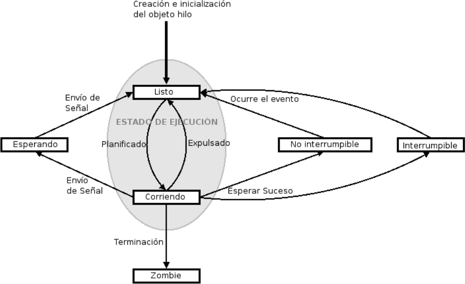

Los **estados** en los que puede estar un proceso en Linux son los siguientes:

| **Estado** | **Descripción del estado**                                                                                                                                                                       |
|------------|--------------------------------------------------------------------------------------------------------------------------------------------------------------------------------------------------|
| **D**      | **Espera ininterrupible** *(sleep).* Generalmente el proceso se encuentra esperando una operación de entrada/salida con algún dispositivo. El proceso no se puede interrumpir.                   |
| **R**      | Proceso **ejecutándose** (*running*), corriendo en el procesador.                                                                                                                                |
| **S**      | **Espera interrumpible**, el proceso está ejecutándose pero en espera de que se planifique para su ejecución en la CPU.                                                                          |
| **T**      | Proceso **esperando** (*stopped*) mediante el envío de alguna señal.                                                                                                                             |
| **Z**      | **Zombie**. Proceso terminado, pero cuyo padre aún sigue «vivo» y no ha capturado el estado de terminación del proceso hijo, y por tanto no lo ha eliminado de la tabla de procesos del sistema. |
| **X**      | Proceso **terminado** esperando eliminarse de la tabla de procesos                                                                                                                               |
```tip
El comando habitual para mostrar los procesos del sistema es **ps**
```

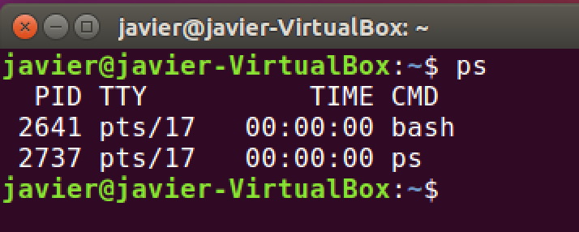

Para mostrar <u>todos los procesos</u> se utiliza el parámetro: **ps -aux**

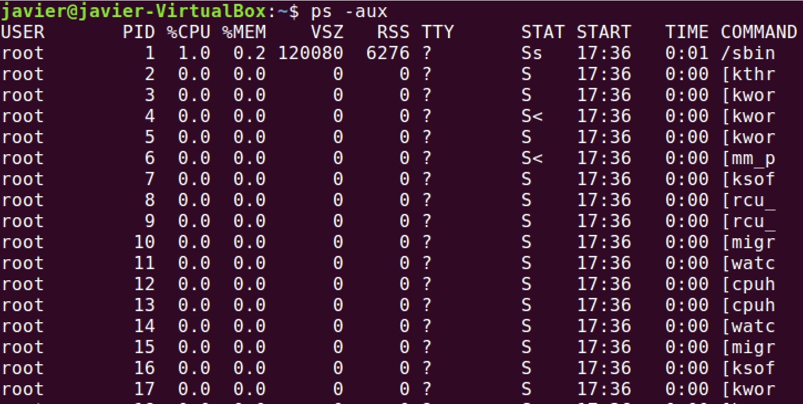

Para mostrar todos los procesos y su prioridad, que veremos a continuación, podemos utilizar el parámetro: **ps –el**

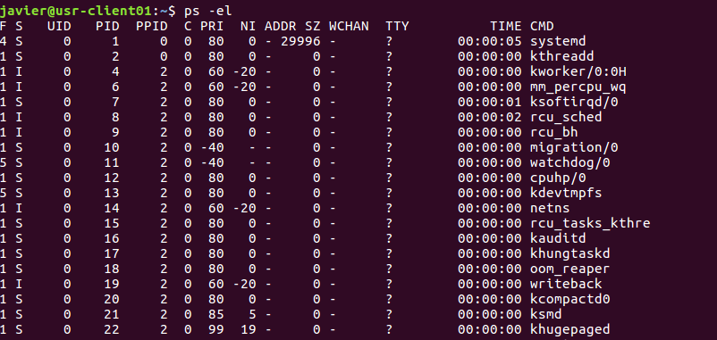

Para conocer el *PID* de un proceso en concreto usaremos el comando **pidof**

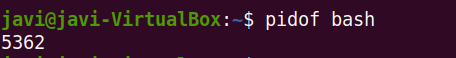

Para mostrar el árbol de procesos (con sus dependencias) utilizaremos **pstree**:

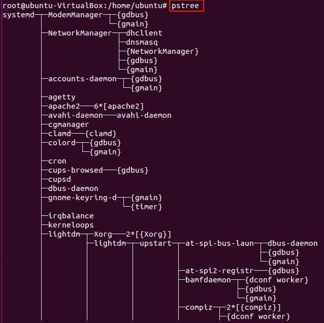

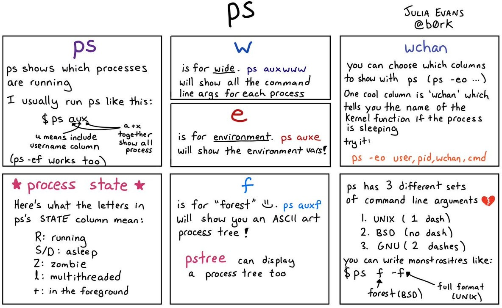

### Acciones sobre los procesos

Acciones posibles sobre los procesos en Linux:

-   **Detener Proceso**: Parar la ejecución de un proceso sin eliminarlo (es posible reanudar su ejecución con continuar). Comando **pkill**
-   **Finalizar o Matar proceso**: Elimina este proceso. Se usa **Kill**. (killall para subprocesos)
-   **Cambiar la prioridad**: A valores entre *-20* y *19*. Los valores negativos sólo los puede ejecutar el administrador. Se utiliza el comando **nice** o **renice**

### Información sobre procesos

```tip
El comando **top** se utiliza para conocer los procesos de ejecución del sistema en tiempo real y es una de las herramientas más importantes para un administrador.
```

Muestra una interfaz en modo texto que se va a ir actualizando cada 3 segundos por defecto. Muestra un resumen del estado de nuestro sistema y la lista de procesos que se están ejecutando.

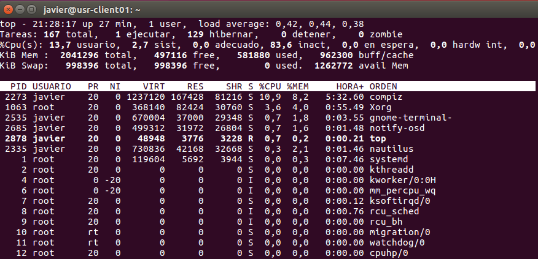

Las diferentes <u>columnas</u> que nos encontramos al ejecutar el comando **top** son:

    PID USUARIO PR NI VIRT RES SHR S %CPU %MEM HORA+ ORDEN
    4436 mario 20 0 982792 154512 91896 S 3,0 0,9 0:56.36 spotify

- *PID*: es el identificador de proceso. Cada proceso tiene un identificador único.
- *USER (USUARIO):* usuario propietario del proceso.
- *PR*: prioridad del proceso (20 por defecto). *RT* significa que se ejecuta en tiempo real.
- *NI*: asigna la prioridad relativa. Si tiene un valor bajo (hasta -20) quiere decir que tiene más prioridad que otro con valor alto (hasta 19).
- *VIRT*: cantidad de memoria virtual utilizada por el proceso. 
- *RES*: cantidad de memoria RAM física que utiliza el proceso. 
- *SHR*: memoria compartida.
- *S (ESTADO):* estado del proceso.
- *%CPU:* porcentaje de CPU utilizado desde la última actualización.
- *%MEM*: porcentaje de memoria física utilizada por el proceso.
- *TIME+ (HORA+) :* tiempo de vida del proceso.

El comando **htop** es un comando interactivo que supone una mejora de la interfaz de **top**:

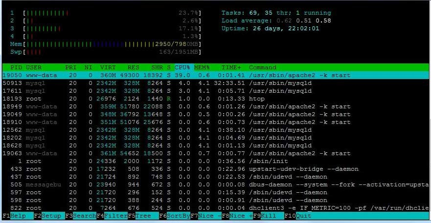 

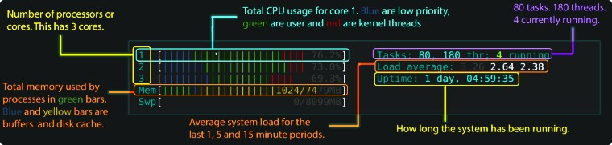 

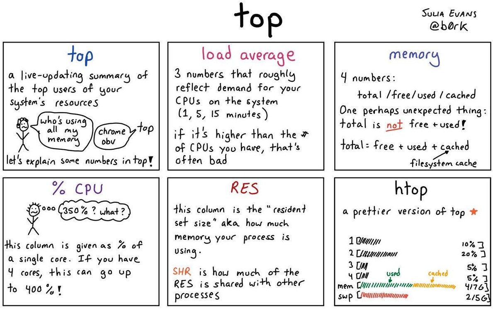

Procesos en primer y segundo plano


Linux es un SO operativo multiusuario y la consola no es una excepción. Ello implica que aún dentro de ella no hace falta lanzar comandos y esperar a sus resultado en primer plano, ya que siempre podremos lanzarlos en **segundo plano**.

Para ello se ejecuta el comando correspondiente seguido del símbolo **&**: 
    
    comando **&**

**Ejecución del comando en primer plano:** hay que esperar hasta que termine el programa o proceso abierto.

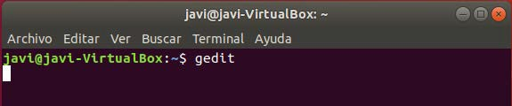

**Ejecución del comando en segundo plano:** se recupera el control de la línea de comandos mientras se ejecuta el programa o proceso.

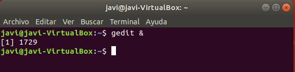

💡 Con el comando **bg** se pueden ver los procesos en segundo plano.

💡 Con **fg** ejecuto en primer plano los procesos que se encuentran en background.

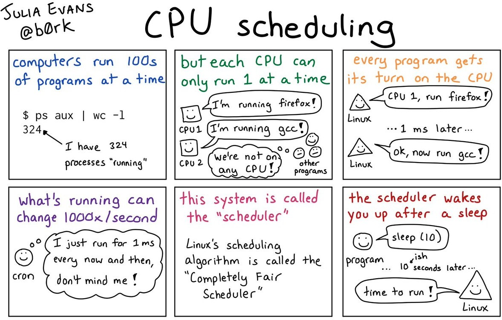

## Prioridad de procesos

```tip
Podemos cambiar la **prioridad relativa** de cualquier proceso que vayamos a lanzar a través del comando **nice**. 
```

Su sintaxis:

    nice **–n** \<prioridad\> comando

💡 El rango de asignación de **prioridad** disponible es de **-20** (mayor) a **19** (menor)

Para procesos que ya están corriendo en el sistema se utiliza el comando **renice**, con la siguiente sintaxis:

    renice prioridad [[-p] pid …] [[-g] pgrp …] [[-u] usuario …]

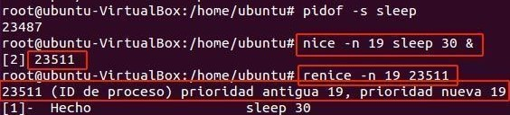

Dentro del comando **ps** se visualiza en la columna NI:

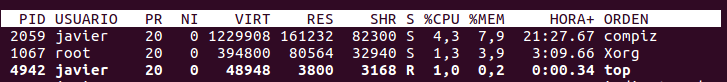

Veamos, como ejecutar el comando yes \> /dev/null & con una prioridad baja de \+10:

    nice -n10 yes \> /dev/null &

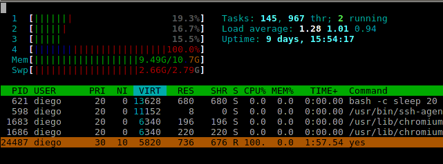

Si ahora necesitamos volver aumentar su prioridad en 5 habrá que utilizar **renice** indicando el PID de dicho proceso ya creado:

    renice -5 24487

## Comunicación entre procesos

```note
La comunicación entre procesos en Linux se lleva a cabo mediante el **envío de señales**. Las señales son notificaciones que un proceso le envía a otro.
```

El proceso receptor puede realizar varias tareas con una señal que recibe:

-   Ignorar la señal, el proceso no hará nada con la señal que reciba. Algunas señales como la **9** (*SIGKILL*) no pueden ser ignoradas.
-   Realizar la acción por defecto en el sistema, es decir, las acciones predeterminadas que el sistema le otorga a cada señal.
-   Realizar una acción particular, programada por el programador del programa que dio origen al proceso.

Para poder ver la lista de señales que un proceso puede enviarle a otro, se utiliza el comando **kill** de la siguiente forma: kill -l

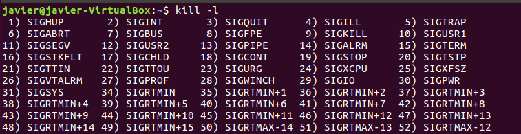

Las **señales** más comunes del sistema Linux son las siguientes:

| **Valor** | **Nombre** | **Descripción**                                                   |
|-----------|------------|-------------------------------------------------------------------|
| **1**     | SIGHUP     | Cuelga el proceso.                                                |
| **2**     | SIGINT     | Interrupción de un proceso (interrupción procedente del teclado)  |
| **3**     | SIGQUIT    | El proceso sale o se detiene (terminación procedente del teclado) |
| **9**     | SIGKILL    | Terminación de un proceso inmediatamente.                         |
| **15**    | SIGTERM    | Terminación del proceso.                                          |
| **17**    | SIGSTOP    | El proceso se detiene sin terminar.                               |
| **18**    | SIGTSTP    | El proceso se detiene o se pausa sin terminar.                    |
| **19**    | SIGCONT    | El proceso continúa después de terminar.       

<http://manpages.ubuntu.com/manpages/xenial/es/man7/signal.7.html>                   |

💡 Las señales SIGKILL y SIGSTOP no pueden ser capturadas, bloqueadas o ignoradas.

```tip
Las señales más famosas se lanzan con **kill** y **killall**:
```

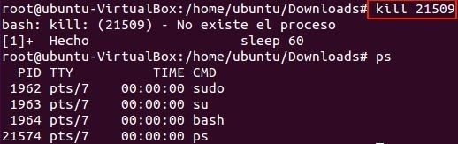

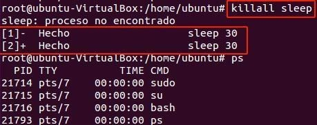

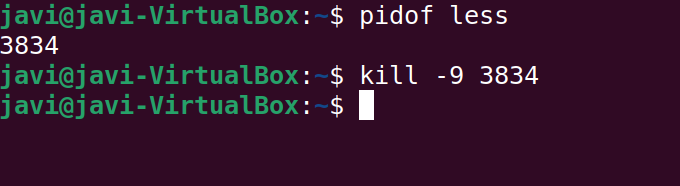

💡 Cuando se necesita pausar o retrasar la ejecución de un comando dentro de un script bash se suele utilizar la herramienta **sleep**, la cual por defecto toma un parámetro que representa la cantidad de segundos a "dormir“.

    sleep NUMERO [SUFIJO]...

Los sufijos disponibles son:

    s Segundos
    m Minutos
    h Horas
    d Días

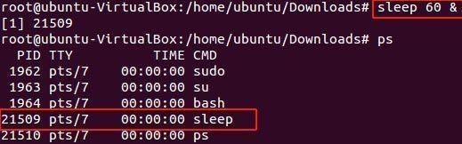

```tip
En **Linux** el comando **systemctl** se utiliza para controlar y administrar **servicios o demonios** en el sistema, durante el arranque o durante la sesión actual.
```

El comando systemctl admite los siguientes <u>parámetros</u> de uso:

| **Acción**                                                               | **systemd**               |
|--------------------------------------------------------------------------|---------------------------|
| **Listar** todas las unidades de servicios y sus estados                 | systemctl list-unit-files |
| **Arrancar** un servicio                                                 | systemctl **start** foo   |
| **Detener** un servicio                                                  | systemctl **stop** foo    |
| **Reiniciar** un servicio                                                | systemctl **restart** foo |
| Mostrar **estado** de un servicio                                        | systemctl **status** foo  |
| **Activar** un servicio para que sea ejecutado durante el arranque       | systemctl enable foo      |
| **Desactivar** un servicio para que no sea ejecutado durante el arranque | systemctl disable foo     |

El **estado** de los diferentes servicios según systemctl list-unit-files:

-   **Enabled**: El servicio está habilitado, se está usando. También indica que se iniciará de forma automática cuando iniciemos el equipo.
-   **Disabled**: El servicio está deshabilitado en este momento. No se inicia de forma automática al reinicio.
-   **Masked**: El servicio está completamente deshabilitado y no se puede iniciar de ningún modo sin previamente desenmascararlo.
-   **Static**: Servicios que únicamente se usarán en el caso que otro servicio o unidad lo precise. Estos servicios pueden estar activos o inactivos, pero siempre están disponibles para cuando se necesite usarlos. Estos servicios no se pueden activar ni desactivar, pero se pueden enmascarar.

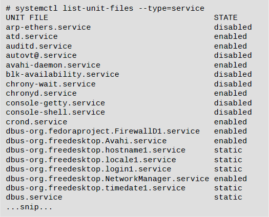

## Resumen de comandos 

| **Comando**   | **Acción**                           | **Ejemplo**          |
|---------------|--------------------------------------|----------------------|
| **ps**        | mostrar procesos                     | ps –aux              |
| **top**       | monitoreo en tiempo real de procesos | top                  |
| **htop**      | interfaz de monitorio basada en top  | htop                 |
| **kill**      | matar un proceso                     | kill 11428           |
| **pkill**     | detener un proceso                   | pkill 11428          |
| **pidof**     | conocer el PID de un proceso         | pidof bash           |
| **nice**      | prioridad para lanzar programa       | nice –n–10 script.sh |
| **renice**    | cambiar prioridad proceso corriendo  | renice +19 890       |
| **pstree**    | mostrar el árbol de procesos         | pstree               |
| **sleep**     | retrasar la ejecución                | sleep 1m 2           |
| **systemctl** | Comando de gestión de servicios      | systemctl stop foo   |
