# UT11.1 Administración de Linux: discos y particionado

## Sistema de archivos

```note
El **sistema de archivos** es la estructura subyacente que un sistema operativo usa para organizar los datos de una unidad de almacenamiento.
```

Se requiere una mínima organización para almacenar archivos y sus datos almacenados. Si bien los fundamentos organizativos suelen ser los mismos en los diferentes sistemas de archivos presentes soportados por Linux, las implementaciones y organizaciones lógicas de los datos en el disco varían bastante de uno a otro. De esta manera, no hay un único tipo de sistema de archivos, sino varios, puestos a disposición del usuario o el administrador.

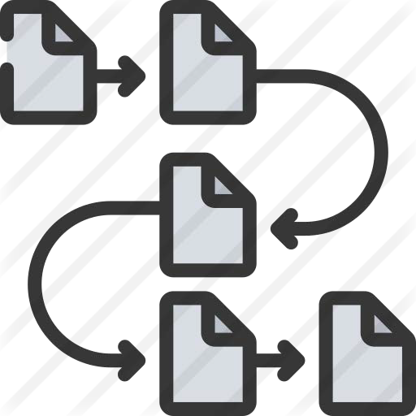

En Linux todo es un archivo, incluyendo dispositivos como discos duros, cdroms, memorias usb, etc., así como dispositivos de comunicación como puertos serial y paralelos, tarjetas de sonido, tarjetas de red etc, incluso también las consolas o terminales son dispositivos asociados a un archivo.

Estos dispositivos son enlazados (*linked*) a un dispositivo de **archivo**, es decir un dispositivo físico representado o asociado a un archivo.

Dichos archivos se encuentran en el directorio **/dev**, el cual veremos más adelante.

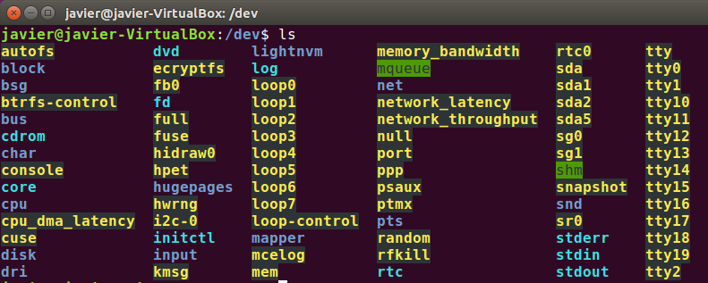

## Directorio dev

En la siguiente tabla se indica el *designador* de dispositivo y su descripción en **/dev**.

Se numeran secuencialmente de 0 hasta donde la arquitectura de hardware lo limite.

| **Tipo**    | **Dispositivo**                                                                                                                                          |
|-------------|----------------------------------------------------------------------------------------------------------------------------------------------------------|
| /dev/hd     | Discos duros IDE y dispositivos IDE antiguos.                                                                                                            |
| **/dev/sd** | Dispositivos de almacenamiento SATA como discos duros, SSDs, etc.                                                                                        |
| /dev/dsp    | Digital Signal Processor. Interfaz entre el software y la tarjeta de sonido.                                                                             |
| /dev/fd     | Unidades de disquetes.                                                                                                                                   |
| /dev/loop   | Se utiliza como abstracción de dispositivos en bloques para el montaje de sistemas de archivos como imágenes ISO. No confundir con el loopback de redes. |
| /dev/lp     | Puertos paralelos.                                                                                                                                       |
| /dev/mcblk  | Tarjetas SD/MMC de almacenamiento.                                                                                                                       |
| /dev/md     | Grupo de metadiscos. Utilizado en sistemas RAID.                                                                                                         |
| /dev/null   | Llamado bit bucket (cubo de bits). Usado para redirigir y descartar información .                                                                        |
| /dev/tty    | Terminales o consolas. *tty0* hace referencia a la propia terminal del usuario.                                                                          |
| /dev/pty    | Terminales remotas o de red, incluyendo las abiertas en Window X.                                                                                        |
| /dev/ttyS   | Puertos serial.                                                                                                                                          |
| /dev/random | Generador de números aleatorios del kernel.                                                                                                              |
| /dev/eth    | Tarjetas o interfaces de red Ethernet.                                                                                                                   |

## Gestión de discos

### Formateo de discos

El comando **mkfs** se utiliza para dar formato a un dispositivo de almacenamiento de bloque con un determinado **sistema de archivos**.

Su sintaxis es la siguiente:

    mkfs [parámetros] [-t sistemas archivos\*] dispositivo [tamaño]

| **Sistemas de archivos admitidos** | 
|------------|
| ext2       |
| ext3       | 
| ext4       | 
| fat        | 
| vfat       | 
| ntfs*      |

### Particionado de discos

El comando **fdisk** se utiliza desde la terminal de Ubuntu para realizar operaciones de particionamiento a través de comandos que veremos a continuación.

Para verificar las existentes utilizaremos *fdisk –l* y para mostrar las relativas a discos físicos sd usaremos *fdisk –l /dev/sd?*

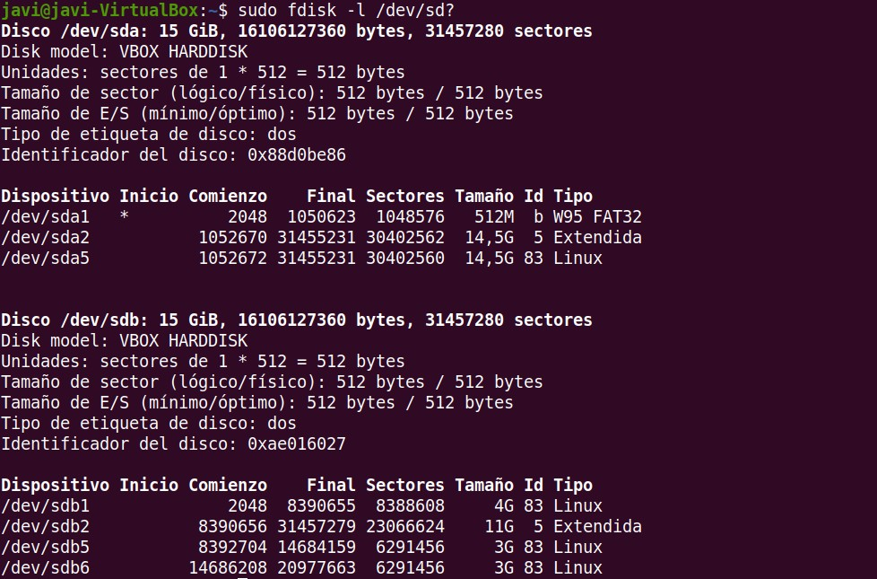

Para usar **fdisk** en <u>modo interactivo</u> indicaremos la partición sobre la que realizar la operación y aparecerá el siguiente menú:

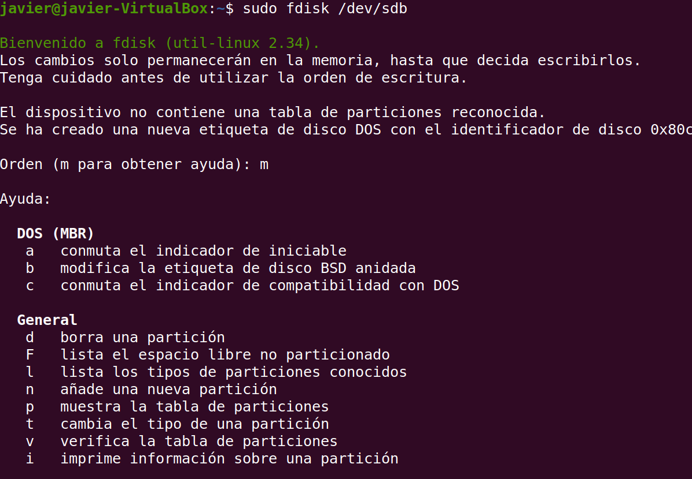

Las **opciones** más usadas del modo interactivo son las siguientes:

| **opción** | **Descripción**                              |
|------------|----------------------------------------------|
| d          | Borra una partición                          |
| l          | Lista los tipos de partición                 |
| m          | Muestra las opciones del menú                |
| n          | Crea una nueva partición                     |
| p          | Muestra las particiones actuales             |
| q          | Sale de fdisk sin guardar las modificaciones |
| t          | Cambia el tipo de partición                  |
| v          | Analiza la tabla de partición                |
| w          | Guarda los cambios y sale de fdisk           |

Creación de una nueva partición con **fdisk**:


- Las particiones primarias en **MBR** se numeran de 1 a 4 y las extendidas de 5 a n.

- En **GPT** las particiones se numeran de 1 a n.

### Montaje de discos

El sistema de archivos de Linux tal y como vimos sólo tiene una raíz y su estructura es independiente de los dispositivos de almacenamiento existentes. Esto implica que el procedimiento a emplear para acceder a la información almacenada en los distintos sistemas de almacenamiento de un ordenador no es tan sencilla como en Windows, y requiere un proceso llamado **montaje**.

```note
El **montaje** de ciertos dispositivos desde la interfaz de muchas de distribuciones modernas está automatizado. Cuando introducimos un disco en la unidad de DVD o insertamos un dispositivo USB o tarjeta, aparecerán automáticamente en el escritorio de Ubuntu iconos que representan los nuevos dispositivos conectados.
```

 

Los comandos **mount** y **umount** se utilizan para **montar dispositivos o particiones**, previamente formateados, y enlazarlos al sistema principal de archivos:

| **Comando** | **Uso**                                                                              | **Sintaxis**                                         |
|-------------|--------------------------------------------------------------------------------------|------------------------------------------------------|
| mount       | Usado para montar o asociar dispositivos de almacenamiento en el sistema de archivos | mount [-fnsrvw] [-t vfstype] [-o options] device dir |
| umount      | Usado para desmontar dispositivos de almacenamiento asociados al sistema de archivos | umount [-dflnrv] device dir                          |
| mkfs        | Orden usada para formatear dispositivos de almacenamiento o extraíbles               | Mkfs –t [fstype] –options –c –v – v –t               |

Cuando montamos un sistema de ficheros, indicamos un directorio del sistema de ficheros "padre", del cual va a colgar la estructura de directorios del sistema de ficheros "hijo". Así por ejemplo:

    mount [-t sistema de ficheros] [dispositivo] punto_montaje

Con el comando **mount** no solo tenemos la posibilidad de montar discos duros, si no también podremos montar imágenes ISO, sistemas de archivo remoto, etc.

Por ejemplo, para montar un CDROM:

    sudo mount -t iso9660 /dev/cdrom /media/cdrom

Para *montar/desmontar* una partición NTFS de Windows:

    sudo mount -t ntfs /dev/sda3 /mnt/windows
    sudo umount /mnt/windows/

Y para montar/desmontar una memoria USB:

    sudo mount –t vfat /dev/sdb1 media/usb
    sudo umount /media/usb  

Montaje de un imagen ISO descargada en /home:

    sudo mount /home/usuario/Kalinux_64.iso /mnt/iso

El directorio **/mnt/** se utiliza generalmente para montajes temporales y el **/media/** para extraíbles

Pasos para el montaje de un disco desde su creación en la MV y formateo:

1.  Crear un **disco Virtual** de tipo sd con la máquina de Linux apagada. A continuación arrancarla normalmente.

2.  Darle **formato** al disco en */dev/sd\** usando el comando mkfs y el sistema de archivos:
    *sudo mkfs –t ext4 /dev/sdb*

3. Crear la carpeta o directorio en *mnt* donde desees montar dicho disco:
*sudo mkdir /mnt/midisco*

4. Proceder al **montaje** del disco en dicha carpeta volviendo a indicar el sistema de archivos:
sudo mount –t ext4 /dev/sdb /mnt/midisco

### Montaje en el arranque

El archivo **fstab** (*File System Table*) se encuentra en el directorio /etc/fstab y se utiliza durante el arranque para leer distintos dispositivos de bloques o sistemas de archivos remotos deben ser montados e integrados en el sistema.

Su formato es el siguiente:

| Dispositivo \*UUID \<file system\> | Punto de montaje \<dir\> | Sistema de archivos \<type\> | Opciones sistema archivos \<options\> | Manejo backups \<dump\> | Orden chequeos \<pass\> |
|------------------------------------|--------------------------|------------------------------|---------------------------------------|-------------------------|-------------------------|

| \# \<file system\> | \<dir\> | \<type\> | \<options\> | \<dump\> | \<pass\> |
|--------------------|---------|----------|-------------|----------|----------|
| /dev/sda1          | /       | ext4     | defaults    | 1        | 1        |
| /dev/sdb1          | /usr    | ext4     | defaults    | 1        | 2        |
| /dev/sda5          | swap    | swap     | defaults    | 0        | 0        |

**\<file system\>** ruta en dev

**\<dir\>** directorio de montaje

**\<type\>** ext2, ext3, reiserfs, xfs, jfs, smbfs, iso9660, vfat, ntfs, swap, and auto

**\<options\>** auto, noauto, exec, noexec,ro, rw, async, flush, user, nouser, suid, nosuid, *defaults*

**\<dump\>** usado por la utilidad *dump* para decidir si hacer backup en caso de 1

**\<pass\>** fsck lee el número para determinar el orden en el que los sistemas de ficheros deberían chequearse.

Lo habitual es que el archivo **fstab** use el siguiente formato, usando un identificador

*UUID* en lugar de los puntos de montaje vistos anteriormente:

| \# \<file system\> \<dir\>                      | \<type\> | \<options\> | \<dump\> | \<pass\> |
|-------------------------------------------------|----------|-------------|----------|----------|
| UUID=0a3407de-014b-458b-b5c1-848e92a327a3 /     | ext4     | defaults    | 1        | 1        |
| UUID=b411dc99-f0a0-4c87-9e05-184977be8539 /home | ext4     | defaults    | 0        | 0        |
| /                                               |          |             |          |          |

El **UUID** (*Universally Unique Identifier*) es un identificador único para cada sistema de ficheros. Al utilizar el UUID en lugar de la referencia física de conexión podremos cambiar las conexiones de los discos sin que los puntos de montaje se vean afectados.

### Chequeo de discos

**fsck** (*file system check*) es el comando de Linux que permite verificar y reparar, en caso de ser necesario, un sistema de archivos de una forma segura.

Si se utiliza con el parámetro **–N,** sólo se desplegará la información de la unidad seleccionada:

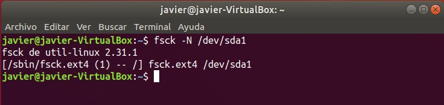

No se debe de utilizar **fsck** en unidades montadas, ya que existen posibilidades de que el bloqueo de la unidad dañe permanentemente su sistema de archivos.

❗ Antes de ejecutar fsck, se debe primeramente **desmontar** la unidad a analizar.

### Comando df (disk free)

El comando **df** (*disk free*) muestra detalles acerca de los sistemas de archivos montados, es decir, detalla el espacio total, ocupado y libre de nuestro sistema.

Al ejecutarse sin opciones, el comando muestra el espacio disponible en todos los sistemas de archivos montados al momento.

Es aconsejable el parámetro *-h*, para que facilite la lectura en Gb, Mb o Kb.

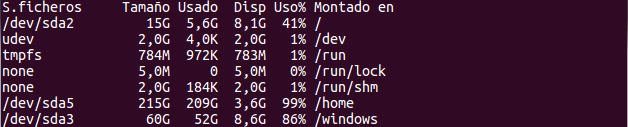

También podemos investigar el espacio libre y ocupado de determinados tipos de sistemas de archivos en particular. Para esto utilizamos la opción -t seguido del tipo de sistema de archivo que nos interese.

### Comando du (disk usage)

El comando **du** (*disk usage*) es el comando estándar de Linux para estimar el uso de espacio en disco de un archivo, directorio en particular o archivos.

El comando se desplazará de forma recursiva a través de todos los archivos y subdirectorios dentro del directorio especificado.

Por ejemplo, el espacio gastado en disco usando **du –shc ./\*** desde la raíz

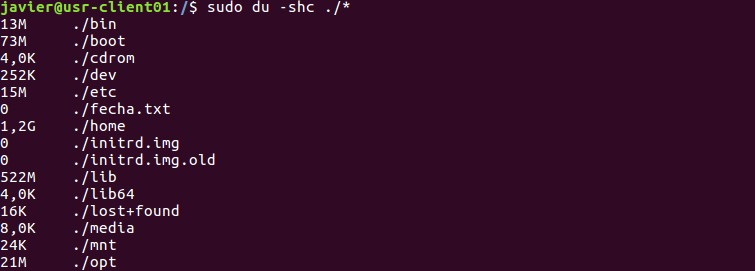

### Información de discos

El comando **lsblk** es útil ya que muestra información de todos los dispositivos de bloque del sistema y sus puntos de montaje:

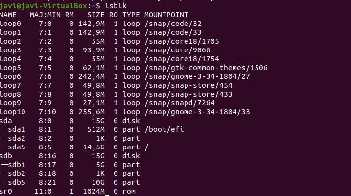

En Linux las particiones en *MBR* se mostrarán de la siguiente forma:

-   Las nombradas de la 1 a la 4 son particiones **primarias**
-   Las nombradas a partir de la 5 son particiones **lógicas**

Los **loop devices** (*loop0, loop1*..) que aparecen listados en los comandos vistos anteriormente y en el directorio dev, son dispositivos virtuales que se utilizan para acceder a un fichero como un dispositivo de bloques.

Linux (y la gran mayoría de sistemas *UNIX*) dispone de un mecanismo que permite montar un fichero (previamente formateado) como si fuese un disco duro, normalmente sin tabla de particiones. Este tipo de archivos se usan a veces para almacenar imágenes ISO de discos y posteriormente montarlas.

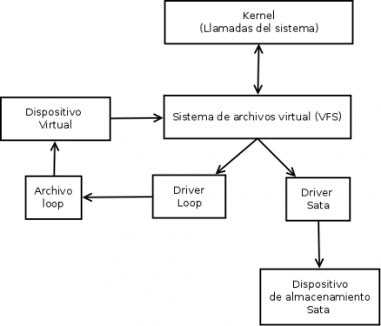

**blkid** es otro comando que sirve para mostrar atributos como el *UUID* y el tipo de sistema de archivos de los dispositivos de bloque (particiones y volúmenes de almacenamiento).

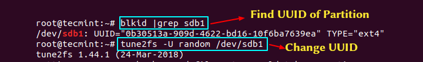

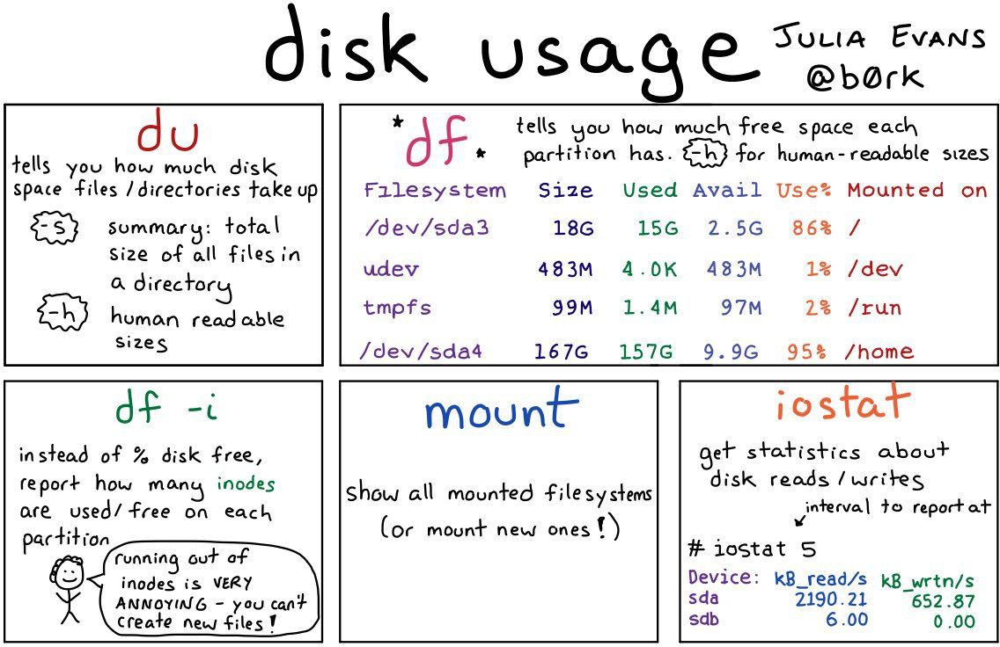

Listado de comandos de **administración de discos** destacados:

| **Comando** | **Descripción**                                                                         |
|-------------|-----------------------------------------------------------------------------------------|
| **mount**   | Montar sistemas de ficheros en un punto de anclaje                                      |
| **umount**  | Desmontar sistemas de archivos de un punto de anclaje                                   |
| **mkfs**    | Dar formato a un dispositivo o partición                                                |
| **fsck**    | Chequear el estado de un sistema de archivos concreto                                   |
| **du**      | Uso de espacio en disco.                                                                |
| **df**      | Mostrar espacio libre en disco.                                                         |
| **lsblk**   | Enumera información sobre todos los dispositivos de bloque disponibles o especificados. |
| **blkid**   | Información de UUID del disco.                                                          |
