# UT12.2 Administración de Linux: usuarios y permisos

## Usuarios y grupos

Linux como sabemos es un sistema operativo **multiusuario**, característica que permite por tanto ser utilizado por múltiples usuarios al mismo tiempo, compartiendo procesador, memoria, almacenamiento, aplicaciones y periféricos.

Para que múltiples usuarios puedan utilizar el sistema de forma segura y ordenada, es necesario que el sistema disponga de mecanismos de administración y seguridad para la protección de los datos de cada uno de los usuarios, así como herramientas que permitan su correcto funcionamiento.

Los usuarios del sistema pueden acceder a este de manera **local** y **remota**, siendo esta última manera la más común en este tipo de sistemas.


## Usuarios y grupos locales

```note
Cada usuario se identifica por un User ID o **UID** así como por su Group ID o **GID** asociado, que por defecto tiene su mismo nombre.
```

💡 En general, a los usuarios generados se les asigna un UID igual o superior a *1000*. Los comprendidos entre *0-100* quedan reservados a usuarios especiales del sistema.

Los diferentes **tipos de usuarios** en Linux:

-   **Root o superusuario** (\#) (**UID=0**): es el único que tiene privilegios sobre todo el sistema, y responsable de las tareas de administración del sistema, tales como la instalación y desinstalación de software, entre otras muchas. Para cualquier acción que necesite permisos de superusuario, el sistema requerirá credenciales root.
-   **Usuarios especiales de sistema**: van vinculados a ciertos servicios, y que pueden asumir ciertos privilegios relativos a este servicio. Se crean automáticamente en la instalación del sistema o de ciertas aplicaciones. Por ejemplo *mail, apache, syslog..*
-   **Usuarios estándar** (\$)**:** Las cuentas de usuarios individuales con login. Puede haber tantas como se requiera. Cada usuario estándar posee su directorio personal dentro de /home

Cada usuario tiene asociada una **cuenta de usuario** concreta (en este curso solo veremos las cuentas locales).

Dichas cuentas no solo ofrecen al usuario un nombre y una contraseña, también le proporciona una ruta para almacenar sus documentos y su perfil, generalmente dentro de la carpeta **/home/nombre-usuario** y comúnmente denominada carpeta home del usuario, y un intérprete de comandos (**shell**) que le permitirá ejecutar aplicaciones.

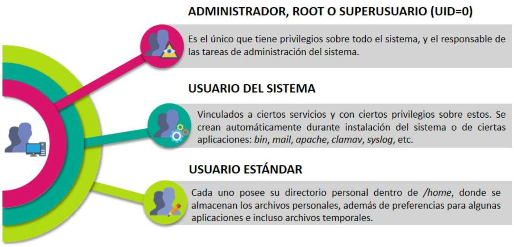

### Superusuario root

Como hemos comentado el usuario **root** (UID=0) en Linux es el usuario que posee mayor nivel de privilegios en el sistema. Es el único que tiene privilegios sobre todo el sistema, y el responsable de las tareas administrativas: instalaciones, modificaciones, configuraciones, etc.

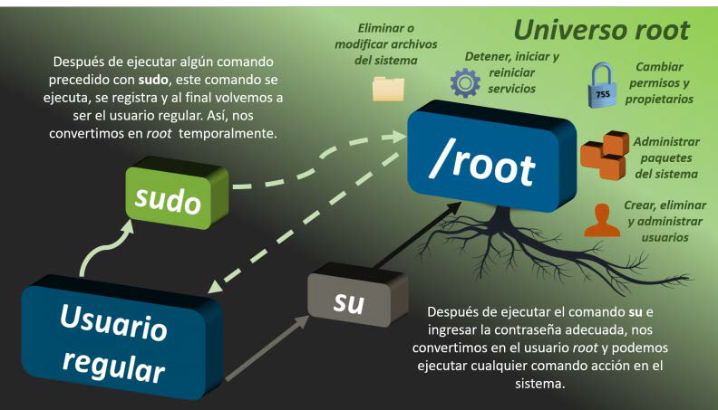

Mediante el comando **sudo** en la línea de comandos se permite al usuario actual, ejecutar aplicaciones o procesos bajo los privilegios de root u otro usuario.

❗ Iniciar sesión de continuo como usuario root es una práctica poco recomendada (sudo su) ya que mantener abierta permanentemente una sesión de usuario root podría traer graves consecuencias e inutilizar el sistema.

### Ficheros importantes

La información sobre usuarios, grupos y contraseñas se guarda en los archivos:

-   **/etc/passwd**: información sobre usuarios
-   **/etc/group**: información sobre grupos
-   **/etc/shadow**: contraseñas cifradas

Dichos ficheros contiene diversos campos separados por dos puntos que estudiaremos a continuación y se puede visualizar su contenido mediante **cat**.

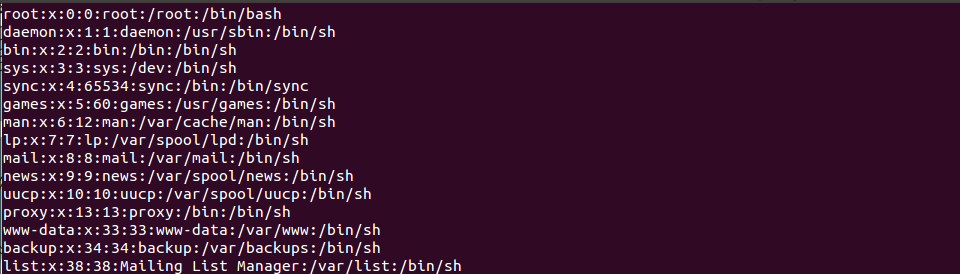

Estructura del fichero **/etc/passwd** con el significado de cada para uno de sus <u>campos</u> separados por dos puntos:

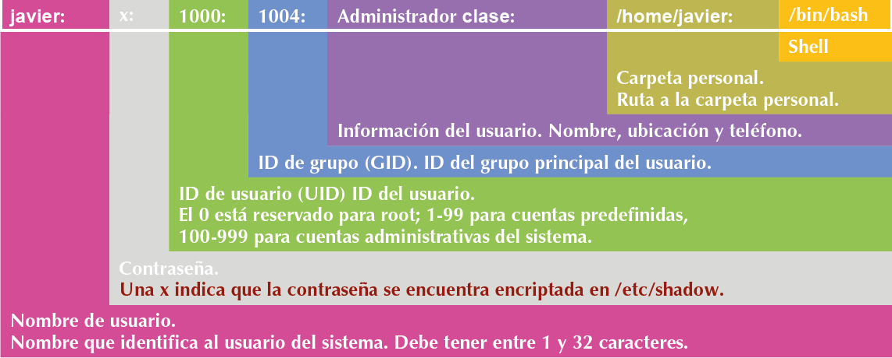

Estructura del fichero **/etc/shadow** con el significado de sus <u>campos</u>:

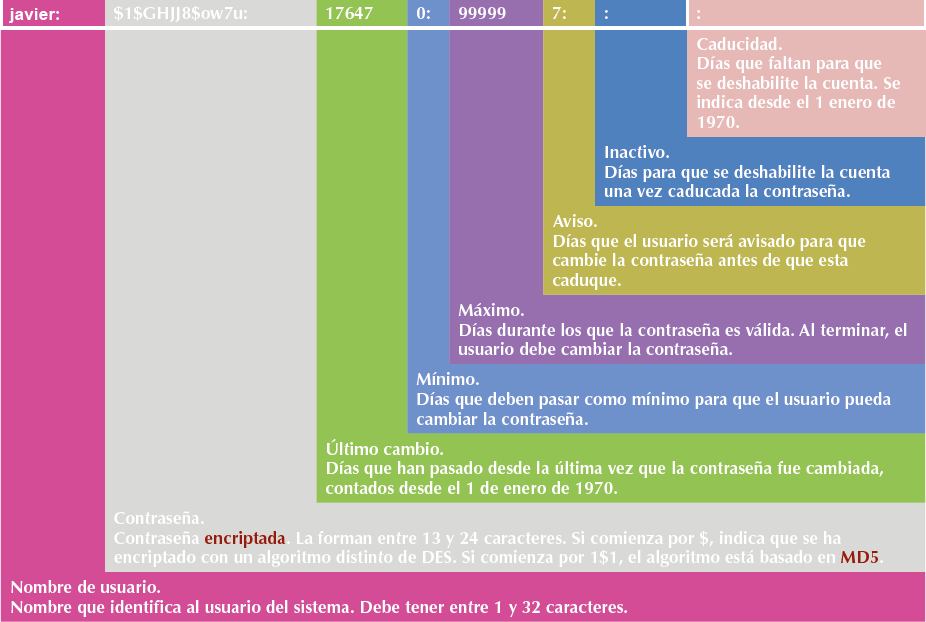

Estructura del fichero **/etc/group** con el significado de sus <u>campos</u>:

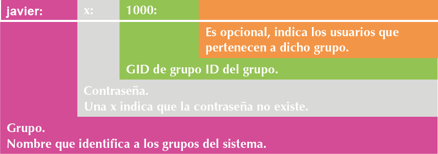

Para mostrar la información de duración de contraseñas de forma más compresible que en el fichero **/etc/shadow** se puede usar el comando **chage –l usuario**:

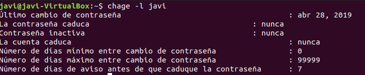

### Privilegios de administrador

Es posible que un usuario estándar necesite disponer de **privilegios de administrador** y poder realizar acciones como **sudo**.

Ello se puede llevar a cabo de dos formas:

1.  Editando el fichero **/etc/sudoers**.

    Añadir el usuario al fichero, por lo que habría que añadir una línea como esta:

        Nombre_usuario ALL=(ALL:ALL) ALL

1.  Editando el fichero **/etc/group**

    Si, en el fichero */etc/sudoers* ya existe una línea referente al grupo *sudo* (o *admin)* como se debe incluir al usuario a uno u otro grupo como secundario editando el fichero */etc/group* (o agregarlo mediante usermod) a dichos grupos.

### Comandos de usuarios

Los comandos más importantes para la gestión de **usuarios locales**:

| **Comando** | **Acción**                                          | **Ejemplo**                |
|-------------|-----------------------------------------------------|----------------------------|
| **useradd** | agregar usuarios                                    | useradd –g users usuario   |
| **adduser** | agregar usuario mediante un script\*                | adduser usuario            |
| **usermod** | modificar usuarios                                  | usermod –d /home/javi user |
| **userdel** | borrar usuarios                                     | userdel –r usaurio         |
| **deluser** | borrar usuario mediante un script\*                 | deluser usuario            |
| **passwd**  | establecer contraseña a un usuario                  | passwd usuario             |
| **chage**   | visualizar o establecer duración de contraseñas     | chage –l usuario           |
| **who**     | usuarios actualmente logueados.                     | who o w                    |
| **id**      | Muestra la identidad del usuario (UID) y sus grupos | id usuario                 |

💡 **adduser** y **deluser** utilizan un script más elaborado para agregar o eliminar usuarios

### Agregar usuarios/grupos

```note
Para **agregar** un usuario de forma sencilla usaremos el comando **useradd.** 
```
Su sintaxis:

    useradd [opciones] [nombre_de_usuario]

Parámetros:

    -d Especifica el directorio home del usuario
    -s Especifica el shell del usuario
    -g Especifica el grupo primario del usuario
    -G Especifica los grupos secundarios del usuario
    -uid Especifica el identificador de usuario para el usuario

💡 Después de crear un usuario con useradd conviene siempre recordar que hay que asignarle a continuación contraseña con el comando **passwd.**

```tip
Para **agregar** grupos se utiliza **groupadd** 
```
Con la siguiente sintaxis:

    groupadd [opciones] [nombre_de_usuario] 
    
Parámetros:

    -g GID Especifica ID para el grupo, el cual debe ser único y mayor que 499

### Modificar usuarios

```tip
Para **modificar** las propiedades de un usuario ya existente se utiliza **usermod** 
```
La sintaxis del comando:

    usermod [parámetros] [nombre_de_usuario]

Parámetros:

    -C Agrega un nuevo valor al campo de comentarios del usuario
    -d Especifica un nuevo directorio home para el usuario
    -g Cambiar el grupo primario del usuario
    -G Cambiar los grupos secundarios del usuario
    -s Cambiar el Shell por defecto del usuario
    -L Bloquea la contraseña del usuario
    -u Cambiar el UID asignado (siempre \> 1000)
    -e Fecha en la que estará deshabilitada la cuenta de usuario (formato AAAA-MM-DD)

### Gestión de contraseñas

```tip
Para la **gestión de contraseñas** se utiliza el comando **chage** 
```

La sintaxis del comando:

    chage [parámetros] [usuario]

Parámetros:

    -l Muestra información sobre la antigüedad de la cuenta
    -d Establece el último día que se cambió la contraseña. Si se pone valor 0 obligará al usuario a cambiar la contraseña en su próximo acceso.
    -m Establece el número mínimo de días entre cambios de contraseña. Si se establece en un valor de 0, indica que el usuario puede cambiar su contraseña en cualquier momento.
    -M Establece el número máximo de días durante los cuales una contraseña es válida.
    -E Establece una fecha concreta de caducidad de una cuenta escrita en formato AAAA-MM-DD

```tip
Para la modificación de contraseñas se utiliza el comando **passwd** 
```

Su sintaxis:

    passwd [parámetros] [nombre_de_usuario]

Parámetros:

    -a informa del estado de las contraseñas de todas las cuentas
    -d | borra la contraseña para la cuenta indicada    
    -l | bloquea la contraseña de la cuenta indicada  
    -u | desbloquea la contraseña de la cuenta indicada 
    -w establece el aviso de caducidad a los días indicados
    -n establece el número mínimo de días antes de que se cambie la contraseña

### Uso de los comandos

💡 **useradd** es un comando que ejecuta un binario del sistema, mientras que **adduser** es un script en *perl* que utiliza el comando useradd. Es más completo ya que crea el *home, pide contraseña* y hace verificaciones pero no está en todas las distribuciones. Igual con **deluser** que además elimina sus ficheros y directorios del home.

Crear al usuario con useradd es el primer paso, el segundo es asignarle una contraseña. Esto se logra con el comando **passwd**, que permite ingresar la contraseña y su verificación. Para verificar el *id* del usuario y grupo usar **id**.

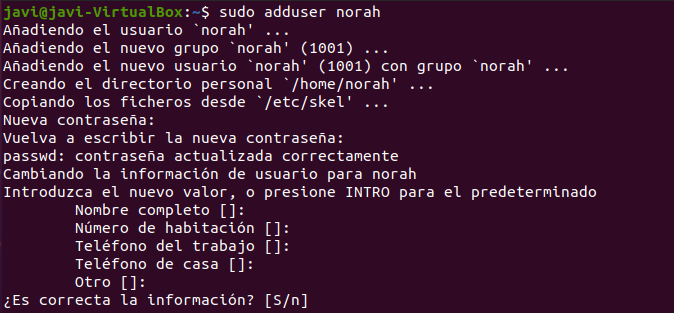
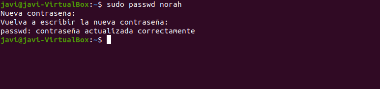
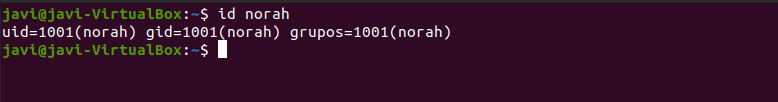

💡 **passwd** tiene varias opciones que permiten bloquear la cuenta -l, desbloquearla -u, y varias opciones más que controlan la vigencia de la contraseña, es decir, es otro modo de establecer los valores de la cuenta en */etc/shadow*.

### Comandos de grupos

Los comandos más importantes para la gestión de **grupos**:

| **Comando**  | **Acción**                                    | **Ejemplo**                 |
|--------------|-----------------------------------------------|-----------------------------|
| **groupadd** | crear un grupo                                | groupadd alumnos            |
| **groupmod** | modificar grupo                               | groupmod –g 2000 profesores |
| **groupdel** | borrar grupo                                  | groupdel profesores         |
| **adduser**  | añadir usuario a un grupo                     | adduser juan profesores     |
| **deluser**  | eliminar usuario de un grupo                  | deluser juan profesores     |
| **groups**   | ver los grupos a los que pertenece un usuario | groups juan                 |


Todos los usuarios pertenecen al menos a un grupo que es el **grupo principal del usuario**, también llamado grupo primario del usuario, pero pueden pertenecer a más grupos. En caso de que pertenezcan a más grupos, éstos serán **grupos secundarios**.

💡 El fichero de contraseñas de usuarios es el */etc/gshadow*

Ubuntu dispone a su vez de una herramienta gráfica de administración de usuarios que es **users-admin** (paquete *system-tools*). Para ejecutarla podemos abrir una consola de root y ejecutar users-admin o desde el menú *configuración\>cuentas de usuario*

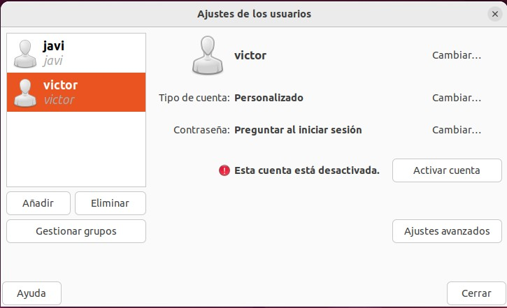

## Permisos

```note
💡 Los permisos en Linux funcionan utilizando el mismo esquema que en Unix; se aplican sobre archivos o sobre directorios y van asociados a usuarios o grupos pudiendo ser de lectura, de escritura o de ejecución.
```

Todos los archivos y directorios en Linux tienen asociado un conjunto de permisos que debe definir las posibilidades de lectura, escritura y ejecución que se aplican al usuario propietario del archivo, al grupo de usuarios al que pertenece, y al resto del mundo.

Existen por tanto tres tipos de permisos **generales** en Linux ya conocidos:

-   Permiso de lectura **(r)**
-   Permiso de escritura **(w)**
-   Permiso de ejecución **(x)**

En la siguiente tabla se muestran los permisos necesarios para ejecutar determinados <u>comandos conocidos</u>:

| **Comando** | **Permisos directorio** **origen** | **Permisos fichero** | **Permisos directorio** **destino** |
|-------------|------------------------------------|----------------------|-------------------------------------|
| cd          | x                                  | No aplicable         | No aplicable                        |
| ls          | r                                  | No aplicable         | No aplicable                        |
| mkdir       | w, x                               | No aplicable         | No aplicable                        |
| rmdir       | w, x                               | No aplicable         | No aplicable                        |
| cat         | x                                  | r                    | No aplicable                        |
| rm          | w, x                               |                      | No aplicable                        |
| cp          | x                                  | r                    | w, x                                |
| mv          | w, x                               |                      | w, x                                |

### Privilegios

De entrada, en cualquier fichero o directorio en Linux hay tres tipos o niveles de **privilegios** a los que van dirigidos los permisos anteriores:

-   **Permisos del Usuario (U).** Es el primer nivel de privilegios. Básicamente representa los permisos que se aplican al propietario de un determinado fichero o directorio.
-   **Permisos del Grupo (G)**. Estamos ante el segundo nivel de privilegios, que define los derechos de lectura, escritura y ejecución que se aplican solo a aquellos usuarios que pertenecen al mismo grupo que el propietario del fichero.
-   **Permisos de Otros (O)**. Este es el último nivel. Representan los privilegios de lectura, escritura y ejecución por parte del resto de usuarios que no entran en ninguno de los niveles anteriores.

### Representación de permisos

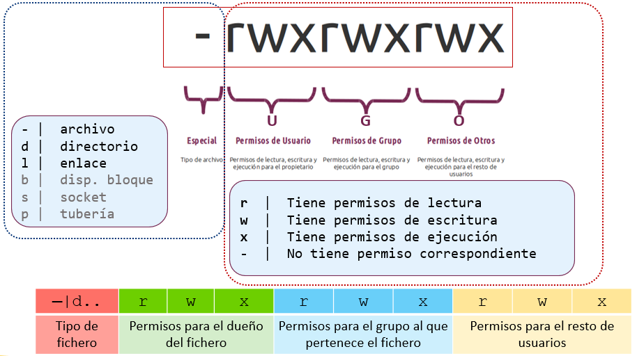

Cada archivo en Linux queda identificado por 10+1 caracteres mismos a los que se les denomina máscara. Se pueden mostrar mediante el comando **ls -l**

El significado de todos los **campos y permisos** en dicho comando será:

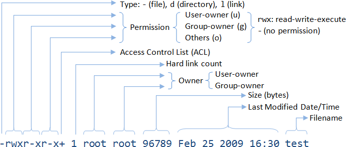

El significado de los **permisos** varía en caso de tratarse de un archivo o de un directorio, lo cual puede ser problemático:

| **Permiso**   | **Aplicación** | **Descripción**                                                                    |
|---------------|----------------|------------------------------------------------------------------------------------|
| Lectura (R)   | Archivo        | Lectura del contenido del archivo.                                                 |
| Lectura (R)   | Directorio     | Listar los archivos que están contenidos en el directorio (ls).                    |
| Escritura (W) | Archivo        | Lectura y modificación del contenido del archivo. Eliminación del archivo.         |
| Escritura (W) | Directorio     | Eliminar carpeta. Crear subdirectorios dentro de ella.                             |
| Ejecución (X) | Archivo        | Ejecución de archivos binarios                                                     |
| Ejecución (X) | Directorio     | Posicionarnos (cd). Acceso a propiedades y contenido de archivos y subdirectorios. |

También existe una representación numérica en **octal**, que parte de idea de la representación anterior, pero sustituye cada grupo **r w x** (y los especiales) por un valor **numérico que sumar** en caso de tener dicho <u>permiso</u>.

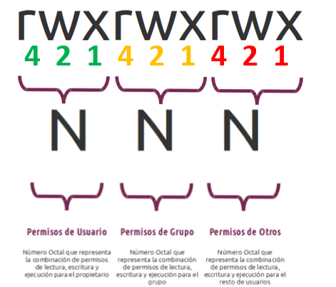

La siguiente tabla muestra la forma de asignar permisos en ambas notaciones:

| **Permisos normales**    | **Valor octal** | **Notación** **simbólica** |
|--------------------------|-----------------|----------------------------|
| **Propietario**: Lectura | 400             | u+r                        |
| Escritura                | 200             | u+w                        |
| Ejecución / Acceso       | 100             | u+x                        |
| **Grupo**: Lectura       | 40              | g+r                        |
| Escritura                | 20              | g+w                        |
| Ejecución / Acceso       | 10              | g+x                        |
| **Otros**: Lectura       | 4               | o+r                        |
| Escritura                | 2               | o+w                        |
| Ejecución / Acceso       | 1               | o+x                        |

### Modificación de permisos

Habiendo entendido lo anterior, es ahora fácil cambiar los permisos de cualquier archivo o directorio, utilizando para ello el comando **chmod** (*change mode*), cuya sintaxis es la siguiente:

    chmod [parámetros] permisos archivo

💡 El parámetro **–R** aplicará los permisos de forma recursiva a los subdirectorios.

Existen dos variantes para aplicar permisos, usando letras o los valores octales como veremos con ejemplos a continuación:
-  **1ª Forma**: chmod [u,g,o][+,-][r,w,x] ruta-directorio
-  **2ª forma**: chmod [valor] ruta-directorio


#### 1ª Forma

Ejemplos:

- Dar permiso de escritura al usuario propietario sobre *'examen.txt'*: 

        chmod u+w examen.txt

- Quitar permiso de escritura al resto de usuarios sobre el archivo anterior:

        chmod o-w examen.txt

- Dar permiso de ejecución al grupo propietario sobre <u> todos los archivos</u>: 

        chmod g+x *

- Dar permiso de lectura al grupo propietario sobre *'examen.txt'*:

        chmod g+r examen.txt

- Dar permiso de escritura al usuario y quitar el de lectura a grupos y otros: 

        chmod u+w, go-r

- Dar permisos de escritura a usuarios y grupos:

        chmod ug+w

#### 2ª Forma

- Dar todos los permisos al usuario y ninguno al grupo ni al resto del fichero *'examen.txt'*: 

        chmod 700 examen.txt

- Dar a usuario y grupo permisos de lectura y ejecución, ninguno al resto: 

        chmod 550 examen.txt

- Dar todos los permisos al usuario así como lectura y ejecución a los demás:

        chmod 755 examen.txt

-  Dar todos los permisos al usuario y de lectura al resto, sobre todos los archivos de texto que contenga el directorio:

        chmod -R 744 *

-  Dar permisos completos a todos los usuarios al directorio /respaldo/

        chmod 777 /respaldo/ 

- Cambiar permisos a lectura y escritura a <u>todos los archivos incluyendo subdirectorios</u>:

        chmod -R 555


### Máscaras

```note
Es importante saber que al crear un fichero o directorio, se creará por unos permisos por defecto llamados **máscara** que pueden visualizarse o modificarse a través del comando **umask.**
```

Normalmente el valor por defecto de **umask** suele ser **002**. Podemos averiguarlo simplemente ejecutando el comando *umask*.

💡 Los ficheros y directorios tienen definidos por defecto unos permisos base, **666** para los ficheros y **777** para los directorios.

Este será por tanto el valor a restar usando el resultado de la **máscara** devuelto por **umask**:

- Por eso, al crear un fichero, su permiso inicial será **664** (-rw-r–r–), valor resultante de realizar la operación *666 -* **002**.
- Al crear un directorio, su permiso inicial será **775** (drwxr-xr-x), resultado de *777 -* **002**.


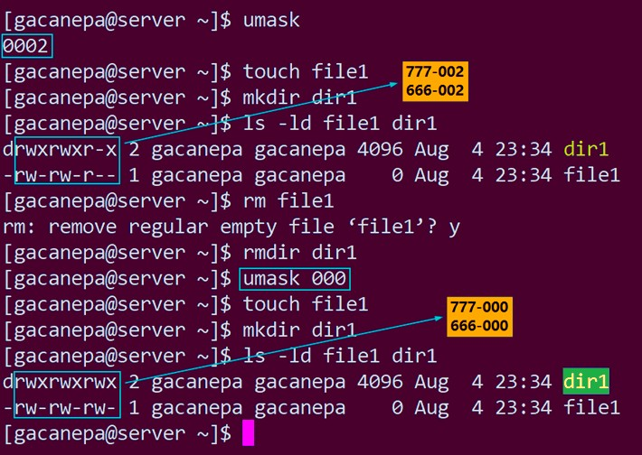

### Modificación de propietario

```tip
El comando **chown** (*change user*) permite cambiar el propietario de un archivo o directorio en sistemas tipo UNIX. 
```

Puede especificarse tanto el nombre de un usuario, así como el identificador de usuario (UID) y el identificador de grupo (GID).

Opcionalmente, utilizando un signo de dos puntos (:), o bien un punto (.), sin espacios entre ellos, entonces se cambia el **usuario y grupo** al que pertenece cada archivo. Con el parámetro **–R** se hará el cambio de propietario de forma recursiva.

    chown [parámetros] archivo

Ejemplos:

    # cambiar usuario propietario
    chown root tmpfile
    # cambiar grupo propietario
    chown :profesores tmpfile
    # cambiar usuario y grupo propietario
    chown root:profesores tmpfile


---


Comandos importantes para la gestión de **permisos**:

| **Comando** | **Acción**                               | **Ejemplo**             |
|-------------|------------------------------------------|-------------------------|
| **chmod**   | cambiar permisos fichero o directorio    | chmod 750 mifichero.txt |
| **chown**   | cambiar propietario fichero o directorio | chown root prueba.txt   |
| **chgrp**   | cambiar grupo fichero o directorio       | chgrp alumnos notas.doc |
| **umask**   | máscara de permisos por defecto          | umask 025               |

---


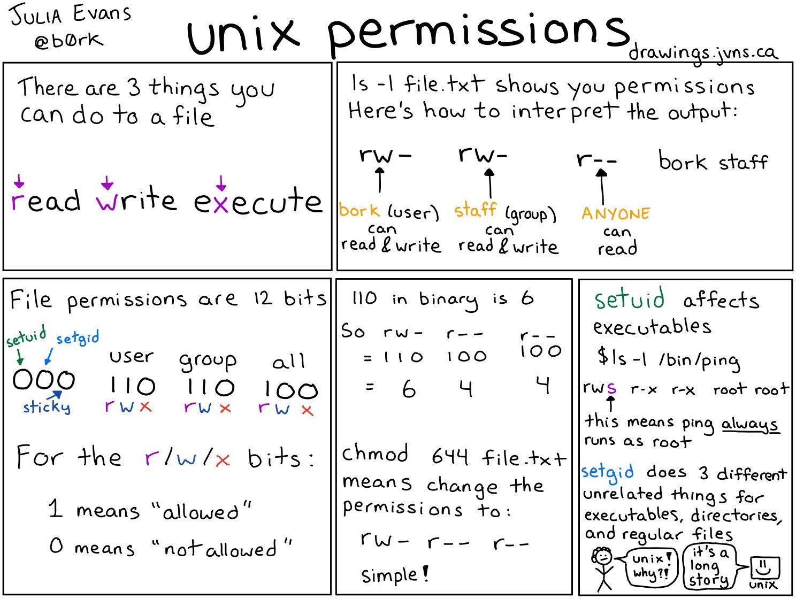

## Creación de plantillas de usuarios

Las **plantillas de usuarios** permiten ahorrar tiempo en la creación de usuarios cuando su número aumenta. Son como moldes que poseen la configuración básica para crear a partir de ellos el resto de usuarios.

La creación de plantillas de usuarios en Linux se basa en la utilización de:

-   **Archivos** que se copian en la creación de un usuario para configurar su entorno personal. Estos archivos se configuran en el directorio /etc/skel/
-   **Parámetros** que se dan por defecto a los usuarios en su creación. Es decir, nosotros podemos especificar en la creación los parámetros de los usuarios, pero si no lo hiciéramos estos serían tomados del archivo /etc/login.defs visto anteriormente.

Cuando se crea un **usuario**, el sistema realiza lo siguiente:

1.  Copia los archivos que se encuentran en el directorio /etc/skel en el directorio de inicio del nuevo usuario.
2.  Establece al usuario y al grupo del usuario que se está creando como propietario y grupo de estos archivos copiados.

Gracias a esto, cuando creamos los usuarios podemos controlar la apariencia de su escritorio, sus variables de entorno, sus alias y muchos otros parámetros de su entorno.
