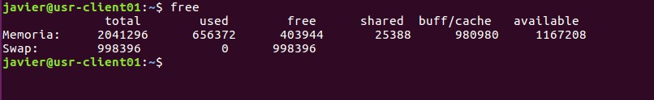
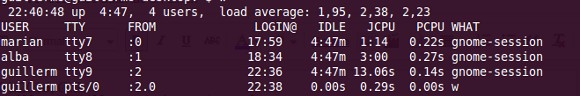
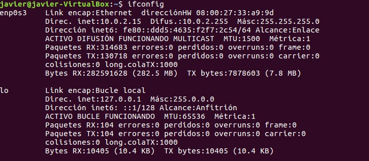
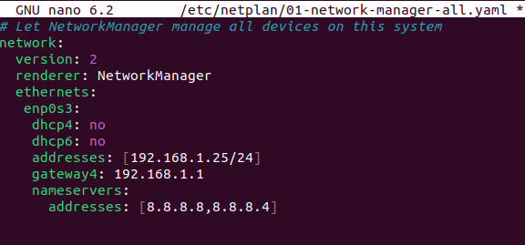
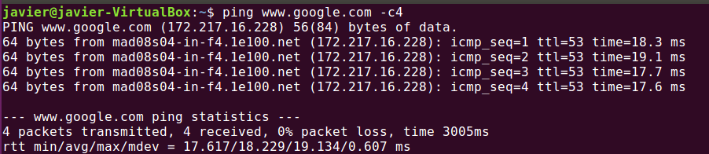
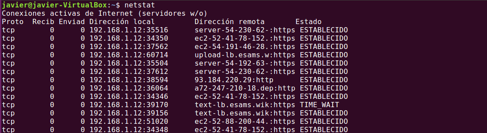
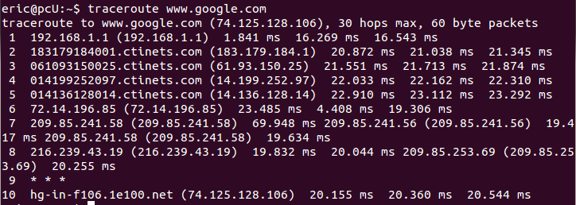
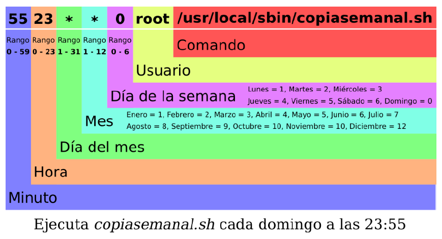

# UT 12.2 Administración de Linux. Información, redes y tareas

## Información del sistema

**uname**

Muestra información del sistema *(versión del SO, Kernel, procesador)*

```bash
# Procesador instalado en el equipouname -p
Intel(R) Core(TM) Duo CPU T2450  @ 2.00GHz
# versión del kernel
uname -r
2.6.22.9-laptop-1mdv
# Toda la información de uname a través de la opción -a
uname -a
Linux segolap 2.6.22.9-laptop-1mdv #1 SMP Thu Sep 27 04:17:10 CEST 2007 i686 Intel(R) Core(TM) Duo CPU T2450  @ 2.00GHz GNU/Linux
```

**free**

Estado de la memoria ram y swap del equipo.



**uptime**

Este comando indica la hora actual el tiempo que el sistema está en marcha, el número de usuarios conectados y la carga promedio del sistema para los últimos 1, 5 y 15 minutos.


**last y lastb**

El comando **last** muestra un listado de los últimos usuarios logueados al sistema e información relevante, mientras que **lastb** (*last bad*), muestra los últimos intentos de logueo al sistema que fracasaron.

**w o who**

Muestra que usuarios están logueados actualmente en el sistema y lo que están haciendo.



**date**

Comando ya conocido, que muestra la fecha y hora del sistema, pudiendo cambiar su formato de salida.

Listado de comandos de **información del sistema** vistos:

| **Comando** | **Descripción**                                                             |
|-------------|-----------------------------------------------------------------------------|
| **uname**   | Mostrar información del sistema: versión, kernel de Linux y otros detalles. |
| **free**    | Estado de la memoria RAM y *swap* ocupados.                                 |
| **uptime**  | Tiempo e información desde que el sistema ha estado funcionando.            |
| **last**    | Últimos accesos al sistema.                                                 |
| **lastb**   | Últimos accesos erróneos al sistema.                                        |
| **w, who**  | Usuarios logueados en el sistema.                                           |

## Gestión de redes

Las **direcciones IP** son uno de los elementos de red que son fundamentales a la hora de gestionar redes ya que nos permiten realizar tareas de gestión como:

-   Conectar el equipo a la red local o Internet.
-   Definir donde se encuentra el equipo y su estado de actividad.
-   Verificar servicios y muchas más.

    Contamos con dos posibilidades a la hora de gestionar las direcciones IP en cualquier tipo de sistema:

-   **DHCP**: Mediante esta opción se configura un servidor para que distribuya de forma dinámica todas las direcciones IP las cuales se han establecido en un rango definido anteriormente pero con este método las direcciones IP cambian de forma frecuente.
-   **Estática**: Al usarse esta alternativa definimos una dirección IP fija para el equipo la cual solo puede ser modificada de forma manual.

### Interfaces de red

Las interfaces de red también conocidas como NIC (*Network Interface Card*) utilizaban un identificador en Linux que solía llamarse:

| **Interfaz** | **descripción**                                 |
|--------------|-------------------------------------------------|
| eth0         | Primera interfaz de red Ethernet cableada local |
| eth1         | Segunda interfaz de red Ethernet cableada local |
| wlan0        | Primera interfaz de red inalámbrica             |
| lo           | Interfaz loopback (localhost)                   |

A partir de la versión **15.10** de Ubuntu estas nomenclaturas han cambiado y reciben el nombre de *Ethernet Interface Logical Name*. Sus nuevas nomenclaturas son:

| **Interfaz** | **equivalencia**        |
|--------------|-------------------------|
| enp0s3       | El equivalente de eth0  |
| enp0s8       | El equivalente de eth1  |
| wlp1s0       | El equivalente de wlan0 |

### Comando ifconfig

Para identificar, mostrar y configurar las redes de las interfaces del sistema se utiliza el comando **ifconfig.**



Si a **ifconfig** se le añade el nombre de la interfaz, presentará la información de dicha interfaz. Si indicamos una dirección IP le asignaremos una dirección estática.

La sintaxis del comando es la siguiente:

    ifconfig interfaz [dirección [parámetros]]

Ejemplos de utilización del comando **ifconfig**:

```bash
#Obtener información de un adaptador de red:
ifconfig enp0s3

#Deshabilitar un adaptador de red:
ifconfig enp0s3 down

#Habilitar un adaptador de red:
ifconfig wlp1s0 up

#Asignar una nueva dirección IP a un adaptador de red:
sudo ifconfig wlp1s0 192.168.1.10

#Asignar una nueva máscara de red a un adaptador de red:
sudo ifconfig enp0s3 netmask 255.255.255.0

#Para asignar una nueva dirección de broadcast:
sudo ifconfig enp0s3 broadcast 192.168.1.255
```

### Utilidad netplan (Ubuntu)

La utilidad netplan se usa para configurar fácilmente la red usado en distribuciones Ubuntu desde su versión 15. Se basa en crear un fichero de texto siguiendo especifaciones *yaml* en la carpeta **/etc/netplan**.

Antiguamente se usaba el fichero /etc/network/interfaces pero ya no funciona. Deberemos modificar el fichero **/etc/netplan/01-network-manager-all.yaml**



Al hacer cambios en dicho fichero deberemos luego usar los siguientes comandos:

El fichero *yaml* tiene un formato concreto que debemos conocer.

Veamos el siguiente ejemplo típico de una configuración para el fichero *yaml*:

IP 192.168.1.50/24

Gateway: 192.168.1.1

DNS: 192.168.1.1

Search Domain: mytcpip.local

Bastará con añadir las siguientes líneas al archivo **/etc/netplan/01-netcfg.yaml**

No usar nunca tabuladores a la hora de rellenar los ficheros *yaml*

### Comando ping

El archiconocido comando **ping** data de los años 70 y es conocido por ser uno de los comandos de red más básicos. Sin embargo, no es tan simple como podemos creer y tiene muchos más usos de los que ya conocemos.

Está basado en el protocolo ICMP y se utiliza para determinar:

-   Si hay conectividad entre nuestra máquina y otra máquina en la red.
-   Sirve para medir la “velocidad” o el tiempo de latencia.



### Comando netstat

**Netstat** es otro comando de red que se utiliza para identificar todas las conexiones *TCP* y *UDP* abiertas en una máquina. Además de esto, nos permite conocer la información siguiente:

-   Tablas de rutas para conocer nuestras interfaces de red y las salidas de las mismas.
-   Estadísticas Ethernet que nos muestran los paquetes enviados, los recibidos y los posibles errores.
-   Saber el id del proceso que está siendo utilizado por la conexión.



### Comando traceroute

Para conocer el camino que recorre un paquete a través de nuestra red se utilizará el comando **traceroute**.

Este comando de red nos permitirá saber por dónde pasa el paquete (máquinas, switches, routers) y comprobar que nuestra red funciona correctamente.

Su sintaxis:

    traceroute [opciones] host [tamaño del paquete].



Comandos de **gestión de redes** básicos:

| **Comando**    | **Acción**                                                         | **Ejemplo**                                         |
|----------------|--------------------------------------------------------------------|-----------------------------------------------------|
| **hostname**   | Muestra información del nombre de la máquina                       | hostname                                            |
| **ifconfig**   | Muestra información y configura las interfaces de red del sistema. | ifconfig enp0s3 192.168.4.2                         |
| **netplan**    | El gestor de redes en Ubuntu (editar fichero yaml)                 | sudo netplan apply                                  |
| **ping**       | Verificar estado de la conexión con un host concreto.              | ping [www.linux.org](http://www.linux.org/)         |
| **netplan**    | Para aplicar configuraciones de red en el equipo.                  | netplan apply                                       |
| **nslookup**   | Herramienta para verificar la resolución dns del equipo.           | nslookup educamadrid.org                            |
| **netstat**    | Identificar conexiones abiertas con el equipo.                     | netstat -e                                          |
| **traceroute** | Mostrar camino que recorre un paquete al destino.                  | traceroute [www.google.com](http://www.google.com/) |

Para crear la infraestructura de una red, como mínimo, tenemos que tener en cuenta los siguientes aspectos:

-   **Configuración de la red**. Para empezar necesitamos configurar las diferentes interfaces de red de nuestro equipo.
-   **Configurar nuestro router (iptables)**. Para permitir la comunicación entre dos o más redes; y nos permite establecer el tráfico de entrada y de salida que permite nuestro equipo.
-   **Servidor DHCP**. Permite asignar automáticamente la configuración IP de los equipos clientes de nuestra red. Este servicio es muy importante ya que nos facilita la conexión de los equipos a nuestra red. Por ejemplo, cuando un portátil se conecta a nuestra red a través del servidor DHCP obtiene su configuración IP.
-   **Servidor DNS**. Permite mantener una equivalencia entre un nombre y su dirección IP. Por ejemplo, el nombre [www.ual.es](http://www.ual.es/) equivale a 150.214.156.62.

## Programación de tareas

**Cron** es un administrador regular de procesos en segundo plano.

**Crontab** es un simple archivo de texto que guarda una lista de comandos a ejecutar en un tiempo especificado por el usuario.

El demonio de cron, llamado **crond** se despierta una vez cada minuto, examina los ficheros de control, que se encuentran en /etc/crontab en algunos sistemas o en */etc/spool/cron/crontabs*

En estos ficheros se almacenan los trabajos planificados mediante **crontab.** Si encuentra algún trabajo que deba ser ejecutado en ese minuto los ejecuta y si no los hay, vuelve a dormir hasta el siguiente minuto.

Existe un fichero histórico de todos los trabajos ejecutados mediante crond, es el fichero: /usr/adm/cronlog o en otros sistemas /usr/lib/cron/log .


### Crontab

Para programar de forma periódica la ejecución de determinados procesos y aplicaciones se utiliza el comando **crontab**

Para agregar una tarea se usa el comando **crontab –e** y se agregan líneas usando el siguiente formato de 5 campos:



El fichero de configuración de crontab se almacena en */etc/crontab*

Rango de valores aceptados para cada campo:

| **1** | **2** | **3** | **4** | **5** | **comando** |
|-------|-------|-------|-------|-------|-------------|

| **Campo** | **Significado**  | **Valores válidos** | Otros valores \*            |
|-----------|------------------|---------------------|-----------------------------|
| 1         | Minuto           | 0-59                |                             |
| 2         | Hora             | 0-23                |                             |
| 3         | Día del mes      | 1-31                |                             |
| 4         | Mes              | 1-12                |                             |
| 5         | Día de la semana | 0-6                 | mon,tue,wed,thu,fri,sat,sun |

-   Si queremos ejecutar una tarea cada x tiempo utilizaremos la barra inclinada **/** para indicarlo: **/**10

    -   Si queremos indicar un rango entre números utilizaremos el guion: 4-5
    -   Si queremos indicar varios valores usaremos las comas: 1,3,6

Existen también una serie de palabras reservadas para simplificar la creación de tareas:

| **Entrada** | **Descripción**                | **Equivale a** |
|-------------|--------------------------------|----------------|
| @yearly     | Se ejecuta una vez al año      | 0 0 1 1 \*     |
| @monthly    | Se ejecuta una vez al mes      | 0 0 1 \* \*    |
| @weekly     | Se ejecuta una vez a la semana | 0 0 \* \* 0    |
| @daily      | Se ejecuta una vez al día      | 0 0 \* \* \*   |
| @midnight   | (igual que @daily)             | 0 0 \* \* \*   |
| @hourly     | Se ejecuta una vez cada hora   | 0 \* \* \* \*  |

El fichero **/etc/crontab** contiene información acerca de los trabajos que se van a ejecutar. Cada usuario tiene un archivo crontab que se guardará en el

directorio /var/spool/cron. Cada archivo tendrá un nombre que será el del usuario que creo cada tab. La única diferencia entre /etc/crontab y los *crontabs* de usuario es que el /etc/crontab agrega un campo adicional donde se especifica bajo que usuario se ejecutarán las tareas.

Cron así mismo permite controlar que usuarios pueden o no pueden usar los servicios de cron. Esto se logra de una manera muy sencilla a través de los siguientes archivos:

-   /etc/cron.allow
-   /etc/cron.deny