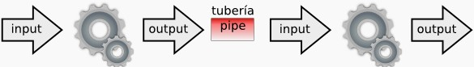
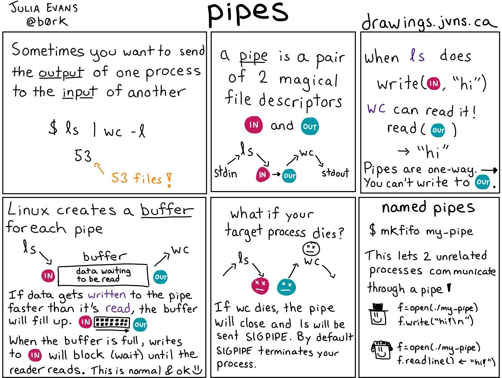
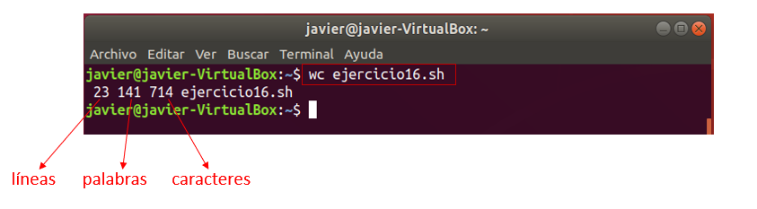
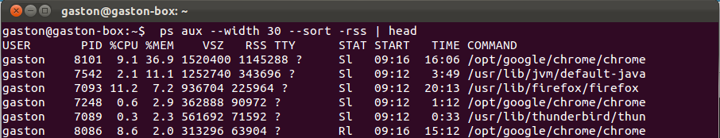
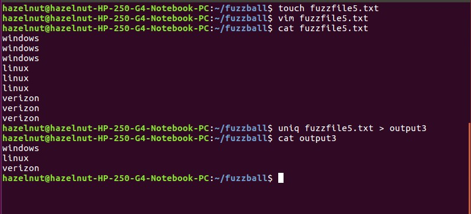
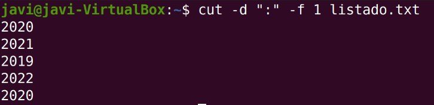
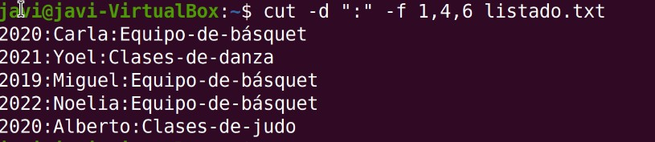

# UT12.2 Administración de Linux: Comandos de gestión de cadenas

## Tuberías y filtros

```tip
Desde la terminal de Linux posible introducir en una misma línea dos o más comandos separados por el carácter **tubería** o pipe ‘**\|**’ ,conectando la salida estándar de un comando con la entrada estándar de otro.
```



El uso más habitual es filtrar datos utilizando comandos que vamos a ir viendo, y que pueden actuar tanto como comandos como filtros.

    comando1 | comando2 | …

💡 La salida proporcionada por el comando1 se tomará como entrada para el comando2 y así sucesivamente



## Comando wc

```tip
El comando **wc** cuenta el número de **líneas, palabras y caracteres** de uno o más fichero(s), incluye espacios en blanco y caracteres de salto de línea.
```

Su sintaxis es la siguiente: 

    wc [parámetros] [fichero]

Donde sus parámetros pueden ser:

    -l visualiza sólo el número de líneas del fichero.
    -w visualiza sólo el número de palabras del fichero.
    -c visualiza sólo el número de caracteres del fichero.




## Comandos head y tail

```tip
El comando **head** muestra las 10 **primeras líneas** de un fichero
```


Si queremos especificar las líneas a mostrar lo haremos con *head –n número*

```tip
El comando **tail** funciona de la misma forma, pero mostrando las 10 **últimas líneas** de un fichero.
```

## Comando grep

```tip
El comando **grep** permite **buscar**, dentro de archivos o la salida que reciba de un tubería las líneas que concuerden con el elemento que especifiquemos (un *patrón de búsqueda*).
```

Es decir, **grep** muestra las líneas que contienen la cadena o patrón <u>resaltándolo</u>. 

La sintaxis básica del comando es la siguiente:

    grep [parámetros] [patrón_búsqueda] [fichero]

Donde parámetros puede ser:

    -c visualiza el nº total de líneas donde se localiza el patrón.
    -i elimina la diferencia entre mayúsculas y minúsculas.
    -l visualiza el nombre de los ficheros donde se localiza el patrón.
    -n visualiza el nº de línea donde aparece el patrón y línea completa
    -v** visualiza las líneas del fichero donde **no** aparece el patrón.
    -w obliga a que patrón coincida solamente con palabras completas.

Se puede usar el comando grep para buscar con un patrón usando lo que se conoce como **expresiones regulares básicas**. Las expresiones regulares están formadas por letras y números, así como por caracteres.

Las <u>expresiones regulares</u> básicas ya vistas incluyen:

| **Símbolo** | **Descripción**                                      |
|-------------|------------------------------------------------------|
| .\*         | Para representar cero o más caracteres.              |
| . (punto)   | Para representar un solo carácter                    |
| [a e i o u] | Para representar algunos caracteres                  |
| [A-Z][0-9]  | Para presentar un rango de caracteres                |
| **\^**      | **Para representar el inicio de una línea de texto** |
| **\$**      | **Para representar el fin de línea de texto**        |

Ejemplos de **expresiones regulares básicas** que podemos usar con *grep*: 

- Un signo de intercalación (\^) indica el <u>inicio de línea</u>:

        grep '^b' texto.txt 

- Un signo de dólar (\$) indica el <u>fin de línea</u>:

        grep 'a$' texto.txt

- Para representar un carácter se utiliza el **.** y para múltiples carácteres el .\*

        grep 'f.cher.' grep 'tex.*'

- Los <u>rangos</u> se representan entre corchetes y los caracteres individuales separados por comas:

        grep [A-Z][a-z][a,e,i,o,u]

Algunos ejemplos usando el comando **grep**:

    # Buscar la cadena Texto en el fichero texto.txt
    grep "Texto" texto.txt
    # Visualizar el contenido de texto.txt y buscar la cadena hola
    cat texto.txt | grep "hola"
    # Cuenta las veces que aparece la cadena “hola" en el fichero log.txt
    grep -c "Texto" log.txt
    # Verificar si un usuario existe en el sistema
    grep nombre_usuario /etc/passwd
    # Visualizar los archivos con permisos 777 (rwxrwxrwx)
    ls –l | grep rwxrwxrwx


## Comandos sort y uniq

```tip
El comando **sort** se utiliza para ordenar líneas de un fichero o un flujo, puede usarse como comando o como filtro.
```

Puede ordenar alfabética o numéricamente, teniendo en cuenta que cada línea del fichero es un registro compuesto por varios campos, los cuales están separados por un carácter denominado separador de campo (tabulador, espacio en blanco…)

Su sintaxis es: 

    sort [parámetros] [fichero]



Con los siguientes parámetros posibles:

    –n ordenación numérica
    –k y un nº indicamos por qué columna ordenar
    –r indicamos la ordenación inversa


💡 Otro comando muy útil es **uniq.** Se usa en combinación con **sort** para eliminar las líneas que están repetidas, dejando la salida con líneas que no están repetidas. Para que funcione correctamente las líneas o ficheros deben estar ordenados, ya que trabaja con líneas adyacentes.




## Comando tr

```tip
El comando **tr** permite sustituir unos caracteres por otros dentro de un archivo. Primero especificamos lo que vamos a sustituir y seguidamente lo que lo sustituye.
```

Su sintaxis es:

    tr [parámetros] caracteres1 [caracteres2]

Donde parámetros puede ser:

    -d: elimina los caracteres indicados en caracteres1 .
    -s: reemplaza los caracteres indicados en caracteres1 .
    -c: los caracteres que no estén indicados en caracteres1 los convierte a caracteres2.

Algunos ejemplos útiles con **tr**:

    # Eliminar los caracteres emp de la palabra ejemplo
    echo ejemplo | tr -d emp
    # Cambiar las minúsculas por mayúsculas
    echo 'Hola Mundo' | tr '[a-z]' '[A-Z]' 
    # Suprimir espacios en blanco
    echo "Hola que tal ?" | tr -d ' '

## Comando cut

```tip
El comando **cut** es utilizado para la extracción de segmentos (o porciones) de las líneas de texto. 
```

Dada una línea de texto la trocea según el <u>separador o delimitador</u> que le indiquemos.


Su sintaxis es:

    cut [parámetros] [fichero]

Donde parámetros puede ser:

    -d carácter separador o delimitador
    -f rango o columna a extraer
    -c carácter a partir del cual cortar

Por ejemplo:

    # Coge las letras de las posiciones 2 a la 4 inclusive (esi)
    echo "mesilla" | cut -c 2-4
    # Cortar la cadena por la letra 'i' devolviendo la segunda parte (lla) 
    echo "mesilla" | cut -di -f2

Vamos a ver más ejemplos típicos del uso de **cut.** Dado un fichero de texto separado por espacios llamado *listado.txt* con el siguiente contenido:

    2020:Junio:23:Carla:Martínez:Equipo-de-básquet
    2021:Abril:22:Yoel:Alonso:Clases-de-danza
    2019:Febrero:21:Miguel:Molina:Equipo-de-básquet
    2022:Enero:22:Noelia:Bernabeu:Equipo-de-básquet
    2020:Mayo:11:Alberto:Silvestre:Clases-de-judo


Mostrar la primera columna:



Mostrar la primera, cuarta y sexta columna:



## Comando awk

```tip
El comando **awk** es una herramienta avanzada de procesamiento de patrones en líneas de texto. 
```

Su utilización estándar es la de filtrar ficheros o salida de comandos de Linux, tratando las líneas para, por ejemplo, mostrar unas determinadas columnas de información.

La sintaxis básica de *awk* es:

    awk [condicion] { comandos }

*awk* es un comando avanzado que se estudiará en posteriores años.

    # Mostrar sólo los nombres y los tamaños de los ficheros:
    ls -l | awk '{ print $8 ":" $5 }'

    # Mostrar sólo los nombres y tamaños de ficheros .txt:
    ls -l | awk '$8 ~ /\.txt/ { print $8 ":" $5 }'


---


Listado de comandos de **gestión de cadenas** destacados:

| **Comando** | **Acción**                                             | **Ejemplo**                 |
|-------------|--------------------------------------------------------|-----------------------------|
| **wc**      | contar el nº de líneas, caracteres y de palabras.      | wc –l fichero.txt           |
| **head**    | Visualiza las primeras filas de un fichero             | head -n5 /var/log/dmesg     |
| **tail**    | Visualiza las últimas filas de un fichero              | tail /var/log/dmesg         |
| **grep**    | buscar un patrón en un fichero.                        | grep javier /etc/passwd     |
| **sort**    | ordenar el contenido de un fichero/listado.            | ls –l \| sort               |
| **uniq**    | elimina filas duplicadas.                              | cat fichero \| uniq         |
| **tr**      | sustituir grupos de caracteres por otros indicados.    | tr 'abc' '123'              |
| **cut**     | cortar o extraer elementos de una línea de un fichero. | cut –d “:” -f 2             |
| **awk**     | herramienta de filtrado avanzado de texto              | ls -l \| awk '{print \$8"}' |
