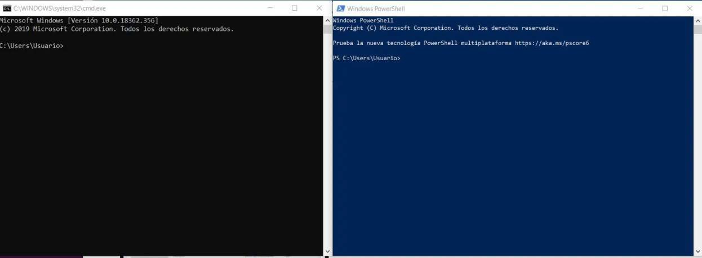
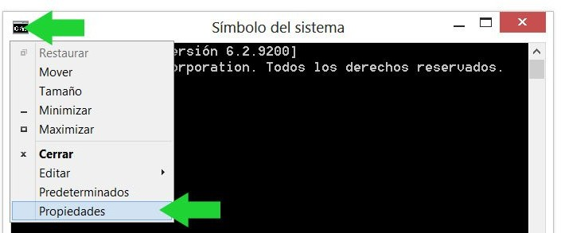
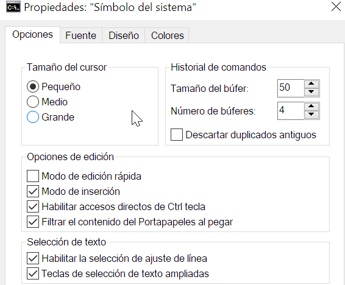
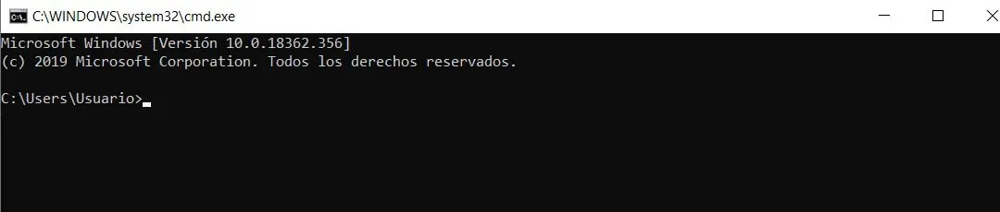
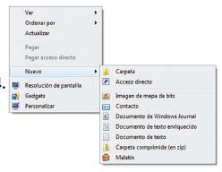
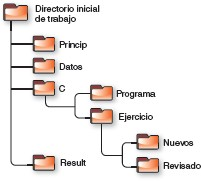
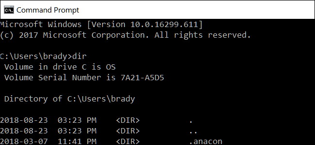

# UT 7.3 Operaciones generales en consola CMD

La consola de comandos, **CMD**, símbolo del sistema o también conocido como **Command prompt** es un intérprete de línea de comandos que lleva acompañando al sistema operativo de Microsoft durante décadas. Tanto es así que es el Shell original para el sistema operativo Microsoft DOS y el Shell predeterminado en Windows hasta la compilación *14791* de Windows 10, momento en el que **Windows Powershell** pasó a ser la opción predeterminada del sistema.

Con el símbolo del sistema podemos lanzar o ejecutar comandos básicos, preparar scripts relativamente sencillos y realizar muchas de las tareas que podemos hacer desde la interfaz gráfica del sistema operativo de Microsoft. Ahora bien, cuando necesitamos realizar desarrollos más avanzados, acceder a ciertas áreas del sistema o automatizar tareas es donde deberíamos usar Windows PowerShell.

La **consola de comandos** (CMD) permite realizar tareas repetitivas de forma rápida. Escribimos el comando (y sus modificadores en su caso), presionamos **ENTER** y la aplicación CMD hará de intérprete para su ejecución.

Algunas **características** de la consola de Windows:

-   No diferencia entre mayúsculas y minúsculas.
-   Al escribir un nombre de archivo o carpeta con espacios conviene escribirlo siempre “*entrecomillado*”.
-   Los nombres pueden ser de hasta 255 caracteres.
-   Al eliminar un archivo este no va a la Papelera y se elimina.
-   Algunas operaciones requieren iniciar la consola como administradores (botón derecho\>**Ejecutar como administrador**)

Se puede configurar el **aspecto** así como ciertas propiedades de la consola de comandos haciendo clic en **propiedades.**

> 💡 La ruta en el disco actual indicada en la consola, y que indica estar a la espera de órdenes después del >, se denomina **PROMPT**.

## Navegación por directorios

> 💡 Para navegar o moverse de directorio en la consola de comandos se utiliza el comando CD (CHDIR) y el comando CD..

Navegar usando el Explorador de archivos como hemos visto es intuitivo y natural.

Generalmente cuando el usuario abre la consola, el directorio donde comienza es su directorio personal. Desde ahí uno puede moverse a los diferentes directorios donde se tenga acceso usando el comando.

El comando **CD..** navega al directorio padre (el anterior).

El comando **CD\\** navega al directorio raíz.  

## Creación de directorios

> 💡 En el entorno de consola de comandos de Windows (CMD), para la creación de directorios se utiliza el comando **MD** (MKDIR). 

En el entorno gráfico, para crear una carpeta dentro de otra, tendremos que tener abierta aquella dentro de la cual queremos crear otra u otras carpetas. Esta carpeta principal, llamada carpeta padre, será de la que «cuelgue» la estructura de carpetas.

La sintaxis del comando **MD** es la siguiente: 

        MD nombre_directorio

## Consulta de directorios

> 💡 En el entorno de consola de comandos de Windows, para la consulta del contenido de un directorio se utiliza el comando **DIR**. 

El **Explorador de Windows** a su vez permite mostrar la información de archivos y carpetas en iconos/listas personalizables.

Su sintaxis: 

        DIR [parámetros]

